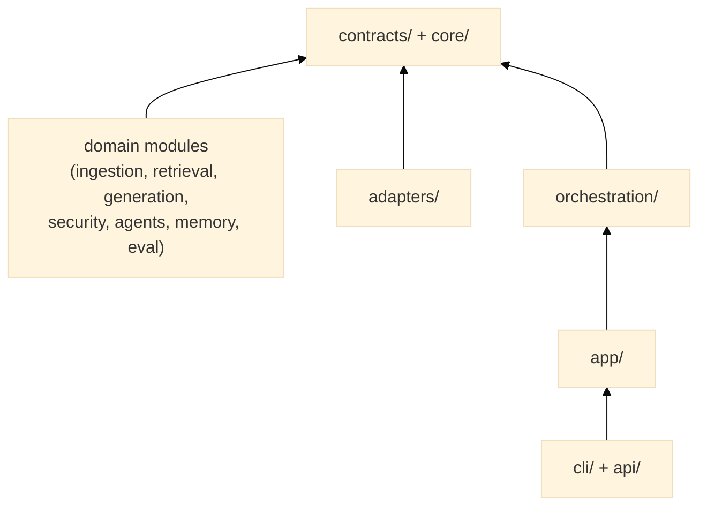

# CLAUDE.md

This file provides guidance to Claude Code (claude.ai/code) when working with code in this repository.

<!-- Updated: 2026-05-22 — 9-block structure per official Claude Code recommendations -->
<!-- Revisit block 09 once VectorRetriever.retrieve() is finalized (V1 sprint in progress) -->
<!-- For personal preferences (Qdrant URL, API key, etc.): create CLAUDE.local.md (gitignored) -->

@.claude/.instructions.md
@.claude/.prompt.md

---

## 01 — Project purpose

Pre-alpha portable assurance and delivery framework for Document AI use cases, built around
three current elements and one partially implemented direction:
- A **bounded native engine** (hybrid retrieval, generation, security — the V1 pipeline,
  `NativeEngineAdapter`).
- An **owned control plane** (governance, audit, offline evaluation, config/manifests, tenant
  isolation, portability — native, with runtime activation explicitly validated per engine).
- **Delegated external engines** for generic multi-agent orchestration and GraphRAG traversal
  (LangGraph today, selected via [ADR-0006](docs/adr/0006-external-engine-selection.md), reached
  through the `DocumentEngine` port).
- A **portable assurance direction** (ADR-0015, Accepted), implemented in stages:
  - **Lot 20 — implemented** (ADR-0016, Accepted): classification-aware provider-egress control,
    mandatory for the framework's known remote provider types (`openai`, `anthropic`,
    `openai-embeddings`).
  - **Lot 21 — implemented** (ADR-0017, Accepted): the L0/L1/L2 assurance contract
    (`contracts/assurance.py`) and a computed conformance report on both shipped adapters.
  - **Lot 22 — in progress, contract only** (ADR-0018, Accepted): `contracts/application.py`
    defines the existing-application boundary. **No existing-application adapter or pilot exists**:
    there is no `adapters/applications/`, and no manifest can select one. Wrapping an existing
    application is not a current capability — never describe it as operational.

The historical "V1 Core RAG → V2 Agentic → V3 Graph Memory → V4 Governance → V5 Multimodal"
progression in block 09 still organizes the detailed roadmap, but per
[ADR-0005](docs/adr/0005-document-ai-control-plane-boundary.md) (accepted 2026-08-04) and
[ADR-0007](docs/adr/0007-layer-boundaries-and-control-plane-activation.md) (accepted 2026-08-07),
plus [ADR-0008](docs/adr/0008-offline-evaluation-and-engine-activation.md), most version numbers
no longer map to "built natively in that version" — see block 09 for the current owned/delegated
split, which is reconciled with the ADRs, not an interim marker awaiting a future rewrite.

**Non-negotiable priority**: preserve the native end-to-end reference path and existing public
contracts. The remaining Lot 22 work (behavioural fixture, pilot adapter, comparative pilot) must
build on the shipped egress and assurance contracts, not weaken them. New graph, governance, or
multimodal work must not break `examples/simple_qa/`, unit tests,
contract tests, or the layering audit.

---

## 02 — Architecture rules

Strict hexagonal layering. Dependencies flow in one direction only:



**Hard rules:**
- `core/` imports nothing from this project.
- `contracts/` imports only `core/`.
- Domain modules import only `contracts/` + `core/models/`. **Never from each other.**
- `adapters/` imports `contracts/` + `core/` + external libs. Never from domain modules.
- A new component is wired only through `orchestration/registry.py` + a YAML manifest. No Python-level wiring inside other modules.

---

## 03 — Project structure

@.claude/project-structure.md

---

## 04 — Development commands

### Quick reference (for daily development)
```bash
# Install V1 deps + dev tools
pip install -e ".[v1,dev]"

# ⚡ QUICK CHECK (< 30s) — Use after any change
./scripts/check.sh quick        # Syntax + import order

# ✓ FULL CHECK (2-5 min) — Use before merge
./scripts/check.sh full         # Quick + unit + contracts

# 🔗 INTEGRATION (1-2 min) — With Qdrant and PostgreSQL for the full suite
./scripts/check.sh integration

# 🚀 E2E TESTS (2-5 min) — Full pipeline
./scripts/check.sh e2e

# 📋 ALL CHECKS (~ 10 min) — Pre-release
./scripts/check.sh all
```

### Individual test scopes
```bash
# Unit tests (no external services)
pytest tests/unit/ -v

# Contract conformance tests (no external services)
pytest tests/contract/ -v

# Single test
pytest tests/unit/ingestion/chunkers/test_fixed.py::test_short_text_single_chunk -v

# Integration tests (Qdrant tests require :6333; PostgreSQL adapter tests require :5432)
pytest tests/integration/ -v -m integration

# E2E tests (requires Qdrant; test_secure_preset_e2e.py additionally requires PostgreSQL but
# deliberately needs no LLM key — deterministic embedder/generator, see that file's own module
# docstring; test_simple_qa_pipeline.py needs an LLM key)
export OPENAI_API_KEY=sk-...   # the SDK's own standard var — NOT MRAG_OPENAI_API_KEY
                                # (app/settings.py's MRAG_-prefixed Settings class was orphaned
                                # and deleted in Étape 8 of ADR-0007; see
                                # docs/guides/troubleshooting.md)
pytest tests/e2e/ -v -m e2e
```

### CLI & API development
```bash
# REST API (development mode with hot-reload)
# NOTE: bare `uvicorn modular_rag.api:create_app --factory` does NOT work — create_app()
# requires a manifest_path argument, and --factory mode calls the factory with zero args.
# Use docker/server.py's pattern (a one-line wrapper) or write your own:
#   from modular_rag.api import create_app
#   app = create_app("manifests/presets/local-hybrid-rag.yaml")
# then: uvicorn server:app --reload  (see docs/api/rest.md for the full parameter reference)

# CLI ingestion
mrag ingest ./my_docs --manifest manifests/presets/local-hybrid-rag.yaml
mrag ask "What is hybrid retrieval?" --manifest manifests/presets/local-hybrid-rag.yaml

# End-to-end example
python examples/simple_qa/main.py ingest examples/simple_qa/docs/
python examples/simple_qa/main.py ask "What is RAG?"
```

### Claude Code project workflows

Project-level skills live in `.claude/skills/` and are exposed as slash commands:

| Workflow | Use when | Runs |
|---|---|---|
| `/test-unit` | Validate fast core behavior | `pytest tests/unit` |
| `/test-contract` | Validate Protocol conformance | `pytest tests/contract` |
| `/qa-v1` | Run the local V1 gate before an MR | Ruff + unit + contract + layering audit |
| `/delivery-loop` | Implement, review with Codex, remediate, and validate | Automated two-pass maximum; never pushes |
| `/check-layering` | Audit hexagonal import boundaries | `python scripts/check_layering.py` |
| `/run-simple-qa` | Smoke-test the example pipeline | `examples/simple_qa/main.py` ingest + ask |
| `/quick-check`, `/full-check`, `/release` | Additional validation tiers | see `docs/guides/validation.md` |

The shared post-edit hook is configured in `.claude/settings.json` and delegates to
`.claude/hooks/post-edit-quality.ps1`. Personal preferences belong in `CLAUDE.local.md`
using `CLAUDE.local.example.md` as a template.

When Claude Code is paired with Codex, Claude Code is the default builder and Codex
is the independent challenger. See `AGENTS.md`, `docs/guides/ai-engineering-workflow.md`,
and `docs/guides/model-routing.md`.

For normal delivery, prefer the single `/delivery-loop` skill: it performs the
handoff, invokes Codex non-interactively, applies the first correction batch, and
runs final validation without pushing. If pass 2 still returns
`CHANGES_REQUIRED`, use the bounded final Claude remediation documented in
`docs/guides/ai-engineering-workflow.md`; it does not trigger a third general
Codex review. The detailed manual steps remain the fallback for troubleshooting.

Before the first Codex review, Claude Code must leave a complete handoff in
`.review/handoff.md` using `.review/handoff.example.md`. The handoff records an
immutable Git base, acceptance criteria, design decisions, validations executed or
unavailable, known limitations, accepted risks, and out-of-scope work. Prefer a
local implementation checkpoint commit so the corrective diff can be isolated;
the checkpoint may be squashed before push. `scripts/prepare_review.ps1` prepares
the mechanical Git context, but Claude Code remains responsible for completing the
semantic sections.

When `.review/codex-review.md` has `Status: CHANGES_REQUIRED`, read the complete
review and verify every finding against the repository before changing code. Do not
apply recommendations blindly: fix valid `BLOCKER` and `HIGH` findings, evaluate
`MEDIUM` findings against the current task scope, and defer `LOW` findings that
would cause unrelated refactoring. Record every finding in the handoff's resolution
table as `FIXED`, `DEFERRED`, `ACCEPTED_RISK`, or `REJECTED`, with evidence. Apply
all accepted corrections as one batch and rerun the appropriate validation scope.

The Codex loop has at most two passes: pass 1 is the complete diff review; pass 2
only verifies finding closure and regressions caused by the corrective diff. After
pass 2, or as soon as Codex returns `READY_FOR_FINAL_VALIDATION`, stop requesting
general reviews. If pass 2 still has an accepted `BLOCKER` or `HIGH`, Claude may
apply one final bounded remediation, rerun deterministic validation, and record
the evidence without changing the Codex report. A third pass requires an
explicitly named, newly introduced critical risk and a human-approved narrow
scope. Claude Code remains the default sole writer, and Codex approval never
replaces deterministic validation or the human delivery decision.

**→ Full command reference:** [docs/guides/validation.md](docs/guides/validation.md)
**→ Validation strategies:** [.claude/settings.json (permissions)](.claude/settings.json)
**→ Testing rules:** [.claude/rules/tests.md](.claude/rules/tests.md)

---

## 05 — Coding rules

<!-- These rules are the most critical ones. Path-specific rules live in .claude/rules/ -->

1. **Contracts first.** The `contracts/` Protocol must exist before any concrete implementation.
2. **No cross-domain imports.** Retrievers never import from `generation/`; guards never import from `ingestion/`. They share only `core/models/` types.
3. **Manifests are the source of truth for runtime pipeline components.** Register those in
   `app/default_factories.py`, then select them by name in YAML. Explicit exceptions are parser
   dispatch (`ingestion/pipelines/default.py::_PARSERS`), engine selection (`load_engine`) and API
   identity verification (`create_app(token_verifier=...)`).
4. **Tests mirror `src/`.** `tests/unit/ingestion/chunkers/test_fixed.py` for `src/modular_rag/ingestion/chunkers/fixed.py`. Add a contract test in `tests/contract/` for every new Protocol implementation.
5. **Observability is mandatory for new execution steps.** Decide explicitly between framework
   `TraceStep`/`Telemetry`, live `Tracer` spans and operational `Meter` metrics at orchestration,
   application or API boundaries; do not change a domain Protocol merely to pass a trace. Current
   coverage and gauge limitations are documented in `docs/guides/observability.md`.
6. **Extend, don't rewrite.** All core modules exist. Add to them rather than recreating.
7. **Lazy imports for heavy deps.** All optional libraries (qdrant-client, rank-bm25, sentence-transformers, openai, anthropic, fitz) must be imported inside the method that uses them, not at module level.
8. **State of the art first.** Before any *design* decision (fusion weights, chunking parameters, guard patterns, metric choices, architectural patterns), read the matching digest in `docs/research/` (DIGEST-retrieval, DIGEST-generation, DIGEST-chunking, DIGEST-evaluation, DIGEST-security, DIGEST-overviews, DIGEST-architecture — distilled from `.claude/research-papers/`) and cite the arXiv id backing the choice. A choice that contradicts the digest must be justified explicitly. Routine implementation (tests, fixes, wiring) does not require this.

---

## 06 — Testing and validation

After any change, run the appropriate scope:

| Scope | Command | Requires |
|---|---|---|
| Core logic | `pytest tests/unit` | nothing |
| Protocol conformance | `pytest tests/contract` | nothing |
| Layering audit | `python scripts/check_layering.py` | nothing |
| Vector store | `pytest tests/integration` | Qdrant on :6333 |
| Full pipeline | `pytest tests/e2e` | Qdrant (+ PostgreSQL and/or an LLM API key depending on the scenario — see `.claude/rules/tests.md`) |

A change to a contract (`contracts/`) requires updating the matching `tests/contract/test_*_conformance.py`. A new domain implementation requires a unit test in `tests/unit/<same_path>/`.

---

## 07 — Security rules

- **Never import** a domain module from another domain module — this is the most common violation to watch for.
- **Safety ≠ Security.** Safety (prompt injection, PII, toxicity) lives in `security/filters/` and `security/redaction/`. Security (RBAC, tenant isolation, policy enforcement) lives in `security/policies/`. Do not mix them.
- **ADR before structural changes.** Any new top-level module, new layer boundary, or contract modification requires a new ADR under `docs/adr/`. ADRs 0001–0003 are reserved.
- **No V3+ code until V1 is end-to-end.** Graph, governance, and multimodal features must wait.

---

## 08 — Git and PR workflow

- Remote: **GitHub** at `github.com/HerbertGourout/modular-rag-framework`. Use GitHub PR
  and Issues terminology.
- CI templates and issue templates still live under `.gitlab/` for historical reasons; new
  CI work should target GitHub Actions under `.github/workflows/` going forward.
- Branch from `main`. One feature per branch. PR checklist is in `CONTRIBUTING.md`.

---

## 09 — Roadmap: V1 → V5 with Strategic Features

<!-- Updated: 2026-08-06 — reconciled with ADR-0005; native design text for delegated
     capabilities removed rather than banner-flagged (see docs/refactoring/lot-17-prototype-retirement.md) -->

> **ADR-0005 superseding note:** of the roadmap below, **V1.1, V1.2, and V2.0 are unchanged —
> build natively as described.** **V2.1 (Multi-Agent Teams), V3.0 (GraphRAG), V3.2 (Fine-Tuning
> Loop — except its drift-detection/evaluation trigger, which stays native), and V5.0
> (multimodal execution)** are delegated to a selected external engine via the `DocumentEngine`
> port ([ADR-0006](docs/adr/0006-external-engine-selection.md), LangGraph), not built natively.
>
> **ADR-0015 is Accepted and partly implemented:** Lot 20 (provider egress, ADR-0016) and Lot 21
> (L0/L1/L2 assurance contract and conformance report, ADR-0017) are implemented. Lot 22 has
> shipped only its contract (`contracts/application.py`, ADR-0018); the existing-application
> adapter, its behavioural fixture and the comparative pilot are not built. Describe those three
> as planned until they are implemented, and never infer from the contract that an existing
> application can already be wrapped.

Strategic roadmap for a native reference engine plus portable control/evidence capabilities. Its
commercial value is a hypothesis to validate through measured pilots, not an irreplaceability
claim.
See [ROADMAP.md](ROADMAP.md) for complete timeline and success criteria per version.

---

### V1 — Core RAG + Evaluation + Audit `[Q2 2026]`

**V1.0 — Hybrid Retrieval + Basic Security** ✅ (implementation complete; live-validated in CI)
- ✅ Core RAG pipeline (ingestion → retrieval → generation)
- ✅ Hybrid retrieval (BM25 + vector + reranking)
- ✅ Security guards (prompt injection, PII redaction)
- 🟡 Observability — `TraceStep` coverage is not universal; optional OTel `Tracer`/`Meter` roles
  are registered and tested but no shipped preset enables them, and two gauges have documented
  freshness/state-reset limitations (see [docs/guides/observability.md](docs/guides/observability.md))
- ✅ ComponentRegistry + manifest wiring
- ✅ Unit and contract tests
- ✅ Integration tests (`tests/integration/`) and the deterministic e2e scenario
  (`tests/e2e/test_secure_preset_e2e.py`) run in CI (`.github/workflows/ci.yml`'s
  `test-integration`/`e2e-deterministic` jobs, added in Batch 10 — an external plan, not this
  file's own Lot sequence) against real Qdrant/PostgreSQL service containers — no longer an
  explicit release-only check. The LLM-backed e2e scenario
  (`tests/e2e/test_simple_qa_pipeline.py`) still runs outside the main pipeline, in
  `.github/workflows/nightly.yml` (scheduled + `workflow_dispatch`), since it needs a real paid
  LLM key the main pipeline deliberately does not require.
- ✅ `examples/simple_qa/` is implemented; the identical underlying pipeline (same manifest and
  docs corpus) now runs nightly against a real LLM + Qdrant (`nightly.yml`, above) — `ROADMAP.md`
  no longer lists this as an unchecked item

**V1.1 — Evaluation-as-Contract** 🟡 (partially built; expanded by Batch 13, external plan —
"Offline benchmark," not this repo's own `docs/refactoring-plan.md` Lot numbering)
- Implemented: `contracts/evaluation.py::Evaluator`, exact-match scoring, recall/precision/MRR/
  NDCG (binary-relevance, `eval/scorers/retrieval_metrics.py`), `BenchmarkRunner` (classifies
  every failure's `error_stage` — retrieval/generation/security/infra — and scores safety-probe
  cases separately from QA cases), `GoldenSet` with one populated `default`-domain dataset
  (`eval/datasets/core_v1.yaml`, loaded via `eval/datasets/loader.py`), deterministic lexical-
  proxy faithfulness/answer-correctness scorers (`eval/scorers/faithfulness.py`,
  `answer_correctness.py` — explicitly not an LLM-judge), a programmatic offline `QualityGate`
  (now supports `lower_is_better` metrics, e.g. latency/cost), and a JSON+Markdown report writer
  (`eval/reporting.py`) enabling commit-to-commit comparison, gated in CI
  (`scripts/run_benchmark.py`, `.github/workflows/ci.yml`'s `benchmark-gate` job). See
  [docs/guides/offline-evaluation.md](docs/guides/offline-evaluation.md).
- Not built: semantic/LLM-judge scorers (RAGAS/ARES/TRACe-style — deferred, would need a
  non-deterministic paid LLM call this benchmark's own reproducibility requirement rules out),
  per-stratum/per-cluster golden-set coverage, additional per-domain datasets beyond the one
  `default`-domain set, and a live regression-dashboard UI (the Markdown/JSON report is the
  current artifact).
- Per ADR-0008, evaluation and gold-dependent quality gates remain offline capabilities, not
  online runtime pipeline components — the benchmark is script-driven, never manifest-activated.

**V1.2 — Compliance Audit Trail** 🟡 (partially built)
- Implemented: structured `AuditEvent`/`AuditSink`, in-memory and append-only PostgreSQL sinks,
  query/run audit emission, pattern redaction, and — since
  [ADR-0011](docs/adr/0011-postgresql-migrations-pooling-and-retention.md) — enforceable retention
  (`PostgresAuditSink.purge_expired()`/`count_expired()`, `mrag audit purge`/`count-expired`,
  gated behind a fail-closed `allow_purge` flag) plus DB-permission-level append-only guidance
  (`docs/guides/postgres-permissions.md`).
- Not built: end-to-end data-lineage tracking, formatted GDPR/CCPA/HIPAA report generation, proof
  that every possible log/export is free of unredacted PII, per-tenant retention (`retention_days`
  is never set to anything but its `365` default anywhere in this codebase today), or a scheduled/
  in-process trigger for the purge CLI (an operator or external cron must invoke it — V1 has no
  scheduler component).

---

### V2 — Policy Engine `[Q3 2026]`

**V2.0 — Policy-as-Code** `[UPDATED — P0 priority]`
- `security/policies/`: Policy-as-Code framework
  - Inline manifest rules evaluated before execution: shipped
  - Multi-tenant isolation (tenant A cannot see tenant B): shipped
  - Caller roles propagated but RBAC decisions (analyst vs director): not implemented
  - Classification-aware provider-egress enforcement: shipped (Lot 20, ADR-0016,
    `governance.egress_policy`); `PolicyEngine`/`TenantIsolationPolicy` still do not themselves
    branch on `DataClassification` — that remains open, unassigned to any lot
- **Key difference vs V1**: Governance is now proactive (prevent bad queries) not just reactive
- **Success**: Policies enforced, multi-tenant isolation works, violations logged

**V2.1 — Multi-Agent Orchestration** — delegated per [ADR-0005](docs/adr/0005-document-ai-control-plane-boundary.md)
§5.2 to a selected external engine via the `DocumentEngine` port; not built natively. The
prototype implementation was removed in
[Lot 17](docs/refactoring/lot-17-prototype-retirement.md).

---

### V3 — Graph Memory + Cost Optimization + Fine-Tuning `[Q4 2026]`

**V3.0 — GraphRAG** — traversal/reasoning execution delegated per
[ADR-0005](docs/adr/0005-document-ai-control-plane-boundary.md) §5.2 to a selected external
engine via the `DocumentEngine` port. Whether a knowledge-graph *data model* should still live
in `memory/` was resolved, not left open: [ADR-0007](docs/adr/0007-layer-boundaries-and-control-plane-activation.md)
Étape 8 removed the native `KnowledgeGraph` class entirely (zero consumers anywhere outside its
own test), restorable via git history if a real, wired need emerges. No native graph capability
exists in this codebase today.

**V3.1 — Cost/Latency Evidence + Reporting** `[NEW — 2 months after V3.0]` — reframed per
ADR-0005 §5.1: the in-house query-routing/model-selection logic is delegated; what stays
native is reporting.
- **Partially built:** ADR-0013 exposes aggregate request latency, generation token and static
  estimated-cost OTel metrics plus a reference dashboard. No shipped preset enables the meter.
- **Still open:** `eval/cost_reporting/`, per-query/user/month attribution and anomaly detection.

**V3.2 — Drift Detection + Evaluation Trigger** `[NEW — 3 months after V3.0]` — reframed per
ADR-0005 §5.2: fine-tuning *execution* is delegated to external MLOps tooling; what stays
native is deciding *when* retraining is needed.
- 🟡 **Implemented (Batch 14, ADR-0014):** `contracts/feedback.py` + `POST /feedback` (thumbs
  up/down, user corrections, durably stored — `security/feedback/store.py` in-memory,
  `adapters/feedback/postgres_sink.py` durable); `eval/drift_detection.py` (pure, offline —
  `compute_drift()` flags a metric degrading past a threshold, matching this section's own
  "alert on degradation" wording).
- **Still open:** no historical baseline from real production traffic yet; `should_trigger_
  retraining` is a real, computed advisory flag that nothing currently wires to an actual
  external retraining trigger. See [docs/guides/feedback-and-drift.md](docs/guides/feedback-and-drift.md).
- **Success**: Feedback collection is real and durable ("> 80%" not measured against a real
  deployment yet); drift detection computes and flags degradation; nothing yet consumes the
  advisory retraining-trigger flag to start a workflow.

---

### V4 — Enterprise + Multilingual Governance `[Q1 2027]`

**V4.0 — Multi-Tenant Policies + Multi-Environment**
- Policy-as-code enhancements (OPA integration)
- Multi-environment manifests (dev/staging/prod)
- Human-in-the-loop review queue: shipped, now with a durable PostgreSQL backend
  (`PostgresReviewQueue`, Batch 14/ADR-0014) plus `mrag review list-pending`/`resolve` CLI
  operations — a public REST endpoint for reviewing/resolving items remains out of scope
  (CLI-only, matching `mrag audit`'s own trust model)
- Risk profiles per pipeline
- **Success**: Prod policies enforced, escalation queue works

**V4.1 — Multilingual Quality + Jurisdiction-Aware Governance** `[PLANNED]`
- Detect language/script as processing metadata; support mixed-script and low-confidence cases.
- Add language-aware parsing/chunking or multilingual adapters only where golden-set slices prove
  the current path inadequate.
- Preserve requested output language and evidence any translation step.
- Derive jurisdiction only from trusted deployment, tenant, residency, contractual, identity, or
  legal context—never from query language alone.
- Success criteria are per-deployment quality/citation floors, not a predeclared “20+ languages.”

---

### V5 — Multimodal Evidence `[Q2 2027]`

**V5.0 — Multimodal Intelligence** — VLM execution delegated per
[ADR-0005](docs/adr/0005-document-ai-control-plane-boundary.md) §5.2 to a selected external
engine via the `DocumentEngine` port. Native ownership may cover provenance/citation enrichment
(page regions, table cells, image references, timecodes), classification, and egress evidence if
a future ADR supports it. No multimodal execution is implemented today.

---

### Adapter Stubs
| Stub | Scope | Status per ADR-0005 | Notes |
|------|-------|--------------------------|-------|
| `adapters/llms/` | Engine-delegation target | **Reachable now** (Lots 6/7/15) — permission moved deny→ask 2026-08-04 | Gateway/routing to the selected external engine and multi-model access, not a cost-optimizer-only concern |
| `adapters/graphstores/` | Engine-delegation target | **Reachable now** (Lots 6/7/15) — permission moved deny→ask 2026-08-04 | Backs the external engine's GraphRAG capability if kept as a data-model adapter; traversal itself is delegated |
| `adapters/search/` | Engine-delegation target | **Reachable now** (Lots 6/7/15) — permission moved deny→ask 2026-08-04 | Multi-provider search, e.g. OpenSearch per `docs/refactoring/technology-candidates.md` |
| `adapters/auth/` | Keycloak OIDC token verification | **Reachable now** (Lot 11b) — permission moved deny→ask 2026-08-05 | Hosts the external binding (`KeycloakTokenVerifier`, implements `contracts/identity.py`'s `TokenVerifier`). Tenant-isolation *enforcement* (fail-closed policy against the verified identity) lives in `security/policies/`, not here — this directory is the OIDC/JWKS client only. |

**Rule**: these are adapter targets for the engine selected in Lot 6, wired through the
`DocumentEngine` port (Lot 7) — not a native reimplementation of what they adapt to. Don't build
generic orchestration/GraphRAG/multimodal logic inside them; they call out to the external
engine or a specific vendor SDK.

---

### Test Stubs Status
| Path | Status | Version | Notes |
|------|--------|---------|-------|
| `tests/integration/` | ✅ Exists | V1 | Run: `pytest tests/integration -m integration` |
| `tests/e2e/` | ✅ Exists | V1 | Run: `pytest tests/e2e -m e2e` (full pipeline) |
| `tests/benchmark/` | 🚫 Not created yet | V3 | Performance baselines added in V3 |
| `tests/policy/` | 🚫 Not created yet | V2 | Policy conformance tests in V2 |
| `tests/multimodal/` | 🚫 Not created yet | V5 | Multimodal tests in V5 |

**Rule**: Create test modules in the version that introduces the feature.

---

### Manifest Stubs Status
| Path | Purpose | Target Version | Status |
|------|---------|-----------------|--------|
| `manifests/dev/` | Development configs | V2 | Populated in V2 with policy variants |
| `manifests/staging/` | Staging configs | V4 | Populated in V4 with prod-like policies |
| `manifests/production/` | Production configs | V4 | Populated in V4 with full governance |
| `manifests/policies/` | Policy YAML | V2 | Created in V2 with examples |

**Rule**: Don't populate until version target. Use `manifests/presets/local-hybrid-rag.yaml` as reference in V1.

---

### Implementation Order (Respect Accepted Decisions and Lot Gates)

> This sequence still governs **native, owned** work (V1.1, V1.2, V2.0, and the parts of V3+ that
> stay native per the ADR-0005 note above). It does **not** gate the engine-delegation lots
> (`docs/refactoring-plan.md` Lots 6, 7, 15) — those can proceed once Phase A/B of the
> refactoring plan reach them, independent of whether native V2.1/V3.0/V3.2/V5.0 have "started."

```
V1 — V1.0 → V1.1 → V1.2 (complete V1 before V2)
V2 — V2.0 (V2.1 delegated, not built — see above)
V3 — V3.0 (delegated) → V3.1 → V3.2 (native reporting/drift-detection portions)
V4 — V4.0 → V4.1 (complete V4 before V5)
V5 — V5.0 (delegated — see above)
Assurance — Lot 20 egress (implemented) → Lot 21 assurance contract (implemented) → Lot 22
contract (implemented) → Lot 22 adapter and pilot (not started)
```

Why sequences matter:
- V1.1 (Evaluation) depends on V1.0 (core components to evaluate)
- V1.2 (Audit) depends on V1.0 + V1.1 (what to audit)
- V2.0 (Policy Engine) depends on V1.x (they use V1 components)
- V3.1's cost/latency reporting and V3.2's drift detection don't depend on V3.0's (delegated)
  GraphRAG — they're independent native features that happen to share a version number
- V4.1 (Multi-Lang) depends on V4.0 (governance framework)
- Lots 20 and 21 are complete, and Lot 22's contract is in place; its remaining scope and
  acceptance evidence are defined in
  `docs/refactoring/lot-22-external-application-adapters-and-conformance.md`. ADR-0015 acceptance
  still does not pre-approve any public schema beyond what ADRs 0016–0018 define.

---

### Wiring Notes (V1 Internals)
- `VectorRetriever._embedder` and `VectorRetriever._store` are injected by `registry.wire()` post-wiring.
- `HybridRetriever` uses `k` (retrieval count) and `reranker_k` from manifest config.
- Built-in runtime components are registered in `app/default_factories.py` and selected through
  manifests; offline evaluation helpers are intentionally constructed programmatically (ADR-0008).

---

### Questions?

**"When do I implement Policy Engine?"**
→ The inline `PolicyEngine` and tenant isolation already ship. Extend them only through an
accepted lot/ADR. Classification-aware provider egress ships (Lot 20); RBAC decisions do not.

**"Do I need multi-language in V1?"**
→ No blanket language count is promised. Define the deployment's required-language matrix and
golden-set slices first. Language never selects jurisdiction on its own.

**"Can I do fine-tuning in V2?"**
→ Not recommended. V3.2 is the target, and even there only the drift-detection/evaluation
trigger is native — the actual fine-tuning execution is delegated per ADR-0005 §5.2 to
external MLOps tooling, not built in this repo at any version.

**"What if client asks for V5 features in V1?"**
→ Explain the strategy honestly: V1.0 is implemented and the main CI includes live service
checks; native governance, audit, feedback/drift, and offline evaluation have specific remaining
gaps listed in `ROADMAP.md`. Multi-agent orchestration (V2.1), GraphRAG traversal (V3.0), fine-tuning
execution (V3.2), and multimodal execution (V5.0) are delegated to a selected external engine
per ADR-0005. ADR-0015's assurance contract and provider-egress control are implemented (Lots
20–21); wrapping an existing external application is not — only its contract exists (Lot 22).

**"What about benchmarks?"**
→ The offline golden-set benchmark and CI quality gate already ship. Production calibration,
additional domain sets, LLM-judge scoring, and per-query/user cost attribution remain open.

---

### Key Differentiators (Why This Roadmap is Incontournable)

| Capability | LangChain | Haystack | **This Framework** |
|---|---|---|---|
| Evaluation | External | Built-in | 🟡 **Native offline primitives + NDCG, one golden dataset, CI-gated (V1.1, Batch 13)**; LLM-judge scoring and a dashboard UI remain open |
| Audit Trail | Manual logs | Limited | 🟡 **Native structured audit (V1.2)**; lineage/compliance reports remain open |
| Policies | None | Limited | ✅ **Policy-as-Code (V2.0), native** |
| Multi-Agent | Bolted-on | Limited | ⚙️ **Delegated target via `DocumentEngine`**; the current fixed LangGraph graph is not multi-agent |
| Cost Evidence | None | None | 🟡 **Aggregate OTel latency/token/estimated-cost metrics + reference dashboard ship**; attribution/anomaly detection remain, routing delegated |
| Fine-Tuning | None | None | 🟡 **Feedback collection + drift detection native and shipped (Batch 14, V3.2); no historical baseline yet; fine-tuning execution delegated** |
| Graph Memory | External | External | ⚙️ **Delegated GraphRAG traversal (V3.0)**; the native graph data model was evaluated and removed (Étape 8, [ADR-0007](docs/adr/0007-layer-boundaries-and-control-plane-activation.md) — resolved: zero consumers, restorable via git history if a real, wired need emerges) — no native graph capability exists today |
| Multi-Language | English-first | Limited | ⬜ **20+ languages (V4.1) — not yet built**; no `adapters/nlp/` module exists |
| Multimodal | Partial | Partial | ⚙️ **Delegated VLM execution (V5.0)**; parsing/citation enrichment may stay native |

⚙️ = delegated per [ADR-0005](docs/adr/0005-document-ai-control-plane-boundary.md) — the
differentiator is owning governance/audit/eval/portability *around* whichever engine is
selected, not reimplementing the engine's own mechanics.
