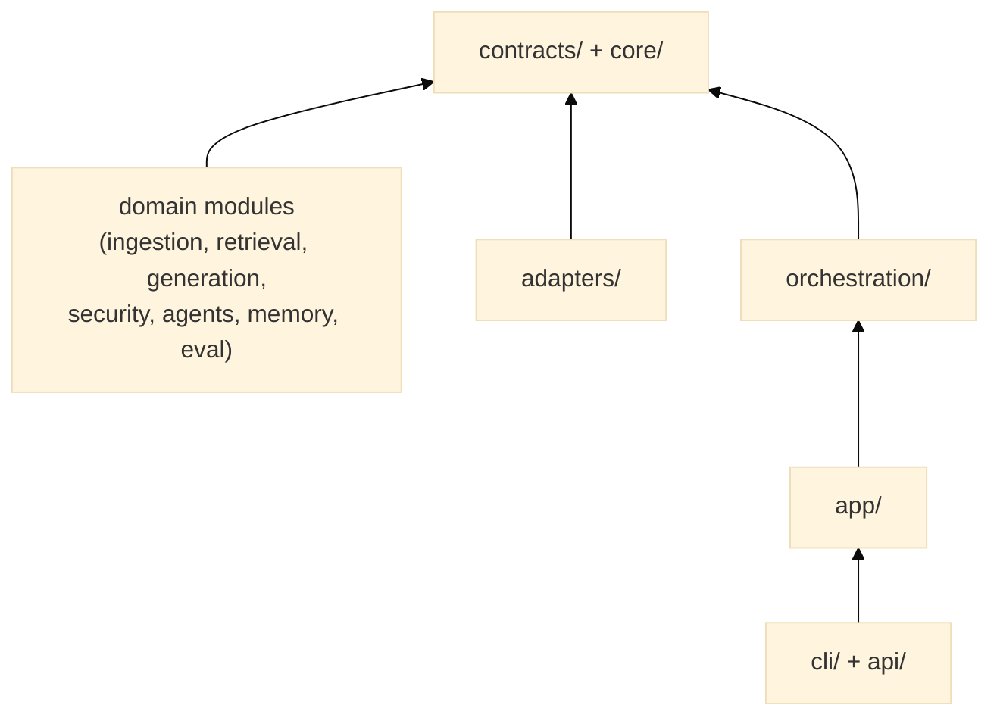

# CLAUDE.md

This file provides guidance to Claude Code (claude.ai/code) when working with code in this repository.

<!-- Updated: 2026-05-22 — 9-block structure per official Claude Code recommendations -->
<!-- Revisit block 09 once VectorRetriever.retrieve() is finalized (V1 sprint in progress) -->
<!-- For personal preferences (Qdrant URL, API key, etc.): create CLAUDE.local.md (gitignored) -->

@.claude/.instructions.md
@.claude/.prompt.md

---

## 01 — Project purpose

Production-grade modular RAG framework for Publicis enterprise use cases, built around three
things: a **bounded native engine** (hybrid retrieval, generation, security — the V1 pipeline,
`NativeEngineAdapter`), an **owned control plane** (governance, audit, evaluation,
config/manifests, tenant isolation, portability — native and manifest-activatable across every
version, not just V1), and **delegated external engines** for generic multi-agent orchestration
and GraphRAG traversal (LangGraph today, selected via [ADR-0006](docs/adr/0006-external-engine-selection.md),
reached through the `DocumentEngine` port). The historical "V1 Core RAG → V2 Agentic → V3 Graph
Memory → V4 Governance → V5 Multimodal" progression in block 09 still organizes the detailed
roadmap, but per [ADR-0005](docs/adr/0005-document-ai-control-plane-boundary.md) (accepted
2026-08-04) and [ADR-0007](docs/adr/0007-layer-boundaries-and-control-plane-activation.md)
(accepted 2026-08-07), most version numbers no longer map to "built natively in that version" —
see block 09 for the current owned/delegated split, which is reconciled with the ADRs, not an
interim marker awaiting a future rewrite.

**Non-negotiable priority**: preserve the V1 end-to-end path before adding V3+ features. New graph, governance, or multimodal work must not break `examples/simple_qa/`, unit tests, contract tests, or the local layering audit.

---

## 02 — Architecture rules

Strict hexagonal layering. Dependencies flow in one direction only:



**Hard rules:**
- `core/` imports nothing from this project.
- `contracts/` imports only `core/`.
- Domain modules import only `contracts/` + `core/models/`. **Never from each other.**
- `adapters/` imports `contracts/` + `core/` + external libs. Never from domain modules.
- A new component is wired only through `orchestration/registry.py` + a YAML manifest. No Python-level wiring inside other modules.

---

## 03 — Project structure

@.claude/project-structure.md

---

## 04 — Development commands

### Quick reference (for daily development)
```bash
# Install V1 deps + dev tools
pip install -e ".[v1,dev]"

# ⚡ QUICK CHECK (< 30s) — Use after any change
./scripts/check.sh quick        # Syntax + import order

# ✓ FULL CHECK (2-5 min) — Use before merge
./scripts/check.sh full         # Quick + unit + contracts

# 🔗 INTEGRATION (1-2 min) — With Qdrant
./scripts/check.sh integration

# 🚀 E2E TESTS (2-5 min) — Full pipeline
./scripts/check.sh e2e

# 📋 ALL CHECKS (~ 10 min) — Pre-release
./scripts/check.sh all
```

### Individual test scopes
```bash
# Unit tests (no external services)
pytest tests/unit/ -v

# Contract conformance tests (no external services)
pytest tests/contract/ -v

# Single test
pytest tests/unit/ingestion/chunkers/test_fixed.py::test_short_text_single_chunk -v

# Integration tests (requires Qdrant on localhost:6333)
pytest tests/integration/ -v -m integration

# E2E tests (requires Qdrant + LLM API key)
export OPENAI_API_KEY=sk-...   # the SDK's own standard var — NOT MRAG_OPENAI_API_KEY
                                # (app/settings.py's Settings class is orphaned; see
                                # docs/guides/troubleshooting.md)
pytest tests/e2e/ -v -m e2e
```

### CLI & API development
```bash
# REST API (development mode with hot-reload)
# NOTE: bare `uvicorn modular_rag.api:create_app --factory` does NOT work — create_app()
# requires a manifest_path argument, and --factory mode calls the factory with zero args.
# Use docker/server.py's pattern (a one-line wrapper) or write your own:
#   from modular_rag.api import create_app
#   app = create_app("manifests/presets/local-hybrid-rag.yaml")
# then: uvicorn server:app --reload  (see docs/api/rest.md for the full parameter reference)

# CLI ingestion
mrag ingest ./my_docs --manifest manifests/presets/local-hybrid-rag.yaml
mrag ask "What is hybrid retrieval?" --manifest manifests/presets/local-hybrid-rag.yaml

# End-to-end example
python examples/simple_qa/main.py ingest examples/simple_qa/docs/
python examples/simple_qa/main.py ask "What is RAG?"
```

### Claude Code project workflows

Project-level skills live in `.claude/skills/` and are exposed as slash commands:

| Workflow | Use when | Runs |
|---|---|---|
| `/test-unit` | Validate fast core behavior | `pytest tests/unit` |
| `/test-contract` | Validate Protocol conformance | `pytest tests/contract` |
| `/qa-v1` | Run the local V1 gate before an MR | Ruff + unit + contract + layering audit |
| `/check-layering` | Audit hexagonal import boundaries | `python scripts/check_layering.py` |
| `/run-simple-qa` | Smoke-test the example pipeline | `examples/simple_qa/main.py` ingest + ask |
| `/quick-check`, `/full-check`, `/release` | Additional validation tiers | see `docs/guides/validation.md` |

The shared post-edit hook is configured in `.claude/settings.json` and delegates to
`.claude/hooks/post-edit-quality.ps1`. Personal preferences belong in `CLAUDE.local.md`
using `CLAUDE.local.example.md` as a template.

When Claude Code is paired with Codex, Claude Code is the default builder and Codex
is the independent challenger. See `AGENTS.md`, `docs/guides/ai-engineering-workflow.md`,
and `docs/guides/model-routing.md`.

**→ Full command reference:** [docs/guides/validation.md](docs/guides/validation.md)
**→ Validation strategies:** [.claude/settings.json (permissions)](.claude/settings.json)
**→ Testing rules:** [.claude/rules/tests.md](.claude/rules/tests.md)

---

## 05 — Coding rules

<!-- These rules are the most critical ones. Path-specific rules live in .claude/rules/ -->

1. **Contracts first.** The `contracts/` Protocol must exist before any concrete implementation.
2. **No cross-domain imports.** Retrievers never import from `generation/`; guards never import from `ingestion/`. They share only `core/models/` types.
3. **Manifests are the source of truth.** Register the component in `orchestration/_default_factories.py`, then select it by name in YAML. Never wire it in Python elsewhere.
4. **Tests mirror `src/`.** `tests/unit/ingestion/chunkers/test_fixed.py` for `src/modular_rag/ingestion/chunkers/fixed.py`. Add a contract test in `tests/contract/` for every new Protocol implementation.
5. **Observability is mandatory.** Every retrieval, generation, and agent method must emit a `TraceStep` via `Trace.add_step()`.
6. **Extend, don't rewrite.** All core modules exist. Add to them rather than recreating.
7. **Lazy imports for heavy deps.** All optional libraries (qdrant-client, rank-bm25, sentence-transformers, openai, anthropic, fitz) must be imported inside the method that uses them, not at module level.
8. **State of the art first.** Before any *design* decision (fusion weights, chunking parameters, guard patterns, metric choices, architectural patterns), read the matching digest in `docs/research/` (DIGEST-retrieval, DIGEST-generation, DIGEST-chunking, DIGEST-evaluation, DIGEST-security, DIGEST-overviews, DIGEST-architecture — distilled from `.claude/research-papers/`) and cite the arXiv id backing the choice. A choice that contradicts the digest must be justified explicitly. Routine implementation (tests, fixes, wiring) does not require this.

---

## 06 — Testing and validation

After any change, run the appropriate scope:

| Scope | Command | Requires |
|---|---|---|
| Core logic | `pytest tests/unit` | nothing |
| Protocol conformance | `pytest tests/contract` | nothing |
| Layering audit | `python scripts/check_layering.py` | nothing |
| Vector store | `pytest tests/integration` | Qdrant on :6333 |
| Full pipeline | `pytest tests/e2e` | Qdrant + LLM API key |

A change to a contract (`contracts/`) requires updating the matching `tests/contract/test_*_conformance.py`. A new domain implementation requires a unit test in `tests/unit/<same_path>/`.

---

## 07 — Security rules

- **Never import** a domain module from another domain module — this is the most common violation to watch for.
- **Safety ≠ Security.** Safety (prompt injection, PII, toxicity) lives in `security/filters/` and `security/redaction/`. Security (RBAC, tenant isolation, policy enforcement) lives in `security/policies/`. Do not mix them.
- **ADR before structural changes.** Any new top-level module, new layer boundary, or contract modification requires a new ADR under `docs/adr/`. ADRs 0001–0003 are reserved.
- **No V3+ code until V1 is end-to-end.** Graph, governance, and multimodal features must wait.

---

## 08 — Git and PR workflow

- Remote: **GitHub** at `github.com/HerbertGourout/modular-rag-framework`. Use GitHub PR
  and Issues terminology.
- CI templates and issue templates still live under `.gitlab/` for historical reasons; new
  CI work should target GitHub Actions under `.github/workflows/` going forward.
- Branch from `main`. One feature per branch. PR checklist is in `CONTRIBUTING.md`.

---

## 09 — Roadmap: V1 → V5 with Strategic Features

<!-- Updated: 2026-08-06 — reconciled with ADR-0005; native design text for delegated
     capabilities removed rather than banner-flagged (see docs/refactoring/lot-17-prototype-retirement.md) -->

> **ADR-0005 superseding note:** of the roadmap below, **V1.1, V1.2, and V2.0 are unchanged —
> build natively as described.** **V2.1 (Multi-Agent Teams), V3.0 (GraphRAG), V3.2 (Fine-Tuning
> Loop — except its drift-detection/evaluation trigger, which stays native), and V5.0
> (multimodal execution)** are delegated to a selected external engine via the `DocumentEngine`
> port ([ADR-0006](docs/adr/0006-external-engine-selection.md), LangGraph), not built natively.

Strategic roadmap integrating **8 high-value features** that make this framework incontournable (irreplaceable).
See [ROADMAP.md](ROADMAP.md) for complete timeline and success criteria per version.

---

### V1 — Core RAG + Evaluation + Audit `[Q2 2026]`

**V1.0 — Hybrid Retrieval + Basic Security** ✅ (Current focus)
- ✅ Core RAG pipeline (ingestion → retrieval → generation)
- ✅ Hybrid retrieval (BM25 + vector + reranking)
- ✅ Security guards (prompt injection, PII redaction)
- ✅ Observability (TraceStep emissions throughout)
- ✅ ComponentRegistry + manifest wiring
- ✅ Unit, contract, integration, e2e tests
- ✅ `examples/simple_qa/` end-to-end

**V1.1 — Evaluation-as-Contract** `[NEW — 1 month after V1.0]`
- `contracts/evaluation.py`: MetricsProtocol for all components
- `eval/metrics/`: NDCG, MRR, semantic similarity, factuality, cost/query
- `eval/golden_sets/`: Domain-specific Q&A (finance, healthcare, manufacturing, default)
- `eval/regression_dashboard.py`: Auto-detect F1 drops, prevent merges
- **Key difference**: Every retriever/generator MUST implement metrics; tests contract conformance
- **Success**: F1 on golden set > 0.85, zero regressions

**V1.2 — Compliance Audit Trail** `[NEW — 2 months after V1.0]`
- `security/audit/`: Immutable append-only event store
- `security/audit/data_lineage_tracker.py`: Source → processing → response chain
- `security/redaction/`: Proof of what was redacted, how
- `security/compliance/`: Auto-generate GDPR/CCPA/HIPAA reports
- **Key difference**: GDPR audit report < 10 seconds; zero unredacted PII in logs
- **Success**: Audit trail immutable, data lineage traceable, compliance reports work

---

### V2 — Policy Engine `[Q3 2026]`

**V2.0 — Policy-as-Code** `[UPDATED — P0 priority]`
- `security/policies/`: Policy-as-Code framework
  - Define policies in YAML (who can access what)
  - PolicyEngine evaluates queries vs policies before execution
  - Role-based access control (analyst vs director)
  - Data classification (public, internal, confidential, restricted)
  - Multi-tenant isolation (tenant A cannot see tenant B)
- **Key difference vs V1**: Governance is now proactive (prevent bad queries) not just reactive
- **Success**: Policies enforced, multi-tenant isolation works, violations logged

**V2.1 — Multi-Agent Orchestration** — delegated per [ADR-0005](docs/adr/0005-document-ai-control-plane-boundary.md)
§5.2 to a selected external engine via the `DocumentEngine` port; not built natively. The
prototype implementation was removed in
[Lot 17](docs/refactoring/lot-17-prototype-retirement.md).

---

### V3 — Graph Memory + Cost Optimization + Fine-Tuning `[Q4 2026]`

**V3.0 — GraphRAG** — traversal/reasoning execution delegated per
[ADR-0005](docs/adr/0005-document-ai-control-plane-boundary.md) §5.2 to a selected external
engine via the `DocumentEngine` port. A knowledge-graph *data model* may still live in
`memory/` if Lot 6 evidence shows the external engine can't represent it — undecided.

**V3.1 — Cost/Latency Evidence + Reporting** `[NEW — 2 months after V3.0]` — reframed per
ADR-0005 §5.1: the in-house query-routing/model-selection logic is delegated; what stays
native is reporting.
- `eval/cost_reporting/`: Dashboard (cost/query, per user, per month), regardless of which
  engine served the query
- **Success**: cost/latency reported per query, anomalies flagged

**V3.2 — Drift Detection + Evaluation Trigger** `[NEW — 3 months after V3.0]` — reframed per
ADR-0005 §5.2: fine-tuning *execution* is delegated to external MLOps tooling; what stays
native is deciding *when* retraining is needed.
- `eval/feedback_collection/`: Thumbs up/down, user corrections
- `eval/drift_detection.py`: Monitor F1 vs baseline, alert on degradation
- **Success**: Feedback > 80%, drift detected, alert triggers a defined external retraining
  workflow

---

### V4 — Multi-Language + Governance `[Q1 2027]`

**V4.0 — Multi-Tenant Policies + Multi-Environment**
- Policy-as-code enhancements (OPA integration)
- Multi-environment manifests (dev/staging/prod)
- Human-in-the-loop: review queue for risky answers
- Risk profiles per pipeline
- **Success**: Prod policies enforced, escalation queue works

**V4.1 — Multi-Language + Cultural Reasoning** `[NEW — 4 months after V4.0]`
- `adapters/nlp/`: Language-specific tokenizers (Arabic, Chinese, French, German, etc.)
- `ingestion/chunkers/multilingual_chunker.py`: Respect sentence boundaries per language
- `adapters/embeddings/multilingual_embeddings.py`: mxbai-embed-large (50+ languages)
- `generation/`: Language-aware generation (preserve language, no forced translation)
- `security/cultural_policies/`: Regulatory routing (GDPR EU, CCPA US, CNIL France)
- **Key difference**: Global-by-default (not English-first); cultural context in answers
- **Success**: 20+ languages native, F1 in non-English > 0.80, regulatory routing works

---

### V5 — Multimodal Intelligence `[Q2 2027]`

**V5.0 — Multimodal Intelligence** — VLM execution delegated per
[ADR-0005](docs/adr/0005-document-ai-control-plane-boundary.md) §5.2 to a selected external
engine via the `DocumentEngine` port. Parsing/citation enrichment (extracting images/tables,
attaching timecodes) may remain native if Lot 6/15 evidence supports it — undecided.

---

### Adapter Stubs
| Stub | Scope | Status per ADR-0005 | Notes |
|------|-------|--------------------------|-------|
| `adapters/llms/` | Engine-delegation target | **Reachable now** (Lots 6/7/15) — permission moved deny→ask 2026-08-04 | Gateway/routing to the selected external engine and multi-model access, not a cost-optimizer-only concern |
| `adapters/graphstores/` | Engine-delegation target | **Reachable now** (Lots 6/7/15) — permission moved deny→ask 2026-08-04 | Backs the external engine's GraphRAG capability if kept as a data-model adapter; traversal itself is delegated |
| `adapters/search/` | Engine-delegation target | **Reachable now** (Lots 6/7/15) — permission moved deny→ask 2026-08-04 | Multi-provider search, e.g. OpenSearch per `docs/refactoring/technology-candidates.md` |
| `adapters/auth/` | Keycloak OIDC token verification | **Reachable now** (Lot 11b) — permission moved deny→ask 2026-08-05 | Hosts the external binding (`KeycloakTokenVerifier`, implements `contracts/identity.py`'s `TokenVerifier`). Tenant-isolation *enforcement* (fail-closed policy against the verified identity) lives in `security/policies/`, not here — this directory is the OIDC/JWKS client only. |

**Rule**: these are adapter targets for the engine selected in Lot 6, wired through the
`DocumentEngine` port (Lot 7) — not a native reimplementation of what they adapt to. Don't build
generic orchestration/GraphRAG/multimodal logic inside them; they call out to the external
engine or a specific vendor SDK.

---

### Test Stubs Status
| Path | Status | Version | Notes |
|------|--------|---------|-------|
| `tests/integration/` | ✅ Exists | V1 | Run: `pytest tests/integration -m integration` |
| `tests/e2e/` | ✅ Exists | V1 | Run: `pytest tests/e2e -m e2e` (full pipeline) |
| `tests/benchmark/` | 🚫 Empty | V3 | Performance baselines added in V3 |
| `tests/policy/` | 🚫 Empty | V2 | Policy conformance tests in V2 |
| `tests/multimodal/` | 🚫 Empty | V5 | Multimodal tests in V5 |

**Rule**: Create test modules in the version that introduces the feature.

---

### Manifest Stubs Status
| Path | Purpose | Target Version | Status |
|------|---------|-----------------|--------|
| `manifests/dev/` | Development configs | V2 | Populated in V2 with policy variants |
| `manifests/staging/` | Staging configs | V4 | Populated in V4 with prod-like policies |
| `manifests/production/` | Production configs | V4 | Populated in V4 with full governance |
| `manifests/policies/` | Policy YAML | V2 | Created in V2 with examples |

**Rule**: Don't populate until version target. Use `manifests/presets/local-hybrid-rag.yaml` as reference in V1.

---

### Implementation Order (Do NOT Skip Versions)

**CRITICAL**: Versions are sequential. Do not implement V3 features in V1.

> This sequence still governs **native, owned** work (V1.1, V1.2, V2.0, and the parts of V3+ that
> stay native per the ADR-0005 note above). It does **not** gate the engine-delegation lots
> (`docs/refactoring-plan.md` Lots 6, 7, 15) — those can proceed once Phase A/B of the
> refactoring plan reach them, independent of whether native V2.1/V3.0/V3.2/V5.0 have "started."

```
V1 — V1.0 → V1.1 → V1.2 (complete V1 before V2)
V2 — V2.0 (V2.1 delegated, not built — see above)
V3 — V3.0 (delegated) → V3.1 → V3.2 (native reporting/drift-detection portions)
V4 — V4.0 → V4.1 (complete V4 before V5)
V5 — V5.0 (delegated — see above)
```

Why sequences matter:
- V1.1 (Evaluation) depends on V1.0 (core components to evaluate)
- V1.2 (Audit) depends on V1.0 + V1.1 (what to audit)
- V2.0 (Policy Engine) depends on V1.x (they use V1 components)
- V3.1's cost/latency reporting and V3.2's drift detection don't depend on V3.0's (delegated)
  GraphRAG — they're independent native features that happen to share a version number
- V4.1 (Multi-Lang) depends on V4.0 (governance framework)

---

### Wiring Notes (V1 Internals)
- `VectorRetriever._embedder` and `VectorRetriever._store` are injected by `registry.wire()` post-wiring.
- `HybridRetriever` uses `k` (retrieval count) and `reranker_k` from manifest config.
- All components wired via `orchestration/registry.py` — never direct Python instantiation.

---

### Questions?

**"When do I implement Policy Engine?"**
→ V2.0 (not V1). It requires agent orchestration context. See [ADR-0003](docs/adr/0003-security-and-governance.md).

**"Do I need multi-language in V1?"**
→ No. V1 is English. V4.1 adds 20+ languages. For now, use mxbai-embed-large (which handles multiple languages by default, but don't expect perfect quality in V1).

**"Can I do fine-tuning in V2?"**
→ Not recommended. V3.2 is the target, and even there only the drift-detection/evaluation
trigger is native — the actual fine-tuning execution is delegated per ADR-0005 §5.2 to
external MLOps tooling, not built in this repo at any version.

**"What if client asks for V5 features in V1?"**
→ Explain the strategy honestly: V1 is proven native RAG with native governance/audit/eval built
in every version. Multi-agent orchestration (V2.1), GraphRAG traversal (V3.0), fine-tuning
execution (V3.2), and multimodal execution (V5.0) are delegated to a selected external engine
per ADR-0005 — this framework's differentiator is owning governance/audit/eval/portability
*around* that engine, not building those four capabilities in-house.

**"What about benchmarks?"**
→ V3+. V1-V2 use golden sets (eval). V3 adds performance benchmarks and tracking.

---

### Key Differentiators (Why This Roadmap is Incontournable)

| Capability | LangChain | Haystack | **This Framework** |
|---|---|---|---|
| Evaluation | External | Built-in | ✅ **Contract-enforced (V1.1), native** |
| Audit Trail | Manual logs | Limited | ✅ **GDPR-ready (V1.2), native** |
| Policies | None | Limited | ✅ **Policy-as-Code (V2.0), native** |
| Multi-Agent | Bolted-on | Limited | ⚙️ **Delegated to a selected external engine (V2.1)**, exposed via `DocumentEngine` |
| Cost Optimization | None | None | ✅ **Evidence/reporting native (V3.1)**; routing logic delegated |
| Fine-Tuning | None | None | ⚙️ **Drift detection/eval trigger native; fine-tuning execution delegated (V3.2)** |
| Graph Memory | External | External | ⚙️ **Delegated GraphRAG traversal (V3.0)**; a native graph data model is possible pending Lot 6 evidence |
| Multi-Language | English-first | Limited | ✅ **20+ languages (V4.1), native** |
| Multimodal | Partial | Partial | ⚙️ **Delegated VLM execution (V5.0)**; parsing/citation enrichment may stay native |

⚙️ = delegated per [ADR-0005](docs/adr/0005-document-ai-control-plane-boundary.md) — the
differentiator is owning governance/audit/eval/portability *around* whichever engine is
selected, not reimplementing the engine's own mechanics.
