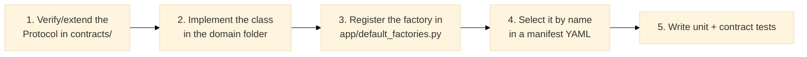

# Contributing

This document exists because the framework's value depends entirely on its architectural
discipline holding up as more people touch it: the hexagonal layering, the contract-first
approach, and the manifest-driven wiring only stay useful if every contribution respects
them. A single cross-domain import or a component wired directly in Python instead of
through a manifest quietly erodes the guarantees the rest of the codebase relies on — which
is why the rules below are enforced rather than just suggested.

## Before you start

0. New to this project? Read [docs/onboarding.md](docs/onboarding.md) first — it explains
   which of the documents below matter for your role (developer, tech lead, delivery
   consultant, functional/business profile, security) and in what order.
1. Read [CLAUDE.md](CLAUDE.md) — it documents the architectural rules you must follow.
2. Read [docs/architecture/overview.md](docs/architecture/overview.md) — the technical specification.
3. Read the relevant ADR(s) in [docs/adr/](docs/adr/) for the area you are modifying.
4. If you use Claude Code, read [docs/guides/claude-code.md](docs/guides/claude-code.md).
5. If you use multiple AI providers, read [docs/guides/ai-engineering-workflow.md](docs/guides/ai-engineering-workflow.md)
   and [docs/guides/model-routing.md](docs/guides/model-routing.md).

---

## Git Workflow Strategy

### Branch Naming

All branches must start from `main` and follow this naming pattern:

| Pattern | Example | Use case |
|---------|---------|----------|
| `feature/...` | `feature/vector-retriever` | New features, adapters, modules |
| `fix/...` | `fix/import-circular-dependency` | Bug fixes |
| `docs/...` | `docs/architecture-guide` | Documentation only (no code) |
| `refactor/...` | `refactor/security-module` | Code restructuring, no new features |
| `test/...` | `test/add-integration-coverage` | Test additions only |

**Examples:**
```bash
# Feature branch
git checkout -b feature/bm25-retriever

# Bug fix
git checkout -b fix/pii-redaction-overflow

# Documentation
git checkout -b docs/deployment-guide
```

### Commit Atomicity

Each commit must be **atomic** and **self-contained**. A reviewer should be able to understand the change by reading the commit message alone.

**Good commits:**
```
✅ Add BM25Retriever adapter + unit tests + contract conformance
✅ Fix circular import in security module
✅ Update CLAUDE.md with V2 scope clarification
```

**Bad commits:**
```
❌ WIP — still debugging
❌ Update stuff
❌ Mixed: add feature + fix bug + update docs
```

### Commit Message Format

Follow conventional commits (simplified):

```
<type>: <description>

<optional body — explain WHY, not WHAT>

Fixes #<issue> (if applicable)
```

**Types**: `feat`, `fix`, `docs`, `refactor`, `test`, `chore`

**Examples:**
```
feat: Add BM25Retriever with RRF fusion support

Implements hybrid retrieval combining vector + lexical scoring.
Uses reciprocal rank fusion for combining results.

Adds:
- BM25Retriever in retrieval/retrievers/bm25.py
- Unit tests in tests/unit/retrieval/
- Contract conformance test

Fixes #42
```

```
fix: Prevent PII redaction regex DOS on large text

PII pattern redaction was O(n²) for long documents.
Switched to compiled regex with timeout guard.

Fixes #128
```

### Pull Request (PR) Workflow

#### 1. **Create PR early** (draft if WIP)
```bash
# Push branch
git push origin feature/xyz

# Create PR on GitHub (mark as Draft if incomplete)
# Title: Clear, descriptive (e.g., "Add BM25 retriever with RRF fusion")
# Description: Fill the template (see below)
```

#### 2. **PR Description Template**

```markdown
## Description
What does this PR do? (1-2 sentences)

## Type of change
- [ ] New feature (addition without breaking change)
- [ ] Breaking change (requires version bump)
- [ ] Bug fix (fixes a bug, no new features)
- [ ] Documentation (doc only, no code)
- [ ] Test improvement (test coverage, no code)
- [ ] Refactoring (code reorganization, no behavior change)

## Scope
List affected modules:
- src/modular_rag/ingestion/chunkers/
- src/modular_rag/contracts/
- tests/unit/ingestion/

## Checklist
- [ ] Tests added/updated (unit + contract if applicable)
- [ ] No cross-domain imports introduced
- [ ] New adapter registered in `app/default_factories.py`
- [ ] `docs/` updated if applicable
- [ ] ADR written if structural decision made
- [ ] `CHANGELOG.md` updated

## Notes
Any other context (e.g., dependencies, breaking changes, etc.)
```

#### 3. **Validation before PR approval**

**Automatic checks (CI/CD):**
- ✅ Lint (ruff) passes
- ✅ Unit tests pass
- ✅ Contract tests pass
- ✅ No merge conflicts

**Manual review (required):**
- ✅ Architecture compliance: does it follow hexagonal layering?
- ✅ No cross-domain imports
- ✅ CLAUDE.md rules respected
- ✅ Code is readable and documented
- ✅ Test coverage adequate

**Approval flow:**
```
Author creates PR
    ↓
Automated CI/CD runs (lint + test + coverage)
    ↓
Code review (peer or maintainer)
    ↓
Approved → Merge to main (squash or rebase)
    ↓
Delete branch
```

### Squash vs. Merge Strategy

- **Squash**: Use for feature branches with multiple commits → 1 clean commit to main
- **Rebase**: Use for docs branches → preserve commit history
- **Merge commit**: Avoid (creates messy history)

**Recommendation**: Squash feature branches to keep `main` history clean.

---

## Development setup

```bash
git clone https://github.com/HerbertGourout/modular-rag-framework.git
cd modular-rag-framework
python -m venv .venv

.venv\Scripts\activate        # Windows
source .venv/bin/activate     # Linux / macOS

pip install -e ".[v1,dev]"    # quote the extras: zsh and some shells expand the brackets
```

`.[v1,dev]` runs the framework. **To run the full unit and contract suites you also need the
`v4` and `langgraph` extras** — they exercise the OpenTelemetry tracer and the real LangGraph
adapter, which is why the CI test jobs install `.[v1,v4,langgraph,dev]`.

Verify the install with `mrag version`, which should print `modular-rag 0.0.1`. For the full
clean-room sequence — including how to skip activation entirely when PowerShell blocks
`Activate.ps1` — follow the checklist in
[docs/guides/installation.md](docs/guides/installation.md).

Windows note: the repository ships both `scripts/check.ps1` and `scripts/check.sh`, and
`scripts/install_git_hooks.ps1` alongside its `.sh` counterpart. Use the PowerShell versions on
Windows; they are the ones exercised on this project's own development machines.

---

## Code rules

Each rule below exists to prevent a specific, previously-identified failure mode — not as
style preference. See [docs/architecture/module-model.md](docs/architecture/module-model.md)
for the worked examples of what breaks when a rule is skipped.

- **Contracts first**: add or update the Protocol in `contracts/` before writing an
  implementation. This keeps the interface the thing everyone agrees on before any one
  implementation biases the design.
- **No cross-domain imports**: `ingestion/` must not import from `generation/`. Both
  communicate through `contracts/` and `core/models/`. Skipping this means a unit test for a
  chunker could start silently requiring an LLM API key, because generation code got pulled
  in transitively.
- **Register in `app/default_factories.py`**: every new built-in adapter must be registered by
  type name. A component that exists in code but isn't registered is invisible to every
  manifest — it simply cannot be selected, which is by design: nothing runs unless a
  manifest says so.
- **Tests mirror `src/`**: `tests/unit/ingestion/chunkers/test_fixed.py` mirrors
  `src/modular_rag/ingestion/chunkers/fixed.py`. This mapping is what lets anyone find the
  test for a given file without searching — it does not scale if tests are grouped any other
  way once there are hundreds of components.
- **Contract tests** go in `tests/contract/` and must use `isinstance(obj, SomeProtocol)` to
  verify conformance. This is what actually proves an implementation satisfies its Protocol
  at runtime — `typing.Protocol` gives no static guarantee on its own (see
  [docs/adr/0002-contracts-and-plugins.md](docs/adr/0002-contracts-and-plugins.md)).

---

## Validation Strategy

Use the standardized validation script for all checks:

```bash
# After every change
./scripts/check.sh quick        # Syntax + imports (~30s)

# Before pushing
./scripts/check.sh full         # Unit + contract tests (~2-5m)

# Optional: with Qdrant
./scripts/check.sh integration  # Add integration tests (~1-2m)

# Pre-release
./scripts/check.sh all          # All scopes (~10m)
```

Windows PowerShell uses the equivalent native script:

```powershell
powershell.exe -NoProfile -ExecutionPolicy Bypass -File scripts\check.ps1 quick
powershell.exe -NoProfile -ExecutionPolicy Bypass -File scripts\check.ps1 full
powershell.exe -NoProfile -ExecutionPolicy Bypass -File scripts\check.ps1 integration
powershell.exe -NoProfile -ExecutionPolicy Bypass -File scripts\check.ps1 all
```

Install the repository's versioned Git hooks once per clone:

```powershell
# Windows
powershell.exe -NoProfile -ExecutionPolicy Bypass -File scripts\install_git_hooks.ps1
```

```bash
# Linux/macOS
sh scripts/install_git_hooks.sh
```

This sets the clone-local `core.hooksPath` to `.githooks`. The `pre-push` hook runs
`scripts/check_docs.py` and blocks the push when links, retired APIs, blueprint labels, alert
names, runbook anchors, or shared alert/SLO formulas are inconsistent. The hook validates and
reports; it never rewrites documentation automatically. Git hooks can be bypassed locally, so the
same documentation check remains mandatory in GitHub Actions.

See [docs/guides/validation-protocol.md](docs/guides/validation-protocol.md) for full reference
(`validation.md` now redirects there — this points at the canonical file directly).

---

## Running tests

```bash
pytest tests/unit            # fast, no external services
python scripts/check_layering.py  # architecture import audit
pytest tests/integration     # full directory requires Qdrant + PostgreSQL locally
pytest tests/contract        # protocol conformance
pytest tests/e2e             # full pipeline; always needs Qdrant, plus PostgreSQL for the
                              # governed-preset scenario — an LLM API key is only required for
                              # the LLM-backed scenario, not the deterministic secure-preset one
```

Claude Code users can run `/qa-v1` for the local V1 gate.
Codex users should follow `AGENTS.md` and default to independent review unless
asked to implement.

---

## Adding a new component (example: new chunker)



1. Verify `contracts/chunking.py` Chunker Protocol covers your interface (or extend it + write ADR).
2. Create `src/modular_rag/ingestion/chunkers/my_chunker.py` implementing `chunk()` and `name()`.
3. Register in `app/default_factories.py`:
   ```python
   reg.register("chunker", "my-chunker", lambda cfg: MyChunker(**cfg.config))
   ```
4. Use in a manifest:
   ```yaml
   chunker:
     type: my-chunker
     config:
       my_param: value
   ```
5. Write tests: `tests/unit/ingestion/chunkers/test_my_chunker.py` + `tests/contract/test_chunker_conformance.py`.

---

## Pull Request Checklist

- [ ] Branch created from `main` with correct naming (`feature/...`, `fix/...`, etc.)
- [ ] Commits are atomic and follow conventional format
- [ ] New code has tests (unit + contract if applicable)
- [ ] No cross-domain imports introduced
- [ ] Local V1 gate run (`/qa-v1` or Ruff + unit + contract + layering audit)
- [ ] High-risk AI-generated changes reviewed by a second provider or human reviewer
- [ ] New adapter registered in `app/default_factories.py`
- [ ] `./scripts/check.sh full` (Linux/macOS) or `powershell.exe -NoProfile -ExecutionPolicy Bypass -File scripts\check.ps1 full` (Windows) passes
- [ ] CI/CD (lint + test + coverage) passes
- [ ] `docs/architecture/` updated if layering or contracts changed
- [ ] ADR written if a structural decision was made
- [ ] `CHANGELOG.md` updated under `[Unreleased]`
- [ ] PR description filled (use template above)
