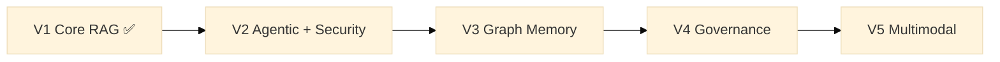

# Modular RAG Framework


A **reusable delivery accelerator** built at Publicis Sapient for production-grade RAG
and agentic systems: declarative orchestration, composable retrieval, structured memory,
native enterprise governance, and progressive multimodal support.
Built once, deployed across client projects — every adapter, manifest, and governance
policy is an asset that compounds over time.

---

## Table of Contents

- [Why this framework?](#why-this-framework)
- [Vision](#vision)
- [Architecture](#architecture)
- [Roadmap (V1 → V5)](#roadmap-v1--v5)
- [Getting started](#getting-started)
- [Key features](#key-features)
- [Project status](#project-status)
- [Contributing](#contributing)
- [License](#license)

---

## Why this framework?

**Context.** Publicis Sapient's AI practice repeatedly builds RAG systems for enterprise
clients — each time re-solving the same problems: governance, multi-tenant data isolation,
vendor lock-in, auditability, security. This framework is the answer: a proprietary
control plane that wraps the best available OSS components (sentence-transformers,
Qdrant, rank-bm25, OpenAI, Anthropic…) behind stable contracts, so that what one
project builds, every subsequent project inherits. The result is faster delivery,
higher margins, and a demonstrable technical differentiator on regulated-industry pitches.

→ [Full business case](docs/business-case.md)

---

Most RAG stacks today force you to choose between:

| | LangChain / LlamaIndex | Haystack | This framework |
|---|---|---|---|
| **Composition style** | Imperative chains | Pipelines + nodes | **Declarative manifests** (knowledge architecture as code) |
| **Agents** | Bolted on | Limited | **First-class**, with planner/retrieval/synth/critic separation |
| **Graph memory** | External plugins | External | **Native** (V3) |
| **Governance** | Manual | Limited | **Policy-as-code** (V4) |
| **Multimodal** | Partial | Partial | **Planned native** (V5) |
| **Evaluation** | External (Ragas, etc.) | Built-in | **Built-in & contract-enforced** |

The goal is **not** to be yet another RAG library — it is to provide a
**context OS**: a control plane over RAG, agents, memory, and governance
that scales from a local prototype to a multi-tenant enterprise deployment
without rewriting the core.

---

## Vision

- Build **modular RAG pipelines** (chunking, retrieval, generation, validation) — V1 ✅.
- Orchestrate **multiple specialized agents** instead of a single monolithic LLM — V2.
- Introduce **graph memory, governance, and multimodality** progressively
  without rewriting the core — V3 → V5.

Every component (chunker, retriever, agent, guard, scorer, etc.) is wired
through **stable contracts** in [`src/modular_rag/contracts/`](src/modular_rag/contracts/)
and selected via **YAML manifests** in [`manifests/`](manifests/).

The full technical specification is in
[`docs/architecture/overview.md`](docs/architecture/overview.md).

---

## Architecture

High-level view of versions V1 to V5:



System layers (see [`docs/architecture/module-model.md`](docs/architecture/module-model.md)):

- **Control plane** — manifests, policies, permissions, routing, audit.
- **Ingestion plane** — parsing, normalization, chunking, enrichment, indexing.
- **Knowledge plane** — vector store, lexical store, optional graph store, reranking.
- **Reasoning plane** — query planning, retrieval orchestration, specialized agents, synthesis.
- **Safety plane** — adversarial-query detection, anti-poisoning, policy enforcement.
- **Evaluation plane** — benchmarks, golden sets, scoring, regression dashboards.

---

## Roadmap (V1 → V5)

| Version | Theme | Key capabilities | Status |
|---|---|---|---|
| **V1** | Core RAG | Ingestion, adaptive chunking, hybrid retrieval (vector + BM25), grounded generation, basic safety, native evaluation, YAML manifests, HTTP API | ✅ Complete |
| **V2** | Agentic + Security | Query routing, multi-agent runtime (planner/retrieval/synth/critic/output), policy-aware tool use, multi-step guardrails | ⬜ Planned |
| **V3** | Graph Memory | Knowledge graph extraction, GraphRAG, multi-hop reasoning, hierarchical community summaries, reasoning memory, EvoRAG-style feedback | ⬜ Planned |
| **V4** | Governance | Policy-as-code, multi-tenant, dev/staging/prod environments, fine-grained audit, human-in-the-loop, risk profiles | ⬜ Planned |
| **V5** | Multimodal | Multimodal ingestion + retrieval (text/images/tables/audio/video), modality-specialized agents, enriched citations with timecodes | ⬜ Planned |

Detail per-version in [`ROADMAP.md`](ROADMAP.md) and
[`docs/architecture/roadmap-mermaid.md`](docs/architecture/roadmap-mermaid.md).

---

## Getting started

### Prerequisites

- Python 3.11+
- [Qdrant](https://qdrant.tech/) running on `localhost:6333`
- An OpenAI API key (or Anthropic)

### Installation

```bash
git clone https://github.com/HerbertGourout/modular-rag-framework.git
cd modular-rag-framework
python -m venv .venv
.venv\Scripts\activate          # Windows
# source .venv/bin/activate     # Linux / macOS
pip install -e ".[v1]"
```

### Run the example pipeline

```bash
# Set your API key
export MRAG_OPENAI_API_KEY=sk-...   # Linux/macOS
$env:MRAG_OPENAI_API_KEY="sk-..."   # Windows PowerShell

# Ingest documents
python examples/simple_qa/main.py ingest examples/simple_qa/docs/

# Ask a question
python examples/simple_qa/main.py ask "What is RAG?"
```

### Use the API directly

```python
from modular_rag.app.bootstrap import load_pipeline

pipeline = load_pipeline("manifests/presets/local-hybrid-rag.yaml")
answer = pipeline.answer("Explain the concept of Modular RAG.")
print(answer.text)
for citation in answer.citations:
    print(" -", citation.source, citation.score)
```

### CLI

```bash
mrag ingest ./my_docs --manifest manifests/presets/local-hybrid-rag.yaml
mrag ask "What is hybrid retrieval?" --manifest manifests/presets/local-hybrid-rag.yaml
```

### REST API

```bash
uvicorn modular_rag.api:create_app --factory --reload
# GET  /health
# POST /answer  {"question": "..."}
# GET  /retrieve?q=...&k=10
```

---

## Development & Validation

### Quick validation (< 1 minute)

Use after code changes:

```bash
./scripts/check.sh quick    # Syntax & import order
./scripts/check.sh full     # Quick + unit + contract tests
```

### Full validation workflows

| Workflow | Command | Time | Use when |
|----------|---------|------|----------|
| **Daily** | `./scripts/check.sh quick` | ~30s | After edits, before commit |
| **Pre-merge** | `./scripts/check.sh full` | ~2-5m | Ready for PR/MR |
| **With services** | `./scripts/check.sh integration` | ~1-2m | Qdrant running |
| **Production** | `./scripts/check.sh all` | ~10m | Before release |

### Individual test scopes

```bash
# Unit tests (no external services)
pytest tests/unit/ -v

# Contract conformance (Protocol validation)
pytest tests/contract/ -v

# Integration tests (requires Qdrant on localhost:6333)
docker run -p 6333:6333 qdrant/qdrant &
pytest tests/integration/ -v -m integration

# End-to-end pipeline (requires Qdrant + LLM API key)
export MRAG_OPENAI_API_KEY=sk-...
pytest tests/e2e/ -v -m e2e
```

→ **Full reference:** [docs/guides/validation.md](docs/guides/validation.md)

---

## Key features

- **Declarative orchestration** via YAML manifests (knowledge architecture as code).
- **Adaptive chunking** and **hybrid retrieval** (vector + BM25, RRF fusion).
- **Security built-in**: prompt injection guard, PII redaction, policy enforcement.
- **Built-in evaluation**: exact-match F1, recall@k, groundedness, latency, cost traces.
- **Full observability**: every pipeline step emits tokens, latency, and metadata.
- **No vendor lock-in**: swap LLMs, embedders, or vector stores via a single YAML line.
- **Planned extensions**: agentic runtime (V2), graph memory (V3), governance (V4), multimodal (V5).

---

## Project status

**V1 is complete and end-to-end functional.**

| Component | Status |
|---|---|
| Core models & contracts | ✅ |
| Ingestion (parsers, chunkers, normalizers) | ✅ |
| Hybrid retrieval (BM25 + vector + RRF) | ✅ |
| OpenAI & Anthropic generators | ✅ |
| Security (guard + PII redactor) | ✅ |
| Evaluation (exact-match, benchmarks) | ✅ |
| REST API & CLI | ✅ |
| YAML manifest wiring | ✅ |
| Unit + contract tests (98/98) | ✅ |
| Integration tests (requires Qdrant) | ✅ |

Track progress and milestones:

- [`CHANGELOG.md`](CHANGELOG.md) — released versions
- [`ROADMAP.md`](ROADMAP.md) — V1 → V5 capabilities
- [`docs/adr/`](docs/adr/) — Architecture Decision Records

---

## Contributing

1. Read [`docs/architecture/overview.md`](docs/architecture/overview.md) and
   the [ADRs](docs/adr/) before submitting structural changes.
2. Fork the repo and create a branch (`feature/my-feature`).
3. Implement your changes + tests
   ([`tests/unit/`](tests/unit/), [`tests/integration/`](tests/integration/),
   [`tests/contract/`](tests/contract/)).
4. Update docs if needed
   ([`docs/guides/`](docs/guides/), [`docs/architecture/`](docs/architecture/)).
5. Open a Pull Request into `main`.

See [`CONTRIBUTING.md`](CONTRIBUTING.md) for coding, testing, and documentation guidelines.

---

## License

This project is distributed under the **Apache License 2.0**.
See the [`LICENSE`](LICENSE) file for details.
