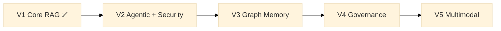
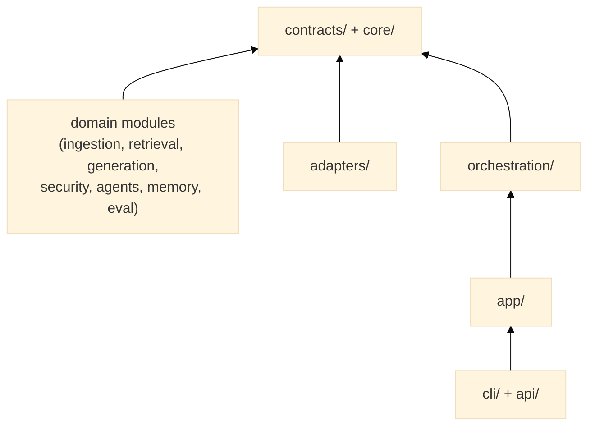

# Modular RAG Framework


> **Note on the status badge.** It reads "pre-alpha" while several sections below describe parts
> of V1 as implemented and unit/contract-tested. Precisely: **V1.0** (CLI, REST API, hybrid
> retrieval, security) is implementation-complete, and the two live-validation runs `ROADMAP.md`'s
> checklist once listed as unchecked (`examples/simple_qa/` end-to-end, and the hybrid-retrieval
> integration run) are now exercised automatically — the hybrid-retrieval integration suite runs
> against a real Qdrant on every push/PR, and the same pipeline `examples/simple_qa/` uses runs
> nightly against real Qdrant and a real LLM key (Batch 10, `.github/workflows/ci.yml` and
> `nightly.yml`) — no longer an open validation gap. **V1.1** (evaluation) and **V1.2** (compliance
> audit) are different: `ROADMAP.md`
> marks both "partially built" with genuine, named implementation gaps, not just pending
> validation — NDCG, populated golden sets, and a regression dashboard for V1.1; formatted
> GDPR/CCPA/HIPAA report generation, an explicit data-lineage artifact, and an access-control log
> for V1.2. So "V1 is complete" is not the claim made anywhere in this document, in either sense
> — only "V1.0 is implemented and live-validated" is. That distinction, and the pre-alpha
> badge itself, are not documentation errors to silently paper over — they reflect an open
> governance question (how "alpha" is defined for this project, and who is authorized to change
> the badge) that this documentation pass does not have the authority to resolve on its own. If
> you are the maintainer reading this and V1.0 has, in your judgment, graduated past pre-alpha,
> update the badge; until then, treat the badge as the more conservative, business-level claim,
> and the technical sections below as precise about which specific sub-version each claim
> actually covers.

A **reusable delivery accelerator** built at Publicis Sapient for production-grade RAG
and agentic systems: declarative orchestration, composable retrieval, structured memory,
native enterprise governance, and progressive multimodal support.
Built once, deployed across client projects — every adapter, manifest, and governance
policy is an asset that compounds over time.

---

## Table of Contents

- [Why this framework?](#why-this-framework)
- [Core concepts](#core-concepts)
- [Vision](#vision)
- [Architecture](#architecture)
- [Design philosophy — why these choices, and what we rejected](#design-philosophy--why-these-choices-and-what-we-rejected)
- [Roadmap (V1 → V5)](#roadmap-v1--v5)
- [Getting started](#getting-started)
- [Development & Validation](#development--validation)
- [Key features](#key-features)
- [Project status](#project-status)
- [Documentation map](#documentation-map)
- [Frequently asked questions & common pitfalls](#frequently-asked-questions--common-pitfalls)
- [Contributing](#contributing)
- [License](#license)

---

## Why this framework?

**Context.** Publicis Sapient's AI practice repeatedly builds RAG systems for enterprise
clients — each time re-solving the same problems: governance, multi-tenant data isolation,
vendor lock-in, auditability, security. This framework is the answer: a proprietary
control plane that wraps the best available OSS components (sentence-transformers,
Qdrant, rank-bm25, OpenAI, Anthropic…) behind stable contracts, so that what one
project builds, every subsequent project inherits. The result is faster delivery,
higher margins, and a demonstrable technical differentiator on regulated-industry pitches.

**Why this matters concretely.** Without a shared framework, every client engagement
independently reinvents: how to keep tenant A's documents invisible to tenant B, how to prove
to an auditor which document produced which answer, how to swap OpenAI for Anthropic (or a
self-hosted model) without rewriting the retrieval layer, and how to demonstrate to a
regulated-industry client (finance, healthcare, public sector) that the system fails closed
rather than open when something goes wrong. Each of those is a multi-week engineering effort if
built from scratch on a single engagement, and a sunk cost that the next engagement cannot reuse
if it was built directly against LangChain's or Haystack's primitives instead of behind this
framework's own contracts. This framework exists specifically so that cost is paid once.

→ [Full business case](docs/business-case.md) · [Onboarding by role — developer, tech lead, delivery, functional, security](docs/onboarding.md)

---

Most RAG stacks today force you to choose between:

| | LangChain / LlamaIndex | Haystack | This framework |
|---|---|---|---|
| **Composition style** | Imperative chains | Pipelines + nodes | **Declarative manifests** (knowledge architecture as code) |
| **Agents** | Bolted on | Limited | **Delegated via adapter** to LangGraph behind `DocumentEngine`; guard, tenant isolation and redaction are enforced today, while unsupported audit/policy/review/telemetry declarations fail startup |
| **Graph memory** | External plugins | External | **Delegated** GraphRAG traversal (V3); the native graph data model was evaluated and removed (Étape 8, [ADR-0007](docs/adr/0007-layer-boundaries-and-control-plane-activation.md) — resolved, not left undecided: zero consumers, restorable via git history if a real need emerges) |
| **Governance** | Manual | Limited | **Policy-as-code**, owned and current (V2.0), not deferred |
| **Multimodal** | Partial | Partial | **Delegated** VLM execution (V5); parsing/citation enrichment may stay native |
| **Evaluation** | External (Ragas, etc.) | Built-in | **Built-in & contract-enforced** |

Per [ADR-0005](docs/adr/0005-document-ai-control-plane-boundary.md) (accepted 2026-08-04), the
goal is **not** to compete on building a bigger agent/graph runtime than the frameworks above —
it is to own the **engine-neutral control plane** around whichever engine you plug in:
governance, audit, evaluation, tenant isolation, and portability that scale from a local
prototype to a multi-tenant enterprise deployment without rewriting the core.

**When should you reach for this framework instead of LangChain/Haystack directly?** If your
project's hard requirements include: provable per-tenant data isolation, an audit trail a
compliance officer can query without reading logs, the ability to swap the underlying LLM or
vector store per client without touching application code, or evaluation gates that block a
regression before it reaches production — this framework's opinions pay for themselves quickly.
If your project is a single-tenant prototype with no compliance requirement and no plan to reuse
the pipeline across engagements, the overhead of learning the manifest/contract/registry model is
real, and a thinner, more direct use of LangChain or a hand-rolled pipeline may get you to a demo
faster. This framework optimizes for the second and third project in a family of engagements, not
necessarily the first prototype.

---

## Core concepts

This section is the mental model every other document in this repository assumes you already
have. Read it once, in full, before touching code — it will save you from re-deriving the same
five ideas from scattered comments across dozens of files.

### 1. Hexagonal (ports-and-adapters) architecture — what, and why

**What.** The codebase is organized into strict layers with a single allowed direction of
dependency: `core/` (foundation, imports nothing) ← `contracts/` (interfaces, imports only
`core/`) ← domain modules (`ingestion/`, `retrieval/`, `generation/`, `security/`, `agents/`,
`memory/`, `eval/` — each imports only `contracts/` + `core/models/`, **never each other**) ←
`adapters/` (external bindings: Qdrant, OpenAI, sentence-transformers — import `contracts/` +
`core/` + external libraries, never domain modules) ← `orchestration/` (wiring, execution flow) ←
`app/` (composition root, the only place allowed to see every layer at once) ← `cli/`/`api/`
(thin entry points). See [`docs/architecture/module-model.md`](docs/architecture/module-model.md)
for the exhaustive, file-by-file version of this map, and
[ADR-0001](docs/adr/0001-modular-architecture.md) for the original decision record.

**Why.** Three concrete failure modes this prevents, each of which has happened in real
enterprise RAG projects the authors have worked on directly:

1. *Retrieval logic silently depends on which LLM is configured*, because someone imported the
   generation module from inside a retriever "just this once" to reuse a prompt-formatting
   helper. Six months later, changing the LLM provider requires touching retrieval code nobody
   remembers is coupled to it. The **domain modules never import each other** rule makes this
   architecturally impossible, not just discouraged by convention.
2. *A vector store migration (Qdrant → pgvector, say) requires touching business logic*, because
   the retriever class directly constructs and calls the Qdrant SDK inline. The **adapters own
   all external-library knowledge, domain modules only see `contracts/`** rule means a new vector
   store is a new file in `adapters/vectorstores/`, registered once, with zero changes to
   `retrieval/`.
3. *Tests require a live Qdrant instance and an OpenAI API key just to check that chunking logic
   is correct*, because nothing separates "pure logic" from "talks to the network." The layering
   rule plus the [contract-testing convention](docs/guides/getting-started.md) means most tests
   run in milliseconds with no external service.

**Alternative considered and rejected.** A more conventional layered MVC-style split
(`models/`, `services/`, `controllers/`) was considered early on and rejected because it does not
by itself prevent failure mode #1 above — nothing in a typical MVC split stops a "service" from
importing another unrelated "service." Hexagonal architecture's specific contribution is making
the **direction of dependency enforceable by a static check** (`scripts/check_layering.py`, run
in CI on every change) rather than relying on code review discipline alone.

### 2. Contracts — `typing.Protocol`, not abstract base classes

**What.** Every capability the framework offers (chunking, embedding, retrieval, generation,
security guarding, evaluation…) is defined as a `typing.Protocol` in `src/modular_rag/contracts/`
— a structural-typing interface, not a class you inherit from. A `HuggingFaceEmbedder` is an
`Embedder` because it has the right methods with the right signatures, not because it extends an
`Embedder` base class.

**Why Protocol instead of ABC (`abc.ABC`).** Two reasons, both deliberate:

- **Adapters wrap third-party objects that cannot be retrofitted to inherit from our base
  classes.** `OpenAIGenerator` wraps the `openai` SDK's client; forcing an inheritance
  relationship would mean either subclassing a library class we don't own (fragile — it can
  change its own inheritance structure any time) or wrapping-and-forwarding every method by hand
  for no additional safety, since Python's duck typing already lets the wrapper satisfy the
  interface structurally.
- **`isinstance()` against a `@runtime_checkable` Protocol gives us conformance testing for
  free**, without a metaclass or registration step: `tests/contract/test_*_conformance.py` files
  simply assert `isinstance(my_new_adapter, Embedder)` and the interpreter checks every required
  method exists. Compare this to ABC's `register()` mechanism, which does not check method
  presence at all — an ABC subclass with a missing method fails only when that method is actually
  called, at runtime, in production. A missing Protocol method fails `isinstance()` immediately,
  in a unit test, before the adapter ever reaches a manifest.

**When you'd add a new contract vs. a new implementation of an existing one.** Adding a new
*implementation* (a new embedder, a new generator) never touches `contracts/` — you add a class in
the appropriate domain module or `adapters/`, and register it. Adding a new *contract* (a
genuinely new capability category, like `contracts/indexing.py`'s `VectorIndexer` sub-protocol
added in [ADR-0009](docs/adr/0009-vector-indexer-dimension-reconciliation.md)) is a structural
change that requires an ADR per `CLAUDE.md` §07 — because every implementation, every
conformance test, and every piece of orchestration code that might call the new method is a
consequence of that one decision, and an ADR is where that blast radius gets written down before
the code does.

### 3. Adapters — the only place external libraries are allowed to leak in

**What.** `adapters/` is where `qdrant-client`, `sentence-transformers`, `openai`, `anthropic`,
and `fitz` (PDF parsing) are actually imported. Every one of them is imported **lazily, inside
the method that needs it**, never at module level — see `.claude/rules/adapters.md` for the
mandatory pattern. This means `import modular_rag.adapters.embeddings.hf_embedder` does not
trigger a multi-hundred-megabyte `sentence-transformers` download; only calling `.embed()` for
the first time does.

**Why lazy imports specifically, not just "adapters own external deps."** A framework installed
via `pip install modular-rag[v1]` is expected to import cleanly and run its unit test suite
(hundreds of tests, sub-10-second wall time in this repository) without any of Qdrant,
sentence-transformers' model weights, or an LLM API key being present. If `HuggingFaceEmbedder`
imported `sentence_transformers` at module level, merely importing the framework's package graph
— which `tests/unit/` does, transitively, through `app/default_factories.py`'s registration of
every built-in adapter — would require a real model download in CI, in every contributor's local
environment, and in any deployment that only ever uses the OpenAI embedder. Lazy imports keep
the framework's own footprint proportional to what a given deployment actually uses.

### 4. The registry + manifests — how components become a running pipeline

**What.** Two pieces work together:

- `orchestration/registry.py`'s `ComponentRegistry` is a lookup table: `role` (`"embedder"`,
  `"generator"`, `"indexer"`…) × `type name` (`"sentence-transformers"`, `"openai"`, `"qdrant"`…)
  → a factory function that builds one instance from a `ComponentConfig` (a `type:` string plus a
  free-form `config:` dict). `app/default_factories.py` is where every built-in implementation
  gets registered against a type name.
- A **manifest** (a YAML file under `manifests/`) is a `PipelineManifest` — a flat, versioned,
  Pydantic-validated document that names, for every role, which registered type to use and what
  config to pass it. `ComponentRegistry.wire(manifest)` reads the manifest, calls the matching
  factory for every configured role, and wires the results together into a `Container`.

**Why manifests instead of Python code building the pipeline directly.** This is the framework's
single most consequential design decision, and it is worth explaining in full because it is easy
to dismiss as "just YAML config" when it is really a governance mechanism:

- **A manifest is reviewable by someone who does not read Python.** A security reviewer, a
  delivery lead, or a client's own compliance team can read
  `manifests/presets/secure-enterprise-rag.yaml` and see exactly which guard, which redactor,
  which audit sink, and which tenant policy are active — without auditing application code.
- **Swapping a component is a one-line diff with no code review of business logic.** Changing
  `embedder: type: sentence-transformers` to `embedder: type: openai-embeddings` does not touch
  `retrieval/`, `generation/`, or any file a code reviewer would need to re-verify for
  correctness — the manifest schema and the registry's factory contract already guarantee the
  new component satisfies the same `Embedder` Protocol.
- **Per-client customization does not require forking the framework.** A client with stricter
  data residency requirements gets their own manifest pointing at a different Qdrant instance and
  a different (possibly on-prem) LLM — the *framework* code is identical across every engagement;
  only the manifest differs. This is what makes the framework a genuine reusable asset rather than
  a template every project copies and diverges from.

**Alternative considered and rejected: a Python DSL / builder API** (e.g.
`Pipeline().with_embedder(OpenAIEmbedder()).with_generator(...)`, the style LangChain's
expression language and Haystack's pipeline API both use). This was explicitly rejected for this
framework's purposes because it collapses the three benefits above back into "read the Python to
know what's configured" — a Python DSL is still code, requiring a Python-literate reviewer, and
because a builder API's component instances are constructed inline, there is no single file a
non-engineer can diff to see what changed between two deployments. The manifest approach trades a
small amount of expressiveness (you cannot conditionally branch pipeline construction in YAML the
way you can in Python) for a hard guarantee that pipeline topology is always externally
observable and diffable. See [ADR-0002](docs/adr/0002-contracts-and-plugins.md) for the original
decision record, and `.claude/.instructions.md` §2 for the enforced "never wire directly in
Python" rule.

**When to touch the registry vs. the manifest.** Adding a *new type* of an existing role (a new
generator implementation) touches the registry once (`app/default_factories.py`, one
`reg.register(...)` call) and then every manifest that wants to use it. Selecting a *different
already-registered type*, or changing an existing component's config, touches only the manifest —
zero Python changes.

### 5. Orchestration engines — native pipeline vs. delegated engine, behind one port

**What.** `RAGEngine` (in `orchestration/engine.py`) is the framework's own, native, sequential
pipeline: tenant check → policy engine → security guard (query) → retrieve → tenant filter →
rerank → generate → security guard (answer) → redact → human review flag → audit. It is wrapped
by `NativeEngineAdapter` to conform to a vendor-neutral `DocumentEngine` port
(`contracts/engine.py`, [ADR-0006](docs/adr/0006-external-engine-selection.md)/
[ADR-0007](docs/adr/0007-layer-boundaries-and-control-plane-activation.md)). A manifest's
`engine.adapter` field selects which implementation of that port actually runs a given pipeline —
`"native"` (the default, `NativeEngineAdapter`) or `"langgraph"`
(`LangGraphEngineAdapter`, wrapping the same wired components in a LangGraph graph instead of
`RAGEngine`'s fixed sequence).

**Why a port at all, if only two adapters exist today.** The port exists so that **application
code (the CLI, the REST API, your own scripts) never needs to know or care** which engine is
answering a question — `ApplicationService.answer()` is identical regardless of
`engine.adapter`'s value. This is what lets the framework delegate generic multi-agent
orchestration to LangGraph (per ADR-0005 §5.2 — the framework's stated position is that
building a third competitive multi-agent runtime is not where this project's value lies) without
that delegation leaking into every caller as a special case. The alternative — application code
branching on "if using the agentic engine, call `.run_agentic()` instead of `.answer()`" — was
rejected specifically because it would make every future engine option a breaking change to every
caller, instead of an additive manifest option.

**Why owned governance still applies uniformly across both.** A `DocumentEngine` implementation
declares a `capabilities: frozenset[EngineCapability]` — `NativeEngineAdapter` declares an empty
set deliberately (see its own docstring: overclaiming a capability it cannot honor would be worse
than declaring none). `LangGraphEngineAdapter` enforces the security guard, tenant isolation, and
redaction today; a manifest that declares `governance.policy_engine`, `governance.review_queue`,
`governance.audit_sink`, or `observability.telemetry` while selecting `engine.adapter: langgraph`
**fails validation at startup**, rather than silently constructing an audit sink nothing ever
writes to. This "declared-but-not-activatable fails validation" rule (ADR-0007 §3) is what keeps
a manifest an honest, auditable statement of what actually runs — not aspirational documentation
of what someone hoped would run.

### 6. The governance stack — tenant isolation, audit, redaction, policy-as-code

**What.** Four independently-optional, manifest-wired components, all under
`security/policies/`, `security/redaction/`, and `security/audit/`:

- **`TenantIsolationPolicy`** — fail-closed by design: a query with no `tenant_id` is denied
  outright (`PolicyViolationError`), not silently answered without tenant scoping. Retrieved
  context is filtered to the requesting tenant's own chunks after retrieval, as a second layer of
  defense on top of the vector store's own server-side tenant filter (Qdrant payload filtering).
  See [`docs/architecture/threat-model.md`](docs/architecture/threat-model.md) for the specific
  cross-tenant leak vectors this defends against, and why both layers exist rather than trusting
  one alone.
- **`PolicyEngine`** — YAML-declared rules (`condition` / `action: deny|warn` pairs) evaluated
  against every query before it reaches retrieval. Policy-as-code, not a comment in a design
  document: a rule that fails to evaluate denies by default (fail-closed), matching the same
  philosophy as tenant isolation.
- **`PatternRedactor`** — regex-based PII/secret redaction (email, phone, IBAN, API key patterns,
  card numbers with Luhn validation) applied to audit payloads and, when configured, to answer
  text before it ever leaves the pipeline.
- **`AuditSink`** (`InMemoryAuditSink` for local/dev, `PostgresAuditSink` for durable,
  append-only, queryable compliance evidence) — every governed run emits `AuditEvent`s
  (`RUN_SUCCEEDED`, `RUN_FAILED`, `GUARD_DECISION`) carrying an explicit, allowlisted payload
  (never raw PII, never the unredacted query text) so an auditor can answer "who asked what, when,
  and was it allowed" without reading application logs.

**Why this is "owned," not delegated, per ADR-0005.** Multi-agent orchestration and GraphRAG
traversal are explicitly delegated to LangGraph because dozens of other well-maintained projects
already solve those problems well, and re-solving them natively would not differentiate this
framework from its competitors. Governance is the opposite case: it is the thing enterprise
clients actually pay for and the thing generic orchestration frameworks do *not* solve well out
of the box (see the comparison table above — "Manual" and "Limited" in the Governance row for
LangChain and Haystack respectively). Owning it natively, and enforcing it identically regardless
of which execution engine answers a query, is the framework's stated differentiator.

### How a request actually flows — a concrete walk-through

Ingestion (`RAGEngine.ingest()` / `ApplicationService.ingest_chunks()`):

```
Document → Chunker.chunk() → [Chunk, Chunk, …] → TenantIsolationPolicy.enforce_ingest()
    (fail-closed if any chunk has no tenant_id) → Embedder.embed() → Indexer.index()
    (Qdrant) → Retriever's own lexical index, if any (BM25)
```

Answering (`RAGEngine.answer()` / `ApplicationService.answer()`, native engine):

```
Query → TenantIsolationPolicy.enforce_query() (fail-closed) → PolicyEngine.enforce_query()
    → SecurityGuard.check_query() → Retriever.retrieve() → TenantIsolationPolicy.filter_chunks()
    → Reranker.rerank() [optional] → Generator.generate() → SecurityGuard.check_answer()
    → Redactor.redact() [optional] → ReviewQueue.enqueue() [optional, if flagged]
    → AuditSink.record() [if configured] → Answer
```

Every arrow above is a real method call you can find in `orchestration/engine.py::_run_steps()` —
this diagram is not aspirational, it is a description of code that exists and is tested today.
Every optional step (marked `[optional]` or gated on a manifest section being present) is a no-op
when its component is not wired, so a minimal `local-hybrid-rag.yaml` manifest with no
`governance:` section runs the same code path with those branches simply skipped.

---

## Vision

- Build **modular RAG pipelines** (chunking, retrieval, generation, validation) — V1 ✅.
- Own governance, audit, evaluation, and tenant isolation natively; delegate generic
  multi-agent orchestration to a selected external engine (LangGraph, ADR-0006) via the
  `DocumentEngine` port — V2 (Policy Engine native and current; agent orchestration delegated).
- Introduce **graph memory, governance, and multimodality** progressively
  without rewriting the core — V3 → V5, per the same owned-vs-delegated split.

Runtime components (chunker, retriever, generator, guard, governance adapters, etc.) are wired
through stable contracts and selected via YAML manifests. Offline evaluation helpers are the
intentional exception: ADR-0008 keeps them programmatic because gold answers and aggregate
baselines do not belong in the online answer path.

The full technical specification is in
[`docs/architecture/overview.md`](docs/architecture/overview.md).

---

## Architecture

High-level view of versions V1 to V5:



This is a *feature-delivery* timeline, not a *dependency-layer* diagram — do not confuse it with
the hexagonal layering described in [Core Concepts](#core-concepts) above. The two are
orthogonal: V1 through V5 are increments of *capability*, delivered inside the same unchanging
hexagonal skeleton described next.

System layers (see [`docs/architecture/module-model.md`](docs/architecture/module-model.md)):



- **Control plane** — manifests, policies, permissions, routing, audit.
- **Ingestion plane** — parsing, normalization, chunking, enrichment, indexing.
- **Knowledge plane** — vector store, lexical store, optional graph store, reranking.
- **Reasoning plane** — retrieval orchestration and synthesis; multi-agent query
  planning/execution is delegated to the selected external engine (ADR-0005 §5.2), reached via
  the `DocumentEngine` port, not built as a native specialized-agent runtime.
- **Safety plane** — adversarial-query detection, anti-poisoning, policy enforcement.
- **Evaluation plane** — benchmarks, golden sets, scoring, regression dashboards.

For the full per-component treatment (role, responsibilities, dependencies, lifecycle,
extension points, and constraints of every major component) see
[`docs/architecture/overview.md`](docs/architecture/overview.md) and
[`docs/architecture/module-model.md`](docs/architecture/module-model.md).

---

## Design philosophy — why these choices, and what we rejected

This is a condensed index into the reasoning already given in depth in [Core
Concepts](#core-concepts) above and in the ADRs, for readers who want the "why" summarized in one
place before deciding whether to adopt the framework:

| Decision | Chosen | Rejected alternative(s) | Full reasoning |
|---|---|---|---|
| Interface style | `typing.Protocol` (structural typing) | `abc.ABC` (nominal inheritance) | [Core Concepts §2](#2-contracts--typingprotocol-not-abstract-base-classes) |
| Pipeline composition | Declarative YAML manifests | Python builder DSL (LangChain/Haystack style) | [Core Concepts §4](#4-the-registry--manifests--how-components-become-a-running-pipeline) |
| Multi-agent orchestration | Delegate to LangGraph via a vendor-neutral port | Build a native competing agent runtime | [ADR-0005](docs/adr/0005-document-ai-control-plane-boundary.md), [Core Concepts §5](#5-orchestration-engines--native-pipeline-vs-delegated-engine-behind-one-port) |
| Governance (tenant isolation, audit, policy) | Native, framework-owned, fail-closed on every engine — but the *currently activated subset* differs by engine: the native pipeline enforces all of it; the LangGraph adapter enforces guard/tenant isolation/redaction today and **rejects** (fails startup validation, does not silently ignore) a manifest declaring `policy_engine`/`review_queue`/`audit_sink`/`telemetry` it doesn't yet consume | Delegate to the orchestration engine's own primitives | [ADR-0005](docs/adr/0005-document-ai-control-plane-boundary.md) §5.1, [Core Concepts §5–6](#5-orchestration-engines--native-pipeline-vs-delegated-engine-behind-one-port) |
| Module dependency direction | Hexagonal, statically enforced (`scripts/check_layering.py`) | Conventional layered MVC, enforced by review only | [ADR-0001](docs/adr/0001-modular-architecture.md), [Core Concepts §1](#1-hexagonal-ports-and-adapters-architecture--what-and-why) |

---

## Roadmap (V1 → V5)

| Version | Theme | Key capabilities | Status |
|---|---|---|---|
| **V1** | Core RAG | Ingestion, adaptive chunking, hybrid retrieval (vector + BM25), grounded generation, basic safety, native evaluation, YAML manifests, HTTP API | 🟡 V1.0 (the pipeline listed here) passes its unit + contract suite and its CLI/API surface is implemented; `ROADMAP.md` is the authoritative, more granular tracker and currently lists V1.1 (Evaluation-as-Contract) and V1.2 (Compliance Audit Trail) as **partially built** — populated golden sets, NDCG, and formatted compliance-report generation are not yet shipped. See [`ROADMAP.md`](ROADMAP.md) for the exact checklist before treating V1 as fully closed. |
| **V2** | Agentic + Security | Policy Engine (native, owned, current) + tenant isolation (real, shipped); multi-agent orchestration delegated to the selected external engine via `DocumentEngine` (ADR-0005) | 🟡 Policy Engine/tenant isolation ✅, agent delegation via LangGraph adapter ✅ (Lot 15) |
| **V3** | Graph Memory | GraphRAG traversal, multi-hop reasoning, and community summaries delegated to the external engine; the native `KnowledgeGraph` data model was removed (Étape 8, [ADR-0007](docs/adr/0007-layer-boundaries-and-control-plane-activation.md)) — zero consumers, restorable via git if a real need emerges | ⬜ Delegated (unavailable in the selected engine today) |
| **V4** | Governance | Policy-as-code, multi-tenant, dev/staging/prod environments, fine-grained audit, human-in-the-loop, risk profiles | ⬜ Planned |
| **V5** | Multimodal | Multimodal ingestion + retrieval (text/images/tables/audio/video); VLM execution delegated to the external engine, parsing/citation enrichment may stay native | ⬜ Planned |

Detail per-version in [`ROADMAP.md`](ROADMAP.md) and
[`docs/architecture/roadmap-mermaid.md`](docs/architecture/roadmap-mermaid.md).

---

## Getting started

This section gets you to a first successful query in a few minutes. For the complete,
step-by-step walkthrough — including what each ingestion step actually does under the hood, how
to read the CLI's output, and how to pick the right preset for your use case — see the
**[full Getting Started guide](docs/guides/getting-started.md)**, which this section deliberately
does not duplicate.

### Prerequisites

- Python 3.11+
- [Qdrant](https://qdrant.tech/) running on `localhost:6333` (`docker run -d -p 6333:6333 qdrant/qdrant`)
- An OpenAI API key (or Anthropic) — only for the two LLM-backed presets; see
  [`tests/e2e/manifests/`](tests/e2e/manifests/) for a fully deterministic, no-external-key
  pipeline you can run without any API key at all, useful for exploring the framework's mechanics
  without incurring API cost.

### Installation

```bash
git clone https://github.com/HerbertGourout/modular-rag-framework.git
cd modular-rag-framework
python -m venv .venv
.venv\Scripts\activate          # Windows
# source .venv/bin/activate     # Linux / macOS
pip install -e ".[v1]"
```

### Run a full hybrid query

```bash
# Set your API key (the OpenAI SDK's own standard var — configuration is manifest-driven,
# see app/config_resolution.py's ${VAR}/secret:// interpolation, not env-var settings classes)
export OPENAI_API_KEY=sk-...   # Linux/macOS
$env:OPENAI_API_KEY="sk-..."   # Windows PowerShell

# Cross-platform; keeps ingestion and querying in one process so BM25 is retained.
python examples/simple_qa/first_query.py
```

**Why "one process" matters here, specifically.** `HybridRetriever` combines two retrieval
mechanisms: a persistent vector index (Qdrant, survives across processes) and an in-memory BM25
lexical index (does **not** survive — it is rebuilt from scratch every time a new Python process
starts). Running ingestion and querying in the same process, as `first_query.py` does, is the
only way to see genuinely fused vector+BM25 results on a fresh environment. This is a deliberate
architectural trade-off, not a bug — see the [FAQ](#frequently-asked-questions--common-pitfalls)
below for the full explanation and your options if you need BM25 to persist across processes.

### Use the API directly

Two facades exist, and choosing the right one matters — see
[Core Concepts §5](#5-orchestration-engines--native-pipeline-vs-delegated-engine-behind-one-port)
for the full explanation of the engine port they both eventually go through.

**`load_pipeline` / `RAGEngine`** — the simpler, "stable compatibility" facade. Use it for local
scripts, notebooks, and single-tenant experimentation where you have no need for authenticated
tenant identity or the vendor-neutral `DocumentEngine` port:

```python
from modular_rag.app.bootstrap import load_pipeline

pipeline = load_pipeline("manifests/presets/local-hybrid-rag.yaml")
answer = pipeline.answer("Explain the concept of Modular RAG.")
print(answer.text)
for citation in answer.citations:
    print(" -", citation.source, citation.score)
```

**`load_application` / `ApplicationService`** — the facade the CLI and REST API actually use in
production. Use it whenever tenant identity, the `engine.adapter` selection (native vs.
LangGraph), or governed audit/policy enforcement matter to your use case. This example still uses
`local-hybrid-rag.yaml` — the same manifest as above, with the same prerequisites (Qdrant + an
LLM key, nothing else) — so it stays copy/paste runnable; `local-hybrid-rag.yaml` wires no
`governance.tenant_policy`, so `tenant_id` below is accepted and threaded through but not
enforced against anything:

```python
from modular_rag.app.public import load_application

app = load_application("manifests/presets/local-hybrid-rag.yaml")
answer = app.answer("Explain the concept of Modular RAG.", tenant_id="acme-corp")
print(answer.text)
app.close()  # releases the Qdrant client, DB connections, etc.
```

**Running the fully governed example** (`manifests/presets/secure-enterprise-rag.yaml`) needs
more than the prerequisites above, and is deliberately not copy/paste-runnable from this
paragraph alone — its manifest requires a reachable PostgreSQL (the durable audit sink) plus
three environment variables the manifest resolves via `${VAR}`/`secret://` interpolation
(`QDRANT_URL`, `QDRANT_API_KEY`, `AUDIT_DATABASE_URL`; see `app/config_resolution.py`). Calling
`load_application("manifests/presets/secure-enterprise-rag.yaml")` with any of these unset raises
`ConfigurationError` at manifest-resolution time, before any pipeline is built — a deliberate
fail-fast behavior (an incompletely-configured governed pipeline should refuse to start, not
start and silently skip governance). This heavier setup is the point: it is what buys you tenant
isolation, policy-as-code, and a durable audit trail — see [Core Concepts
§6](#6-the-governance-stack--tenant-isolation-audit-redaction-policy-as-code) for why that
trade-off exists, and
[`tests/e2e/test_secure_preset_e2e.py`](tests/e2e/test_secure_preset_e2e.py)'s own module
docstring for a complete, runnable (Qdrant + PostgreSQL, no LLM key) demonstration of this exact
manifest's governance behavior end-to-end.

### CLI

```bash
mrag ingest ./my_docs --manifest manifests/presets/local-hybrid-rag.yaml
mrag ask "What is hybrid retrieval?" --manifest manifests/presets/local-hybrid-rag.yaml
```

The vector index persists in Qdrant between these commands; the reference BM25 index does not.
Consequently, a separate `mrag ask` process uses vector fallback. See the
[getting-started guide](docs/guides/getting-started.md) for a genuinely hybrid one-process run,
and the FAQ below for why this is a deliberate design trade-off rather than an oversight.

### REST API

`create_app()` requires a manifest path argument, so plain `--factory` mode (which calls the
factory with no arguments) does not work — wrap it in a one-line module instead:

```python
# server.py
from modular_rag.api import create_app
app = create_app("manifests/presets/local-hybrid-rag.yaml")
```

```bash
uvicorn server:app --reload
```

Four routes exist today:

| Route | Method | Auth | Purpose |
|---|---|---|---|
| `/health` | GET | Never required | Liveness probe — process is up and the pipeline finished wiring. |
| `/ready` | GET | Never required | Readiness probe (Lot 6) — probes every wired component that implements `HealthCheckable` (Qdrant, PostgreSQL, and the configured LLM generator via a real, cached, non-generative authenticated call) and returns `healthy`/`degraded` (HTTP 200) or `unready` (HTTP 503); see [docs/api/rest.md](docs/api/rest.md#get-ready) for the full status/criticality contract. |
| `/answer` | POST | Required only if `create_app(token_verifier=...)` was given a verifier (mandatory when the manifest wires `governance.tenant_policy`) | `{"question": "..."}` → `{"text": ..., "citations": [...], "trace_id": ...}` |
| `/retrieve` | GET | Same as `/answer` | `?q=...&k=10` → raw retrieved chunks with scores, no generation |

```bash
curl -X POST http://localhost:8000/answer \
     -H "Content-Type: application/json" \
     -d '{"question": "Explain the concept of Modular RAG."}'
```

For the complete reference — every `create_app()` parameter, authentication model, rate limiting,
and error-response shape — see **[`docs/api/rest.md`](docs/api/rest.md)**.

---

## Development & Validation

### Quick validation (< 1 minute)

Use after code changes:

```bash
./scripts/check.sh quick    # Syntax & import order
./scripts/check.sh full     # Quick + unit + contract tests
# Windows PowerShell (works even when local scripts are disabled):
powershell.exe -NoProfile -ExecutionPolicy Bypass -File scripts\check.ps1 full
```

### Full validation workflows

| Workflow | Command | Time | Use when |
|----------|---------|------|----------|
| **Daily** | `./scripts/check.sh quick` | ~30s | After edits, before commit |
| **Pre-merge** | `./scripts/check.sh full` | ~2-5m | Ready for PR |
| **With services** | `./scripts/check.sh integration` | ~1-2m | Qdrant running |
| **Production** | `./scripts/check.sh all` | ~10m | Before release |

### Individual test scopes

```bash
# Unit tests (no external services)
pytest tests/unit/ -v

# Contract conformance (Protocol validation)
pytest tests/contract/ -v

# Integration tests (requires Qdrant and PostgreSQL for the complete directory)
docker run -p 6333:6333 qdrant/qdrant &
docker run -d -p 5432:5432 -e POSTGRES_PASSWORD=postgres postgres:16
pytest tests/integration/ -v -m integration

# End-to-end pipeline (requires Qdrant; a PostgreSQL-backed governance scenario also exists and
# needs no LLM key at all — see tests/e2e/test_secure_preset_e2e.py's own module docstring)
export OPENAI_API_KEY=sk-...
pytest tests/e2e/ -v -m e2e
```

→ **Full reference:** [docs/guides/validation.md](docs/guides/validation.md)

---

## Key features

- **Declarative orchestration** via YAML manifests (knowledge architecture as code) — see
  [Core Concepts §4](#4-the-registry--manifests--how-components-become-a-running-pipeline) for why
  this is a governance mechanism, not just configuration convenience.
- **Adaptive chunking** and **hybrid retrieval** (vector + BM25, Reciprocal Rank Fusion) — vector
  search and lexical (keyword) search each catch queries the other misses; RRF combines their
  rankings without needing the two scores to be on the same scale.
- **Security built-in**: prompt injection guard, PII redaction, policy enforcement — see
  [Core Concepts §6](#6-the-governance-stack--tenant-isolation-audit-redaction-policy-as-code).
- **Built-in evaluation**: exact match plus recall/precision/MRR and a programmatic benchmark
  runner/quality gate; NDCG, populated golden datasets, and a dashboard remain open.
- **Trace instrumentation**: query guard, retrieval, optional reranking, and generation emit
  `TraceStep` records. Tenant/policy checks, post-generation guard checks, redaction, and human
  review do not yet have distinct steps. A `telemetry` component (`type: structlog` or
  `type: null`, wired under a manifest's `observability:` section — see
  `secure-enterprise-rag.yaml` for a working example) persists that trace via
  `Telemetry.record_trace()`; without one configured, the trace is built and then discarded after
  the request completes, matching every other optional-component precedent in this framework
  (guard, redactor, tenant policy: no-op unless wired). See
  [`docs/guides/observability.md`](docs/guides/observability.md) for the full trace/telemetry
  model.
- **No vendor lock-in**: swap LLMs, embedders, or vector stores via a single YAML line.
- **Planned extensions**: agentic runtime (V2), graph memory (V3), governance (V4), multimodal (V5).

---

## Project status

**V1's core pipeline (ingest → retrieve → generate) is implemented end-to-end via the CLI, direct
Python use, and the REST API, and is covered by a unit + contract test suite that runs — and is
verified passing — on every change (no external services required for that suite specifically).
Two categories below (integration, e2e) require live Qdrant/PostgreSQL/an LLM key that this
project's current CI does not provision, so their status below reflects "implemented and
believed correct" rather than "continuously, automatically re-verified" — see the note under
that row.**

| Component | Status |
|---|---|
| Core models & contracts | ✅ |
| Ingestion (parsers, chunkers, normalizers) | ✅ |
| Hybrid retrieval (BM25 + vector + RRF) | ✅ (small-corpus BM25 scoring gap — see [refactoring plan](docs/refactoring-plan.md) §2) |
| OpenAI & Anthropic generators | ✅ |
| Deterministic embedder/generator (no external key, e2e/local use) | ✅ |
| Security (guard + PII redactor) | ✅ |
| Governance (tenant isolation, policy engine, durable audit sink) | 🟡 The mechanisms are implemented and unit/contract-tested (tenant isolation, policy-as-code, Postgres-backed append-only audit events, PII redaction). Per [`ROADMAP.md`](ROADMAP.md) V1.2, **not yet built**: a formatted GDPR/CCPA/HIPAA report generator (today, turning captured audit events into a compliance report is a manual query), an explicit data-lineage-tracking artifact, and an access-control log. |
| Evaluation (exact-match, benchmarks) | 🟡 `Evaluator` Protocol, exact-match scoring, and recall/precision/MRR are implemented and contract-tested. Per [`ROADMAP.md`](ROADMAP.md) V1.1, **not yet built**: NDCG@k, populated per-domain golden sets (`eval/datasets/` is currently empty), and a regression dashboard. Naming/failure-masking caveats also apply — see [refactoring plan](docs/refactoring-plan.md) §2. |
| CLI | ✅ |
| REST API | ✅ `/health`, `/ready`, `/retrieve`, `/answer` all work — the `/answer` 422 routing bug once present in an early build was fixed (see [`CHANGELOG.md`](CHANGELOG.md)) and is covered by a regression test |
| YAML manifest wiring | ✅ for all three `manifests/presets/*.yaml` (local-hybrid-rag, secure-enterprise-rag, langgraph-rag); `manifests/blueprints/` holds design sketches (GraphRAG, multimodal) that don't load — see [manifests/README.md](manifests/README.md) |
| Unit + contract tests | ✅ passing — run `./scripts/check.sh full` for the current count (changes too often for a static number to stay accurate). This suite requires no external services and is the one category in this table verified on every change. |
| Integration tests (Qdrant + PostgreSQL for the full directory) | ✅ Implemented and marked `@pytest.mark.integration`, and **now run in CI** (`.github/workflows/ci.yml`'s `test-integration` job, against real Qdrant/PostgreSQL service containers). Qdrant covers vector-store/retrieval tests; PostgreSQL covers audit/lifecycle adapters. Provision both locally to run the full directory yourself. |
| E2E tests (Qdrant, one scenario also PostgreSQL) | ✅ / 🟡 The deterministic scenario (`tests/e2e/test_secure_preset_e2e.py`, no LLM key needed — deterministic embedder/generator, exercises tenant isolation/audit/restart persistence) **now runs in CI** (`ci.yml`'s `e2e-deterministic` job). The LLM-backed scenario (`tests/e2e/test_simple_qa_pipeline.py`) still runs outside the main pipeline, in a separate scheduled/manual `.github/workflows/nightly.yml`, since it needs a real paid LLM key the main pipeline deliberately does not require. `./scripts/check.sh e2e` still requires Qdrant, PostgreSQL, *and* an LLM key up front for a full local run — see that script for the exact prerequisite check. |

Track progress and milestones:

- [`CHANGELOG.md`](CHANGELOG.md) — released versions
- [`ROADMAP.md`](ROADMAP.md) — delivery matrix: native, delegated, or planned per capability
- [`docs/adr/`](docs/adr/) — Architecture Decision Records

---

## Documentation map

This repository's `docs/` tree is large (100+ files) because it deliberately keeps a full,
dated history of every architectural decision and refactoring lot alongside the current-state
reference material — nothing is deleted just because it became historical. Use this map to find
what you actually need without reading everything:

| I want to… | Start here |
|---|---|
| **Get running in 15 minutes** | [`docs/guides/getting-started.md`](docs/guides/getting-started.md), [`docs/guides/installation.md`](docs/guides/installation.md) |
| **Understand my role's specific concerns** (developer, tech lead, delivery, security) | [`docs/onboarding.md`](docs/onboarding.md) |
| **Understand the full architecture, layer by layer** | [`docs/architecture/overview.md`](docs/architecture/overview.md), [`docs/architecture/module-model.md`](docs/architecture/module-model.md), [`docs/architecture/data-model.md`](docs/architecture/data-model.md), [`docs/architecture/runtime-flow.md`](docs/architecture/runtime-flow.md) |
| **Understand *why* a structural decision was made** | [`docs/adr/`](docs/adr/) (`_index.md` for the index) — read these before proposing a structural change; several later ADRs partially supersede earlier ones, always check the index for current status |
| **Extend the framework** (new chunker, retriever, generator, adapter) | [`docs/guides/plugin-development.md`](docs/guides/plugin-development.md), and the matching `.claude/skills/add-*` skill if you use Claude Code |
| **Call the REST API from another service** | [`docs/api/rest.md`](docs/api/rest.md), [`docs/api/_index.md`](docs/api/_index.md) |
| **Deploy to production** | [`docs/guides/deployment.md`](docs/guides/deployment.md), [`docs/guides/backup-restore.md`](docs/guides/backup-restore.md), [`docs/guides/observability.md`](docs/guides/observability.md) |
| **Review security/compliance posture** | [`docs/architecture/threat-model.md`](docs/architecture/threat-model.md), [`docs/architecture/security.md`](docs/architecture/security.md), [`docs/architecture/data-classification-policy.md`](docs/architecture/data-classification-policy.md), [`docs/guides/audit-traceability.md`](docs/guides/audit-traceability.md) |
| **Understand a manifest's schema and which presets actually run** | [`manifests/README.md`](manifests/README.md), [`manifests/_index.md`](manifests/_index.md) |
| **Understand the business case** (for a delivery/sales conversation) | [`docs/business-case.md`](docs/business-case.md), [`ROADMAP.md`](ROADMAP.md) |
| **Understand a retrieval/generation/chunking/security design choice's research grounding** | [`docs/research/`](docs/research/) — `DIGEST-*.md` files distill the arXiv papers actually cited in code comments; `EVIDENCE-CATALOGUE.md` indexes them |
| **See exactly what changed, lot by lot, during the ADR-0005/0007 refactoring programme** | [`docs/refactoring-plan.md`](docs/refactoring-plan.md) (the tracker) and `docs/refactoring/lot-*.md` (one file per lot, with evidence) |
| **Use Claude Code or Codex on this repository** | [`docs/guides/claude-code.md`](docs/guides/claude-code.md), [`docs/guides/ai-engineering-workflow.md`](docs/guides/ai-engineering-workflow.md), [`docs/guides/model-routing.md`](docs/guides/model-routing.md), and the full `docs/guides/claude-code-*.md` set for deep configuration topics |
| **Read superseded or archived material** (kept for historical traceability, not current guidance) | [`docs/archive/`](docs/archive/) — always check whether a more current document supersedes it first |

---

## Frequently asked questions & common pitfalls

**Q: I set `MRAG_OPENAI_API_KEY` and the framework still says no API key is configured. Why?**
A: That variable name never worked, at any point in this codebase's history that current code
reflects. `app/settings.py` once declared `MRAG_`-prefixed environment variables, but nothing in
the real pipeline-wiring path ever constructed that `Settings` object — it was dead code, deleted
outright during the ADR-0007 stabilization pass. Every adapter reads its configuration from the
**manifest**, and when a manifest's `api_key` config field is left unset, the underlying SDK
(OpenAI's or Anthropic's) falls back to its own standard environment variable —
`OPENAI_API_KEY` or `ANTHROPIC_API_KEY`, no `MRAG_` prefix, nothing this framework defines itself.

**Q: I ingested documents with the CLI, then asked a question in a separate `mrag ask` call, and
retrieval quality feels worse than when I ran ingestion and querying in one script. Why?**
A: This is the BM25/vector persistence asymmetry described in [Getting
Started](#getting-started) above — and it only applies to the **default** lexical backend.
`HybridRetriever` fuses a persistent vector index (Qdrant) with a lexical leg selected by the
manifest's `retriever.config.lexical` key: `"bm25-memory"` (the default — an in-memory BM25 index
rebuilt empty every time a new process starts) or `"sparse-qdrant"` (a persistent Qdrant sparse
collection that survives process boundaries and is shared across workers, same durability
guarantee as the vector index — see `manifests/presets/secure-enterprise-rag.yaml`, which sets
this). On the `bm25-memory` default, a separate CLI invocation for `mrag ask` starts a fresh
process with zero BM25 state, so `HybridRetriever` falls back to vector-only retrieval for that
call — supported, but not the fused hybrid behavior you get from a single long-running process.
If your deployment needs the lexical leg to survive process boundaries or multiple workers, set
`lexical: sparse-qdrant` (requires Qdrant client/server **1.10+**) rather than supplying your own
external backend.

**Q: Why did `POST /answer` return HTTP 422 for every request in an old build I have checked
out?** A: A now-fixed bug: `QuestionRequest`/`AnswerResponse` were originally nested inside
`create_app()`; combined with `from __future__ import annotations`, that produced an
unresolvable forward-reference annotation that FastAPI silently misread as expecting a query
parameter instead of a JSON request body. The fix (moving both models to module level) shipped
with a regression test (`tests/unit/api/test_api.py`) specifically so this cannot silently
regress. If you see this on `main`, it is a genuine bug — please open an issue.

**Q: My manifest wires a `governance.tenant_policy` but `create_app()` raises
`ConfigurationError` at startup instead of just starting with an open API. Is that a bug?**
A: No — that is the intended, fail-closed behavior (see [Core Concepts
§6](#6-the-governance-stack--tenant-isolation-audit-redaction-policy-as-code)). A tenant-isolated
manifest with no `token_verifier` passed to `create_app()` would otherwise start successfully and
silently serve every request as if it had no authenticated tenant, which
`TenantIsolationPolicy` would then deny one request at a time (a confusing wall of 403s) rather
than refusing to start at all. Pass a real `token_verifier` (e.g.
`adapters.auth.keycloak_verifier.KeycloakTokenVerifier`) to `create_app()` for any manifest that
wires `governance.tenant_policy`.

**Q: Can I wire a component directly in Python instead of going through a manifest, just this
once, to save time?** A: The framework's own rules say no (`.claude/.instructions.md` §2), and
the reasoning in [Core Concepts §4](#4-the-registry--manifests--how-components-become-a-running-pipeline)
explains why: doing so silently defeats the "manifest is the reviewable source of truth" property
every other governance mechanism in this framework assumes holds. If you find yourself wanting
to, it usually means either the manifest schema is missing a field you need (open an issue/ADR
discussion) or you are writing a one-off script for which `ComponentRegistry.wire()` directly
against a hand-built `PipelineManifest` object — still manifest-shaped, just not loaded from a
YAML file — is the supported escape hatch (see how `tests/unit/orchestration/test_registry.py`
does this for test purposes).

**Q: Where do I ask a question that isn't answered here?** A: Open a GitHub issue on this
repository. If your question is about Claude Code or Codex tooling used *on* this repository
(not the framework itself), see [`docs/guides/claude-code.md`](docs/guides/claude-code.md) first.

---

## Contributing

1. Read [`docs/architecture/overview.md`](docs/architecture/overview.md) and
   the [ADRs](docs/adr/) before submitting structural changes.
2. Fork the repo and create a branch (`feature/my-feature`).
3. Implement your changes + tests
   ([`tests/unit/`](tests/unit/), [`tests/integration/`](tests/integration/),
   [`tests/contract/`](tests/contract/)).
4. Update docs if needed
   ([`docs/guides/`](docs/guides/), [`docs/architecture/`](docs/architecture/)).
5. If you use Claude Code, run `/qa-v1` and see
   [`docs/guides/claude-code.md`](docs/guides/claude-code.md).
6. If you use Claude Code and Codex together, follow
   [`docs/guides/ai-engineering-workflow.md`](docs/guides/ai-engineering-workflow.md)
   and [`docs/guides/model-routing.md`](docs/guides/model-routing.md).
7. Open a GitHub PR into `main`.

See [`CONTRIBUTING.md`](CONTRIBUTING.md) for coding, testing, and documentation guidelines.

---

## License

This project is distributed under the **Apache License 2.0**.
See the [`LICENSE`](LICENSE) file for details.
