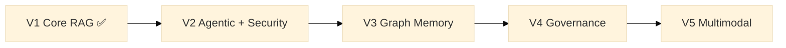

# Modular RAG Framework


A **reusable delivery accelerator** built at Publicis Sapient for production-grade RAG
and agentic systems: declarative orchestration, composable retrieval, structured memory,
native enterprise governance, and progressive multimodal support.
Built once, deployed across client projects — every adapter, manifest, and governance
policy is an asset that compounds over time.

---

## Table of Contents

- [Why this framework?](#why-this-framework)
- [Vision](#vision)
- [Architecture](#architecture)
- [Roadmap (V1 → V5)](#roadmap-v1--v5)
- [Getting started](#getting-started)
- [Key features](#key-features)
- [Project status](#project-status)
- [Contributing](#contributing)
- [License](#license)

---

## Why this framework?

**Context.** Publicis Sapient's AI practice repeatedly builds RAG systems for enterprise
clients — each time re-solving the same problems: governance, multi-tenant data isolation,
vendor lock-in, auditability, security. This framework is the answer: a proprietary
control plane that wraps the best available OSS components (sentence-transformers,
Qdrant, rank-bm25, OpenAI, Anthropic…) behind stable contracts, so that what one
project builds, every subsequent project inherits. The result is faster delivery,
higher margins, and a demonstrable technical differentiator on regulated-industry pitches.

→ [Full business case](docs/business-case.md) · [Onboarding by role — developer, tech lead, delivery, functional, security](docs/onboarding.md)

---

Most RAG stacks today force you to choose between:

| | LangChain / LlamaIndex | Haystack | This framework |
|---|---|---|---|
| **Composition style** | Imperative chains | Pipelines + nodes | **Declarative manifests** (knowledge architecture as code) |
| **Agents** | Bolted on | Limited | **Delegated via adapter** to a selected external engine (LangGraph) behind a vendor-neutral `DocumentEngine` port — this framework owns governance/audit/tenant-isolation around it, not a native agent runtime |
| **Graph memory** | External plugins | External | **Delegated** GraphRAG traversal (V3); a native graph data model may be retained, undecided |
| **Governance** | Manual | Limited | **Policy-as-code**, owned and current (V2.0), not deferred |
| **Multimodal** | Partial | Partial | **Delegated** VLM execution (V5); parsing/citation enrichment may stay native |
| **Evaluation** | External (Ragas, etc.) | Built-in | **Built-in & contract-enforced** |

Per [ADR-0005](docs/adr/0005-document-ai-control-plane-boundary.md) (accepted 2026-08-04), the
goal is **not** to compete on building a bigger agent/graph runtime than the frameworks above —
it is to own the **engine-neutral control plane** around whichever engine you plug in:
governance, audit, evaluation, tenant isolation, and portability that scale from a local
prototype to a multi-tenant enterprise deployment without rewriting the core.

---

## Vision

- Build **modular RAG pipelines** (chunking, retrieval, generation, validation) — V1 ✅.
- Own governance, audit, evaluation, and tenant isolation natively; delegate generic
  multi-agent orchestration to a selected external engine (LangGraph, ADR-0006) via the
  `DocumentEngine` port — V2 (Policy Engine native and current; agent orchestration delegated).
- Introduce **graph memory, governance, and multimodality** progressively
  without rewriting the core — V3 → V5, per the same owned-vs-delegated split.

Every component (chunker, retriever, agent, guard, scorer, etc.) is wired
through **stable contracts** in [`src/modular_rag/contracts/`](src/modular_rag/contracts/)
and selected via **YAML manifests** in [`manifests/`](manifests/).

The full technical specification is in
[`docs/architecture/overview.md`](docs/architecture/overview.md).

---

## Architecture

High-level view of versions V1 to V5:



System layers (see [`docs/architecture/module-model.md`](docs/architecture/module-model.md)):

- **Control plane** — manifests, policies, permissions, routing, audit.
- **Ingestion plane** — parsing, normalization, chunking, enrichment, indexing.
- **Knowledge plane** — vector store, lexical store, optional graph store, reranking.
- **Reasoning plane** — retrieval orchestration and synthesis; multi-agent query
  planning/execution is delegated to the selected external engine (ADR-0005 §5.2), reached via
  the `DocumentEngine` port, not built as a native specialized-agent runtime.
- **Safety plane** — adversarial-query detection, anti-poisoning, policy enforcement.
- **Evaluation plane** — benchmarks, golden sets, scoring, regression dashboards.

---

## Roadmap (V1 → V5)

| Version | Theme | Key capabilities | Status |
|---|---|---|---|
| **V1** | Core RAG | Ingestion, adaptive chunking, hybrid retrieval (vector + BM25), grounded generation, basic safety, native evaluation, YAML manifests, HTTP API | ✅ Complete |
| **V2** | Agentic + Security | Policy Engine (native, owned, current) + tenant isolation (real, shipped); multi-agent orchestration delegated to the selected external engine via `DocumentEngine` (ADR-0005) | 🟡 Policy Engine/tenant isolation ✅, agent delegation via LangGraph adapter ✅ (Lot 15) |
| **V3** | Graph Memory | GraphRAG traversal, multi-hop reasoning, and community summaries delegated to the external engine; the native `KnowledgeGraph` data model was removed (Étape 8, [ADR-0007](docs/adr/0007-layer-boundaries-and-control-plane-activation.md)) — zero consumers, restorable via git if a real need emerges | ⬜ Delegated (unavailable in the selected engine today) |
| **V4** | Governance | Policy-as-code, multi-tenant, dev/staging/prod environments, fine-grained audit, human-in-the-loop, risk profiles | ⬜ Planned |
| **V5** | Multimodal | Multimodal ingestion + retrieval (text/images/tables/audio/video); VLM execution delegated to the external engine, parsing/citation enrichment may stay native | ⬜ Planned |

Detail per-version in [`ROADMAP.md`](ROADMAP.md) and
[`docs/architecture/roadmap-mermaid.md`](docs/architecture/roadmap-mermaid.md).

---

## Getting started

### Prerequisites

- Python 3.11+
- [Qdrant](https://qdrant.tech/) running on `localhost:6333`
- An OpenAI API key (or Anthropic)

### Installation

```bash
git clone https://github.com/HerbertGourout/modular-rag-framework.git
cd modular-rag-framework
python -m venv .venv
.venv\Scripts\activate          # Windows
# source .venv/bin/activate     # Linux / macOS
pip install -e ".[v1]"
```

### Run the example pipeline

```bash
# Set your API key (the OpenAI SDK's own standard var — configuration is manifest-driven,
# see app/config_resolution.py's ${VAR}/secret:// interpolation, not env-var settings classes)
export OPENAI_API_KEY=sk-...   # Linux/macOS
$env:OPENAI_API_KEY="sk-..."   # Windows PowerShell

# Ingest documents
python examples/simple_qa/main.py ingest examples/simple_qa/docs/

# Ask a question
python examples/simple_qa/main.py ask "What is RAG?"
```

### Use the API directly

```python
from modular_rag.app.bootstrap import load_pipeline

pipeline = load_pipeline("manifests/presets/local-hybrid-rag.yaml")
answer = pipeline.answer("Explain the concept of Modular RAG.")
print(answer.text)
for citation in answer.citations:
    print(" -", citation.source, citation.score)
```

### CLI

```bash
mrag ingest ./my_docs --manifest manifests/presets/local-hybrid-rag.yaml
mrag ask "What is hybrid retrieval?" --manifest manifests/presets/local-hybrid-rag.yaml
```

### REST API

`create_app()` requires a manifest path argument, so plain `--factory` mode (which calls the
factory with no arguments) does not work — wrap it in a one-line module instead:

```bash
# server.py
# from modular_rag.api import create_app
# app = create_app("manifests/presets/local-hybrid-rag.yaml")

uvicorn server:app --reload
# GET  /health
# GET  /retrieve?q=...&k=10
# POST /answer
```

---

## Development & Validation

### Quick validation (< 1 minute)

Use after code changes:

```bash
./scripts/check.sh quick    # Syntax & import order
./scripts/check.sh full     # Quick + unit + contract tests
```

### Full validation workflows

| Workflow | Command | Time | Use when |
|----------|---------|------|----------|
| **Daily** | `./scripts/check.sh quick` | ~30s | After edits, before commit |
| **Pre-merge** | `./scripts/check.sh full` | ~2-5m | Ready for PR/MR |
| **With services** | `./scripts/check.sh integration` | ~1-2m | Qdrant running |
| **Production** | `./scripts/check.sh all` | ~10m | Before release |

### Individual test scopes

```bash
# Unit tests (no external services)
pytest tests/unit/ -v

# Contract conformance (Protocol validation)
pytest tests/contract/ -v

# Integration tests (requires Qdrant on localhost:6333)
docker run -p 6333:6333 qdrant/qdrant &
pytest tests/integration/ -v -m integration

# End-to-end pipeline (requires Qdrant + LLM API key)
export OPENAI_API_KEY=sk-...
pytest tests/e2e/ -v -m e2e
```

→ **Full reference:** [docs/guides/validation.md](docs/guides/validation.md)

---

## Key features

- **Declarative orchestration** via YAML manifests (knowledge architecture as code).
- **Adaptive chunking** and **hybrid retrieval** (vector + BM25, RRF fusion).
- **Security built-in**: prompt injection guard, PII redaction, policy enforcement.
- **Built-in evaluation**: exact-match F1, recall@k, groundedness, latency, cost traces.
- **Trace instrumentation**: every pipeline step emits a `TraceStep` (tokens, latency, metadata)
  — but the `Trace` itself is discarded after each request unless a `telemetry` component is
  wired, and the manifest schema does not currently expose one to configure. Not yet "full
  observability" end-to-end; see [refactoring plan](docs/refactoring-plan.md) §2.
- **No vendor lock-in**: swap LLMs, embedders, or vector stores via a single YAML line.
- **Planned extensions**: agentic runtime (V2), graph memory (V3), governance (V4), multimodal (V5).

---

## Project status

**V1's core pipeline (ingest → retrieve → generate) is functional end-to-end via the CLI and
direct Python use. The REST API has one known-broken endpoint — see below.**

| Component | Status |
|---|---|
| Core models & contracts | ✅ |
| Ingestion (parsers, chunkers, normalizers) | ✅ |
| Hybrid retrieval (BM25 + vector + RRF) | ✅ (small-corpus BM25 scoring gap — see [refactoring plan](docs/refactoring-plan.md) §2) |
| OpenAI & Anthropic generators | ✅ |
| Security (guard + PII redactor) | ✅ |
| Evaluation (exact-match, benchmarks) | ✅ (naming/failure-masking caveats — see [refactoring plan](docs/refactoring-plan.md) §2) |
| CLI | ✅ |
| REST API | ✅ `/health`, `/retrieve`, `/answer` all work |
| YAML manifest wiring | ✅ for all three `manifests/presets/*.yaml` (local-hybrid-rag, secure-enterprise-rag, langgraph-rag); `manifests/blueprints/` holds design sketches (GraphRAG, multimodal) that don't load — see [manifests/README.md](manifests/README.md) |
| Unit + contract tests | ✅ passing — run `./scripts/check.sh full` for the current count (changes too often for a static number to stay accurate) |
| Integration tests (requires Qdrant) | ✅ |

Track progress and milestones:

- [`CHANGELOG.md`](CHANGELOG.md) — released versions
- [`ROADMAP.md`](ROADMAP.md) — delivery matrix: native, delegated, or planned per capability
- [`docs/adr/`](docs/adr/) — Architecture Decision Records

---

## Contributing

1. Read [`docs/architecture/overview.md`](docs/architecture/overview.md) and
   the [ADRs](docs/adr/) before submitting structural changes.
2. Fork the repo and create a branch (`feature/my-feature`).
3. Implement your changes + tests
   ([`tests/unit/`](tests/unit/), [`tests/integration/`](tests/integration/),
   [`tests/contract/`](tests/contract/)).
4. Update docs if needed
   ([`docs/guides/`](docs/guides/), [`docs/architecture/`](docs/architecture/)).
5. If you use Claude Code, run `/qa-v1` and see
   [`docs/guides/claude-code.md`](docs/guides/claude-code.md).
6. If you use Claude Code and Codex together, follow
   [`docs/guides/ai-engineering-workflow.md`](docs/guides/ai-engineering-workflow.md)
   and [`docs/guides/model-routing.md`](docs/guides/model-routing.md).
7. Open a GitHub PR into `main`.

See [`CONTRIBUTING.md`](CONTRIBUTING.md) for coding, testing, and documentation guidelines.

---

## License

This project is distributed under the **Apache License 2.0**.
See the [`LICENSE`](LICENSE) file for details.
