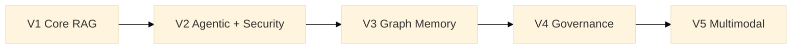

# Modular RAG Framework

> ⚠️ **Status: pre-alpha / scaffolding.**
> This repository currently contains the **architectural skeleton only**.
> No runtime code has been implemented yet. The code snippets in this README
> describe the **target API for v0.1** — they will not run today.
> Track progress in [`ROADMAP.md`](ROADMAP.md) and [`CHANGELOG.md`](CHANGELOG.md).

[](https://pscode.lioncloud.net/data_specialiste/advancedpublicisrag/-/pipelines)
[](https://pscode.lioncloud.net/data_specialiste/advancedpublicisrag/-/graphs/main/charts)


A **reusable delivery accelerator** built at Publicis Sapient for production-grade RAG
and agentic systems: declarative orchestration, composable retrieval, structured memory,
native enterprise governance, and progressive multimodal support.
Built once, deployed across client projects — every adapter, manifest, and governance
policy is an asset that compounds over time.

---

## Table of Contents

- [Why this framework?](#why-this-framework)
- [Vision](#vision)
- [Architecture](#architecture)
- [Roadmap (V1 → V5)](#roadmap-v1--v5)
- [Getting started](#getting-started)
- [Key features (target)](#key-features-target)
- [Project status](#project-status)
- [Contributing](#contributing)
- [License](#license)

---

## Why this framework?

**Context.** Publicis Sapient's AI practice repeatedly builds RAG systems for enterprise
clients — each time re-solving the same problems: governance, multi-tenant data isolation,
vendor lock-in, auditability, security. This framework is the answer: a proprietary
control plane that wraps the best available OSS components (LlamaIndex chunkers,
Ragas evaluators, LiteLLM gateway, Qdrant…) behind stable contracts, so that what one
project builds, every subsequent project inherits. The result is faster delivery,
higher margins, and a demonstrable technical differentiator on regulated-industry pitches.

→ [Full business case](docs/business-case.md)

---

Most RAG stacks today force you to choose between:

| | LangChain / LlamaIndex | Haystack | This framework (goal) |
|---|---|---|---|
| **Composition style** | Imperative chains | Pipelines + nodes | **Declarative manifests** (knowledge architecture as code) |
| **Agents** | Bolted on | Limited | **First-class**, with planner/retrieval/synth/critic separation |
| **Graph memory** | External plugins | External | **Native** (V3) |
| **Governance** | Manual | Limited | **Policy-as-code** (V4) |
| **Multimodal** | Partial | Partial | **Planned native** (V5) |
| **Evaluation** | External (Ragas, etc.) | Built-in | **Built-in & contract-enforced** |

The goal is **not** to be yet another RAG library — it is to provide a
**context OS**: a control plane over RAG, agents, memory, and governance
that scales from a local prototype to a multi-tenant enterprise deployment
without rewriting the core.

---

## Vision

- Build **modular RAG pipelines** (chunking, retrieval, generation, validation) — V1.
- Orchestrate **multiple specialized agents** instead of a single monolithic LLM — V2.
- Introduce **graph memory, governance, and multimodality** progressively
  without rewriting the core — V3 → V5.

Every component (chunker, retriever, agent, guard, scorer, etc.) is wired
through **stable contracts** in [`src/modular_rag/contracts/`](src/modular_rag/contracts/)
and selected via **YAML manifests** in [`manifests/`](manifests/).

The full technical specification is in
[`docs/architecture/overview.md`](docs/architecture/overview.md).

---

## Architecture

High-level view of versions V1 to V5:



System layers (see [`docs/architecture/module-model.md`](docs/architecture/module-model.md)):

- **Control plane** — manifests, policies, permissions, routing, audit.
- **Ingestion plane** — parsing, normalization, chunking, enrichment, indexing.
- **Knowledge plane** — vector store, lexical store, optional graph store, reranking.
- **Reasoning plane** — query planning, retrieval orchestration, specialized agents, synthesis.
- **Safety plane** — adversarial-query detection, anti-poisoning, policy enforcement.
- **Evaluation plane** — benchmarks, golden sets, scoring, regression dashboards.

---

## Roadmap (V1 → V5)

| Version | Theme | Key capabilities | Status |
|---|---|---|---|
| **V1** | Core RAG | Ingestion, adaptive chunking, hybrid retrieval (vector + BM25), grounded generation, basic safety, native evaluation, YAML manifests, HTTP API | 🟧 In design |
| **V2** | Agentic + Security | Query routing, multi-agent runtime (planner/retrieval/synth/critic/output), policy-aware tool use, multi-step guardrails | ⬜ Planned |
| **V3** | Graph Memory | Knowledge graph extraction, GraphRAG, multi-hop reasoning, hierarchical community summaries, reasoning memory, EvoRAG-style feedback | ⬜ Planned |
| **V4** | Governance | Policy-as-code, multi-tenant, dev/staging/prod environments, fine-grained audit, human-in-the-loop, risk profiles | ⬜ Planned |
| **V5** | Multimodal | Multimodal ingestion + retrieval (text/images/tables/audio/video), modality-specialized agents, enriched citations with timecodes | ⬜ Planned |

Detail per-version in [`ROADMAP.md`](ROADMAP.md) and
[`docs/architecture/roadmap-mermaid.md`](docs/architecture/roadmap-mermaid.md).

---

## Getting started

### Prerequisites

- Python 3.11+
- Git
- Access to an LLM (OpenAI, Azure, or any supported backend)

### Installation (development)

```bash
git clone https://pscode.lioncloud.net/data_specialiste/advancedpublicisrag.git
cd advancedpublicisrag
python -m venv .venv
.venv\Scripts\activate          # Windows
# source .venv/bin/activate     # Linux / macOS
pip install -e .
```

> ⚠️ At the current pre-alpha stage `pip install -e .` installs the package
> shell only — no runtime modules are wired yet.

### First RAG pipeline (target API — v0.1)

```python
# Roadmap snippet — not functional yet (v0.1 target API).
from modular_rag.app.bootstrap import load_pipeline

pipeline = load_pipeline("manifests/presets/local-hybrid-rag.yaml")
answer = pipeline.answer("Explain the concept of Modular RAG.")
print(answer.text)
for citation in answer.citations:
    print(" -", citation.source, citation.score)
```

End-to-end examples will live in [`examples/`](examples/):
`simple_qa`, `hybrid_search`, `secure_rag`, `agentic_rag`, `graph_memory`.

---

## Key features (target)

- **Declarative orchestration** via YAML manifests (knowledge architecture as code).
- **Adaptive chunking** and **hybrid retrieval** (vector + lexical, fusion-ready).
- **Agentic runtime** with specialized agents (extraction, synthesis, validation, critic).
- **Native security**: query guard, anti-poisoning, redaction, policy enforcement.
- **Built-in evaluation**: benchmarks, recall@k, groundedness, latency, cost, traces.
- **Planned extensions**: graph memory (V3), advanced governance (V4), multimodal reasoning (V5).

---

## Project status

This is a **pre-alpha scaffolding**. Today, the repository ships:

- ✅ A complete **directory & module skeleton** (contracts, adapters, agents, manifests, ADRs).
- ✅ A **5-version roadmap** aligned with the technical specification.
- ✅ Test directories stratified by concern (unit / integration / e2e / contract / benchmark).
- ⬜ **No runtime code yet** — implementations land progressively starting at v0.1.

Track progress and milestones:

- [`CHANGELOG.md`](CHANGELOG.md) — released versions
- [`ROADMAP.md`](ROADMAP.md) — V1 → V5 capabilities
- [`docs/adr/`](docs/adr/) — Architecture Decision Records

---

## Contributing

Contributions are welcome — especially during this scaffolding phase, where
every contract and ADR is open for discussion.

1. Read [`docs/architecture/overview.md`](docs/architecture/overview.md) and
   the [ADRs](docs/adr/) before submitting structural changes.
2. Fork the repo and create a branch (`feature/my-feature`).
3. Implement your changes + tests
   ([`tests/unit/`](tests/unit/), [`tests/integration/`](tests/integration/),
   [`tests/contract/`](tests/contract/)).
4. Update docs if needed
   ([`docs/guides/`](docs/guides/), [`docs/architecture/`](docs/architecture/)).
5. Open a Merge Request into `main`.

See [`CONTRIBUTING.md`](CONTRIBUTING.md) for coding, testing, and documentation guidelines.

---

## License

This project is distributed under the **Apache License 2.0**.
See the [`LICENSE`](LICENSE) file for details.
