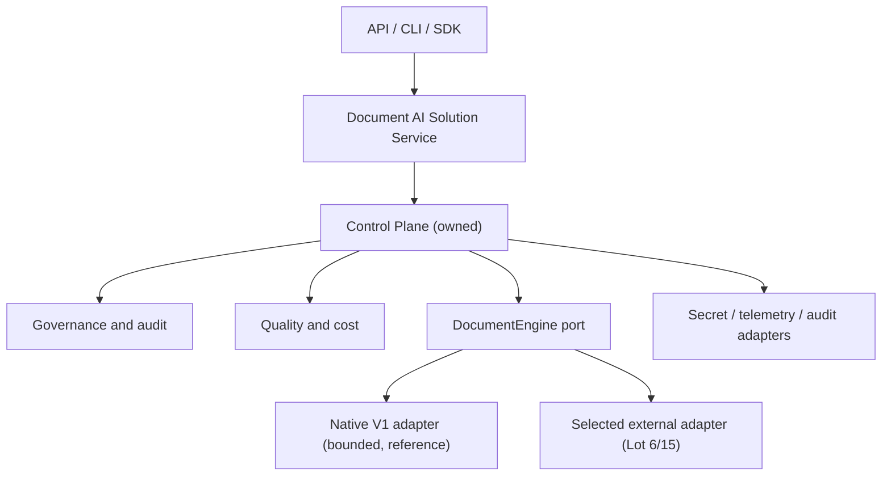

# ADR-0005 — Document-AI Control Plane: Product Boundary and Engine Delegation

**Status:** Accepted
**Date:** 2026-08-03
**Authors:** Herbert Gourout (sole decision authority as of this date; target team of up to
3 additional contributors not yet assembled)
**Supersedes (partially):** [ADR-0004](0004-strategic-features-v1-v5.md) — see §5

---

## Context

### The problem this ADR resolves

Two prior audits of this repository (consolidated in
[docs/refactoring-plan.md](../refactoring-plan.md)) converged on the same finding: continuing
to build a general-purpose agentic orchestration framework (the V2–V5 portion of the roadmap in
[CLAUDE.md §09](../../CLAUDE.md#09--roadmap-v1--v5-with-strategic-features) and
[ROADMAP.md](../../ROADMAP.md)) means competing directly with LangGraph, LlamaIndex, and
Haystack on their core strength — orchestration breadth and ecosystem — with a fraction of
their engineering resources. A team of this size — currently one person, with room to grow to a
handful — cannot out-execute those projects on generic agent runtimes, tool-calling frameworks,
or GraphRAG traversal engines maintained by dozens-to-hundreds of contributors.

ADR-0004 already stated the right instinct — *"do not compete with LangChain on breadth;
compete on depth in governance, compliance, evaluation, cost optimization, fine-tuning"* — but
did not follow that instinct all the way through: the V2–V5 roadmap it ratified still specifies
building a native multi-agent runtime (V2.0–V2.1), a native knowledge-graph/GraphRAG engine
(V3.0), and native multimodal execution (V5.0) in-house. This ADR completes the logic ADR-0004
started: capabilities that are generic orchestration mechanics are delegated to a selected
external engine; capabilities that are this project's actual differentiator — governance,
audit, evaluation, tenant isolation, configuration, portability — are owned and built natively,
engine-independent of whichever orchestration engine sits underneath.

### Why now (Lot 1, gates everything downstream)

Per `docs/refactoring-plan.md` §9, every lot from 2 onward depends directly or transitively on
this decision being recorded. Claude Code's own instructions
([CLAUDE.md](../../CLAUDE.md), [.claude/.instructions.md](../../.claude/.instructions.md))
currently encode the pre-pivot V1→V5 roadmap and will keep steering implementation toward
native V2+ orchestration work until they are realigned (Lot 2) — which cannot happen safely
until this ADR states what they should say instead.

---

## Decision

### 5.1 Owned (engine-independent control plane — build natively, in this repository)

| Capability | Home | Roadmap origin |
|---|---|---|
| Solution manifests (versioned, validated, secret-aware) | `orchestration/`, `contracts/` | V1 base, hardened per Lot 9 |
| Execution context (identity, tenant, correlation) | `core/`, `contracts/` | New — required by Lot 11 |
| Policy enforcement, tenant isolation, redaction boundaries | `security/policies/`, `security/redaction/` | V2.0 Policy Engine — **retained**, not delegated |
| Provenance, audit schemas, compliance evidence | `security/audit/` | V1.2 — **retained** |
| Quality profiles, regression gates, golden-set evaluation | `eval/` | V1.1 — **retained** |
| Cost/latency evidence and reporting | `eval/`, `orchestration/` | V3.1 concept, reframed as evidence/reporting rather than in-house routing logic |
| Engine capability discovery, normalized results/errors | `contracts/`, `orchestration/` | New — the `DocumentEngine` port (Lot 7) |

### 5.2 Delegated (do not reimplement in core; expose through an adapter instead)

| Capability | Previously scoped as | Disposition |
|---|---|---|
| Generic multi-agent orchestration, tool-calling, planning | V2.0–V2.1 | Delegate to selected external engine (Lot 6 spike, Lot 15 production adapter) |
| Durable workflow execution | (implicit in V2/V3 orchestration) | Delegate |
| Generic GraphRAG traversal / graph-native agent memory | V3.0 | Delegate; a knowledge-graph *data model* may still live in `memory/` if evidence from Lot 6 shows the external engine cannot represent it, but traversal/reasoning execution does not |
| Continuous fine-tuning platform mechanics | V3.2 | Delegate to external MLOps/fine-tuning tooling; this project retains only the *drift detection and evaluation* trigger, which stays in §5.1 |
| Universal connector catalogues | (implicit ingestion scope) | Delegate |
| Multimodal model execution (VLM inference itself) | V5.0 | Delegate; multimodal *parsing and citation enrichment* may remain owned if Lot 6/15 evidence supports it |

A delegated capability may still be *exposed* through a thin adapter in this repository. It must
not be reimplemented in `core`/domain modules without a new ADR that shows why an adapter
cannot meet the product outcome — this is the same bar `docs/refactoring-plan.md` §10.1 sets.

### 5.3 Non-goals

- This project does not aim to match LangGraph/LlamaIndex/Haystack on breadth of integrations,
  orchestration primitives, or agent-framework ergonomics.
- This project does not build a second general-purpose graph-traversal or workflow engine.
- Native V1 (`RAGEngine`) is not the long-term execution core; see native-adapter exit criteria
  below.

### 5.4 Target architecture

Dependency direction: `interfaces -> service/control plane -> contracts/core`. Infrastructure and
engines implement contracts; neither leaks vendor types across the public boundary. Existing
fine-grained component protocols (`Chunker`, `Retriever`, `Generator`, ...) remain internal to
the native adapter — they are not the cross-engine abstraction.

### 5.5 Native-adapter exit criteria

The native `RAGEngine` adapter is retained as long as, and only as long as:

1. It is the only adapter passing the full semantic conformance suite (until Lot 15 lands a
   second one), **or**
2. It remains materially cheaper to maintain than migrating a given deployment to the external
   adapter, evidenced at each Lot 17/18 checkpoint.

When neither holds, native V1 moves to deprecated status with a recorded support window (Lot
17). This ADR does not set a calendar date for that decision — it is evidence-driven, decided
at Lot 17/18, not here.

### 5.6 Measurable success outcomes

- One external engine passes the same semantic engine/governance/audit/quality test suite as
  native V1 (Lot 15 acceptance).
- Switching the engine adapter requires no change to governance or quality profiles (Lot 15/18
  acceptance, per `docs/refactoring-plan.md` §12).
- No capability listed in §5.1 depends on which engine adapter is active.

---

## Consequences

### Positive

- Removes the unwinnable breadth competition with funded, widely-adopted orchestration
  frameworks; concentrates 4 people's effort on the governance/audit/eval/portability
  capabilities that are this project's actual differentiator, consistent with ADR-0004's
  original "compete on depth" thesis.
- `docs/refactoring-plan.md`'s 18-lot programme becomes actionable — Lot 2 (Claude realignment)
  and everything downstream now has an approved target to align to.

### Negative / Risks

- Native V1's own component protocols (`Chunker`, `Retriever`, `Generator`, ...) — the subject
  of ADR-0001/0002 — become internal implementation detail of one adapter among (eventually) at
  least two, not the project's primary extensibility surface. Existing contract tests for those
  protocols remain valid but no longer describe the outer product boundary.
- Risk of "lowest common denominator" abstraction if the `DocumentEngine` port is designed
  against only one engine. Mitigated by requiring the Lot 6 spike to evaluate against at least
  two candidates before Lot 7 freezes the contract, and by the two-adapter proof required before
  §5.6 is considered met.
- CLAUDE.md/ROADMAP.md, and the V2–V5 feature descriptions in ADR-0004, are now partially
  inaccurate until Lot 2 (interim) and Lot 17 (full consolidation) update them. Until then, this
  ADR is the authoritative statement of product boundary where it conflicts with those documents.

### Mitigations

- Lot 2 performs a narrow, immediate realignment of Claude-facing instructions so automated
  work does not keep implementing the delegated capabilities in §5.2 in the interim.
- Lot 6 requires a time-boxed, disposable spike comparing at least two external engines before
  any contract is frozen — this ADR does not itself select an engine.
- Lot 17 is the single point where CLAUDE.md, ROADMAP.md, and ADR-0004's feature list are fully
  reconciled with this decision; no earlier lot silently rewrites them wholesale.

---

## Relationship to prior ADRs

- **ADR-0001** (hexagonal layering) and **ADR-0002** (contracts/plugins): unchanged in
  substance. The layering and contract-first discipline continues to apply within the native
  adapter and within the new `DocumentEngine` port itself.
- **ADR-0003** (security/governance): unchanged, and reinforced — §5.1 makes policy, audit, and
  redaction explicitly engine-independent owned capabilities, which is what ADR-0003 already
  assumed.
- **ADR-0004** (strategic features V1→V5): **partially superseded**. V1.1 (Evaluation-as-
  Contract) and V1.2 (Compliance Audit Trail) are retained as-is. V2.0 (Policy Engine) is
  retained as-is. V2.1 (Multi-Agent Teams), V3.0 (GraphRAG), V3.2 (Fine-Tuning platform
  mechanics), and V5.0 (multimodal execution) are redirected from "build natively" to "delegate
  via adapter," per §5.2. ADR-0004 should be marked `Superseded (partial) — see ADR-0005` once
  this ADR is accepted, not deleted.

---

## Open decisions (deferred, not resolved by this ADR)

- Which external engine is selected: deferred to Lot 6's spike and ADR.
- Final package/product name: explicitly non-blocking per `docs/refactoring-plan.md` decision
  log.
- Whether a native knowledge-graph data model is retained (§5.2 footnote): deferred to Lot 6/15
  evidence.

---

## Decision record

**Decision:** Adopt the engine-independent control-plane product boundary in §5.1–§5.4;
delegate generic orchestration/GraphRAG/fine-tuning/multimodal execution per §5.2; retain native
V1 as a bounded, exit-criteria-bound reference adapter per §5.5.

**Date:** 2026-08-03

**Status:** Accepted 2026-08-04 by Herbert Gourout, sole decision authority per
[Lot 0 decision authority](../refactoring/lot-0-baseline.md#2-decision-authority).

**Next:** Lot 2 — narrow interim realignment of `CLAUDE.md` and `.claude/` instructions to stop
steering implementation toward the delegated capabilities in §5.2.
