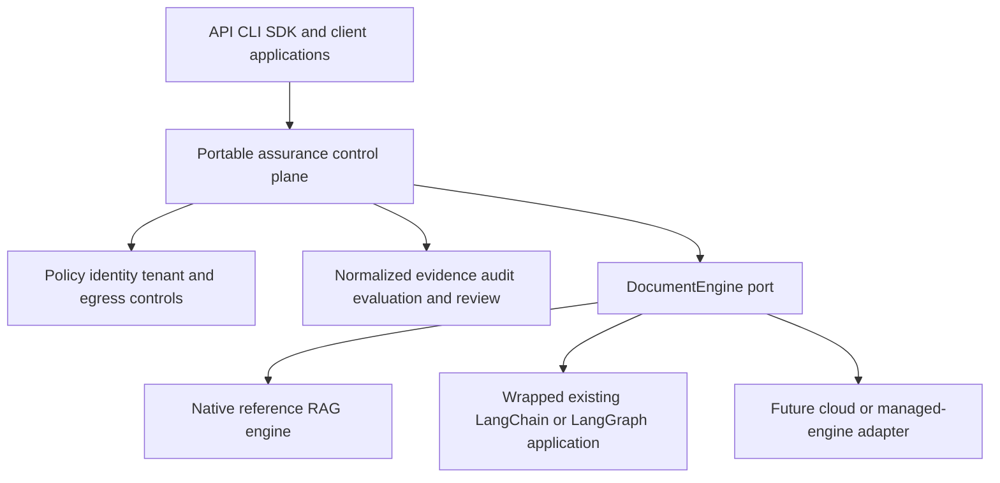

# ADR-0015 — Portable Assurance Layer and External Application Boundary

**Status:** Accepted

**Date:** 2026-09-01

**Accepted:** 2026-09-02 by the maintainer

**Authors:** Architecture working session

---

## Context

ADR-0005 correctly moved the product away from building another general-purpose agent runtime.
The repository now owns a native RAG reference engine and an engine-neutral `DocumentEngine`
port, with a first LangGraph adapter. The implementation nevertheless exposes an important gap
between that direction and the intended product:

- the current LangGraph adapter builds a fixed graph from framework components; it does not yet
  govern an existing LangChain or LangGraph application supplied by a client;
- guard, tenant isolation, and redaction run through that adapter, but manifests requesting
  policy, audit, review, or telemetry fail at startup because those controls are not uniformly
  available across engines;
- `EngineResult` normalizes an answer, citations, steps, and metadata, but does not yet define the
  evidence needed to prove tenant filtering, data-egress decisions, audit completeness, usage, or
  human-review routing across heterogeneous engines;
- mature platforms already provide orchestration, tracing, evaluation, and guardrail features.
  Individual features are therefore not a credible differentiator by themselves.

The durable opportunity is a portable assurance layer: a reusable way to declare, enforce, test,
and evidence delivery requirements across a native engine, an external framework application,
and later cloud-managed engines. The native RAG pipeline remains useful as the reference
implementation and local/offline fallback; it is not the product's only execution model.

## Decision

### 1. Product statement

Position the project as:

> A portable standard for building, governing, and validating Document AI solutions, compatible
> with existing engines and delivered with a native reference RAG engine.

The project does not compete with LangChain, LangGraph, LlamaIndex, Haystack, or cloud providers
on orchestration breadth. It complements them by owning portable policies, evidence contracts,
conformance tests, and deployment-independent delivery conventions.

### 2. Two supported adoption paths

The target architecture must support both paths behind the same control-plane contracts:

1. **Framework-built solution** — compose the native reference pipeline or a supported external
   engine using manifests and built-in adapters.
2. **Bring-your-own application** — wrap an existing LangChain/LangGraph or other Document AI
   application without rewriting its internal graph, then apply the assurance boundary around
   inputs, outputs, declared evidence, and supported lifecycle hooks.

An adapter must state honestly which controls it can enforce. Unsupported mandatory controls
continue to fail closed during validation; they must never be silently ignored.

### 3. Assurance levels

Conformance is expressed as an explicit level, not a binary "compatible" label:

| Level | Required visibility | Guarantee |
|---|---|---|
| **L0 — Opaque output** | Request and final response only | Input/output policy checks, redaction, identity propagation, and outcome audit where configured. No claim about retrieval internals. |
| **L1 — Evidence-aware** | L0 plus normalized citations/retrieval evidence | Citation, provenance, tenant-scope, and offline quality checks can be verified against evidence returned by the engine. |
| **L2 — Governed stages** | L1 plus enforceable hooks before/after sensitive stages | Retrieval filtering, egress control, generation policy, review routing, and stage-level audit can be enforced and certified. |

Documentation, manifests, and conformance reports must name the achieved level and any missing
capability. L0 is useful but must not be marketed as equivalent to L2.

### 4. Engine capability and evidence direction

Future contract work should evolve capability discovery beyond generic streaming/tool-use flags.
Candidate portable capabilities include retrieval evidence, tenant-filter evidence, data-egress
control, stage-level audit evidence, usage/cost reporting, human-review routing, and
pre-stream validation. Exact names and schemas require a separate accepted contract ADR before
implementation.

The normalized evidence contract should describe what happened without exposing vendor-native
types across the public boundary. Vendor-specific details may remain in namespaced metadata when
they cannot be normalized safely.

### 5. Data protection is part of assurance

The data-classification and provider-egress work already planned as Lot 20 is a core product
capability, not an optional deployment note. Provider selection must account for data class,
deployment/legal jurisdiction, residency, tenant policy, and provider capability. Query language
alone is never a valid proxy for jurisdiction.

### 6. Native engine role

The native engine remains:

- the executable reference for L2 semantics;
- the local/offline-first option where supported adapters are configured;
- a deterministic conformance fixture and fallback for deployments that do not need a broader
  orchestration runtime.

It is not a requirement that the native engine match external frameworks feature for feature.
Its value is a clear, inspectable reference implementation of the contracts and controls.

## Target architecture

## Acceptance criteria for implementation

This ADR is implemented only when all of the following are evidenced:

1. An existing external application can be wrapped without rebuilding its internal workflow.
2. The adapter advertises an assurance level and machine-readable capabilities.
3. Mandatory unsupported controls fail before serving traffic.
4. The same conformance suite validates native and external adapters at their declared levels.
5. A conformance report distinguishes enforced guarantees from supplied-but-unverified evidence.
6. Lot 20 data-egress policy is applied consistently at every outbound provider boundary.
7. Documentation contains no claim that framework choice alone guarantees compliance.

## Non-goals

- Reimplementing a generic chain, agent, graph, or model-serving ecosystem.
- Claiming that every external engine can reach L2 without exposing the necessary hooks.
- Replacing cloud IAM, network controls, key management, model gateways, or legal review.
- Treating manifests or audit records as automatic regulatory certification.

## Consequences

### Positive

- Existing LangChain/LangGraph users become a primary adoption path rather than a migration
  target.
- Differentiation rests on the combination of portable controls and evidence, not on inaccurate
  claims that competing platforms lack evaluation, tracing, or guardrails.
- The native engine remains strategically useful without dictating every client's runtime.
- Compatibility claims become testable through assurance levels and conformance evidence.

### Negative and risks

- L0 integrations provide weaker guarantees and require careful communication.
- Normalizing evidence across engines can collapse meaningful vendor differences; conformance
  must allow explicit capability gaps and namespaced metadata.
- Wrapping arbitrary applications expands the threat surface and requires negative tests for
  bypasses, streaming, tool calls, and partial failures.
- The product thesis remains a hypothesis until pilots measure integration effort, control
  coverage, and reuse across real projects.

## Relationship to existing decisions

- **ADR-0005:** extended, not reversed. The owned control plane remains the product boundary;
  this ADR adds the bring-your-own-application path and explicit assurance levels.
- **ADR-0006:** LangGraph remains the first selected external engine, not the exclusive target.
- **ADR-0007/0008:** fail-closed activation and offline evaluation boundaries remain unchanged.
- **ADR-0014:** feedback, review, and drift become evidence/control capabilities that external
  adapters may declare at an assurance level.

This decision approves the product and architecture direction, not immediate implementation of
its contracts. Lot 20 remains the first dependency. Lots 21–22 remain planned work and must pass
their own contract, security, compatibility, and pilot decision gates before capability claims
change from planned to current.
