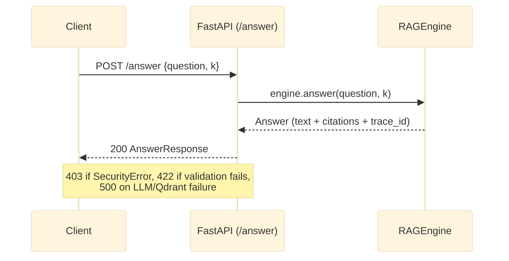

# REST API Reference

The Modular RAG Framework ships a FastAPI application (`src/modular_rag/api/`) so that a RAG
pipeline can be called as a network service rather than embedded as a Python library. This
matters for any client whose existing application (a portal, a chatbot integration, an
internal tool) is not written in Python, or that simply doesn't want heavy dependencies like
`sentence-transformers` or `qdrant-client` inside its own process. The API is a thin
`create_app()` factory over the same `RAGEngine` the CLI uses — there is no separate business
logic here, only request/response translation.

`create_app(manifest_path)` requires an argument, so bare `--factory` mode (which calls the
factory with zero arguments) does not work. Wrap it in a one-line module instead:

```python
# server.py
from modular_rag.api import create_app
app = create_app("manifests/presets/local-hybrid-rag.yaml")
```

```bash
uvicorn server:app --host 0.0.0.0 --port 8000
```

Base URL: `http://localhost:8000`

> **`POST /answer` is currently broken.** `api/__init__.py` combines `from __future__ import
> annotations` with a `QuestionRequest` class scoped locally inside `create_app()`; FastAPI
> cannot resolve the resulting forward-reference annotation and silently treats the request
> body as an unresolvable query parameter instead. Every call shaped as documented below
> returns `422`, not `200`. See [docs/refactoring-plan.md](../refactoring-plan.md) §2 and
> `tests/unit/api/test_api.py::test_answer_route_does_not_accept_the_documented_json_body`
> for the confirmed root cause. `/health` and `/retrieve` are unaffected and work as documented.

---

## Endpoints

### `GET /health`

Health check. Returns HTTP 200 when the pipeline is loaded and ready.

**Response**

```json
{
  "status": "ok",
  "pipeline": "local-hybrid-rag",
  "version": "0.0.1"
}
```

---

### `POST /answer`

Submit a question and receive a grounded answer with citations.



For the full internal breakdown of `engine.answer()` (guard → retrieve → rerank →
generate → guard → telemetry), see
[runtime-flow.md](../architecture/runtime-flow.md), "V1 — Simple RAG (query path)."

**Request body**

```json
{
  "question": "What are the main conclusions of the Q3 report?",
  "k": 5
}
```

| Field | Type | Required | Description |
|---|---|---|---|
| `question` | `string` | Yes | The user question |
| `k` | `integer` | No | Number of chunks to retrieve (default: 5) |

**Response** (once the routing bug above is fixed — this is what the handler itself already
builds correctly; verified by calling it directly, bypassing the broken route, in
`tests/unit/api/test_api.py::test_answer_handler_logic_works_and_leaks_raw_exception_text`)

```json
{
  "text": "The main conclusions of the Q3 report are...",
  "citations": [],
  "trace_id": "a1b2c3d4"
}
```

`citations` is `list[dict]` built from `Citation.model_dump()` — populated only if the
configured `Generator` actually attaches citations; there is no `model` field on the response.

**Error responses**

| Status | When |
|---|---|
| `422 Unprocessable Entity` | Currently: *every* call, due to the routing bug above. Once fixed: invalid request body (e.g., missing `question`) |
| `500 Internal Server Error` | LLM API failure, Qdrant unreachable, a security-guard block (`SecurityError`), or any other exception — `api/__init__.py`'s `except Exception` clause does not distinguish between them, and returns the raw exception text in `detail` (see [refactoring plan](../refactoring-plan.md) §2). There is no `403` response for guard blocks; that status is not used anywhere in this API. |

---

### `GET /retrieve`

Retrieve chunks for a query without generating an answer. Useful for debugging retrieval quality.

**Query parameters**

| Parameter | Type | Default | Description |
|---|---|---|---|
| `q` | `string` | Required | The search query |
| `k` | `integer` | `10` | Number of chunks to return |

**Request**

```
GET /retrieve?q=BM25+retrieval+model&k=5
```

**Response**

```json
[
  {
    "chunk_id": "uuid-...",
    "score": 0.87,
    "content": "BM25 is a probabilistic retrieval model based on term frequency..."
  }
]
```

Exactly these three fields — `chunk_id`, `score`, `content` (truncated to 300 characters). There
is no `doc_id`, `source`, `rank`, or `retrieval_method` in the response today, despite earlier
drafts of this document showing them; verified against `api/__init__.py`'s `/retrieve` handler
and `tests/unit/api/test_api.py::test_retrieve_truncates_chunk_content_to_300_chars`.

---

## Authentication

At the current pre-alpha stage, there is no built-in authentication.
In production:

1. Put the API behind an authenticated reverse proxy or API gateway.
2. V4 will add per-tenant API keys and JWT validation via `adapters/auth/`.

---

## OpenAPI docs

When the server is running, interactive docs are available at:

- Swagger UI: `http://localhost:8000/docs`
- ReDoc: `http://localhost:8000/redoc`
- OpenAPI JSON: `http://localhost:8000/openapi.json`

---

## Client example (Python)

```python
import httpx

client = httpx.Client(base_url="http://localhost:8000")

response = client.post("/answer", json={
    "question": "Explain the hybrid retrieval approach.",
    "k": 5,
})
response.raise_for_status()
data = response.json()

print(data["text"])
for cit in data["citations"]:
    print(f"  [{cit['source']}] {cit['passage'][:80]}")
```

## Client example (curl)

```bash
curl -s -X POST http://localhost:8000/answer \
     -H "Content-Type: application/json" \
     -d '{"question": "What is GraphRAG?", "k": 5}' \
     | python -m json.tool
```
