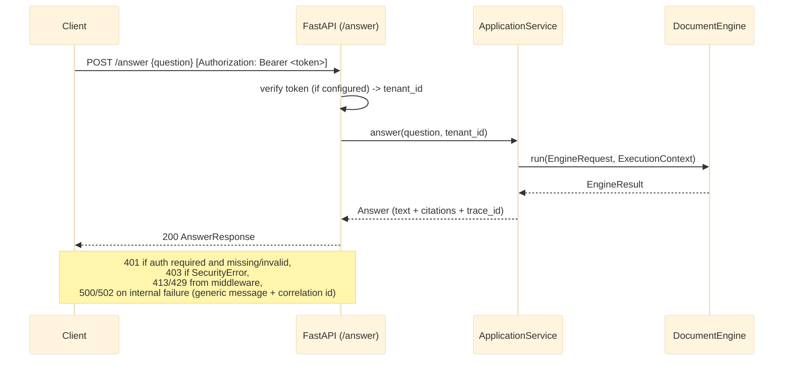

# REST API Reference

The Modular RAG Framework ships a FastAPI application (`src/modular_rag/api/`) so that a RAG
pipeline can be called as a network service rather than embedded as a Python library. This
matters for any client whose existing application (a portal, a chatbot integration, an
internal tool) is not written in Python, or that simply doesn't want heavy dependencies like
`sentence-transformers` or `qdrant-client` inside its own process.

The API is a thin `create_app()` factory over the same `ApplicationService` the CLI uses. The
service selects the manifest's `DocumentEngine` for answer execution and retains native
ingestion/retrieval-only use cases; the HTTP layer only performs request/response translation,
authentication, resource lifecycle, and safe-error mapping
(Lot 16a, [docs/refactoring-plan.md](../refactoring-plan.md)).

`create_app(manifest_path, ...)` requires `manifest_path`, so bare `--factory` mode (which calls
the factory with zero arguments) does not work. Wrap it in a one-line module instead:

```python
# server.py
from modular_rag.api import create_app
app = create_app("manifests/presets/local-hybrid-rag.yaml")
```

```bash
uvicorn server:app --host 0.0.0.0 --port 8000
```

Base URL: `http://localhost:8000`

---

## `create_app()` parameters

| Parameter | Default | Purpose |
|---|---|---|
| `manifest_path` | required | Pipeline manifest YAML — same as the CLI's `--manifest`. |
| `token_verifier` | `None` | A `contracts.identity.TokenVerifier` (e.g. `adapters.auth.keycloak_verifier.KeycloakTokenVerifier`, Lot 11b). When set, `/answer` and `/retrieve` require a valid `Authorization: Bearer <token>` header. `None` leaves every route open **only if the loaded manifest has no `governance.tenant_policy` wired** — dev/local use, matching every other optional-component precedent in this codebase (guard, redactor, tenant_policy). **A manifest that wires a `tenant_policy` makes this parameter mandatory: `create_app()` raises `ConfigurationError` at startup instead of leaving the API unauthenticated (Lot 1, tenant fail-closed)** — the service refuses to start rather than silently exposing tenant-isolated data. |
| `max_body_bytes` | `1_000_000` (1 MB) | Requests with a `Content-Length` over this are rejected `413` before the body is read. |
| `rate_limit_per_minute` | `60` | Per-client (by `X-Forwarded-For` or socket address) fixed-window request limit; over it returns `429` with a `Retry-After` header. In-memory, single-process — not shared across horizontally-scaled replicas; a Redis-backed limiter is the production upgrade path if this API is ever deployed with more than one worker. |
| `max_concurrent_requests` | `30` (Lot 6) | Caps requests being processed *at the same instant* via a `threading.Semaphore`; over it returns `503` immediately (no queuing). Kept below anyio's own 40-token thread limiter for sync (`def`) routes — see `api/__init__.py`'s module comment — so this limit is the one that actually binds. Same in-memory, single-process scoping as `rate_limit_per_minute`. |

```python
from modular_rag.api import create_app
from modular_rag.adapters.auth.keycloak_verifier import KeycloakTokenVerifier

app = create_app(
    "manifests/presets/local-hybrid-rag.yaml",
    token_verifier=KeycloakTokenVerifier(issuer_url="...", audience="..."),
    rate_limit_per_minute=120,
)
```

---

## Endpoints

### `GET /health`

Liveness probe. Returns HTTP 200 once `create_app()` has finished wiring the pipeline. Never
requires authentication, and is exempt from the body-size and rate-limit middleware — an
orchestrator's own liveness probe must never trip either.

**Response**

```json
{
  "status": "ok",
  "pipeline": "local-hybrid-rag"
}
```

---

### `GET /ready`

Readiness probe (Lot 6, "readiness and resilience" — superseding the Lot 16a stub that only
confirmed wiring succeeded). Actually probes every registered component that implements
`contracts.health.HealthCheckable` (`QdrantStore`, `QdrantSparseStore`, `PostgresLifecycleLedger`,
`PostgresAuditSink`, the wired retriever's lexical leg, and the configured `generator`) and
aggregates the result. Exempt from authentication, body-size, rate-limit, and concurrency-limit
middleware — an orchestrator's own readiness probe must never be blocked by any of them.

**Status values** (`core.enums.ReadinessState`):

| `status` | HTTP code | Meaning |
|---|---|---|
| `healthy` | 200 | Every probed dependency is reachable. |
| `degraded` | 200 | At least one non-critical dependency is unhealthy, but the pipeline can still serve — e.g. the sparse leg of a hybrid retriever is down but the dense leg still works, or vice versa. Still 200 so the orchestrator keeps routing traffic. |
| `unready` | **503** | A critical dependency is unhealthy: `audit_sink` (when wired — every `/answer` call fails without it, see `RAGEngine._audit()`), `generator` (always — no fallback exists for a failed `generate()` call either), or **both** the dense (`indexer`) and lexical (`retriever`) retrieval legs simultaneously (no usable retrieval capacity left — the `secure-enterprise-rag` preset's dense and sparse legs share one Qdrant server, so a Qdrant outage takes down both at once). |

**Generator probing**: `OpenAIGenerator`/`AnthropicGenerator.check_health()` make a real,
authenticated, non-generative call against the *specific configured model* —
`client.models.retrieve(self.model)`, no completion/token cost — so a revoked, malformed,
expired, or over-quota key, or a misspelled/retired/inaccessible model, is caught the same way a
real `/answer` call would catch it.

The call goes through a per-probe view of the client
(`client.with_options(timeout=5.0, max_retries=0)`), never the shared production client — the
probe is a single short attempt, not the 30s timeout and SDK-default 2 retries a real generation
call uses. Cached for 30s (per generator instance, lock-guarded so a cache-miss under concurrent
`/ready` calls triggers only one real provider request) so the unauthenticated, rate-limit-exempt
`/ready` route can't be used to hammer the provider's own API.

Residual limitation: this validates retrieving the model's metadata, not the specific
chat/completion endpoint a real request uses — narrower than a full end-to-end check, but well
beyond a bare credential-presence check. See
[ADR-0010](../adr/0010-health-checkable-and-readiness-semantics.md) for the full rationale.

**Response**

```json
{
  "status": "degraded",
  "pipeline": "local-hybrid-rag",
  "dependencies": [
    {
      "name": "qdrant",
      "healthy": false,
      "detail": "unreachable (a1b2c3d4)",
      "latency_ms": 5002.3,
      "role": "indexer"
    }
  ]
}
```

`dependencies[].detail` is intentionally **not** the raw exception message — `/ready` is
unauthenticated, so a raw message (which can embed hostnames, database/collection names, or a
third-party SDK's own error text) would leak on an anonymous request. It's one of a small set of
stable codes (`timeout`, `unreachable`, `circuit open`, `busy`) plus a short correlation id; the
full exception is logged server-side (structured, `dependency_check_failed`) keyed by that same
id for an operator to join the two.

---

### `POST /answer`

Submit a question and receive a grounded answer with citations.



For the full internal breakdown of `engine.answer()` (guard → retrieve → rerank →
generate → guard → redact → telemetry), see
[runtime-flow.md](../architecture/runtime-flow.md), "V1 — Simple RAG (query path)."

**Request body**

```json
{
  "question": "What are the main conclusions of the Q3 report?"
}
```

| Field | Type | Required | Description |
|---|---|---|---|
| `question` | `string` | Yes | The user question |

There is no `k` field on the request body — `k` is a manifest/retriever config value, not
something a caller sets per request (this document previously showed one; it was never read by
the handler).

**Response**

```json
{
  "text": "The main conclusions of the Q3 report are...",
  "citations": [],
  "trace_id": "a1b2c3d4"
}
```

`citations` is `list[dict]` built from `Citation.model_dump()` — populated only if the
configured `Generator` actually attaches citations; there is no `model` field on the response.

**Error responses**

| Status | When |
|---|---|
| `401 Unauthorized` | `token_verifier` is configured and the request is missing a bearer token, or the token fails verification (`AuthenticationError`). |
| `403 Forbidden` | A `SecurityError` (guard denial, tenant-policy denial, or any `PolicyViolationError`) — `detail` is that exception's own message, which is written to be caller-facing (the same `reason` a `SecurityGuard` returns). |
| `413 Payload Too Large` | Request body exceeds `max_body_bytes`. |
| `422 Unprocessable Entity` | Invalid request body (e.g. missing `question`). |
| `429 Too Many Requests` | Rate limit exceeded; response has a `Retry-After` header. |
| `500 Internal Server Error` / `502 Bad Gateway` | Any other failure (LLM API error, Qdrant unreachable, an unexpected bug). `detail` is a generic message plus a correlation id — the original exception text is logged server-side (`structlog`, `api.request_failed`) under the same id, never returned to the caller (Lot 16a, [docs/refactoring-plan.md](../refactoring-plan.md) — closes the raw-exception-leak gap Lot 4 first characterized). |

---

### `POST /feedback`

Record feedback for an answer previously returned by `/answer` (ADR-0014). Feedback storage is a
native control-plane operation even when another engine is selected for answer execution.

**Request body**

| Field | Type | Required | Description |
|---|---|---|---|
| `trace_id` | `string` | Yes | The `trace_id` returned with the answer. |
| `idempotency_key` | `string` | Yes | Stable per logical feedback action; HTTP retries reuse the same value. |
| `rating` | `"thumbs_up" \| "thumbs_down" \| null` | No | Structured user rating. |
| `correction_text` | `string \| null` | No | Suggested correction. Rejected unless the manifest wires a redactor; stored text is redacted first. |
| `citation_count` | `integer \| null` | No | Optional caller-reported citation count for offline drift analysis. |
| `is_test` | `boolean` | No (`false`) | Synthetic/QA marker. Requires the verified `tester` role. |

```http
POST /feedback
Authorization: Bearer <token>
Content-Type: application/json

{
  "trace_id": "a1b2c3d4",
  "rating": "thumbs_down",
  "correction_text": "The policy took effect in 2025.",
  "citation_count": 1,
  "idempotency_key": "feedback-widget-7f6f"
}
```

**Response**

```json
{
  "id": "feedback-record-id"
}
```

The same `(tenant_id, idempotency_key)` is a silent no-op on retry. Authentication follows
`/answer`: the tenant/user identity comes only from the verified token. `is_test: true` without a
verified `tester` role returns 403. A free-text correction without a configured redactor, or a
manifest without a usable feedback sink, is rejected through the typed API error mapping. See
[Feedback and drift](../guides/feedback-and-drift.md) for retention, CLI, and offline drift use.

---

### `GET /retrieve`

Retrieve chunks for a query without generating an answer. Useful for debugging retrieval quality.

**Query parameters**

| Parameter | Type | Default | Description |
|---|---|---|---|
| `q` | `string` | Required | The search query |
| `k` | `integer` | `10` | Number of chunks to return |

Requires the same `Authorization: Bearer <token>` header as `/answer` when `token_verifier` is
configured — the authenticated tenant's chunks only, per `Container.tenant_policy`
(Lot 16a fixed a real gap here: `RAGEngine.retrieve()` previously never consulted
`tenant_policy` at all, unlike `answer()`).

**Request**

```
GET /retrieve?q=BM25+retrieval+model&k=5
Authorization: Bearer <token>
```

**Response**

```json
{
  "chunks": [
    {
      "chunk_id": "uuid-...",
      "score": 0.87,
      "content": "BM25 is a probabilistic retrieval model based on term frequency..."
    }
  ],
  "trace_id": "uuid-..."
}
```

`chunks` — each entry has exactly `chunk_id`, `score`, `content` (truncated to 300 characters).
There is no `doc_id`, `source`, `rank`, or `retrieval_method` in the response.

`trace_id` — a real framework `Trace.id` (ADR-0012, Codex review pass 2 HIGH-002), letting a
caller correlate this retrieval with observability data, the same way `AnswerResponse.trace_id`
already does for `/answer`. **Response shape changed** (was a bare JSON array of chunks) —
acceptable pre-launch per this project's own pre-alpha status (see the root `README.md`'s status
badge note).

---

## Authentication

`create_app(..., token_verifier=...)` (Lot 16a) — see the parameters table above. With no
verifier configured **and no `governance.tenant_policy` wired on the loaded manifest**, the API
is unauthenticated (dev/local use only). If the manifest *does* wire a `tenant_policy`, a
verifier is no longer optional: `create_app()` raises `ConfigurationError` at startup when one
isn't given (Lot 1, tenant fail-closed) — plan for this at deployment time, not after a failed
launch.

With a verifier configured, `/answer`, `/feedback`, and `/retrieve` require
`Authorization: Bearer <token>`; `/health` and `/ready` never do.
`adapters/auth/keycloak_verifier.py`'s `KeycloakTokenVerifier`
(Lot 11b) is the reference implementation, verifying against a real Keycloak realm's JWKS
endpoint.

There is no per-tenant API-key scheme — identity comes only from the verified token's
`TenantContext`, never from a request field a caller could set to claim a tenant.

---

## OpenAPI docs

When the server is running, interactive docs are available at:

- Swagger UI: `http://localhost:8000/docs`
- ReDoc: `http://localhost:8000/redoc`
- OpenAPI JSON: `http://localhost:8000/openapi.json`

---

## Client example (Python)

```python
import httpx

client = httpx.Client(base_url="http://localhost:8000")

response = client.post(
    "/answer",
    json={"question": "Explain the hybrid retrieval approach."},
    headers={"Authorization": "Bearer <token>"},  # only if token_verifier is configured
)
response.raise_for_status()
data = response.json()

print(data["text"])
for cit in data["citations"]:
    print(f"  [{cit.get('source')}] {str(cit.get('passage', ''))[:80]}")
```

## Client example (curl)

```bash
curl -s -X POST http://localhost:8000/answer \
     -H "Content-Type: application/json" \
     -H "Authorization: Bearer <token>" \
     -d '{"question": "What is GraphRAG?"}' \
     | python -m json.tool
```
