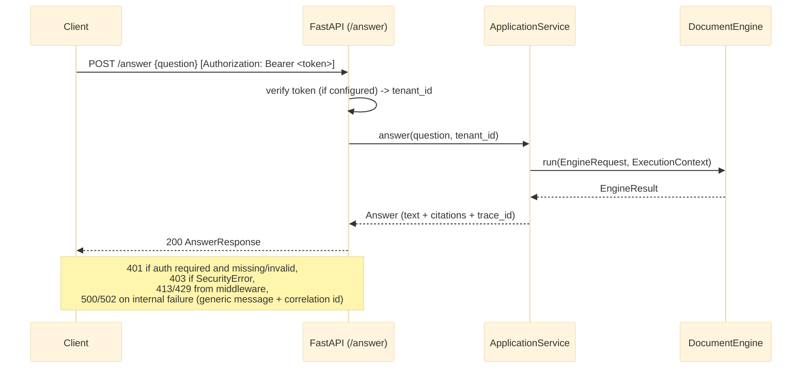

# REST API Reference

The Modular RAG Framework ships a FastAPI application (`src/modular_rag/api/`) so that a RAG
pipeline can be called as a network service rather than embedded as a Python library. This
matters for any client whose existing application (a portal, a chatbot integration, an
internal tool) is not written in Python, or that simply doesn't want heavy dependencies like
`sentence-transformers` or `qdrant-client` inside its own process. The API is a thin
`create_app()` factory over the same `ApplicationService` the CLI uses. The service selects the
manifest's `DocumentEngine` for answer execution and retains native ingestion/retrieval-only
use cases; the HTTP layer only performs request/response translation, authentication, resource
lifecycle, and safe-error mapping
(Lot 16a, [docs/refactoring-plan.md](../refactoring-plan.md)).

`create_app(manifest_path, ...)` requires `manifest_path`, so bare `--factory` mode (which calls
the factory with zero arguments) does not work. Wrap it in a one-line module instead:

```python
# server.py
from modular_rag.api import create_app
app = create_app("manifests/presets/local-hybrid-rag.yaml")
```

```bash
uvicorn server:app --host 0.0.0.0 --port 8000
```

Base URL: `http://localhost:8000`

---

## `create_app()` parameters

| Parameter | Default | Purpose |
|---|---|---|
| `manifest_path` | required | Pipeline manifest YAML — same as the CLI's `--manifest`. |
| `token_verifier` | `None` | A `contracts.identity.TokenVerifier` (e.g. `adapters.auth.keycloak_verifier.KeycloakTokenVerifier`, Lot 11b). When set, `/answer` and `/retrieve` require a valid `Authorization: Bearer <token>` header. `None` leaves every route open — dev/local use, matching every other optional-component precedent in this codebase (guard, redactor, tenant_policy). **Any deployment serving more than one tenant's data must configure one.** |
| `max_body_bytes` | `1_000_000` (1 MB) | Requests with a `Content-Length` over this are rejected `413` before the body is read. |
| `rate_limit_per_minute` | `60` | Per-client (by `X-Forwarded-For` or socket address) fixed-window request limit; over it returns `429` with a `Retry-After` header. In-memory, single-process — not shared across horizontally-scaled replicas; a Redis-backed limiter is the production upgrade path if this API is ever deployed with more than one worker. |

```python
from modular_rag.api import create_app
from modular_rag.adapters.auth.keycloak_verifier import KeycloakTokenVerifier

app = create_app(
    "manifests/presets/local-hybrid-rag.yaml",
    token_verifier=KeycloakTokenVerifier(issuer_url="...", audience="..."),
    rate_limit_per_minute=120,
)
```

---

## Endpoints

### `GET /health`

Liveness probe. Returns HTTP 200 once `create_app()` has finished wiring the pipeline. Never
requires authentication, and is exempt from the body-size and rate-limit middleware — an
orchestrator's own liveness probe must never trip either.

**Response**

```json
{
  "status": "ok",
  "pipeline": "local-hybrid-rag"
}
```

---

### `GET /ready`

Readiness probe (Lot 16a). Today this reports the same thing `/health` does — confirmation that
`create_app()` completed wiring successfully. It does **not** probe live connectivity to the
vector store or LLM provider; that would need a per-adapter health-check contract this lot did
not add. Recorded honestly here rather than implied by the route name. Also exempt from
body-size and rate-limit middleware, for the same reason as `/health`.

**Response**

```json
{
  "status": "ready",
  "pipeline": "local-hybrid-rag"
}
```

---

### `POST /answer`

Submit a question and receive a grounded answer with citations.



For the full internal breakdown of `engine.answer()` (guard → retrieve → rerank →
generate → guard → redact → telemetry), see
[runtime-flow.md](../architecture/runtime-flow.md), "V1 — Simple RAG (query path)."

**Request body**

```json
{
  "question": "What are the main conclusions of the Q3 report?"
}
```

| Field | Type | Required | Description |
|---|---|---|---|
| `question` | `string` | Yes | The user question |

There is no `k` field on the request body — `k` is a manifest/retriever config value, not
something a caller sets per request (this document previously showed one; it was never read by
the handler).

**Response**

```json
{
  "text": "The main conclusions of the Q3 report are...",
  "citations": [],
  "trace_id": "a1b2c3d4"
}
```

`citations` is `list[dict]` built from `Citation.model_dump()` — populated only if the
configured `Generator` actually attaches citations; there is no `model` field on the response.

**Error responses**

| Status | When |
|---|---|
| `401 Unauthorized` | `token_verifier` is configured and the request is missing a bearer token, or the token fails verification (`AuthenticationError`). |
| `403 Forbidden` | A `SecurityError` (guard denial, tenant-policy denial, or any `PolicyViolationError`) — `detail` is that exception's own message, which is written to be caller-facing (the same `reason` a `SecurityGuard` returns). |
| `413 Payload Too Large` | Request body exceeds `max_body_bytes`. |
| `422 Unprocessable Entity` | Invalid request body (e.g. missing `question`). |
| `429 Too Many Requests` | Rate limit exceeded; response has a `Retry-After` header. |
| `500 Internal Server Error` / `502 Bad Gateway` | Any other failure (LLM API error, Qdrant unreachable, an unexpected bug). `detail` is a generic message plus a correlation id — the original exception text is logged server-side (`structlog`, `api.request_failed`) under the same id, never returned to the caller (Lot 16a, [docs/refactoring-plan.md](../refactoring-plan.md) — closes the raw-exception-leak gap Lot 4 first characterized). |

---

### `GET /retrieve`

Retrieve chunks for a query without generating an answer. Useful for debugging retrieval quality.

**Query parameters**

| Parameter | Type | Default | Description |
|---|---|---|---|
| `q` | `string` | Required | The search query |
| `k` | `integer` | `10` | Number of chunks to return |

Requires the same `Authorization: Bearer <token>` header as `/answer` when `token_verifier` is
configured — the authenticated tenant's chunks only, per `Container.tenant_policy`
(Lot 16a fixed a real gap here: `RAGEngine.retrieve()` previously never consulted
`tenant_policy` at all, unlike `answer()`).

**Request**

```
GET /retrieve?q=BM25+retrieval+model&k=5
Authorization: Bearer <token>
```

**Response**

```json
[
  {
    "chunk_id": "uuid-...",
    "score": 0.87,
    "content": "BM25 is a probabilistic retrieval model based on term frequency..."
  }
]
```

Exactly these three fields — `chunk_id`, `score`, `content` (truncated to 300 characters). There
is no `doc_id`, `source`, `rank`, or `retrieval_method` in the response.

---

## Authentication

`create_app(..., token_verifier=...)` (Lot 16a) — see the parameters table above. With no
verifier configured, the API is unauthenticated (dev/local use only). With one configured,
`/answer` and `/retrieve` require `Authorization: Bearer <token>`; `/health` and `/ready` never
do. `adapters/auth/keycloak_verifier.py`'s `KeycloakTokenVerifier` (Lot 11b) is the reference
implementation, verifying against a real Keycloak realm's JWKS endpoint.

There is no per-tenant API-key scheme — identity comes only from the verified token's
`TenantContext`, never from a request field a caller could set to claim a tenant.

---

## OpenAPI docs

When the server is running, interactive docs are available at:

- Swagger UI: `http://localhost:8000/docs`
- ReDoc: `http://localhost:8000/redoc`
- OpenAPI JSON: `http://localhost:8000/openapi.json`

---

## Client example (Python)

```python
import httpx

client = httpx.Client(base_url="http://localhost:8000")

response = client.post(
    "/answer",
    json={"question": "Explain the hybrid retrieval approach."},
    headers={"Authorization": "Bearer <token>"},  # only if token_verifier is configured
)
response.raise_for_status()
data = response.json()

print(data["text"])
for cit in data["citations"]:
    print(f"  [{cit.get('source')}] {str(cit.get('passage', ''))[:80]}")
```

## Client example (curl)

```bash
curl -s -X POST http://localhost:8000/answer \
     -H "Content-Type: application/json" \
     -H "Authorization: Bearer <token>" \
     -d '{"question": "What is GraphRAG?"}' \
     | python -m json.tool
```
