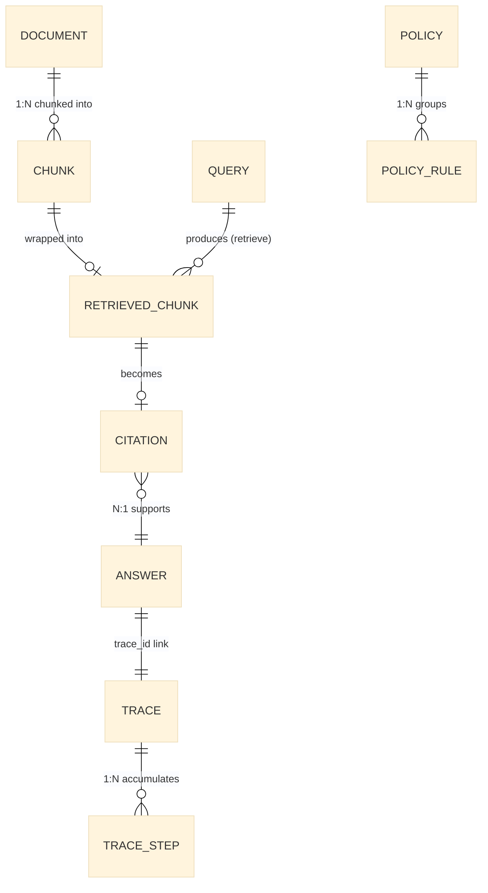
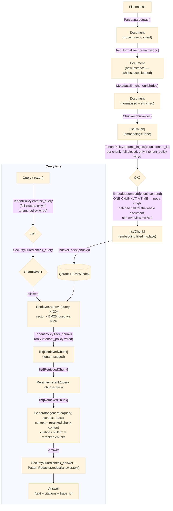

# Data Model Reference

All domain entities live under `src/modular_rag/core/models/`. They are plain Pydantic v2 models — no ORM, no database mapping. Every layer of the framework passes these objects around; nothing is serialised to a persistence format until an adapter does it explicitly.

---

## Relations between models



`Metrics` is a standalone evaluation result — it is not linked to `Answer` at the model
level; an evaluator computes it separately from a `(Query, Answer, expected)` triple. See
section 8 below.

---

## 1. Document

**File**: `core/models/document.py`

A document is the atomic ingestion unit. It is **immutable** (`frozen=True`) — once created from a file or API response, its content never changes. Mutations produce a new Document.

| Field | Type | Default | Description |
|---|---|---|---|
| `id` | `str` | `new_id()` | ULID — globally unique, sortable by creation time |
| `source` | `str` | required | File path, URL, or opaque identifier of the origin |
| `content` | `str` | required | Full raw text extracted from the source |
| `modality` | `Modality` | `TEXT` | One of: `text`, `image`, `table`, `audio`, `video`, `code` |
| `mime_type` | `str` | `"text/plain"` | MIME type of the source (drives parser selection) |
| `metadata` | `dict[str, Any]` | `{}` | Freeform key-value pairs (title, author, tags, language…) |
| `created_at` | `datetime` | `utcnow()` | Ingestion timestamp (UTC) |

**Invariants**
- `frozen=True` — any attempt to mutate a field raises `ValidationError`.
- `source` must be non-empty; an empty source is a bug, not a user error.

**Example**
```python
from modular_rag.core.models.document import Document

doc = Document(
    source="reports/Q4-2025.pdf",
    content="Revenue for Q4 was $42M, up 18% year-over-year.",
    mime_type="application/pdf",
    metadata={"author": "Finance Team", "year": 2025},
)
```

---

## 2. Chunk

**File**: `core/models/chunk.py`

A Chunk is a sub-segment of a Document, produced by a `Chunker`. Unlike `Document`, chunks are **mutable** (`frozen=False`) so that embedders can write the `embedding` field in-place after creation.

| Field | Type | Default | Description |
|---|---|---|---|
| `id` | `str` | `new_id()` | ULID — unique per chunk |
| `doc_id` | `str` | required | ID of the parent Document |
| `content` | `str` | required | Text content of this chunk |
| `modality` | `Modality` | `TEXT` | Inherited from parent document |
| `embedding` | `list[float] \| None` | `None` | Dense embedding vector (set by Embedder after chunking) |
| `start_char` | `int` | `0` | Byte offset of chunk start in the original document |
| `end_char` | `int` | `0` | Byte offset of chunk end |
| `page` | `int \| None` | `None` | Page number (for PDF sources) |
| `tenant_id` | `str \| None` | `None` | Owning tenant (Lot 11b). `None` (legacy/unclassified content) is treated as *inaccessible* by `TenantIsolationPolicy.filter_chunks()`, never implicitly public — see `overview.md` §3's Safety plane and the root README's Core Concepts §6. |
| `metadata` | `dict[str, Any]` | `{}` | Inherited or enriched metadata |

**Invariants**
- `doc_id` must match an existing `Document.id`. No referential integrity is enforced by the model — the pipeline is responsible.
- `token_estimate` is a computed property (`len(content.split())`), not stored. It is an approximation; real token counts depend on the tokenizer.

**Property**
```python
@property
def token_estimate(self) -> int:
    return len(self.content.split())
```

**Example**
```python
from modular_rag.core.models.chunk import Chunk

chunk = Chunk(
    doc_id=doc.id,
    content="Revenue for Q4 was $42M, up 18% year-over-year.",
    start_char=0,
    end_char=48,
    page=1,
)
print(chunk.token_estimate)  # 10
```

---

## 3. Query

**File**: `core/models/query.py`

A Query represents a user's intent. Like `Document`, it is **immutable** — once constructed, the text and metadata are final.

| Field | Type | Default | Description |
|---|---|---|---|
| `id` | `str` | `new_id()` | ULID — used to correlate with `Answer.query_id` and `Trace.query_id` |
| `text` | `str` | required | The raw question text |
| `modality` | `Modality` | `TEXT` | Modality of the question (text, image…) |
| `tenant_id` | `str \| None` | `None` | Set once a caller authenticates (Lot 11b); fail-closed enforcement lives in `security/policies/tenant_isolation.py`, not on this model |
| `metadata` | `dict[str, Any]` | `{}` | User-id, session-id, locale |
| `created_at` | `datetime` | `utcnow()` | Request timestamp (UTC) |

`routing_hint` (`RoutingStrategy | None`) was removed in Lot 17 (`docs/refactoring-plan.md`)
along with `RoutingStrategy`/`QueryRouter` — the router that would have read it never actually
influenced pipeline execution (zero consumers, verified before removal).

**Invariants**
- `frozen=True` — query text must not be mutated mid-pipeline (this would break trace correlation).

**Example**
```python
from modular_rag.core.models.query import Query

q = Query(
    text="What was our revenue growth in Q4 2025?",
    metadata={"user_id": "u_123"},
    tenant_id="finance",
)
```

---

## 4. RetrievedChunk

**File**: `core/models/retrieved.py`

A `RetrievedChunk` wraps a `Chunk` with retrieval metadata: how it was found, what its relevance score is, and what rank it occupies after fusion/reranking.

| Field | Type | Default | Description |
|---|---|---|---|
| `chunk` | `Chunk` | required | The chunk that was retrieved |
| `score` | `float` | required | Relevance score (0.0–1.0 after normalisation, or RRF score) |
| `rank` | `int` | required | 1-based rank after fusion and/or reranking |
| `retrieval_method` | `RetrievalMethod` | `HYBRID` | How this chunk was found: `vector`, `bm25`, or `hybrid` — `graph` and `multimodal` were removed from this enum (Étape 8 cleanup, 2026-08-07): both described delegated capabilities (ADR-0005 §5.2) with zero producing code and zero consumers, so they were dropped rather than kept as unreachable enum values. Restorable via git history if a native graph/multimodal retriever is ever built. |

**Invariants**
- `frozen=True` — scores and ranks must not be changed after retrieval.
- `__lt__` is defined as `self.rank < other.rank`, enabling `sorted(retrieved_chunks)` to sort by relevance.

**Example**
```python
from modular_rag.core.models.retrieved import RetrievedChunk
from modular_rag.core.enums import RetrievalMethod

rc = RetrievedChunk(
    chunk=chunk,
    score=0.87,
    rank=1,
    retrieval_method=RetrievalMethod.HYBRID,
)
```

---

## 5. Citation and Answer

**File**: `core/models/answer.py`

A `Citation` is a direct pointer from the answer back to a specific chunk that supported the claim. An `Answer` aggregates the generated text, all citations, confidence, and the trace ID for debugging.

### Citation

| Field | Type | Default | Description |
|---|---|---|---|
| `chunk_id` | `str` | required | ID of the `Chunk` that supports this claim |
| `source` | `str` | required | Human-readable source reference (file path, URL) |
| `passage` | `str` | required | Verbatim excerpt from the chunk used in the answer |
| `score` | `float` | required | Relevance score of the supporting chunk |
| `page` | `int \| None` | `None` | Page number if available |
| `metadata` | `dict[str, Any]` | `{}` | Extra provenance information |

### Answer

| Field | Type | Default | Description |
|---|---|---|---|
| `id` | `str` | `new_id()` | ULID — unique per answer |
| `query_id` | `str` | required | ID of the originating `Query` |
| `text` | `str` | required | Generated answer text |
| `citations` | `list[Citation]` | `[]` | Supporting citations, in order of relevance |
| `confidence` | `float \| None` | `None` | Overall confidence score (0.0–1.0), set by generator or validator |
| `trace_id` | `str \| None` | `None` | Links to the `Trace` for this request |
| `model` | `str \| None` | `None` | Model identifier used for generation (e.g. `"gpt-4o"`) |
| `metadata` | `dict[str, Any]` | `{}` | Extra fields (e.g. token counts, routing strategy used) |
| `created_at` | `datetime` | `utcnow()` | Generation timestamp |

**Example**
```python
from modular_rag.core.models.answer import Answer, Citation

answer = Answer(
    query_id=q.id,
    text="Revenue grew 18% year-over-year to $42M in Q4 2025.",
    citations=[
        Citation(
            chunk_id=chunk.id,
            source="reports/Q4-2025.pdf",
            passage="Revenue for Q4 was $42M, up 18% year-over-year.",
            score=0.87,
            page=1,
        )
    ],
    confidence=0.92,
    model="gpt-4o",
)
```

---

## 6. TraceStep and Trace

**File**: `core/models/trace.py`

A `Trace` is the audit record for a single pipeline execution. It accumulates `TraceStep` entries, one per pipeline stage (guard, retrieve, rerank, generate…). The accumulation is **additive** — `add_step()` atomically appends and updates totals.

### TraceStep

| Field | Type | Default | Description |
|---|---|---|---|
| `name` | `str` | required | Stage name (e.g. `"retrieve"`, `"generate"`) |
| `input_tokens` | `int` | `0` | Tokens consumed as input in this step |
| `output_tokens` | `int` | `0` | Tokens produced in this step |
| `latency_ms` | `float` | `0.0` | Wall-clock latency for this step in milliseconds |
| `metadata` | `dict[str, Any]` | `{}` | Extra diagnostics (model, k, method…) |

### Trace

| Field | Type | Default | Description |
|---|---|---|---|
| `schema_version` | `str` | `TRACE_SCHEMA_VERSION` (currently `"1.2"`) | Versions the shape of this model itself, not the pipeline run |
| `id` | `str` | `new_id()` | ULID — referenced by `Answer.trace_id` |
| `query_id` | `str` | required | Correlates with the originating `Query` |
| `pipeline_id` | `str` | `""` | Manifest or pipeline name |
| `steps` | `list[TraceStep]` | `[]` | Ordered list of steps |
| `total_latency_ms` | `float` | `0.0` | Running total — updated by `add_step()` |
| `total_input_tokens` | `int` | `0` | Running total |
| `total_output_tokens` | `int` | `0` | Running total |
| `failed` | `bool` | `False` | Set when `RAGEngine._run()` catches an exception; the trace still reaches `telemetry.record_trace()` before the exception re-raises (Lot 10) |
| `failure_reason` | `str \| None` | `None` | Set alongside `failed` |
| `created_at` | `datetime` | `utcnow()` | Start of pipeline execution |

**`routing_strategy` no longer exists on this model.** It was removed in Étape 8
([ADR-0007](../adr/0007-layer-boundaries-and-control-plane-activation.md)), which is also why
`TRACE_SCHEMA_VERSION` is `"1.2"` and not `"1.1"` — the field dated back to the deleted native
`QueryRouter`, had zero real consumers, and always held its empty-string default in practice. A
consumer reading older `Trace` JSON that happened to key off this field should treat its absence
the same way the empty-string default always effectively meant: no dynamic routing occurred.

**Key method**
```python
def add_step(self, step: TraceStep) -> None:
    self.steps.append(step)
    self.total_latency_ms += step.latency_ms
    self.total_input_tokens += step.input_tokens
    self.total_output_tokens += step.output_tokens
```

**Example**
```python
from modular_rag.core.models.trace import Trace, TraceStep

trace = Trace(query_id=q.id, pipeline_id="local-hybrid-rag")
trace.add_step(TraceStep(name="retrieve", latency_ms=120.5, metadata={"k": 20}))
trace.add_step(TraceStep(name="generate", input_tokens=1200, output_tokens=180, latency_ms=880.0))

print(trace.total_latency_ms)    # 1000.5
print(trace.total_input_tokens)  # 1200
```

---

## 7. PolicyRule and Policy

**File**: `core/models/policy.py`

Policies govern what the pipeline is allowed to do. A `Policy` groups multiple `PolicyRule` objects and can be scoped to a tenant or topic. Rules are applied in descending priority order via `sorted_rules()`.

### PolicyRule

| Field | Type | Default | Description |
|---|---|---|---|
| `id` | `str` | `new_id()` | ULID |
| `name` | `str` | required | Human-readable rule identifier |
| `condition` | `str` | required | DSL expression or regex pattern evaluated at runtime |
| `action` | `PolicyAction` | required | One of: `allow`, `deny`, `redact`, `warn`, `require_review` |
| `priority` | `int` | `0` | Higher priority rules are evaluated first |
| `metadata` | `dict[str, Any]` | `{}` | Tags, owner, last-modified |

### Policy

| Field | Type | Default | Description |
|---|---|---|---|
| `id` | `str` | `new_id()` | ULID |
| `name` | `str` | required | Policy name (e.g. `"gdpr-finance"`) |
| `rules` | `list[PolicyRule]` | `[]` | Rules belonging to this policy |
| `scope` | `str` | `"*"` | Glob pattern matching pipeline IDs this policy applies to |
| `enabled` | `bool` | `True` | Disabled policies are loaded but not evaluated |
| `tenant` | `str` | `"default"` | Tenant this policy belongs to |

**Key method**
```python
def sorted_rules(self) -> list[PolicyRule]:
    return sorted(self.rules, key=lambda r: r.priority, reverse=True)
```

**Example**
```python
from modular_rag.core.models.policy import Policy, PolicyRule
from modular_rag.core.enums import PolicyAction

policy = Policy(
    name="gdpr-finance",
    tenant="finance",
    scope="*-prod",
    rules=[
        PolicyRule(name="block-ssn", condition=r"\b\d{3}-\d{2}-\d{4}\b",
                   action=PolicyAction.DENY, priority=100),
        PolicyRule(name="warn-pci", condition="credit_card",
                   action=PolicyAction.WARN, priority=50),
    ],
)
for rule in policy.sorted_rules():
    print(rule.name, rule.priority)  # block-ssn 100, warn-pci 50
```

---

## 8. Metrics

**File**: `core/models/metrics.py`

`Metrics` is a flat bag of evaluation scores, grouped into four families. All scoring fields are
optional floats or ints — an evaluator only fills the fields it can compute; `summary()` returns
only the fields worth showing, making it safe to log or compare across evaluators that each
populate a different subset. `METRICS_SCHEMA_VERSION` (currently `"1.0"`) is bumped when a
field's *meaning* changes (e.g. a metric's formula) — not for a purely additive new field (Lot 13,
`docs/refactoring-plan.md`).

| Field | Type | Family | Description |
|---|---|---|---|
| `schema_version` | `str` | — | `METRICS_SCHEMA_VERSION`; excluded from `summary()`'s output regardless of value (see below) |
| `recall_at_k` | `float \| None` | Retrieval | Fraction of relevant chunks retrieved in top-k, over retrieved chunks vs. a relevant-chunk-id set |
| `precision_at_k` | `float \| None` | Retrieval | Fraction of retrieved chunks that are relevant |
| `ndcg` | `float \| None` | Retrieval | Normalised Discounted Cumulative Gain — **field exists in the schema, but no shipped evaluator computes it yet** (`ROADMAP.md` V1.1 — "NDCG@k" is explicitly tracked as not-yet-built) |
| `mrr` | `float \| None` | Retrieval | Mean Reciprocal Rank |
| `exact_match` | `float \| None` | Answer | `1.0`/`0.0` — genuine normalized string equality, answer vs. gold (`ExactMatchEvaluator`) |
| `answer_precision` | `float \| None` | Answer | Token-set precision, answer vs. gold |
| `answer_recall` | `float \| None` | Answer | Token-set recall, answer vs. gold |
| `answer_relevance` | `float \| None` | Answer | Token-set **F1**, answer vs. gold — despite the name, this is answer-vs-*gold-answer* overlap, not a semantic-similarity-to-the-query metric; do not confuse it with a query-relevance score |
| `groundedness` | `float \| None` | Answer | Fraction of answer claims supported by retrieved context — see `generation/validators/groundedness.py`'s own docstring for why this is explicitly a lexical-overlap heuristic, not a faithfulness metric, even where "groundedness" is used as a field name |
| `faithfulness` | `float \| None` | Answer | Whether the answer contradicts the context |
| `context_precision` | `float \| None` | Answer | Signal-to-noise ratio of the retrieved context |
| `policy_violations` | `int \| None` | Policy/governance | Count of policy rules the run violated |
| `latency_ms` | `float \| None` | Cost/latency | End-to-end pipeline latency |
| `input_tokens` | `int \| None` | Cost/latency | Total input tokens consumed |
| `output_tokens` | `int \| None` | Cost/latency | Total output tokens generated |
| `cost_usd` | `float \| None` | Cost/latency | Estimated cost in USD |
| `failed` | `bool` (default `False`) | Failure signal | `True` when the underlying engine call raised — see below; excluded from `summary()`'s output regardless of value |
| `failure_reason` | `str \| None` | Failure signal | Set alongside `failed=True`; excluded from `summary()`'s output regardless of value |

**Why `failed`/`failure_reason` exist as their own family (Lot 13 — "distinguish infrastructure
failure from zero quality").** Before these two fields existed, a benchmark case whose engine
call *raised an exception* and a case that ran fine but scored zero on every metric produced the
*same* `Metrics` object shape — all-`None` fields either way. That made a crashed evaluation run
indistinguishable from a genuinely bad answer in any downstream report. `Metrics.for_failure(reason)`
is the supported way to construct a failure record: every scoring field stays `None` (there is
nothing to score), but `failed=True` and `failure_reason` make the crash explicit.

**Key method — note the exclusion list, not just "non-None":**
```python
_SUMMARY_EXCLUDED_FIELDS = frozenset({"schema_version", "failed", "failure_reason"})

def summary(self) -> dict[str, float]:
    return {
        k: v
        for k, v in self.model_dump().items()
        if v is not None and k not in _SUMMARY_EXCLUDED_FIELDS
    }
```
`schema_version`/`failed`/`failure_reason` are excluded **unconditionally**, not merely because
they might be `None` — `schema_version` is never `None` (it has a string default) and `failed`
defaults to `False`, not `None`, so a naive "only non-None fields" description would incorrectly
predict both appearing in every single `summary()` call. This exclusion list is precisely why
they don't.

**Example**
```python
from modular_rag.core.models.metrics import Metrics

m = Metrics(recall_at_k=0.85, precision_at_k=0.70, latency_ms=1200.0, cost_usd=0.003)
print(m.summary())
# {'recall_at_k': 0.85, 'precision_at_k': 0.70, 'latency_ms': 1200.0, 'cost_usd': 0.003}
# — NOT {'schema_version': '1.0', 'failed': False, ...} even though both have non-None values.

failure = Metrics.for_failure("engine timed out after 30s")
print(failure.summary())
# {} — every scoring field is None, and the three failure-signal fields are excluded from
# summary() regardless — check `.failed`/`.failure_reason` directly, not `.summary()`, to detect
# this case.
```

---

## 9. Object lifecycle — Document to Answer

This section traces the data transformation path through a V1 pipeline:



The `Trace` object is created at the start of the query path and accumulates a `TraceStep` after
each stage. The final `Answer.trace_id` links back to it for observability. The three
`TenantPolicy`-labeled steps above are no-ops whenever no `tenant_policy` is wired in the
manifest — this is the identical minimal-vs-governed pipeline distinction described in
[`overview.md` §2](overview.md#2-guiding-principles) ("progressive rollout"); a
`local-hybrid-rag.yaml` run skips all three, a `secure-enterprise-rag.yaml` run executes all
three. See [`overview.md` §10](overview.md#10-ingestion-pipeline-v1-detail) for why embedding
happens one chunk at a time rather than as a single batched call, and why that has real
cost/latency consequences for large corpora with an API-backed embedder.
