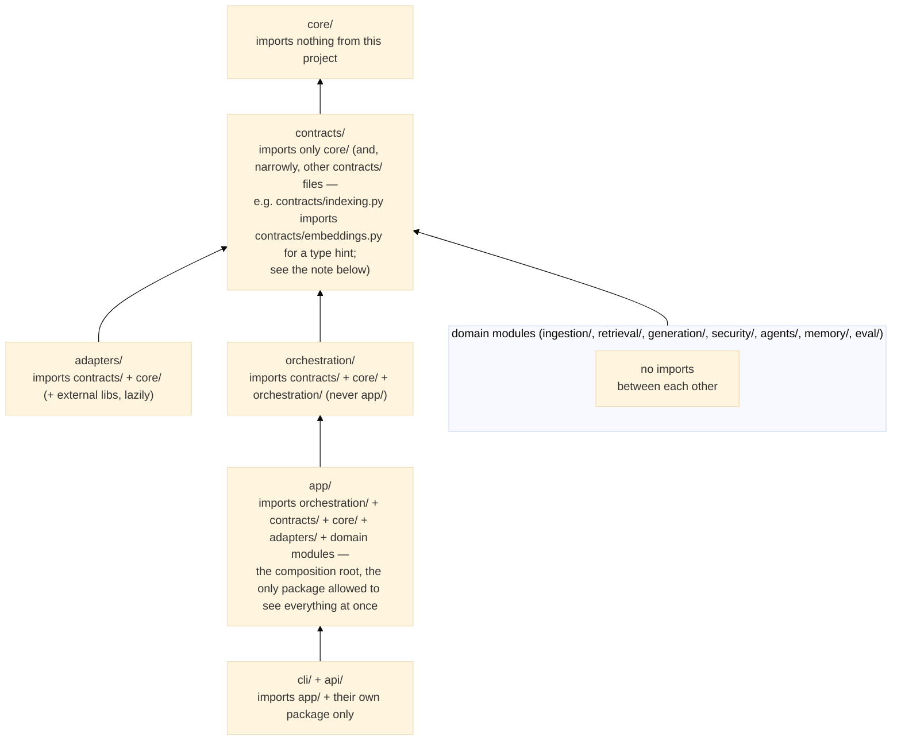

# Module Model — Layer Boundaries

This document describes the dependency architecture of the framework: what modules exist, which
direction dependencies are allowed to flow, why those rules exist, and what each package exposes
publicly. Unlike [`overview.md`](overview.md) (the conceptual "why" document), this file is the
**exhaustive, file-by-file reference** — every path below was verified directly against
`src/modular_rag/` (not copied from a prior version of this document) on the date this revision
was written. If you find a path here that no longer matches the filesystem, trust the filesystem
and file an issue/PR to fix this document — that mismatch is exactly the kind of drift this
revision exists to close (see the historical note at the end of this document for how badly this
file itself had drifted before this revision).

---

## Module tree

```
src/modular_rag/
├── contracts/          ← Protocols (interfaces). Nothing else depends on these except adapters + domain modules.
│   ├── audit.py            AuditEvent, AuditEventType, AuditSink, ALLOWED_PAYLOAD_KEYS, AUDIT_SCHEMA_VERSION
│   ├── chunking.py         Chunker protocol
│   ├── embeddings.py       Embedder protocol (sync + async)
│   ├── engine.py           DocumentEngine port, EngineRequest/EngineResult/EngineStep/EngineCapability,
│   │                       ExecutionContext, CancellationToken, GovernanceHook, GovernanceDecision
│   ├── erasure.py          ErasureProof (right-to-erasure proof model)
│   ├── evaluation.py       Evaluator protocol, AnswerEngine protocol (minimal QA-engine interface)
│   ├── generation.py       Generator protocol
│   ├── identity.py         TenantContext, TokenVerifier protocol
│   ├── indexing.py         Indexer protocol, VectorIndexer sub-protocol (ADR-0009)
│   ├── lifecycle.py        LifecycleLedger protocol, DocumentRecord, DocumentStatus
│   ├── manifests.py        PipelineManifest, ComponentConfig, GovernanceSection, QualitySection,
│   │                       ObservabilitySection, LifecycleSection, EngineSelection, ManifestLoader
│   │                       (LifecycleSection exists here but is — as of this writing — not
│   │                       re-exported from contracts/__init__.py's __all__; a real, minor gap
│   │                       in the package's own public surface, not a documentation error)
│   ├── meter.py            Meter protocol (ADR-0013, live operational counters/histograms/gauges —
│   │                       distinct from core.models.metrics.Metrics, a differently-scoped
│   │                       post-hoc evaluation-quality bag)
│   ├── parsing.py          Parser protocol
│   ├── reconciliation.py   DocumentDivergence, ReconciliationReport, RepairResult — plain Pydantic
│   │                       models, NOT a Protocol; consumed by orchestration/reconciliation.py's
│   │                       IndexReconciler (a concrete class, not itself contract-defined here)
│   ├── reranking.py        Reranker protocol
│   ├── retrieval.py        Retriever protocol
│   ├── review.py           ReviewItem model, ReviewQueue protocol
│   ├── secrets.py          SecretResolver protocol
│   ├── security.py         SecurityGuard, Redactor, TenantPolicy protocols; GuardResult model
│   ├── storage.py          Storage protocol (KV)
│   ├── telemetry.py        Telemetry protocol
│   └── tracing.py          Tracer/Span protocols (ADR-0012, live OpenTelemetry-compatible spans)
│                          (No `memory.py`/`KnowledgeGraphStore`, no `agents.py`/`planning.py` —
│                          the graph-store and native-agent contracts these would have backed
│                          were removed in the ADR-0007 stabilization pass / Lot 17 respectively;
│                          see the historical note at the end of this document.)
│
├── core/               ← Shared, depended on by all. Imports NOTHING from this project.
│   ├── models/             Domain entities (Pydantic v2, see data-model.md)
│   │   ├── document.py
│   │   ├── chunk.py
│   │   ├── query.py
│   │   ├── retrieved.py
│   │   ├── retrieval_result.py  RetrievalResult (chunks + trace_id, ADR-0012)
│   │   ├── answer.py           Answer, Citation
│   │   ├── trace.py            Trace, TraceStep, TRACE_SCHEMA_VERSION
│   │   ├── policy.py           Policy, PolicyRule
│   │   └── metrics.py          Metrics
│   ├── document_identity.py    content_hash(), document_key() — stable identity for lifecycle/dedup
│   ├── enums.py            Modality, RetrievalMethod, PolicyAction, DataClassification, PIICategory
│   │                       (StrEnum) — NOT ChunkingStrategy/GraphRelation/RoutingStrategy/AgentRole;
│   │                       all four were removed as dead code with zero real consumers (the
│   │                       delegated agent/graph features they described are not built natively —
│   │                       see ADR-0005)
│   ├── errors.py           Exception hierarchy rooted at ModularRAGError — see overview.md §12
│   │                       for the complete, current tree (this file's own version had drifted:
│   │                       do not trust an older copy of that diagram either)
│   ├── ids.py              new_id(), short_id()
│   └── resilience.py       Retry/circuit-breaker primitives (Lot 14, docs/refactoring-plan.md)
│   `core/__init__.py` exports the four *submodules* (`enums`, `errors`, `ids`, `models`), not
│   individual names — `from modular_rag.core import errors` then `errors.ModularRAGError`, not
│   `from modular_rag.core import ModularRAGError`.
│
├── adapters/           ← External bindings. Implements contracts/. May import heavy deps, lazily.
│   │                     No `__init__.py` at the top level or inside any subdirectory (plain
│   │                     namespace packages, as of Lot 10) — every adapter is imported by its
│   │                     full submodule path, e.g.
│   │                     `from modular_rag.adapters.vectorstores.qdrant_store import QdrantStore`.
│   ├── embeddings/
│   │   ├── openai_embedder.py         OpenAIEmbedder (batched sync + async, lazy `openai` import)
│   │   ├── hf_embedder.py             HuggingFaceEmbedder (lazy `sentence-transformers` import;
│   │   │                              static `_DIMENSIONS` table for known models keeps
│   │   │                              `.dimensions` free of a model load — ADR-0009)
│   │   └── deterministic_embedder.py  DeterministicEmbedder — feature-hashed, no model/network,
│   │                                  for e2e tests and dependency-free local pipelines
│   ├── vectorstores/
│   │   ├── qdrant_store.py            QdrantStore — implements Indexer + VectorIndexer (ADR-0009)
│   │   │                              and the low-level `retrieve_by_vector()` VectorRetriever
│   │   │                              calls into (not a full standalone Retriever on its own)
│   │   └── qdrant_sparse_store.py     QdrantSparseStore — implements Indexer against a dedicated
│   │                                  sparse-only Qdrant collection (Modifier.IDF); the
│   │                                  low-level `retrieve_by_text()` PersistentSparseRetriever
│   │                                  calls into. Deliberately a *separate* collection from
│   │                                  qdrant_store.py's, not named vectors on the same points —
│   │                                  see its own module docstring for why
│   ├── audit/
│   │   └── postgres_sink.py           PostgresAuditSink — durable, append-only AuditSink
│   │                                  (lazy `psycopg` import; no `.close()` today — a known,
│   │                                  minor gap, see overview.md §13)
│   ├── lifecycle/
│   │   └── postgres_ledger.py         PostgresLifecycleLedger (lazy `psycopg` import)
│   ├── auth/
│   │   └── keycloak_verifier.py       KeycloakTokenVerifier — implements contracts.identity's
│   │                                  TokenVerifier against Keycloak specifically (Lot 11b);
│   │                                  a REAL implementation, not a placeholder
│   ├── llms/
│   │   └── langgraph_engine.py        LangGraphEngineAdapter — implements the DocumentEngine
│   │                                  port by wrapping a LangGraph graph (ADR-0006); the
│   │                                  engine-delegation adapter target this directory is
│   │                                  reserved for, NOT where OpenAIGenerator/AnthropicGenerator
│   │                                  live (those are in generation/synthesizers/ — see below;
│   │                                  an older version of this document wrongly placed them here)
│   ├── graphstores/        empty — reserved engine-delegation adapter target (ADR-0005/0006);
│   │                       no file exists here today
│   └── search/             empty — reserved engine-delegation adapter target; no file exists here
│
├── ingestion/          ← Domain module: file → Document → Chunk. Public exports via
│                          ingestion/__init__.py: ingest_path, ingest_directory.
│   ├── parsers/
│   │   ├── text_parser.py     TextParser (.txt, .md)
│   │   ├── html_parser.py     HTMLParser
│   │   ├── docx_parser.py     DocxParser (Word)
│   │   └── pdf_parser.py      PDFParser (.pdf via PyMuPDF/`fitz`, lazy import)
│   ├── chunkers/
│   │   ├── fixed.py           FixedSizeChunker (token window + overlap)
│   │   ├── adaptive.py        AdaptiveChunker (splits on Markdown headings)
│   │   └── _windowing.py      Shared windowing helper both chunkers use internally
│   ├── normalizers/
│   │   └── text_normalizer.py TextNormalizer (whitespace, newline collapsing)
│   ├── enrichers/
│   │   ├── metadata_enricher.py  MetadataEnricher (filename, extension, size_bytes, enriched_at)
│   │   └── contextual_enricher.py  ContextualEnricher (document-context-prefixed embedding_text)
│   ├── lifecycle/
│   │   ├── in_memory_ledger.py   InMemoryLifecycleLedger
│   │   ├── hashing.py            Content-hash helpers used by the lifecycle ledger
│   │   └── backup.py             Ledger backup/restore (Lot 12c)
│   └── pipelines/
│       └── default.py         ingest_path()/ingest_directory() — parse → normalize → enrich →
│                              chunk → (tenant_id stamped if given). Stops *before* embedding —
│                              see overview.md §10 for why that boundary is drawn there.
│
├── retrieval/          ← Domain module: Query → list[RetrievedChunk]. Public exports via
│                          retrieval/__init__.py: BM25Retriever, VectorRetriever, HybridRetriever,
│                          PersistentSparseRetriever.
│   ├── retrievers/
│   │   ├── bm25.py            BM25Retriever (rank-bm25, lazy import; in-memory index — dev-only,
│   │   │                      see overview.md §3 Knowledge plane for the persistence caveat)
│   │   ├── vector.py          VectorRetriever (wraps a wired Embedder + VectorIndexer-capable store)
│   │   ├── sparse.py          PersistentSparseRetriever (delegates to an injected
│   │   │                      adapters.vectorstores.qdrant_sparse_store.QdrantSparseStore — the
│   │   │                      durable-deployment alternative to bm25.py's in-memory index; see
│   │   │                      overview.md §3)
│   │   └── hybrid.py          HybridRetriever (fuses vector + an injectable lexical backend —
│   │                          BM25Retriever by default, or PersistentSparseRetriever when a
│   │                          manifest sets retriever.config.lexical: sparse-qdrant — via RRF;
│   │                          degrades to vector-only or lexical-only when one side returns
│   │                          nothing — see overview.md §11)
│   ├── fusion/
│   │   └── rrf.py             reciprocal_rank_fusion() (rrf_k=60)
│   └── rerankers/
│       └── cross_encoder.py   CrossEncoderReranker (lazy `sentence-transformers` cross-encoder import)
│
├── generation/         ← Domain module: context → Answer. Public exports via
│                          generation/__init__.py: OpenAIGenerator, AnthropicGenerator.
│   ├── synthesizers/
│   │   ├── openai_gen.py          OpenAIGenerator (lazy `openai` import)
│   │   ├── anthropic_gen.py       AnthropicGenerator (lazy `anthropic` import)
│   │   └── deterministic_gen.py   DeterministicGenerator — extractive/template-based, no LLM
│   │                              call, for e2e tests and dependency-free local pipelines
│   ├── citations/
│   │   └── builder.py             build_citations() — shared by every Generator implementation
│   │                              above, including DeterministicGenerator
│   └── validators/
│       └── groundedness.py        GroundednessValidator — a lexical-overlap gate, explicitly
│                                  NOT a faithfulness metric (see that file's own docstring)
│
├── security/           ← Domain module: guard + redact + policy + audit + tenant isolation.
│                          Public exports via security/__init__.py: InMemoryAuditSink,
│                          BasicSecurityGuard, HumanReviewGate, TenantIsolationPolicy, PatternRedactor.
│   ├── filters/
│   │   └── basic_guard.py     BasicSecurityGuard (injection patterns, blocked terms, uncited-URL
│   │                          answer check)
│   ├── detectors/
│   │   └── adversarial.py     AdversarialDetector (V2 scope — not wired into any shipped preset today)
│   ├── redaction/
│   │   └── patterns.py        PatternRedactor (email, phone FR, IBAN, API key patterns, card
│   │                          numbers with Luhn validation)
│   ├── policies/
│   │   ├── policy_engine.py       PolicyEngine (native, owned per ADR-0005 §5.1 — evaluates
│   │   │                          inline Policy/PolicyRule conditions, manifest-wired via
│   │   │                          governance.policy_engine)
│   │   ├── tenant_isolation.py    TenantIsolationPolicy (fail-closed; enforce_query/enforce_ingest/
│   │   │                          filter_chunks — Lot 11b)
│   │   └── human_review.py        HumanReviewGate (implements ReviewQueue; Lot 11c)
│   ├── audit/
│   │   └── store.py           InMemoryAuditSink (the local/dev AuditSink; durable backend under adapters/)
│   └── feedback/
│       └── store.py           InMemoryFeedbackSink (ADR-0014; durable backend under adapters/feedback/)
│
├── eval/               ← Domain module: Answer × ground truth → Metrics. Public exports via
│                          eval/__init__.py: BenchmarkCase, BenchmarkReport, BenchmarkRunner,
│                          ExactMatchEvaluator, compute_retrieval_metrics.
│   ├── scorers/
│   │   ├── exact_match.py         ExactMatchEvaluator (token-level P/R)
│   │   └── retrieval_metrics.py   compute_retrieval_metrics() — recall@k, precision@k, MRR, NDCG@k
│   ├── datasets/                   populated core_v1.yaml golden set + loader
│   ├── drift_detection.py          pure offline feedback/freshness/review drift computation
│   ├── reporting.py                deterministic JSON and Markdown benchmark reports
│   ├── runners/
│   │   └── benchmark.py           BenchmarkRunner, BenchmarkCase, BenchmarkReport, GoldenSet
│   └── quality_gate.py            QualityGate — offline-only; not part of any runtime pipeline
│                                  manifest (ADR-0008) — see overview.md §3 Evaluation plane
│
├── memory/             ← Domain module. Public exports via memory/__init__.py: InMemoryStorage.
│   └── kv/
│       └── in_memory.py       InMemoryStorage (implements the Storage protocol)
│                          No graph submodule — `memory/graph/` (KnowledgeGraph, GraphNode,
│                          GraphEdge) was removed during the ADR-0007 stabilization pass: zero
│                          consumers anywhere in the codebase, restorable via git history if a
│                          genuine native need for a graph data model ever materializes (see
│                          overview.md §3, Knowledge plane, and the project-structure.md note on
│                          this specific, still-undecided question).
│
├── agents/             ← Engine-delegation adapter integration point (ADR-0005 §5.2), not a
│                          native multi-agent runtime. `agents/__init__.py` currently holds only
│                          a docstring explaining this scope — no adapter-integration code has
│                          been written into this package yet as of this revision. The five
│                          prototype agent classes (coordinator/planner/retriever/extractor/
│                          synthesizer/validator) this directory used to hold were removed in
│                          Lot 17 (zero test coverage, zero consumers).
│
├── observability/      ← Domain-adjacent module: structured logging + telemetry + no-op tracing
│                          and metrics. Public exports via observability/__init__.py:
│                          StructlogTelemetry, NullTelemetry, NullSpan, NullTracer, NullMeter — all
│                          defined directly in __init__.py, no submodule. The real OpenTelemetry
│                          Tracer/Meter (OtelTracer, ADR-0012; OtelMeter, ADR-0013) live in
│                          adapters/observability/, not here — each lazy-imports the optional
│                          opentelemetry-* packages.
│
├── orchestration/      ← Runtime logic: compiles manifests, runs pipelines. May import only
│                          contracts/ + core/ — never app/ (see the dependency-rule note below).
│   ├── container.py        Container — holds every wired component instance (moved here from
│   │                       app/container.py during the ADR-0007 stabilization pass; a 5-line
│   │                       backward-compatibility re-export shim was left at the old location —
│   │                       see app/ below)
│   ├── engine.py            RAGEngine — the native sequential pipeline (ingest, answer, retrieve,
│   │                       delete_document, rebuild_document, erase_document)
│   ├── native_engine.py     NativeEngineAdapter — wraps RAGEngine to conform to the
│   │                       DocumentEngine port (Lot 7/8); declares an empty capability set
│   │                       deliberately (see that class's own docstring)
│   ├── registry.py          ComponentRegistry — register()/wire(); the concrete factory
│   │                       registrations themselves live in app/default_factories.py, NOT here
│   │                       (a common point of confusion — this file defines the wiring
│   │                       *mechanism*, not the catalogue of what's registered)
│   ├── reconciliation.py    IndexReconciler — detects/repairs divergence between the vector
│   │                       index, the lexical retriever's own state, and the lifecycle ledger
│   │                       (Lot 12b/12c)
│   └── state_machine.py     PipelineStateMachine — tracks pipeline state transitions
│   (router.py/flow_compiler.py were removed in Lot 17 — zero consumers; RAGEngine constructed a
│   QueryRouter but never called .route() on it.)
│
├── app/                ← Process-level composition root. May import every layer below it —
│                          the only package allowed to.
│   ├── bootstrap.py         load_manifest(), resolve_manifest() re-export, load_pipeline()
│   │                       (compatibility facade → RAGEngine), load_native_engine(),
│   │                       load_engine() (→ whichever DocumentEngine adapter engine.adapter
│   │                       selects), load_application() (→ ApplicationService, what CLI/API use)
│   ├── config_resolution.py resolve_manifest() (${VAR}/secret:// interpolation),
│   │                       validate_capabilities() (dry-run manifest sanity check, no
│   │                       network/model I/O — what `mrag validate` calls; currently omits
│   │                       tracer/meter type validation, which `wire()` still catches)
│   ├── container.py         5-line backward-compatibility re-export of orchestration.container.Container
│   ├── default_factories.py register_defaults()/create_default_registry() — the actual catalogue
│   │                       of every built-in component type, registered against the
│   │                       ComponentRegistry mechanism orchestration/registry.py defines
│   ├── application.py       ApplicationService — the facade CLI/API actually use (answer,
│   │                       ingest_chunks, retrieve, requires_identity, close)
│   ├── public.py            The stable, curated public surface API/CLI import from — re-exports
│   │                       load_application, resolve_manifest, validate_capabilities,
│   │                       create_default_registry, ingest_path/ingest_directory,
│   │                       PipelineManifest, TenantContext/TokenVerifier, and the
│   │                       ModularRAGError family
│   └── lifecycle.py         startup()/shutdown() functions — exist, but as of this revision
│                           have **zero callers anywhere else in the codebase**. The real
│                           teardown path in production code is `Container.close()`, called
│                           directly from CLI command teardown and the REST API's lifespan
│                           handler (see overview.md §13) — not through this module. Do not
│                           assume these two functions run merely because they exist; verify
│                           with a fresh `grep` before relying on either, since this is exactly
│                           the kind of quietly-orphaned code this codebase has had before
│                           (`app/settings.py`, described below).
│                       **No `app/settings.py` exists.** An earlier version of this document (and
│                       several others across this repository) described a `Settings`
│                       (pydantic-settings) class here, reading `MRAG_`-prefixed environment
│                       variables. It was never actually constructed anywhere in the real
│                       pipeline-wiring path — dead code, confirmed and deleted outright during
│                       the ADR-0007 stabilization pass. If you see `MRAG_OPENAI_API_KEY` or
│                       similar referenced anywhere as if it works, that reference is describing
│                       history, not current behavior — every adapter's credentials come from the
│                       manifest, falling back to the underlying SDK's own standard environment
│                       variable (`OPENAI_API_KEY`, `ANTHROPIC_API_KEY`) when unset.
│
├── cli/                ← User-facing: Typer CLI. A single module, `cli/__init__.py` — there is
│                          no `cli/main.py`. Commands: `mrag ask`, `mrag ingest`, `mrag validate`,
│                          `mrag manifest-schema`, `mrag version`.
│
└── api/                ← User-facing: FastAPI REST API. Three files, no `routes/` subdirectory:
    ├── __init__.py          create_app() factory; routes (`/health`, `/ready`, `/answer`,
    │                       `/retrieve`) are defined directly in this module, not split into a
    │                       separate routes package
    ├── errors.py            to_http_exception() — maps ModularRAGError subclasses to HTTP status codes
    └── middleware.py        RateLimitMiddleware, MaxBodySizeMiddleware
```

---

## Dependency rule — and why it exists



> **Note on contracts-importing-contracts.** `CLAUDE.md` §02's prose describes `contracts/` as
> importing "only `core/`," and most contract files genuinely do. In practice,
> `scripts/check_layering.py` — the actual, enforced source of truth — permits contracts/ to
> import other contracts/ files too (`"contracts can only import core or contracts modules"`),
> and `contracts/indexing.py` uses exactly this to type-hint `VectorIndexer.bind_embedder()`
> against `contracts.embeddings.Embedder` (ADR-0009). Trust the layering script over the prose
> summary if the two ever seem to disagree — the script is what actually gates a change.

> Note: `orchestration/` imports only `contracts/` + `core/` (+ its own `orchestration/`
> submodules) — it never imports `app/`. This matches [CLAUDE.md](../../CLAUDE.md) section 02
> (`app/ → orchestration/ → contracts/ + core/`). A previous version of this document listed
> `+ app/` on the `orchestration/` line, which would have created a circular import; corrected here.

**Why the rule exists — a concrete example:**

> Suppose `retrieval/retrievers/vector.py` imported from `generation/synthesizers/openai_gen.py` to check whether the model supports embeddings. A unit test for `VectorRetriever` would then require a valid OpenAI API key, even though retrieval has nothing to do with text generation. The dependency rule eliminates this hidden coupling: retrievers and generators only communicate through `core/models/` types and `contracts/` protocols, wired at startup by the container.

A second example: if `security/filters/basic_guard.py` imported from `ingestion/parsers/text_parser.py` to parse the query, then adding a new parser would require touching the security module — the change radius would be unpredictable. With the rule, the security module depends only on `Query` (a `core/models/` type) and `contracts/security.py`.

---

## The adapter pattern — why `adapters/` is separate

Domain modules (`retrieval/`, `generation/`, etc.) implement contracts and use `core/models/` types. They must be testable without installing heavy external libraries.

`adapters/` is where external library dependencies live. For example:
- `adapters/embeddings/hf_embedder.py` depends on `sentence-transformers` (a real model download). If this code lived in `retrieval/`, every test of `BM25Retriever` would require `sentence-transformers` to be installed.
- `adapters/vectorstores/qdrant_store.py` depends on `qdrant-client`. If this lived in `retrieval/`, `VectorRetriever` would be permanently coupled to Qdrant.

By isolating heavy deps in `adapters/`, domain modules stay dependency-light and testable in isolation. The `ComponentRegistry` wires the right adapter at startup based on the manifest — see [`overview.md` §9](overview.md#9-manifest--pipeline-wiring) for the full wiring path and why the registry mechanism (`orchestration/registry.py`) and the concrete factory catalogue (`app/default_factories.py`) are deliberately two different files.

---

## Public API per package

What each package's `__init__.py` actually exports (verified directly, not inferred) — what downstream code should import:

| Package | Public exports |
|---|---|
| `contracts/` | Contract exports for retrieval/generation/security, `Feedback`/`FeedbackRating`/`FeedbackSink`, `ReviewItem`/`ReviewQueue`, audit/lifecycle/reconciliation, manifests, `DocumentEngine`, tracing, and metrics. Verify the exact current export list in `contracts/__init__.py`; the assurance types planned by accepted ADR-0015 do not exist yet. |
| `core/` | The four *submodules* `enums`, `errors`, `ids`, `models` — not individual names (see the module tree note above) |
| `core/models/` | `Document`, `Chunk`, `Query`, `RetrievedChunk`, `RetrievalResult`, `Citation`, `Answer`, `TraceStep`, `Trace`, `PolicyRule`, `Policy`, `Metrics` |
| `core/enums` | `Modality`, `RetrievalMethod`, `PolicyAction`, `DataClassification`, `PIICategory` |
| `core/errors` | `ModularRAGError` and every subclass — see [`overview.md` §12](overview.md#12-error-hierarchy) for the complete, current tree |
| `ingestion/` | `ingest_path`, `ingest_directory` |
| `retrieval/` | `BM25Retriever`, `VectorRetriever`, `HybridRetriever` |
| `generation/` | `OpenAIGenerator`, `AnthropicGenerator` (`DeterministicGenerator` is not re-exported here — import it directly from `generation.synthesizers.deterministic_gen`) |
| `security/` | `InMemoryAuditSink`, `BasicSecurityGuard`, `HumanReviewGate`, `TenantIsolationPolicy`, `PatternRedactor` |
| `eval/` | Benchmark/golden-set loaders and runners, exact-match/retrieval scorers including `ndcg_at_k`, quality gates/reporting, and offline drift helpers (see `eval/__init__.py` for the exact list) |
| `memory/` | `InMemoryStorage` (no graph submodule — see the module tree above) |
| `observability/` | `StructlogTelemetry`, `NullTelemetry`, `NullSpan`, `NullTracer`, `NullMeter` |
| `orchestration/` | *(no `__init__.py` re-exports — import concrete classes directly from their submodule, e.g. `from modular_rag.orchestration.engine import RAGEngine`, `from modular_rag.orchestration.container import Container`)* |
| `app/` | `public` is the intended stable surface for external callers (API/CLI); `bootstrap`, `default_factories`, and `application` are also directly importable but `public.py`'s curated re-export list is what CLI/API code actually imports from in practice |

`contracts.planning` (`Planner`/`ExecutionPlan`/`ExecutionStep`), `contracts.agents`
(`Agent`/`AgentResult`/`AgentTask`), and `core.enums.RoutingStrategy`/`AgentRole` were removed
in Lot 17 (`docs/refactoring-plan.md`) — zero consumers, superseded by ADR-0005 §5.2's
delegation decision.

---

## Forbidden import examples

These three patterns break the architectural invariants and are prohibited:

**1. Domain module imports another domain module**
```python
# retrieval/retrievers/vector.py  ← FORBIDDEN
from modular_rag.generation.synthesizers.openai_gen import OpenAIGenerator  # ✗

# Why forbidden: couples retrieval tests to an LLM client.
# Correct: generator is injected via Container at startup.
```

**2. `contracts/` imports from a domain module**
```python
# contracts/chunking.py  ← FORBIDDEN
from modular_rag.ingestion.chunkers.fixed import FixedSizeChunker  # ✗

# Why forbidden: contracts are the stable interface layer.
# Importing an implementation inverts the dependency.
# Correct: contracts import only typing, core/models/, and other contracts/ files
# (see the "Note on contracts-importing-contracts" callout above).
```

**3. `core/models/` imports from `contracts/` or any domain module**
```python
# core/models/chunk.py  ← FORBIDDEN
from modular_rag.contracts.chunking import Chunker  # ✗

# Why forbidden: core/models/ is the lowest layer; it must be importable
# by every other module. A circular dependency would be created.
# Correct: core/models/ imports only Python stdlib and pydantic.
```

---

## Historical note — why this document insists on "verified directly against the filesystem"

The version of this document that predated this revision had drifted from the real filesystem in
several ways:

- Described `generation/` and `retrieval/` with flat, single-file layouts
  (`generation/openai_gen.py`, `retrieval/vector.py`) that had not matched the real, nested
  package structure (`generation/synthesizers/openai_gen.py`, `retrieval/retrievers/vector.py`)
  for some time.
- Listed `adapters/llms/` as holding the OpenAI/Anthropic generators — they have never lived
  there; that directory is the LangGraph engine-delegation adapter target.
- Described `adapters/auth/` as an empty placeholder after a real `KeycloakTokenVerifier`
  implementation had already shipped.
- Claimed `orchestration/registry.py` contains a `_default_factories` map (the real factory
  catalogue is in `app/default_factories.py`).
- Most seriously, it still described `app/settings.py`'s `Settings` class as a real, active file,
  months after it had been confirmed as dead code and deleted outright.

None of these were malicious; each was accurate the day it was written and simply never got
updated as the code moved on.

The corrective habit this document now tries to model: when in doubt about a path, `find
src/modular_rag -name "*.py"` and read the actual file before writing a sentence about it, rather
than trusting the previous version of this document (including, eventually, this one).
