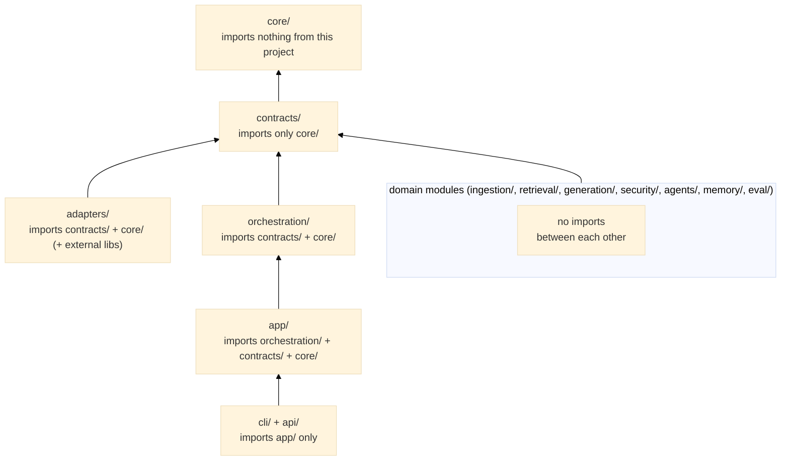

# Module Model — Layer Boundaries

This document describes the dependency architecture of the framework: what modules exist, which direction dependencies are allowed to flow, why those rules exist, and what each package exposes publicly.

---

## Module tree

```
src/modular_rag/
├── contracts/          ← Protocols (interfaces). Nothing else depends on these except adapters + domain modules.
│   ├── chunking.py         Chunker protocol
│   ├── embedding.py        Embedder protocol (sync + async)
│   ├── storage.py          Indexer, Retriever, Storage protocols
│   ├── generation.py       Generator, Reranker protocols
│   ├── security.py         SecurityGuard, Redactor, GuardResult
│   ├── evaluation.py       Evaluator protocol
│   ├── telemetry.py        Telemetry protocol
│   ├── memory.py           KnowledgeGraphStore protocol
│   └── manifest.py         ManifestLoader, PipelineManifest
│
├── core/               ← Shared, depended on by all. Imports NOTHING from this project.
│   ├── models/             Domain entities (Pydantic v2, see data-model.md)
│   │   ├── document.py
│   │   ├── chunk.py
│   │   ├── query.py
│   │   ├── retrieved.py
│   │   ├── answer.py
│   │   ├── trace.py
│   │   ├── policy.py
│   │   └── metrics.py
│   ├── enums.py            StrEnum definitions (Modality, RetrievalMethod, etc.)
│   ├── ids.py              new_id() → ULID, short_id() → 8-char slug
│   └── errors.py           Exception hierarchy rooted at ModularRAGError
│
├── adapters/           ← External bindings. Implements contracts/. May import heavy deps.
│   ├── embeddings/
│   │   ├── openai_embedder.py    OpenAIEmbedder (batched sync + async)
│   │   └── hf_embedder.py        HuggingFaceEmbedder (sentence-transformers)
│   ├── vectorstores/
│   │   └── qdrant_store.py       QdrantStore (Indexer + low-level Retriever)
│   ├── llms/               (placeholder — OpenAI/Anthropic generators)
│   ├── auth/               (placeholder — API key / OAuth validation)
│   ├── graphstores/        (placeholder — Neo4j / NetworkX graph backend)
│   └── search/             (placeholder — web search tools)
│
├── ingestion/          ← Domain module: file → Document → Chunk
│   ├── parsers/
│   │   ├── text.py         TextParser (.txt, .md, .html)
│   │   └── pdf.py          PDFParser (.pdf via PyMuPDF, lazy import)
│   ├── chunkers/
│   │   ├── fixed.py        FixedSizeChunker (token window + overlap)
│   │   └── adaptive.py     AdaptiveChunker (splits on Markdown headings)
│   ├── normalizers/
│   │   └── text.py         TextNormalizer (whitespace, newlines)
│   └── enrichers/
│       └── metadata.py     MetadataEnricher (word count, language)
│
├── retrieval/          ← Domain module: Query → list[RetrievedChunk]
│   ├── bm25.py             BM25Retriever (rank-bm25, lazy import)
│   ├── vector.py           VectorRetriever (wired store + Embedder)
│   └── fusion.py           ReciprocRankFusion (rrf_k=60)
│
├── generation/         ← Domain module: context → Answer
│   └── openai_gen.py       OpenAIGenerator (lazy openai import)
│
├── security/           ← Domain module: guard + redact + policy
│   ├── filters/
│   │   └── basic_guard.py  BasicSecurityGuard (injection patterns, blocked terms)
│   ├── detectors/
│   │   └── adversarial.py  AdversarialDetector (V2 — exfiltration, poisoning)
│   ├── redaction/
│   │   └── patterns.py     PatternRedactor (email, phone, IBAN, API key)
│   └── policies/
│       └── policy_engine.py PolicyEngine (V4 — evaluates PolicyRule conditions)
│
├── eval/               ← Domain module: Answer × ground truth → Metrics
│   └── exact_match.py      ExactMatchEvaluator (token-level P/R)
│
├── memory/             ← Domain module: persistent knowledge graph (V3)
│   └── graph/
│       └── knowledge_graph.py KnowledgeGraph (in-memory, plain dict/list — not NetworkX,
│                              despite an earlier version of this diagram; retained with a
│                              caveat in Lot 17, see docs/refactoring-plan.md)
│
├── agents/             ← engine-delegation adapter integration (ADR-0005 §5.2), not a
│                          native multi-agent runtime — the five prototype agent classes this
│                          diagram used to list here were removed in Lot 17 (zero test
│                          coverage, zero consumers; docs/refactoring-plan.md)
│
├── observability/      ← Domain module: structured logging + telemetry
│   └── telemetry.py        StructlogTelemetry, NullTelemetry
│
├── orchestration/      ← Runtime logic: compiles manifests, runs pipelines
│   ├── engine.py           RAGEngine (ingest, answer, retrieve)
│   ├── registry.py         ComponentRegistry (_default_factories map)
│   └── state_machine.py    StateMachine (tracks pipeline state transitions)
│   # router.py/flow_compiler.py removed in Lot 17 — zero consumers; RAGEngine constructed a
│   # QueryRouter but never called .route() on it. docs/refactoring-plan.md.
│
├── app/                ← Process-level wiring
│   ├── bootstrap.py        load_manifest() → wire() → RAGEngine
│   ├── container.py        Container (holds wired component instances)
│   ├── settings.py         Settings (pydantic-settings, reads env vars)
│   └── lifecycle.py        Startup / shutdown hooks
│
├── cli/                ← User-facing: Typer CLI
│   └── main.py             `mrag ask`, `mrag ingest`, `mrag version`
│
└── api/                ← User-facing: FastAPI REST API
    ├── app.py              create_app() factory
    └── routes/             /health, /answer, /retrieve endpoints
```

---

## Dependency rule — and why it exists



> Note: `orchestration/` imports only `contracts/` + `core/` — it never imports `app/`.
> This matches [CLAUDE.md](../../CLAUDE.md) section 02 (`app/ → orchestration/ →
> contracts/ + core/`). A previous version of this document listed `+ app/` on the
> `orchestration/` line, which would have created a circular import; corrected here.

**Why the rule exists — a concrete example:**

> Suppose `retrieval/vector.py` imported from `generation/openai_gen.py` to check whether the model supports embeddings. A unit test for `VectorRetriever` would then require a valid OpenAI API key, even though retrieval has nothing to do with text generation. The dependency rule eliminates this hidden coupling: retrievers and generators only communicate through `core/models/` types and `contracts/` protocols, wired at startup by the container.

A second example: if `security/filters/basic_guard.py` imported from `ingestion/parsers/text.py` to parse the query, then adding a new parser would require touching the security module — the change radius would be unpredictable. With the rule, the security module depends only on `Query` (a `core/models/` type) and `contracts/security.py`.

---

## The adapter pattern — why `adapters/` is separate

Domain modules (`retrieval/`, `generation/`, etc.) implement contracts and use `core/models/` types. They must be testable without installing heavy external libraries.

`adapters/` is where external library dependencies live. For example:
- `adapters/embeddings/hf_embedder.py` depends on `sentence-transformers` (a 2 GB download). If this code lived in `retrieval/`, every test of `BM25Retriever` would require `sentence-transformers` to be installed.
- `adapters/vectorstores/qdrant_store.py` depends on `qdrant-client`. If this lived in `retrieval/`, `VectorRetriever` would be permanently coupled to Qdrant.

By isolating heavy deps in `adapters/`, domain modules stay dependency-light and testable in isolation. The `ComponentRegistry` wires the right adapter at startup based on the manifest.

---

## Public API per package

What each package exports from its `__init__.py` (what downstream code should import):

| Package | Public exports |
|---|---|
| `contracts/` | `Chunker`, `Embedder`, `Indexer`, `Retriever`, `Reranker`, `Generator`, `SecurityGuard`, `Redactor`, `GuardResult`, `Evaluator`, `Telemetry`, `Storage`, `ManifestLoader`, `PipelineManifest` |
| `core/models/` | `Document`, `Chunk`, `Query`, `RetrievedChunk`, `Citation`, `Answer`, `TraceStep`, `Trace`, `PolicyRule`, `Policy`, `Metrics` |
| `core/` | `Modality`, `RetrievalMethod`, `ChunkingStrategy`, `PolicyAction`, `GraphRelation`, `ModularRAGError` (+ subclasses) |

`contracts.planning` (`Planner`/`ExecutionPlan`/`ExecutionStep`), `contracts.agents`
(`Agent`/`AgentResult`/`AgentTask`), and `core.enums.RoutingStrategy`/`AgentRole` were removed
in Lot 17 (`docs/refactoring-plan.md`) — zero consumers, superseded by ADR-0005 §5.2's
delegation decision.
| `ingestion/` | `TextParser`, `PDFParser`, `FixedSizeChunker`, `AdaptiveChunker`, `TextNormalizer`, `MetadataEnricher`, `ingest_path` |
| `retrieval/` | `BM25Retriever`, `VectorRetriever`, `ReciprocRankFusion` |
| `security/` | `BasicSecurityGuard`, `PatternRedactor` |
| `eval/` | `ExactMatchEvaluator` |
| `memory/` | `KnowledgeGraph` |
| `orchestration/` | `RAGEngine`, `ComponentRegistry` |
| `app/` | `bootstrap`, `Settings` |

---

## Forbidden import examples

These three patterns break the architectural invariants and are prohibited:

**1. Domain module imports another domain module**
```python
# retrieval/vector.py  ← FORBIDDEN
from modular_rag.generation.openai_gen import OpenAIGenerator  # ✗

# Why forbidden: couples retrieval tests to an LLM client.
# Correct: generator is injected via Container at startup.
```

**2. `contracts/` imports from a domain module**
```python
# contracts/chunking.py  ← FORBIDDEN
from modular_rag.ingestion.chunkers.fixed import FixedSizeChunker  # ✗

# Why forbidden: contracts are the stable interface layer.
# Importing an implementation inverts the dependency.
# Correct: contracts import only typing, core/models/, and other contracts.
```

**3. `core/models/` imports from `contracts/` or any domain module**
```python
# core/models/chunk.py  ← FORBIDDEN
from modular_rag.contracts.chunking import Chunker  # ✗

# Why forbidden: core/models/ is the lowest layer; it must be importable
# by every other module. A circular dependency would be created.
# Correct: core/models/ imports only Python stdlib and pydantic.
```
