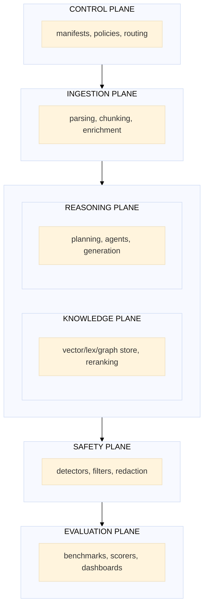
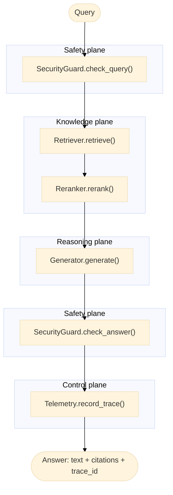
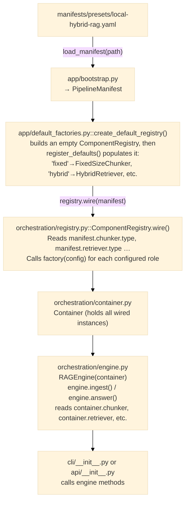
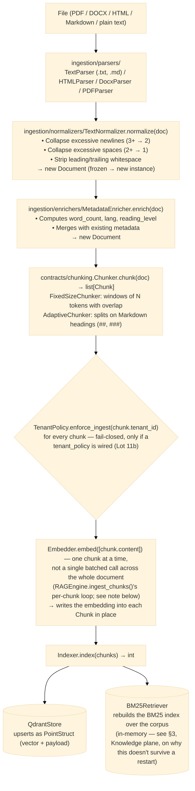
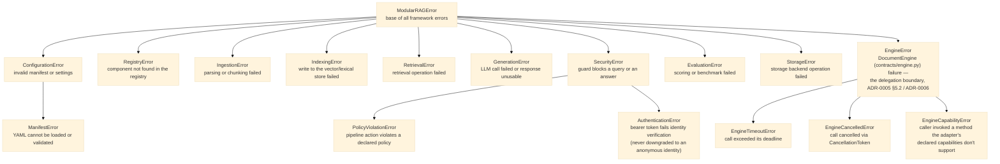

# Architecture Overview — Modular RAG Framework

> This document is the technical specification (cahier technique) for the framework — the
> document a new maintainer should read cover-to-cover before touching orchestration, contracts,
> or the manifest schema. It answers *what* each piece is, *why* it exists in this shape, *how*
> it fits together, and *where* to go for even more depth (per-file listings live in
> [`module-model.md`](module-model.md); the full domain-model field reference lives in
> [`data-model.md`](data-model.md); a sequence-diagram view of the same execution flows described
> here lives in [`runtime-flow.md`](runtime-flow.md)).

---

## 1. Purpose

This framework provides a **context OS** for RAG and agentic systems: an engine-neutral control
plane over knowledge, governance, and observability, built around three pillars:

1. **Declarative orchestration** — pipelines are described in YAML (manifests), not in imperative
   Python. See §9 below for the full manifest → running pipeline path, and the root
   [`README.md`](../../README.md#4-the-registry--manifests--how-components-become-a-running-pipeline)
   for why this is a deliberate governance mechanism, not just configuration convenience.
2. **Composable retrieval** — chunking, embedding, indexing, fusion, and reranking are swappable
   contracts (§6). Swapping Qdrant for a future vector store, or `sentence-transformers` for a
   hosted embedding API, changes one manifest line and zero application code.
3. **Engine-neutral execution** — a vendor-neutral `DocumentEngine` port (`contracts/engine.py`)
   selects the native sequential engine or an external engine adapter (LangGraph,
   [ADR-0006](../adr/0006-external-engine-selection.md)) with explicit, validated control-plane
   capability differences; per
   [ADR-0005](../adr/0005-document-ai-control-plane-boundary.md), generic multi-agent
   orchestration is delegated to that external engine, not built as a native specialized-agent
   runtime.

**Who this document is for.** Anyone about to modify `orchestration/`, `contracts/`, or the
manifest schema itself; anyone reviewing a pull request that touches layer boundaries; anyone
deciding whether a new capability belongs in this framework natively or should be delegated to
the external engine per ADR-0005. If you are only *using* the framework (writing manifests,
calling the CLI/API), the [getting-started guide](../guides/getting-started.md) and
[plugin-development guide](../guides/plugin-development.md) are more direct paths — come back
here when you need to understand *why* something works the way it does, not just *how* to use it.

---

## 2. Guiding principles

| Principle | Implication | Why this principle, specifically |
|---|---|---|
| **Strict modularity** | Every major capability is a contract (`typing.Protocol`) | A framework used across many client engagements accumulates adapters faster than any single team can review them. Modularity by contract means a new adapter's correctness is checked structurally (`isinstance()` against the Protocol, enforced in `tests/contract/`) rather than by trusting every contributor read every other adapter's code. |
| **Loose coupling** | The orchestrator depends on interfaces, never on concrete implementations | `orchestration/engine.py` never imports `QdrantStore` or `OpenAIGenerator` by name — only `Container.indexer`/`Container.generator`, typed against the Protocol. This is what makes `scripts/check_layering.py`'s static enforcement possible: if orchestration *could* import a concrete adapter, the layering rule would be unenforceable by tooling and would degrade to a code-review convention, exactly the failure mode described in the root README's [Core Concepts §1](../../README.md#1-hexagonal-ports-and-adapters-architecture--what-and-why). |
| **Native evaluation** | A standalone measurement contract exists (`contracts/evaluation.py`'s `Evaluator`) — not, as an earlier version of this row claimed, one measurement protocol per building block | A RAG pipeline's failure modes (hallucination, missed context, cost blowup) are invisible without measurement, and are the single most common reason a client-facing RAG deployment gets pulled back after launch. `Evaluator.evaluate(query, answer, expected, context) -> Metrics` scores a completed run as a whole; retrievers and generators do not each implement their own per-component metric Protocol — see [data-model.md](data-model.md#metrics) for what `Metrics` actually covers today, and V1.1 in `ROADMAP.md` for what's still open (NDCG, populated golden sets). |
| **Secure by default** | Input filtering and guardrails run upstream of reasoning | The security guard's `check_query()` runs *before* retrieval, not after generation. A prompt-injection attempt that is denied before retrieval never has the chance to influence which context gets retrieved in the first place — running the guard after generation would only catch the attack after it already shaped the answer. |
| **Native observability** | Framework traces, live spans and operational metrics are separate, optional signals | `TraceStep` coverage is specific (`guard_query`, `retrieve`, optional `rerank`, `generate`); optional `Telemetry` records the resulting `Trace`. ADR-0012/0013 add manifest-activatable OTel `Tracer` and `Meter` ports at orchestration/application/API boundaries. No shipped preset enables them, and readiness/review gauges have documented sampling limitations — see [observability.md](../guides/observability.md). |
| **Progressive rollout** | Advanced features (graph, governance, multimodal) stay optional until stabilized | Every governed component (`tenant_policy`, `audit_sink`, `policy_engine`, `redactor`, `review_queue`, `reranker`) is optional in `Container` and no-ops when absent. This lets `manifests/presets/local-hybrid-rag.yaml` (a minimal local-dev pipeline) and `manifests/presets/secure-enterprise-rag.yaml` (the full governance stack) run through the **identical** `RAGEngine._run_steps()` code path — the enterprise manifest does not fork the pipeline logic, it only adds components that were already conditionally supported. |

---

## 3. The system's six planes



The diagram above shows the *conceptual* flow of a request through the six planes. It is a
simplification for orientation purposes — the real, code-accurate sequencing (which plane's
components run in what order, including the safety plane running *before* the knowledge plane on
the query side, not only after) is given in §5's execution-flow diagram and, in full detail, in
[`runtime-flow.md`](runtime-flow.md). Treat this section as "what each plane owns," not "the
literal call order."

Each plane below is described with: **role** (what problem it solves), **responsibilities**
(what it does and does not own), **primary contracts** (which Protocols live here),
**dependencies** (what it's allowed to depend on, per the hexagonal layering rule), **lifecycle**
(when its components are constructed/used/released), **extension points** (how you add to it),
and **limits/constraints** (what it deliberately does not do today).

### Control plane

- **Role.** Own the pipeline's *topology and governance posture* — what components are wired,
  what policies apply, what gets audited — as data (a manifest), not as code paths scattered
  across the application.
- **Responsibilities.** Manifest schema and validation (`contracts/manifests.py`,
  `app/config_resolution.py`); component registry and wiring (`orchestration/registry.py`,
  `app/default_factories.py`); policy-as-code enforcement (`security/policies/policy_engine.py`);
  routing between the native engine and delegated engines (`app/bootstrap.py::load_engine()`).
- **Primary contracts.** `ManifestLoader`, and indirectly every other contract, since the control
  plane is what wires all of them together.
- **Dependencies.** `orchestration/` and `app/` — the only layers allowed to see every other
  layer at once (the composition root, per the hexagonal rule in
  [module-model.md](module-model.md)).
- **Lifecycle.** A manifest is loaded and validated once per process (`load_manifest()` /
  `resolve_manifest()`), wired once into a `Container` (`ComponentRegistry.wire()`), and the
  resulting `Container` lives for the process's lifetime — there is no hot-reload of a manifest
  today; changing a manifest requires restarting the process that loaded it.
- **Extension points.** New component *types* are added by registering a factory in
  `app/default_factories.py::register_defaults()` (see §9). New manifest *sections* (a genuinely
  new governance concept, not a new implementation of an existing role) require a schema change
  to `contracts/manifests.py` and, per `CLAUDE.md` §07, an ADR.
- **Limits.** No dynamic/conditional manifest logic (no "if environment == prod, use X" inside a
  manifest) — different environments get different manifest *files*, not one manifest with
  branches. This is deliberate: a manifest's entire point is to be a flat, diffable statement of
  what runs, and conditional logic would reintroduce the "you have to read code to know what's
  configured" problem manifests exist to solve.

### Ingestion plane

- **Role.** Turn arbitrary source material (files, in a variety of formats) into the framework's
  internal `Chunk` representation, ready for embedding and indexing.
- **Responsibilities.** File parsing (`ingestion/parsers/` — PDF via PyMuPDF, Word, HTML,
  Markdown, plain text), text normalization (`ingestion/normalizers/` — whitespace/newline
  collapsing), metadata enrichment (`ingestion/enrichers/` — word count, language detection,
  reading level), and chunking strategy (`ingestion/chunkers/` — fixed-size windows vs.
  Markdown-heading-adaptive splitting).
- **Primary contracts.** `Parser`, `Chunker`.
- **Dependencies.** `contracts/` + `core/models/` only — no dependency on `retrieval/`,
  `generation/`, or any other domain module (the "domain modules never import each other" rule).
  Notably, ingestion does **not** depend on `Embedder` — embedding is not an ingestion-plane
  responsibility; see §10 for exactly where it happens instead and why that boundary is drawn
  there.
- **Lifecycle.** Ingestion components are stateless per-call: a `Chunker` instance can be reused
  across many `chunk()` calls with no accumulated state (unlike, say, `BM25Retriever`, which does
  accumulate an in-memory index — that statefulness lives in the knowledge plane, not here).
- **Extension points.** A new file format is a new `Parser` implementation (`supports(path)` +
  `parse(path) → Document`), added to `ingestion/pipelines/default.py::_PARSERS`; parsers are not
  manifest/registry roles today. A new chunking strategy is a new
  `Chunker` implementation. See
  [`docs/guides/plugin-development.md`](../guides/plugin-development.md) for the full worked
  example of adding a chunker.
- **Limits.** Ingestion is currently synchronous and single-document-at-a-time from the caller's
  perspective (`ingest_path`/`ingest_directory` loop over files); there is no built-in
  parallel/batched ingestion pipeline for very large corpora today.

### Knowledge plane

- **Role.** Store and retrieve `Chunk`s efficiently — the framework's "where facts live" layer.
- **Responsibilities.** Vector storage and similarity search (`adapters/vectorstores/` — Qdrant
  today), lexical/keyword search (`retrieval/retrievers/bm25.py`), fusion of the two
  (`retrieval/fusion/rrf.py`, §11), and reranking of fused results
  (`retrieval/rerankers/cross_encoder.py`). A graph store is a stubbed, not-yet-populated
  extension point (`adapters/graphstores/`, per ADR-0005/0006 — see §4, V3).
- **Primary contracts.** `Indexer` (and its narrower `VectorIndexer` sub-protocol, §6),
  `Retriever`, `Reranker`.
- **Dependencies.** `adapters/` (owns the only permitted imports of `qdrant-client`, lazily) +
  `retrieval/` (pure fusion/orchestration logic, no external library imports of its own).
- **Lifecycle.** The lexical/BM25 leg's persistence is now selectable, not fixed —
  `HybridRetriever`'s `retriever.config.lexical` manifest key picks between two backends:
  - `"bm25-memory"` (the default) — `BM25Retriever`, an **in-memory Python object** whose index
    is rebuilt from nothing every time a new process starts, lost when the process exits. The
    local development preset's choice.
  - `"sparse-qdrant"` — `PersistentSparseRetriever`, backed by a dedicated Qdrant sparse-vector
    collection via `adapters/vectorstores/qdrant_sparse_store.py`'s `QdrantSparseStore`. A real,
    persistent server, same durability property as `QdrantStore`'s dense collection. The
    enterprise/secure preset's choice.

  `HybridRetriever` silently degrades to vector-only results when its lexical leg returns nothing
  (see `HybridRetriever.retrieve()`'s `if not lexical_hits:` branch), and now also records *why*
  via `last_degraded_sources` (a genuine backend failure vs. a legitimate empty result). This is
  why a fresh `mrag ask` CLI invocation after a separate `mrag ingest` process, on the
  `bm25-memory` default, gets vector-only results rather than an error: the degradation is
  deliberate and documented, not a bug. A manifest that needs the lexical leg to survive process
  boundaries should set `lexical: sparse-qdrant` instead of working around the in-memory default.
- **Extension points.** A new vector store implements `VectorIndexer` (see
  [ADR-0009](../adr/0009-vector-indexer-dimension-reconciliation.md) for the exact contract a
  dimension-aware store must satisfy). A new reranking strategy implements `Reranker`.
- **Limits.** `bm25-memory` (still the default, for zero-infrastructure local development) does
  not survive process restarts or share state across workers — that limitation is inherent to it,
  not a missing feature. A deployment that needs the lexical leg to survive those should select
  `lexical: sparse-qdrant` (`manifests/presets/secure-enterprise-rag.yaml` does this) rather than
  supplying its own external backend, which is no longer the only option. `sparse-qdrant` itself
  requires Qdrant client and server **1.10+** (`Modifier.IDF`/`query_points()` are not present in
  1.9).

  Not yet proven by this repo's own tests: persistence across an actual Qdrant server restart and
  consistency across a real multi-node replica set (the existing tests use multiple client
  connections against one single-node server, not a real restart/cluster).

### Reasoning plane

- **Role.** Turn retrieved context into a grounded, cited answer.
- **Responsibilities.** Prompt construction and LLM invocation (`generation/synthesizers/`),
  citation building (`generation/citations/builder.py`), and a cheap lexical-support gate
  (`generation/validators/groundedness.py` — explicitly **not** a faithfulness metric; see that
  module's own docstring for the distinction and the research citation backing it).
- **Primary contracts.** `Generator`.
- **Dependencies.** `contracts/` + `core/models/` (for the native generators); `adapters/llms/`
  for anything that would need a heavy external SDK (the delegated-engine adapter target, per
  ADR-0005 §5.2 — see §1 above).
- **Lifecycle.** Stateless per-call, like the ingestion plane, with one exception worth knowing:
  `OpenAIGenerator`/`AnthropicGenerator` lazily construct and cache their SDK client on first use
  (`_get_client()`), and expose a `close()` method to release it — `Container.close()` calls
  `close()` on every component that defines one, so a wired generator's client is released when
  the application shuts down.
- **Extension points.** A new LLM provider, or a deterministic/no-external-dependency generator
  for tests (see `generation/synthesizers/deterministic_gen.py`, added specifically so an
  end-to-end test scenario can prove citation and governance behavior without an API key), is a
  new `Generator` implementation.
- **Limits.** Per ADR-0005 §5.2, this plane does **not** host a native multi-agent
  planner/executor — multi-step reasoning that requires an agent loop is delegated to the
  external engine via the `DocumentEngine` port (§1, §4 V2). Do not add agent-loop logic here;
  see [`.claude/rules/agents.md`](../../.claude/rules/agents.md) for the current, accurate scope
  of what belongs in `agents/` today.

### Safety plane

- **Role.** Prevent unsafe queries from reaching the reasoning plane, and unsafe/leaking content
  from reaching the caller.
- **Responsibilities.** Prompt-injection and poison-marker detection
  (`security/filters/basic_guard.py`), PII/secret redaction (`security/redaction/patterns.py`),
  tenant isolation enforcement (`security/policies/tenant_isolation.py`), and policy-as-code
  evaluation (`security/policies/policy_engine.py`). See the root README's [Core Concepts
  §6](../../README.md#6-the-governance-stack--tenant-isolation-audit-redaction-policy-as-code) for
  why this plane is the framework's stated competitive differentiator, and
  [`threat-model.md`](threat-model.md) for the specific attack scenarios each mechanism defends
  against.
- **Primary contracts.** `SecurityGuard`, `Redactor`, `TenantPolicy`.
- **Dependencies.** `contracts/` + `core/models/` only. **Never** `ingestion/`, `retrieval/`, or
  `generation/` — `.claude/rules/security.md`'s single most emphasized rule, because a safety
  component that could reach into retrieval logic would defeat the entire point of running safety
  checks *before* retrieval happens.
- **Lifecycle.** Stateless per-call. Every safety component is optional in `Container` and
  no-ops when absent — a manifest with no `security:` section and no `governance:` section runs
  the identical pipeline code path with these checks simply skipped, never crashing on their
  absence.
- **Extension points.** A new guard is a new `SecurityGuard` implementation
  (`check_query`/`check_answer`); a new redaction pattern is added to `PatternRedactor` (with a
  matching entry in `tests/unit/security/test_redaction.py`, per `.claude/rules/security.md`).
- **Limits.** `BasicSecurityGuard`'s injection detection is regex-based and explicitly documented
  as a first line of defense only — see that class's own docstring for the research citations
  explaining why pattern matching alone cannot catch every prompt-injection variant, and what
  layer (semantic/role-aware checks) would be needed to close that gap. Do not treat passing the
  current guard as proof a query is safe; treat it as proof the *known, pattern-matchable* attack
  classes were checked.

### Evaluation plane

- **Role.** Measure pipeline quality against ground truth, offline — not as an online blocking
  gate for ordinary production traffic.
- **Responsibilities.** Exact-match and retrieval-quality scoring (`eval/scorers/`), benchmark
  execution (`eval/runners/benchmark.py`), and a programmatic quality gate
  (`contracts/manifests.py::QualitySection`) that is explicitly **not** wired into the online
  answer path — see [ADR-0008](../adr/0008-offline-evaluation-and-engine-activation.md) for why:
  exact-match evaluation requires a gold answer, which an ordinary production question does not
  have, so a manifest declaring `evaluation:` or `quality.gate:` fails validation rather than
  silently constructing components nothing will ever call correctly.
- **Primary contracts.** `Evaluator`, `AnswerEngine` (the minimal QA-engine interface evaluation
  runners consume — deliberately narrower than the full `DocumentEngine` port, since a golden-set
  runner only needs `.answer(question) → Answer`, not streaming/cancellation/capability
  negotiation).
- **Dependencies.** `contracts/` + `core/models/` only.
- **Lifecycle.** Evaluation runs are batch, offline, developer/CI-triggered — not part of any
  request's runtime path.
- **Extension points.** A new metric is a new `Evaluator` implementation.
- **Limits.** No online quality-gate blocking of production answers exists today, by design (see
  ADR-0008); adding one would require an online metric with no gold-answer dependency, which does
  not currently exist in this codebase.

---

## 4. Roadmap V1 → V5

This section describes the **target** state of each version — what it is meant to enable
once complete, independent of what's already delivered today. For the real state (which
boxes are checked), see [ROADMAP.md](../../ROADMAP.md); for the same progression told
without technical jargon, see [docs/onboarding.md](../onboarding.md), section 3. The five
versions are not independent batches — each builds on the pipeline built by the previous one
rather than replacing it.

> **ADR-0005 note (2026-08-04):** V1.1/V1.2/V2.0 below build natively as described. V2.1
> (multi-agent teams), V3.0 (GraphRAG traversal), V3.2 (fine-tuning execution), and V5.0
> (multimodal execution) are **delegated** to the selected external engine (LangGraph) via the
> `DocumentEngine` port, not built as native runtimes — see
> [ADR-0005](../adr/0005-document-ai-control-plane-boundary.md) §5.2.

### V1 — Core RAG
**What the framework enables:**
- Source ingestion (files, folders) with parsing (PDF, Word, HTML, Markdown, plain text).
- Optimized chunking (fixed-size, section-adaptive).
- Hybrid dense + lexical search (vector + BM25) with RRF fusion.
- Cross-encoder reranking.
- Grounded generation (citations, groundedness) via OpenAI or Anthropic — or a fully
  deterministic, no-external-key generator/embedder pair for testing and offline demos (see
  `adapters/embeddings/deterministic_embedder.py`, `generation/synthesizers/deterministic_gen.py`).
- Basic security: query filtering, injection detection, PII redaction.
- Native evaluation: exact match, recall@k, MRR.
- Exposure via HTTP API (FastAPI) and CLI (`mrag ask`, `mrag ingest`).
- Reproducible configuration through versioned YAML manifests.

### V2 — Policy Engine + Delegated Orchestration
**Additions:**
- Policy-as-code (native): inline manifest rules and multi-tenant isolation. Roles are propagated
  in `ExecutionContext`, but RBAC enforcement and classification-aware rules are not implemented.
- Multi-agent orchestration, adaptive routing, and multi-step agentic workflows: delegated to
  the selected external engine via the `DocumentEngine` port — not built natively. See
  [ADR-0005](../adr/0005-document-ai-control-plane-boundary.md) §5.2. The LangGraph adapter
  (`LangGraphEngineAdapter`) is implemented and selectable today via `engine.adapter: langgraph`
  in a manifest, but currently runs a fixed route → retrieve → guard → generate graph rather than
  the delegated multi-agent behaviours — see `manifests/presets/langgraph-rag.yaml`.

### V3 — GraphRAG (Delegated) + Cost/Fine-Tuning Evidence (Native)
**Additions:**
- GraphRAG traversal/reasoning: delegated to the selected external engine — not built natively.
  The unused native knowledge-graph data model was removed in Étape 8.
- Cost/latency evidence and reporting (native): aggregate OTel latency/token/estimated-cost metrics
  and a reference dashboard exist; per-query/user/month attribution and anomaly detection do not.
  Routing logic itself remains delegated.
- Drift detection and evaluation trigger (native): decides *when* retraining is needed;
  fine-tuning execution itself is delegated.

### V4 — Governance
**Additions:**
- Policy-as-code: YAML rules versioned in Git, enforced at runtime.
- Multi-tenant: separate context domains (finance, HR, legal…).
- Multi-environment: dev / staging / prod with progressively stricter policies.
- Full audit: who accessed what, when, with which result.
- Human-in-the-loop: human validation for sensitive answers.
- Per-pipeline risk profiles.

### V5 — Multimodal (Delegated)
**Additions:**
- VLM execution (image/table/audio/video model inference, modality-specialized agents):
  delegated to the selected external engine via the `DocumentEngine` port — not built natively.
- Multimodal parsing and citation enrichment (extracting images/tables, attaching timecodes)
  may remain native if Lot 6/15 evidence supports it — undecided.

---

## 5. V1 execution flow (simple RAG)



This is the *minimal* V1 flow — a manifest with no `governance:` section runs exactly this. The
**full** flow, as actually implemented in `RAGEngine._run_steps()` and exercised by
`manifests/presets/secure-enterprise-rag.yaml`, inserts three more steps that this simplified
diagram omits for readability: a tenant-identity check (before `G1`, fail-closed — denies
outright if no `tenant_id` is present, see the root README's [Core Concepts
§6](../../README.md#6-the-governance-stack--tenant-isolation-audit-redaction-policy-as-code)), a
policy-engine evaluation (also before `G1`), and a tenant-scoped context filter (between `Ret`
and `Rer`, dropping any chunk that does not belong to the requesting tenant — a second,
defense-in-depth layer on top of the vector store's own server-side tenant filter). Every one of
these three additional steps is a no-op when its governing manifest section is absent, which is
exactly why the minimal diagram above is not "wrong" for a local-dev manifest — it is that
manifest's actual, complete execution path.

For the same flow drawn as a sequence diagram across actors (`RAGEngine`, `SecurityGuard`,
`Retriever`, `Reranker`, `Generator`, `Telemetry`), see
[runtime-flow.md](runtime-flow.md), "V1 — Simple RAG (query path)".

---

## 6. Founding contracts

The contracts in `src/modular_rag/contracts/` are the framework's immutable core. Every
implementation — internal or external — must satisfy these Protocols. Every entry below is a
`typing.Protocol`, checked structurally via `isinstance()` (see the root README's [Core Concepts
§2](../../README.md#2-contracts--typingprotocol-not-abstract-base-classes) for why Protocol was
chosen over `abc.ABC`); the signature column is simplified for readability — most contracts also
define an `async` twin of their main method (`aembed`/`aretrieve`/`agenerate`, etc.) and a
`name() -> str` identifier method not shown here. Read the actual file under
`src/modular_rag/contracts/` for the complete, authoritative signature before implementing one.

| Contract | Role | V |
|---|---|---|
| `Chunker` | `chunk(doc) → [Chunk]` | V1 |
| `Parser` | `supports(path) → bool` / `parse(path) → Document` | V1 |
| `Embedder` | `embed(texts) → [[float]]` | V1 |
| `Indexer` | `index(chunks)` / `delete(ids)` / `clear()` / `list_ids()` | V1 |
| `VectorIndexer` | `Indexer` + `bind_embedder(embedder)` / `ensure_vector_size(dimensions)` — the narrower, opt-in sub-protocol a dimension-sensitive store (Qdrant) implements so its collection's vector size is always derived from or validated against the wired embedder, never a silent wrong default | V1 ([ADR-0009](../adr/0009-vector-indexer-dimension-reconciliation.md)) |
| `Retriever` | `retrieve(query, k) → [RetrievedChunk]` | V1 |
| `Reranker` | `rerank(query, chunks, k) → [RetrievedChunk]` | V1 |
| `Generator` | `generate(query, context, trace) → Answer` | V1 |
| `SecurityGuard` | `check_query(query)` / `check_answer(answer)` | V1 |
| `Evaluator` | `evaluate(query, answer, expected, context) → Metrics` | V1 |
| `AnswerEngine` | `answer(question, **kwargs) → Answer` — the minimal QA-engine interface offline evaluation runners consume, deliberately narrower than `DocumentEngine` | V1 |
| `TenantPolicy` | `enforce_query(query)` / `enforce_ingest(tenant_id)` / `filter_chunks(tenant_id, chunks)` | V1 (Lot 11b) |
| `TokenVerifier` | `verify(token) → TenantContext` — the identity-verification boundary consumed by `create_app(token_verifier=...)`; must raise `AuthenticationError` on any invalid token, never return a placeholder identity | V1 (Lot 11b) |
| `DocumentEngine` | `run(request, context) → EngineResult` | V1 (Lot 7 — native and LangGraph adapters) |
| `Telemetry` | `record_trace(trace)` | V1 |
| `Tracer` / `Span` | Live distributed spans (`start_span`, attributes, errors, end) | ADR-0012 |
| `Meter` | Operational counters, histograms and gauges | ADR-0013 |
| `AuditSink` | `record(event)` | V1 (Lot 10) |
| `LifecycleLedger` | `record_ingested`/`tombstone`/`export_all` | V1 (Lot 12a) |
| `ReviewQueue` | `should_review(answer) → bool` / `enqueue(item)` / `resolve(id, approved, reviewer)` | V1 (Lot 11c) |
| `SecretResolver` | `resolve(name) → str` — resolves a `secret://<name>` reference found in a manifest's raw YAML | V1 (Lot 9) |
| `Storage` | `put/get/delete/exists` | V1 |
| `Redactor` | `redact(text) → str` | V1 |
| `ManifestLoader` | `load(path) → PipelineManifest` | V1 |

`Planner` (`plan(query) → ExecutionPlan`) and `Agent` (`run(task) → AgentResult`) were removed
in Lot 17 (`docs/refactoring-plan.md`) — zero implementations, zero consumers, superseded by the
`DocumentEngine` delegation port above.

---

## 7. Architecture decisions

See the ADRs in `docs/adr/` (`_index.md` is the authoritative, maintained index — the list below
is a curated subset for orientation, and can lag the index; always check `_index.md` for the
current full set and superseding relationships):

- [ADR-0001](../adr/0001-modular-architecture.md) — Six planes, contracts/implementations separation
- [ADR-0002](../adr/0002-contracts-and-plugins.md) — Protocols + Factory Registry
- [ADR-0003](../adr/0003-security-and-governance.md) — Safety vs Security, policy-as-code
- [ADR-0005](../adr/0005-document-ai-control-plane-boundary.md) — Owned-vs-delegated product boundary (accepted 2026-08-04); partially supersedes [ADR-0004](../adr/0004-strategic-features-v1-v5.md)
- [ADR-0006](../adr/0006-external-engine-selection.md) — LangGraph selected as the external `DocumentEngine` adapter target
- [ADR-0007](../adr/0007-layer-boundaries-and-control-plane-activation.md) — The concrete dependency model and activation path that makes ADR-0005 operational: a capability is not delivered merely because its class exists, it must be reachable, wired, and tested
- [ADR-0008](../adr/0008-offline-evaluation-and-engine-activation.md) — Offline evaluation is separated from online answer execution (§3's Evaluation plane above); runtime engine capability gaps fail startup rather than silently no-opping
- [ADR-0009](../adr/0009-vector-indexer-dimension-reconciliation.md) — The `VectorIndexer` sub-protocol (§6) and the embedder/store dimension-reconciliation policy

---

## 8. Data models

The domain models are defined in `src/modular_rag/core/models/`. They are Pydantic v2 objects — no ORM, no database. See `data-model.md` for the full documentation.

| Model | File | Frozen | Usage |
|---|---|---|---|
| `Document` | `document.py` | ✓ | Ingestion unit: source, raw content, metadata |
| `Chunk` | `chunk.py` | ✗ | Sub-segment of a Document, with optional embedding |
| `Query` | `query.py` | ✓ | User query + tenant_id (Lot 11b) |
| `RetrievedChunk` | `retrieved.py` | ✓ | Chunk + score + rank + retrieval method |
| `RetrievalResult` | `retrieval_result.py` | ✗ | Return type of `retrieve()`: chunks + a real trace_id (ADR-0012) |
| `Citation` | `answer.py` | ✗ | Pointer from an answer to a source chunk |
| `Answer` | `answer.py` | ✗ | Generated text + citations + trace_id |
| `TraceStep` | `trace.py` | ✗ | Latency + tokens for one pipeline step |
| `Trace` | `trace.py` | ✗ | Full audit of an execution (accumulated via `add_step()`) |
| `PolicyRule` | `policy.py` | ✗ | Condition + action (allow/deny/redact/warn) |
| `Policy` | `policy.py` | ✗ | Set of rules scoped to a tenant |
| `Metrics` | `metrics.py` | ✗ | Evaluation scores (recall@k, MRR, groundedness…) |

**Key invariants:**
- `Document` and `Query` are immutable (`frozen=True`). Any modification produces a new instance
  (`model_copy(update={...})`). Why immutability specifically for these two: both flow through
  multiple pipeline stages that must never accidentally mutate the caller's original object.
  `ingestion/normalizers/` produces a *new* `Document` rather than editing the parsed one in
  place, so a bug in a normalizer cannot corrupt data a different, earlier stage already read.
- `Chunk.token_estimate` is a computed property (`len(content.split())`), not stored — a
  deliberately crude word-count approximation, not a real tokenizer count. Do not use it for
  anything that needs to match an LLM provider's actual token accounting (context-window
  budgeting, cost calculation).
- `Trace.add_step()` is the only way to add a step. It atomically updates the
  `total_latency_ms`, `total_input_tokens`, and `total_output_tokens` totals, which is why every
  pipeline component must call it rather than appending to `Trace.steps` directly — appending
  directly would silently desynchronize the totals from the step list; always go through
  `add_step()`.
- `Policy.sorted_rules()` returns the rules sorted by decreasing priority.
- `Metrics.summary()` returns only the non-None fields.

---

## 9. Manifest → pipeline wiring

The complete path from a YAML file to an operational pipeline:



To wire a new component:
1. Implement the corresponding contract in `contracts/` (or reuse an existing one — most new
   components are new *implementations* of an existing contract, not new contracts; see §6's
   note on when a genuinely new contract, rather than a new implementation, is warranted).
2. Register the factory in `app/default_factories.py::register_defaults()` —
   `reg.register("<role>", "<type-name>", lambda cfg: MyComponent(**cfg.config))`. This is the
   **only** place a new component type is registered; `orchestration/registry.py` itself defines
   the `ComponentRegistry` mechanism but does not contain any concrete component registrations —
   a common point of confusion for a new contributor searching for "where do I add my component,"
   worth stating explicitly here to head off.
3. Reference the type in the manifest YAML: `chunker: {type: my_chunker, config: {...}}`.

**Why the registry and the manifest are separate files/mechanisms**, rather than, say, a manifest
that directly names a Python import path to instantiate: decoupling "which type names exist" (the
registry) from "which type name a given deployment picked" (the manifest) means a manifest author
never needs to know or write a Python import path — they select from a closed, reviewable
vocabulary of registered type names.

A typo (`type: qdrnat`) fails fast and clearly (`RegistryError: No factory for role='indexer'
type='qdrnat'. Available: ['qdrant']`) rather than as an opaque `ImportError` on a malformed
dotted path.

---

## 10. Ingestion pipeline (V1 detail)



**Two things worth calling out explicitly, both easy to get wrong by reading only the diagram
shape and not the actual code in `orchestration/engine.py::ingest_chunks()`:**

1. **Embedding happens one chunk at a time, not batched.** `RAGEngine.ingest_chunks()` loops over
   chunks and calls `self._c.embedder.embed([chunk.content])[0]` inside the loop — a separate
   `embed()` call per chunk, only for chunks that don't already carry an embedding (`if
   chunk.embedding is None`).

   This matters operationally: ingesting a large document with an API-backed embedder (e.g.
   `OpenAIEmbedder`) makes as many API calls as there are chunks, not one batched call for the
   whole document — a real cost/latency consideration for large corpora that the diagram's single
   "Embed" box could otherwise hide.
2. **Tenant-isolation enforcement happens before embedding, not after.** When a `tenant_policy` is
   configured, every chunk's `tenant_id` is checked (`enforce_ingest`) before any embedding or
   indexing work starts — a chunk with no tenant identity is rejected outright, not embedded and
   then discarded.

   This ordering is deliberate: it means an ingestion run against a tenant-isolated pipeline
   either succeeds completely with every chunk properly attributed, or fails before any (possibly
   costly) embedding API calls are made for content that would have been rejected anyway.

Note: Embedding and indexing happen in `RAGEngine.ingest()`/`ingest_chunks()`, not in
`ingest_path()`/`ingest_directory()` (in `ingestion/pipelines/default.py`). The separation is
intentional — `ingest_path()`/`ingest_directory()` only parse, normalize, enrich, chunk, and
(when a `tenant_id` is given) stamp tenant identity onto each chunk; they are testable without
any external service (no Qdrant, no embedding model/API) precisely because they stop before the
embedding step. `RAGEngine.ingest_chunks()` is the boundary where a real embedder and a real
indexer become necessary.

---

## 11. Hybrid retrieval algorithm (RRF)

Hybrid retrieval combines two ranked result lists (dense vector + lexical BM25) into a single fused list via **Reciprocal Rank Fusion**:

```
RRF_score(d) = Σᵢ  1 / (rrf_k + rankᵢ(d))

  where:
    rrf_k  = 60  (smoothing constant, standard in the literature)
    rankᵢ  = rank of document d in list i (1-based)
    Σ      = sum over all result lists (vector, BM25)
```

Example with 2 lists:
```
document "Q4 revenue"
  rank_vector = 3  → 1 / (60 + 3) = 0.0159
  rank_bm25   = 1  → 1 / (60 + 1) = 0.0164
  RRF_score   = 0.0159 + 0.0164 = 0.0323
```

The vector/BM25 ratio in the `local-hybrid-rag.yaml` preset is **0.7 / 0.3**: vector results carry more weight because they capture semantics, while BM25 boosts exact matches on technical terms.

After fusion, chunks are re-ranked by decreasing `RRF_score`. A cross-encoder reranker then refines this ranking over the top-k (default: 5).

**Why RRF instead of a weighted linear combination of raw scores.** Vector cosine similarity and
BM25's score are not on comparable scales — a cosine similarity of 0.8 and a BM25 score of 12.3
cannot be meaningfully averaged without an arbitrary normalization step that itself needs tuning
per corpus.

RRF sidesteps this entirely by fusing on **rank position**, not raw score magnitude, which is
scale-invariant by construction: it only asks "was this document 1st, 2nd, 3rd… in each list,"
never "how much better was it." This is why `rrf_k = 60` (a smoothing constant controlling how
much low ranks are discounted) is the only tunable hyperparameter here, rather than a per-source
score-normalization scheme.

**What happens when one of the two retrieval sources returns nothing.**
`HybridRetriever.retrieve()` handles this explicitly rather than feeding an empty list into the
fusion formula: if BM25 returns no hits, the result is the vector list alone (re-ranked and
labeled `RetrievalMethod.VECTOR`, not `HYBRID`); symmetrically for an empty vector list. Fusion
(and the `HYBRID` label) only happens when both sources contributed at least one hit.

This is the precise mechanism behind the BM25-persistence caveat described in §3 (Knowledge
plane) and the root README's FAQ: a fresh process with an empty BM25 index does not error, it
silently returns `RetrievalMethod.VECTOR`-labeled results instead of `HYBRID`-labeled ones.

---

## 12. Error hierarchy

All framework exceptions inherit from `ModularRAGError` (defined in `core/errors.py`). The complete tree, as it exists in code today:



> **Historical note.** An earlier version of this diagram (and of `core/errors.py`) also defined
> `GraphError` (V3, graph construction/traversal) and `AgentError` (V2, native agent-task
> failure). Both were removed during the ADR-0007 stabilization pass (Étape 8): zero
> implementations raised them, zero call sites caught them, and their entire reason for existing
> — a native graph plane and a native agent runtime — is delegated per ADR-0005 rather than built
> in this repository (§1, §4). They are restorable from git history if a genuine native need for
> either ever materializes; do not reintroduce them speculatively.

**Handling rule:** catch the most specific exception possible. Only catch `ModularRAGError` at
the HTTP/CLI handler level to return a generic error response
(`api/errors.py::to_http_exception()`, `cli/__init__.py::_exit_code_for()` — both map specific
subclasses to specific status codes/exit codes; see those two functions for the authoritative
current mapping rather than assuming one). Never silently swallow a `SecurityError` — it must
always be logged, and in a governed pipeline, audited (`AuditEvent`,
`AuditEventType.GUARD_DECISION` — see §3's Safety plane and the root README's Core Concepts §6).

---

## 13. Component lifecycle — construction, wiring, use, and teardown

This section exists because "lifecycle" is one of the harder things to infer purely from reading
individual files — it only becomes clear by tracing a component across `app/`, `orchestration/`,
and the component's own class. Every wired component (embedder, indexer, generator, guard…) goes
through exactly four stages:

1. **Construction** — a factory function (registered in `app/default_factories.py`) is called
   with the manifest's `config:` dict for that role, producing a bare instance. Construction is
   required to be **cheap and side-effect-free**: per `.claude/rules/adapters.md`, no network
   call, no heavy model load, happens here — an adapter's `__init__` only stores configuration.
   This is what makes `mrag validate` (`app/config_resolution.py::validate_capabilities()`) able
   to sanity-check a manifest without ever touching a network.
2. **Post-wiring injection** — a small number of components need a *second* component that isn't
   naturally expressed as manifest config (e.g. `VectorRetriever` needs the wired `Embedder`
   instance itself, not just embedder configuration). `ComponentRegistry.wire()` performs this
   injection immediately after construction, via a small set of documented private-attribute or
   protocol-method hand-offs. See `CLAUDE.md`'s "Wiring Notes" section and
   [ADR-0009](../adr/0009-vector-indexer-dimension-reconciliation.md) for the two concrete
   examples that exist today (`VectorRetriever._embedder`/`_store`, and
   `VectorIndexer.bind_embedder()`).
3. **Use** — the component's contract methods are called by `RAGEngine`/`ApplicationService` for
   the lifetime of the process. Most components are stateless across calls (ingestion plane,
   safety plane, reasoning plane); a few accumulate real state (`BM25Retriever`'s in-memory index,
   `QdrantStore`'s/`PostgresAuditSink`'s lazily-opened network client — see §3 and §12 above for
   where this matters).
4. **Teardown** — `Container.close()` (called from `RAGEngine.close()` /
   `ApplicationService.close()`, itself invoked from the CLI's command teardown and the REST API's
   lifespan handler) calls `.close()` on every wired component that defines one, in a best-effort
   loop that logs and continues past a failure rather than aborting the rest of teardown.

   `Container.close()`'s `getattr(component, "close", None)` check treats a missing `close()` as
   "nothing to release," not a failure — a new adapter that opens a real network connection or
   file handle should still define `close()` to be a good citizen of this teardown loop; nothing
   enforces that at the Protocol level.

   `QdrantStore`, `PostgresAuditSink`, and `PostgresLifecycleLedger` all define an idempotent
   `close()` that releases their lazily-opened connection (Codex review, MED-003 — the latter two
   were a real, confirmed gap until this pass: `Container.close()`'s discovery mechanism silently
   found nothing to call, leaking the connection on every `app.close()`, contrary to what this
   document and `README.md` both already claimed at the time).

---

## 14. Extension points — summary

Every plane above documents its own extension points in detail; this table is the quick-reference
index. See [`docs/guides/plugin-development.md`](../guides/plugin-development.md) for full,
step-by-step worked examples of the first four rows.

| I want to add… | Implement | Register in | Select via |
|---|---|---|---|
| A file format | `Parser` | `ingestion/pipelines/default.py::_PARSERS` | Parsers are tried by file support; not manifest-selected today |
| A chunking strategy | `Chunker` | `app/default_factories.py` | `chunker.type` in a manifest |
| An embedding model/provider | `Embedder` (+ `VectorIndexer.bind_embedder()` compatibility if paired with a dimension-aware store) | `app/default_factories.py` | `embedder.type` |
| A vector/lexical store | `Indexer` (`VectorIndexer` if dimension-aware) | `app/default_factories.py` | `indexer.type` |
| A retrieval/fusion strategy | `Retriever` | `app/default_factories.py` | `retriever.type` |
| A reranking strategy | `Reranker` | `app/default_factories.py` | `reranker.type` |
| An LLM provider or generation strategy | `Generator` | `app/default_factories.py` | `generator.type` |
| A safety guard | `SecurityGuard` | `app/default_factories.py` | `security.type` |
| A governance policy component | `TenantPolicy` / policy engine rules | `app/default_factories.py` (component) or manifest `governance.policy_engine.config.policies` (rules) | `governance.*` |
| An execution engine (native pipeline alternative) | `DocumentEngine` | `app/bootstrap.py::load_engine()` | `engine.adapter` |
| A genuinely new capability category (not covered above) | A new `Protocol` in `contracts/` | — | Requires an ADR first, per `CLAUDE.md` §07 |
