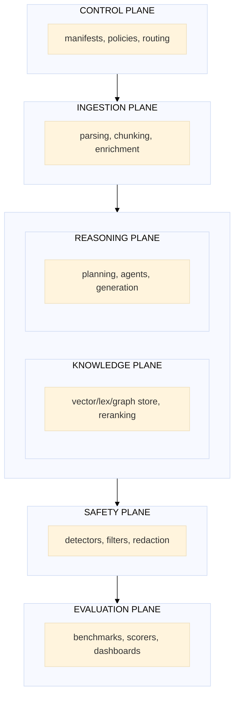
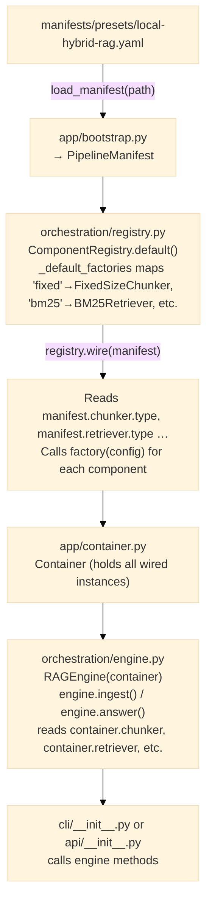
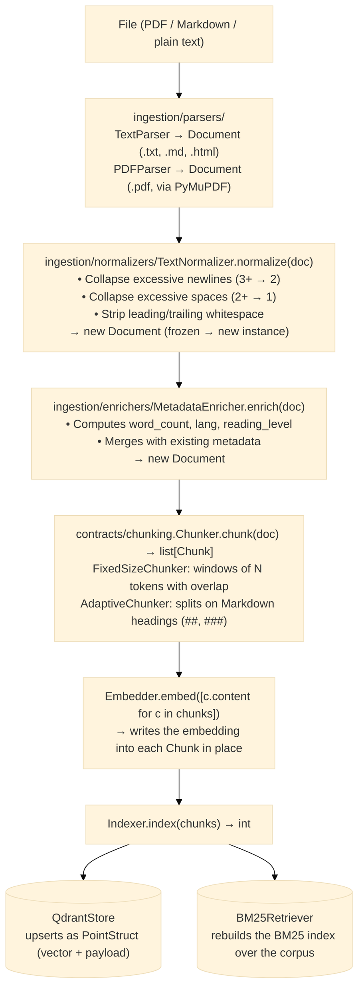
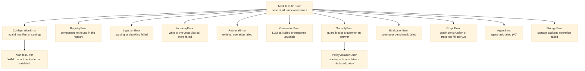

# Architecture Overview — Modular RAG Framework

> This document is the technical specification (cahier technique) for the framework.

---

## 1. Purpose

This framework provides a **context OS** for RAG and agentic systems: an engine-neutral control
plane over knowledge, governance, and observability, built around three pillars:

1. **Declarative orchestration** — pipelines are described in YAML (manifests), not in imperative Python.
2. **Composable retrieval** — chunking, embedding, indexing, fusion, and reranking are swappable contracts.
3. **Engine-neutral execution** — a vendor-neutral `DocumentEngine` port (`contracts/engine.py`)
   lets the same governed pipeline run on the native sequential engine or a selected external
   engine (LangGraph, [ADR-0006](../adr/0006-external-engine-selection.md)); per
   [ADR-0005](../adr/0005-document-ai-control-plane-boundary.md), generic multi-agent
   orchestration is delegated to that external engine, not built as a native specialized-agent
   runtime.

---

## 2. Guiding principles

| Principle | Implication |
|---|---|
| **Strict modularity** | Every major capability is a contract (`typing.Protocol`) |
| **Loose coupling** | The orchestrator depends on interfaces, never on concrete implementations |
| **Native evaluation** | Every building block has an associated measurement protocol (`contracts/evaluation.py`) |
| **Secure by default** | Input filtering and guardrails run upstream of reasoning |
| **Native observability** | Traces, provenance, scores, costs, and latency logged at every step |
| **Progressive rollout** | Advanced features (graph, governance, multimodal) stay optional until stabilized |

---

## 3. The system's six planes



---

## 4. Roadmap V1 → V5

This section describes the **target** state of each version — what it is meant to enable
once complete, independent of what's already delivered today. For the real state (which
boxes are checked), see [ROADMAP.md](../../ROADMAP.md); for the same progression told
without technical jargon, see [docs/onboarding.md](../onboarding.md), section 3. The five
versions are not independent batches — each builds on the pipeline built by the previous one
rather than replacing it.

> **ADR-0005 note (2026-08-04):** V1.1/V1.2/V2.0 below build natively as described. V2.1
> (multi-agent teams), V3.0 (GraphRAG traversal), V3.2 (fine-tuning execution), and V5.0
> (multimodal execution) are **delegated** to the selected external engine (LangGraph) via the
> `DocumentEngine` port, not built as native runtimes — see
> [ADR-0005](../adr/0005-document-ai-control-plane-boundary.md) §5.2.

### V1 — Core RAG
**What the framework enables:**
- Source ingestion (files, folders) with parsing (PDF, Word, HTML, Markdown, plain text).
- Optimized chunking (fixed-size, section-adaptive).
- Hybrid dense + lexical search (vector + BM25) with RRF fusion.
- Cross-encoder reranking.
- Grounded generation (citations, groundedness) via OpenAI or Anthropic.
- Basic security: query filtering, injection detection, PII redaction.
- Native evaluation: exact match, recall@k, MRR.
- Exposure via HTTP API (FastAPI) and CLI (`mrag ask`, `mrag ingest`).
- Reproducible configuration through versioned YAML manifests.

### V2 — Policy Engine + Delegated Orchestration
**Additions:**
- Policy-as-code (native): RBAC, data classification, multi-tenant isolation.
- Multi-agent orchestration, adaptive routing, and multi-step agentic workflows: delegated to
  the selected external engine via the `DocumentEngine` port — not built natively. See
  [ADR-0005](../adr/0005-document-ai-control-plane-boundary.md) §5.2.

### V3 — GraphRAG (Delegated) + Cost/Fine-Tuning Evidence (Native)
**Additions:**
- GraphRAG traversal/reasoning: delegated to the selected external engine — not built natively.
  A native knowledge-graph data model may still live in `memory/`, pending Lot 6 evidence.
- Cost/latency evidence and reporting (native): dashboards, per-query/user/month attribution —
  the routing logic itself is delegated.
- Drift detection and evaluation trigger (native): decides *when* retraining is needed;
  fine-tuning execution itself is delegated.

### V4 — Governance
**Additions:**
- Policy-as-code: YAML rules versioned in Git, enforced at runtime.
- Multi-tenant: separate context domains (finance, HR, legal…).
- Multi-environment: dev / staging / prod with progressively stricter policies.
- Full audit: who accessed what, when, with which result.
- Human-in-the-loop: human validation for sensitive answers.
- Per-pipeline risk profiles.

### V5 — Multimodal (Delegated)
**Additions:**
- VLM execution (image/table/audio/video model inference, modality-specialized agents):
  delegated to the selected external engine via the `DocumentEngine` port — not built natively.
- Multimodal parsing and citation enrichment (extracting images/tables, attaching timecodes)
  may remain native if Lot 6/15 evidence supports it — undecided.

---

## 5. V1 execution flow (simple RAG)


For the same flow drawn as a sequence diagram across actors (`RAGEngine`, `SecurityGuard`,
`Retriever`, `Reranker`, `Generator`, `Telemetry`), see
[runtime-flow.md](runtime-flow.md), "V1 — Simple RAG (query path)".

---

## 6. Founding contracts

The contracts in `src/modular_rag/contracts/` are the framework's immutable core. Every implementation — internal or external — must satisfy these Protocols:

| Contract | Role | V |
|---|---|---|
| `Chunker` | `chunk(doc) → [Chunk]` | V1 |
| `Embedder` | `embed(texts) → [[float]]` | V1 |
| `Indexer` | `index(chunks)` / `delete(ids)` | V1 |
| `Retriever` | `retrieve(query, k) → [RetrievedChunk]` | V1 |
| `Reranker` | `rerank(query, chunks, k) → [RetrievedChunk]` | V1 |
| `Generator` | `generate(query, context, trace) → Answer` | V1 |
| `SecurityGuard` | `check_query(query)` / `check_answer(answer)` | V1 |
| `Evaluator` | `evaluate(query, answer, expected, context)` | V1 |
| `TenantPolicy` | `enforce_query(query)` / `filter_chunks(tenant_id, chunks)` | V1 (Lot 11b) |
| `DocumentEngine` | `run(request, context) → EngineResult` | V1 (Lot 7 — native and LangGraph adapters) |
| `Telemetry` | `record_trace(trace)` | V1 |
| `AuditSink` | `record(event)` | V1 (Lot 10) |
| `LifecycleLedger` | `record_ingested`/`tombstone`/`export_all` | V1 (Lot 12a) |
| `Storage` | `put/get/delete/exists` | V1 |
| `Redactor` | `redact(text) → str` | V1 |
| `ManifestLoader` | `load(path) → PipelineManifest` | V1 |

`Planner` (`plan(query) → ExecutionPlan`) and `Agent` (`run(task) → AgentResult`) were removed
in Lot 17 (`docs/refactoring-plan.md`) — zero implementations, zero consumers, superseded by the
`DocumentEngine` delegation port above.

---

## 7. Architecture decisions

See the ADRs in `docs/adr/`:
- [ADR-0001](../adr/0001-modular-architecture.md) — Six planes, contracts/implementations separation
- [ADR-0002](../adr/0002-contracts-and-plugins.md) — Protocols + Factory Registry
- [ADR-0003](../adr/0003-security-and-governance.md) — Safety vs Security, policy-as-code
- [ADR-0005](../adr/0005-document-ai-control-plane-boundary.md) — Owned-vs-delegated product boundary (accepted 2026-08-04); partially supersedes [ADR-0004](../adr/0004-strategic-features-v1-v5.md)
- [ADR-0006](../adr/0006-external-engine-selection.md) — LangGraph selected as the external `DocumentEngine` adapter target

---

## 8. Data models

The domain models are defined in `src/modular_rag/core/models/`. They are Pydantic v2 objects — no ORM, no database. See `data-model.md` for the full documentation.

| Model | File | Frozen | Usage |
|---|---|---|---|
| `Document` | `document.py` | ✓ | Ingestion unit: source, raw content, metadata |
| `Chunk` | `chunk.py` | ✗ | Sub-segment of a Document, with optional embedding |
| `Query` | `query.py` | ✓ | User query + tenant_id (Lot 11b) |
| `RetrievedChunk` | `retrieved.py` | ✓ | Chunk + score + rank + retrieval method |
| `Citation` | `answer.py` | ✗ | Pointer from an answer to a source chunk |
| `Answer` | `answer.py` | ✗ | Generated text + citations + trace_id |
| `TraceStep` | `trace.py` | ✗ | Latency + tokens for one pipeline step |
| `Trace` | `trace.py` | ✗ | Full audit of an execution (accumulated via `add_step()`) |
| `PolicyRule` | `policy.py` | ✗ | Condition + action (allow/deny/redact/warn) |
| `Policy` | `policy.py` | ✗ | Set of rules scoped to a tenant |
| `Metrics` | `metrics.py` | ✗ | Evaluation scores (recall@k, MRR, groundedness…) |

**Key invariants:**
- `Document` and `Query` are immutable (`frozen=True`). Any modification produces a new instance.
- `Chunk.token_estimate` is a computed property (`len(content.split())`), not stored.
- `Trace.add_step()` is the only way to add a step — it atomically updates the `total_latency_ms`, `total_input_tokens`, and `total_output_tokens` totals.
- `Policy.sorted_rules()` returns the rules sorted by decreasing priority.
- `Metrics.summary()` returns only the non-None fields.

---

## 9. Manifest → pipeline wiring

The complete path from a YAML file to an operational pipeline:



To wire a new component:
1. Implement the corresponding contract in `contracts/`.
2. Add the factory in `orchestration/registry.py → _default_factories`.
3. Reference the type in the manifest YAML: `chunker: {type: my_chunker, ...}`.

---

## 10. Ingestion pipeline (V1 detail)



Note: Embedding and indexing happen in `RAGEngine.ingest()`, not in `ingest_path()`. The separation is intentional — `ingest_path()` is testable without any external service.

---

## 11. Hybrid retrieval algorithm (RRF)

Hybrid retrieval combines two ranked result lists (dense vector + lexical BM25) into a single fused list via **Reciprocal Rank Fusion**:

```
RRF_score(d) = Σᵢ  1 / (rrf_k + rankᵢ(d))

  where:
    rrf_k  = 60  (smoothing constant, standard in the literature)
    rankᵢ  = rank of document d in list i (1-based)
    Σ      = sum over all result lists (vector, BM25)
```

Example with 2 lists:
```
document "Q4 revenue"
  rank_vector = 3  → 1 / (60 + 3) = 0.0159
  rank_bm25   = 1  → 1 / (60 + 1) = 0.0164
  RRF_score   = 0.0159 + 0.0164 = 0.0323
```

The vector/BM25 ratio in the `local-hybrid-rag.yaml` preset is **0.7 / 0.3**: vector results carry more weight because they capture semantics, while BM25 boosts exact matches on technical terms.

After fusion, chunks are re-ranked by decreasing `RRF_score`. A cross-encoder reranker then refines this ranking over the top-k (default: 5).

---

## 12. Error hierarchy

All framework exceptions inherit from `ModularRAGError` (defined in `core/errors.py`). The complete tree:



**Handling rule:** catch the most specific exception possible. Only catch `ModularRAGError` at the HTTP/CLI handler level to return a generic error response. Never silently swallow a `SecurityError` — it must always be logged.
