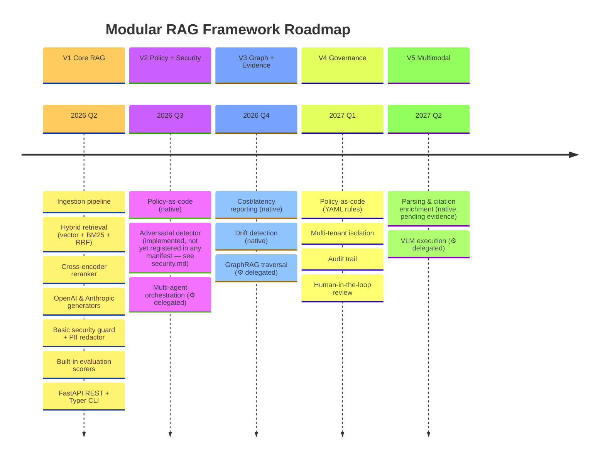
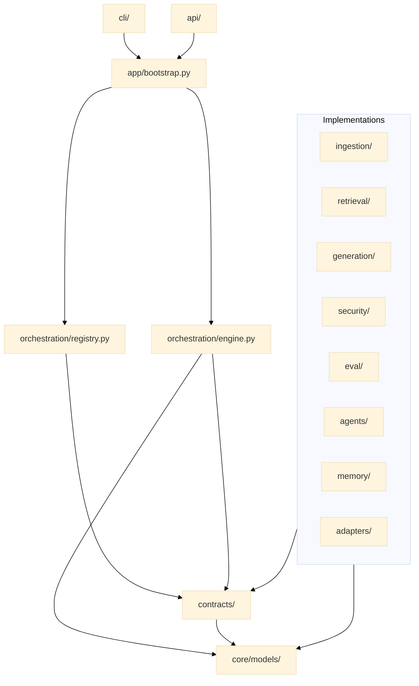
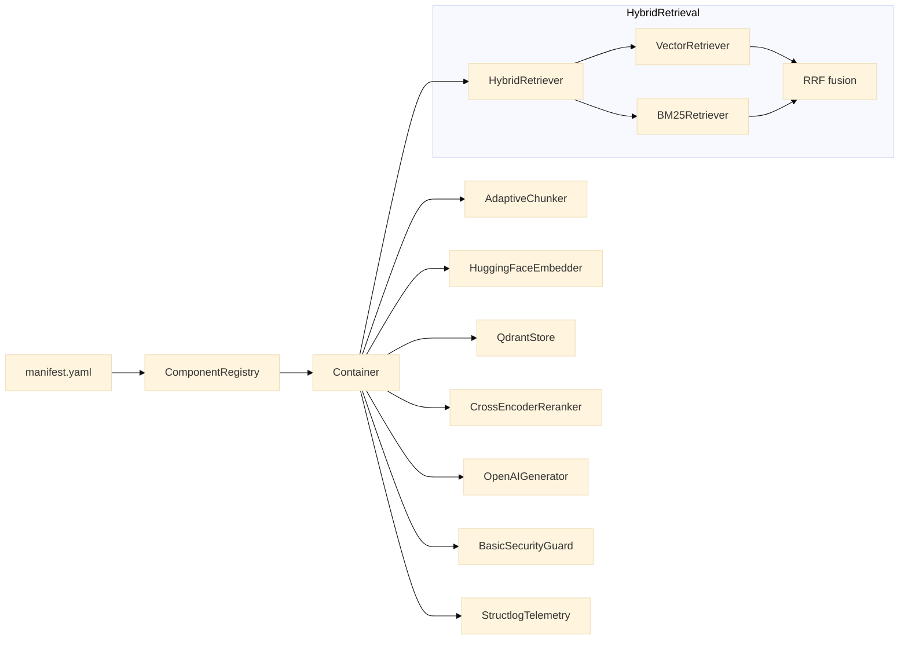
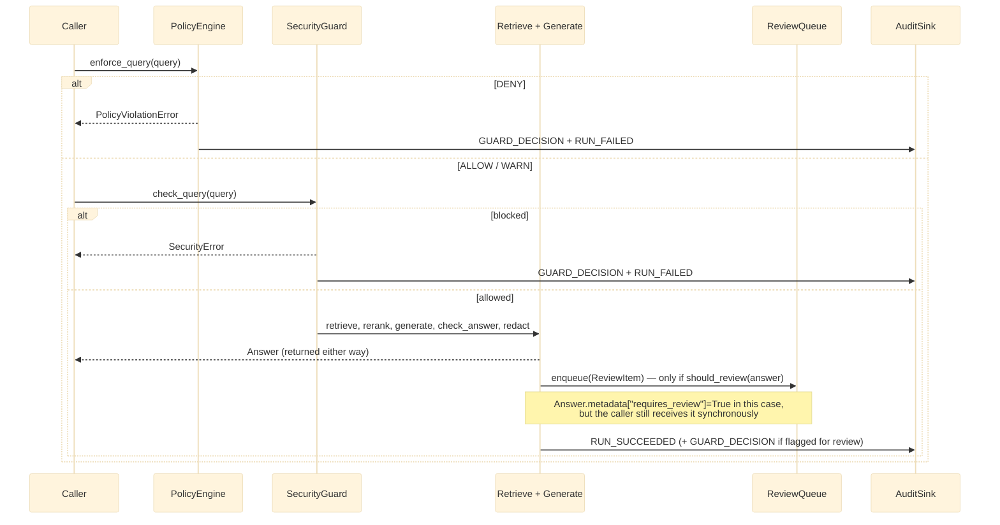

# Roadmap — Visual Diagrams

The diagrams below are visual companions to two text documents: [ROADMAP.md](../../ROADMAP.md)
(the checklist of what is done vs. planned) and
[docs/architecture/module-model.md](module-model.md) (the prose explanation of why the
dependency rules exist). Read this page when a picture answers your question faster than a
table — for example, when you need to explain the V1→V5 sequencing to someone who has never
opened the codebase.

## V1 → V5 progression

This timeline is the same content as [ROADMAP.md](../../ROADMAP.md), laid out
chronologically instead of as checkboxes. Use it to answer "what quarter does capability X
land in" at a glance; use `ROADMAP.md` itself to know whether it has actually shipped yet —
dates here are planning targets, not delivery guarantees.

## Module dependency graph

This is the hexagonal layering rule from [module-model.md](module-model.md) drawn as a
graph instead of described as a rule. The arrows all point downward toward `Contracts` and
`Core` — that convergence is the whole point: every domain module (ingestion, retrieval,
generation, security, eval, agents, memory, adapters) depends on the same stable center, and
none of them depend on each other. If you ever see an arrow that would need to point
sideways between two `Implementations` boxes, that is exactly the forbidden import pattern
documented in `module-model.md`.

## V1 component wiring

This diagram answers a question the module dependency graph deliberately leaves out: which
*specific* built-in implementation gets wired for each contract in the default V1 setup, using
`manifests/presets/local-hybrid-rag.yaml` as the concrete example.
`ComponentRegistry` reads the manifest, resolves each `type:` string to a concrete class
(here `AdaptiveChunker`, `HuggingFaceEmbedder` — manifest `type: "sentence-transformers"`,
default model `bge-small-en-v1.5`, hence "BGE" if you see that name elsewhere — `QdrantStore`...),
and hands the wired instances to the `Container` (`orchestration/container.py`). Swap any single
box by editing one line in the YAML manifest — nothing else on this diagram changes as a result,
which is the guarantee the manifest-first design is meant to provide.

## Multi-agent orchestration and GraphRAG — delegated

> **Delegated per [ADR-0005](../adr/0005-document-ai-control-plane-boundary.md) §5.2.**
> Multi-agent orchestration and GraphRAG traversal are delegated to a selected external engine
> via the `DocumentEngine` port, not built natively in this repository. The prototype
> multi-agent implementation was removed in
> [Lot 17](../refactoring/lot-17-prototype-retirement.md); GraphRAG traversal was
> concept-only — nothing was ever built to remove. For the real, current request flow
> (including the delegation fork), see
> [docs/architecture/runtime-flow.md](runtime-flow.md).

## Policy + human-review evaluation loop

**This is shipped, native, and wired into the live request path today** — Lots 11b and 11c
(`docs/refactoring-plan.md`) delivered it; this is no longer a target design a previous version
of this document described as not yet existing. `PolicyEngine.enforce_query()` is confirmed
(directly against `orchestration/engine.py`'s `_run_steps()`) to run before `SecurityGuard.
check_query()`, and a `DENY` genuinely never reaches the LLM: `PolicyViolationError` is raised
before retrieval or generation happen at all. This is the mechanism a DPO or auditor would ask to
see evidence of (see [docs/business-case.md](../business-case.md) section 4) — and it is real.

**One correction to how `REQUIRE_REVIEW` behaves, versus what a previous version of this
diagram showed:** it does **not** produce a distinct "pending" response withheld from the
caller. The real behavior (`RAGEngine._run_steps()`'s human-review step) generates the answer
normally, then — if `review_queue.should_review(answer)` says yes — returns that *same* answer
to the caller immediately, with `metadata["requires_review"] = True` set on it, while separately
enqueuing a `ReviewItem` for a human reviewer and recording a `GUARD_DECISION` audit event.

The requester is not blocked waiting on a human; the flagging is informational metadata on an
answer they already received, plus an asynchronous review-queue entry. A caller that wants to
actually withhold flagged answers from end users has to check `answer.metadata["requires_review"]`
itself and decide what to do with that — this codebase doesn't withhold on your behalf.

See [runtime-flow.md](runtime-flow.md) for the complete, step-by-step governed request sequence
this diagram summarizes, including the double-audit-event behavior on a denial.
