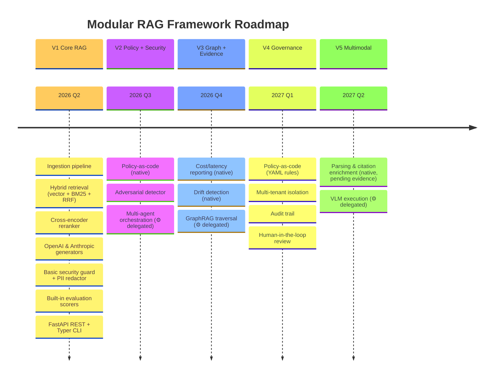
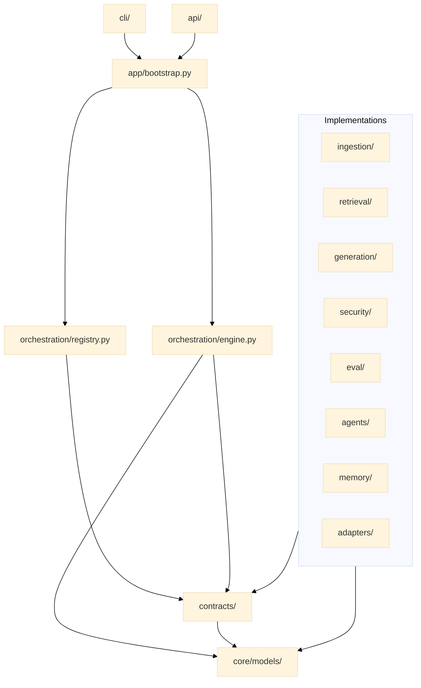
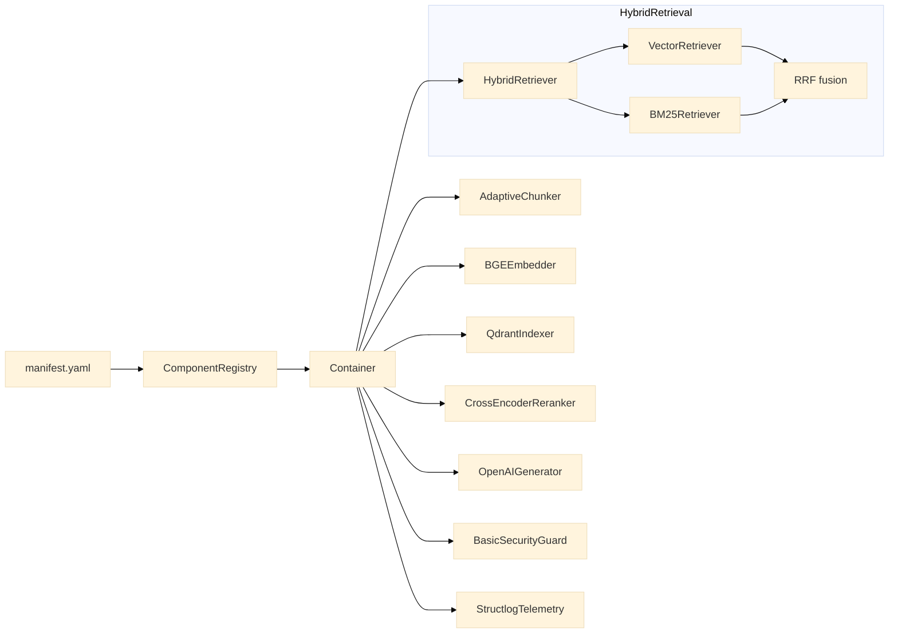
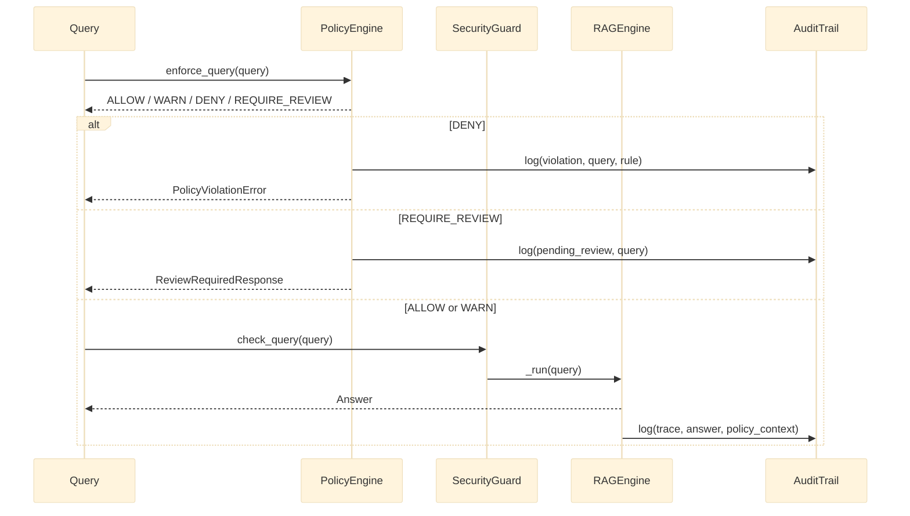

# Roadmap — Visual Diagrams

The diagrams below are visual companions to two text documents: [ROADMAP.md](../../ROADMAP.md)
(the checklist of what is done vs. planned) and
[docs/architecture/module-model.md](module-model.md) (the prose explanation of why the
dependency rules exist). Read this page when a picture answers your question faster than a
table — for example, when you need to explain the V1→V5 sequencing to someone who has never
opened the codebase.

## V1 → V5 progression

This timeline is the same content as [ROADMAP.md](../../ROADMAP.md), laid out
chronologically instead of as checkboxes. Use it to answer "what quarter does capability X
land in" at a glance; use `ROADMAP.md` itself to know whether it has actually shipped yet —
dates here are planning targets, not delivery guarantees.

## Module dependency graph

This is the hexagonal layering rule from [module-model.md](module-model.md) drawn as a
graph instead of described as a rule. The arrows all point downward toward `Contracts` and
`Core` — that convergence is the whole point: every domain module (ingestion, retrieval,
generation, security, eval, agents, memory, adapters) depends on the same stable center, and
none of them depend on each other. If you ever see an arrow that would need to point
sideways between two `Implementations` boxes, that is exactly the forbidden import pattern
documented in `module-model.md`.

## V1 component wiring

This diagram answers a question the module dependency graph deliberately leaves out: which
*specific* built-in implementation gets wired for each contract in the default V1 setup.
`ComponentRegistry` reads the manifest, resolves each `type:` string to a concrete class
(here `AdaptiveChunker`, `BGEEmbedder`, `QdrantIndexer`...), and hands the wired instances to
the `Container`. Swap any single box by editing one line in the YAML manifest — nothing else
on this diagram changes as a result, which is the guarantee the manifest-first design is
meant to provide.

## Multi-agent orchestration and GraphRAG — delegated

> **Delegated per [ADR-0005](../adr/0005-document-ai-control-plane-boundary.md) §5.2.**
> Multi-agent orchestration and GraphRAG traversal are delegated to a selected external engine
> via the `DocumentEngine` port, not built natively in this repository. The prototype
> multi-agent implementation was removed in
> [Lot 17](../refactoring/lot-17-prototype-retirement.md); GraphRAG traversal was
> concept-only — nothing was ever built to remove. For the real, current request flow
> (including the delegation fork), see
> [docs/architecture/runtime-flow.md](runtime-flow.md).

## V4 policy evaluation loop

This sequence is what makes the framework safe to deploy for regulated or multi-tenant
clients (see [docs/business-case.md](../business-case.md), section 4): the `PolicyEngine`
is consulted *before* the query even reaches the security guard or the engine, and every
branch — `DENY`, `REQUIRE_REVIEW`, or `ALLOW`/`WARN` — writes to the audit trail. A `DENY`
never reaches the LLM at all; a `REQUIRE_REVIEW` produces a pending response instead of an
answer, so a human reviews it before the requester sees anything. This is the mechanism a
DPO or auditor would ask to see evidence of — and it does not exist yet in the shipped code
(see [ROADMAP.md](../../ROADMAP.md), V4 section); this diagram documents the target design.

