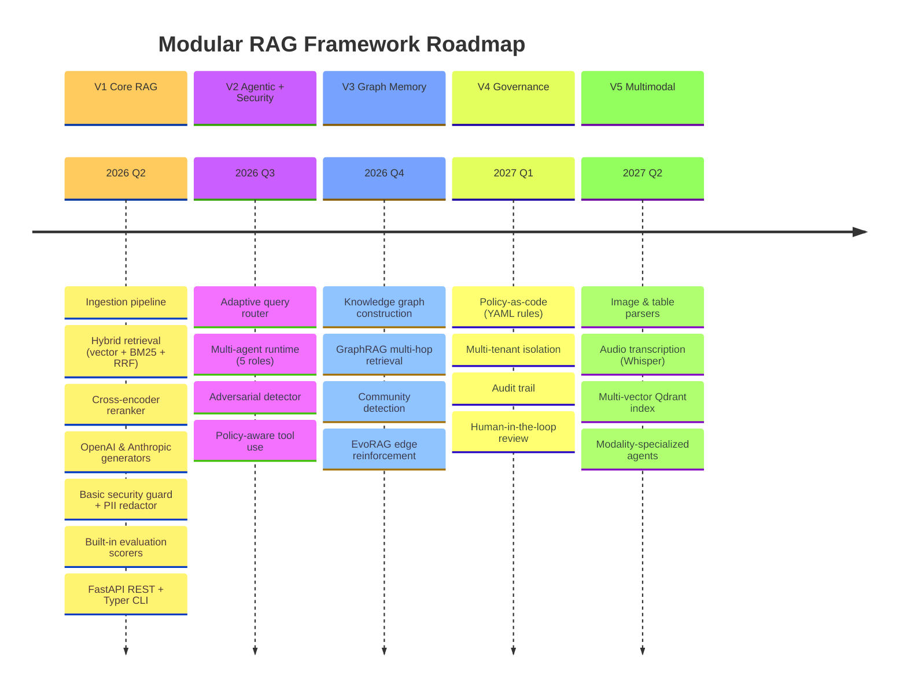
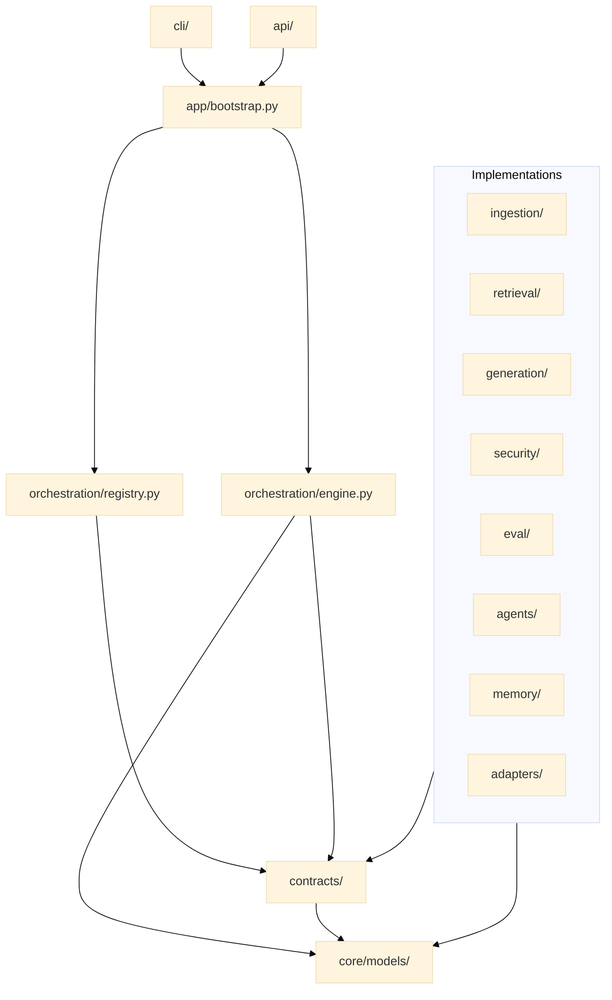
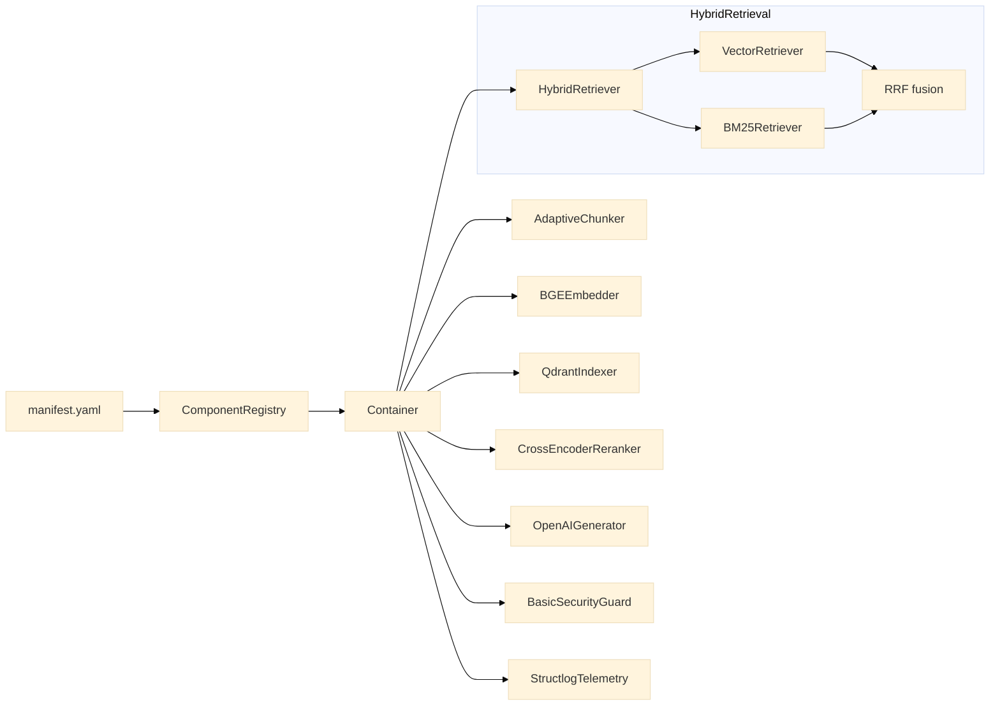
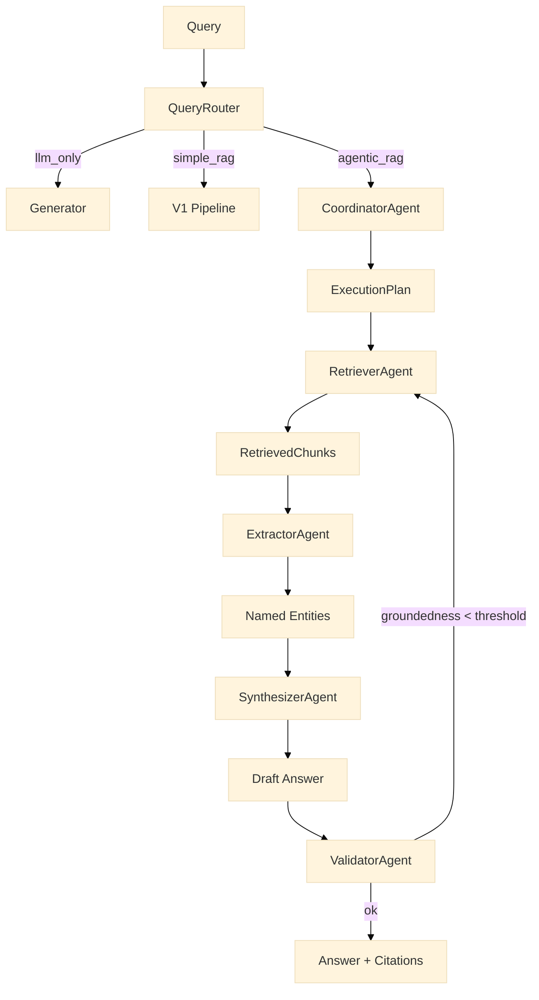
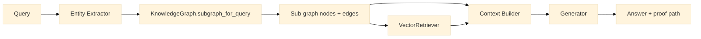
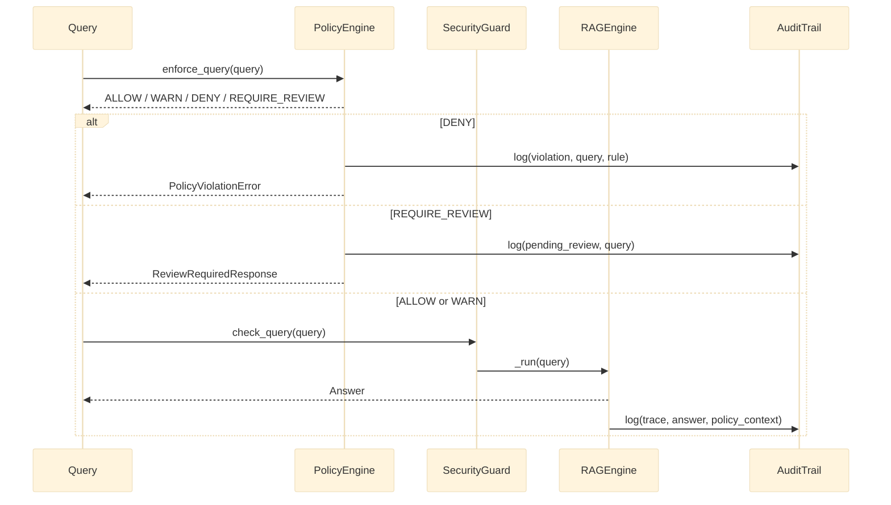

# Roadmap — Visual Diagrams

## V1 → V5 progression

```mermaid
%%{init: {"theme": "base"}}%%
timeline
    title Modular RAG Framework Roadmap
    section V1 Core RAG
        2026 Q2 : Ingestion pipeline
                : Hybrid retrieval (vector + BM25 + RRF)
                : Cross-encoder reranker
                : OpenAI & Anthropic generators
                : Basic security guard + PII redactor
                : Built-in evaluation scorers
                : FastAPI REST + Typer CLI
    section V2 Agentic + Security
        2026 Q3 : Adaptive query router
                : Multi-agent runtime (5 roles)
                : Adversarial detector
                : Policy-aware tool use
    section V3 Graph Memory
        2026 Q4 : Knowledge graph construction
                : GraphRAG multi-hop retrieval
                : Community detection
                : EvoRAG edge reinforcement
    section V4 Governance
        2027 Q1 : Policy-as-code (YAML rules)
                : Multi-tenant isolation
                : Audit trail
                : Human-in-the-loop review
    section V5 Multimodal
        2027 Q2 : Image & table parsers
                : Audio transcription (Whisper)
                : Multi-vector Qdrant index
                : Modality-specialized agents
```

## Module dependency graph

```mermaid
%%{init: {"theme": "base"}}%%
flowchart TD
    CLI[cli/] --> Bootstrap
    API[api/] --> Bootstrap

    Bootstrap[app/bootstrap.py] --> Registry
    Bootstrap --> Engine

    Registry[orchestration/registry.py] --> Contracts
    Engine[orchestration/engine.py] --> Contracts
    Engine --> Core

    Contracts[contracts/] --> Core[core/models/]

    subgraph Implementations
        Ingestion[ingestion/]
        Retrieval[retrieval/]
        Generation[generation/]
        Security[security/]
        Eval[eval/]
        Agents[agents/]
        Memory[memory/]
        Adapters[adapters/]
    end

    Implementations --> Contracts
    Implementations --> Core
```

## V1 component wiring

```mermaid
%%{init: {"theme": "base"}}%%
flowchart LR
    YAML[manifest.yaml] --> Registry[ComponentRegistry]
    Registry --> Container[Container]

    Container --> Chunker[AdaptiveChunker]
    Container --> Embedder[BGEEmbedder]
    Container --> Indexer[QdrantIndexer]
    Container --> Retriever[HybridRetriever]
    Container --> Reranker[CrossEncoderReranker]
    Container --> Generator[OpenAIGenerator]
    Container --> Guard[BasicSecurityGuard]
    Container --> Telemetry[StructlogTelemetry]

    subgraph HybridRetrieval
        Retriever --> VectorR[VectorRetriever]
        Retriever --> BM25R[BM25Retriever]
        VectorR --> RRF[RRF fusion]
        BM25R --> RRF
    end
```

## V2 agentic runtime

```mermaid
%%{init: {"theme": "base"}}%%
flowchart TD
    Q[Query] --> Router[QueryRouter]

    Router -->|llm_only| LLM[Generator]
    Router -->|simple_rag| V1[V1 Pipeline]
    Router -->|agentic_rag| Coord[CoordinatorAgent]

    Coord --> Plan[ExecutionPlan]
    Plan --> RetAgent[RetrieverAgent]
    RetAgent --> Chunks[RetrievedChunks]
    Chunks --> Extractor[ExtractorAgent]
    Extractor --> Entities[Named Entities]
    Entities --> Synth[SynthesizerAgent]
    Synth --> Draft[Draft Answer]
    Draft --> Validator[ValidatorAgent]
    Validator -->|groundedness < threshold| RetAgent
    Validator -->|ok| Output[Answer + Citations]
```

## V3 GraphRAG flow

```mermaid
%%{init: {"theme": "base"}}%%
flowchart LR
    Q[Query] --> EE[Entity Extractor]
    EE --> KG[KnowledgeGraph.subgraph_for_query]
    KG --> SubG[Sub-graph nodes + edges]
    SubG --> VR[VectorRetriever]
    SubG --> CB[Context Builder]
    VR --> CB
    CB --> LLM[Generator]
    LLM --> Answer[Answer + proof path]
```

## V4 policy evaluation loop

```mermaid
%%{init: {"theme": "base"}}%%
sequenceDiagram
    participant Q as Query
    participant PE as PolicyEngine
    participant Guard as SecurityGuard
    participant Engine as RAGEngine
    participant Audit as AuditTrail

    Q->>PE: enforce_query(query)
    PE-->>Q: ALLOW / WARN / DENY / REQUIRE_REVIEW

    alt DENY
        PE->>Audit: log(violation, query, rule)
        PE-->>Q: PolicyViolationError
    else REQUIRE_REVIEW
        PE->>Audit: log(pending_review, query)
        PE-->>Q: ReviewRequiredResponse
    else ALLOW or WARN
        Q->>Guard: check_query(query)
        Guard->>Engine: _run(query)
        Engine-->>Q: Answer
        Engine->>Audit: log(trace, answer, policy_context)
    end
```
