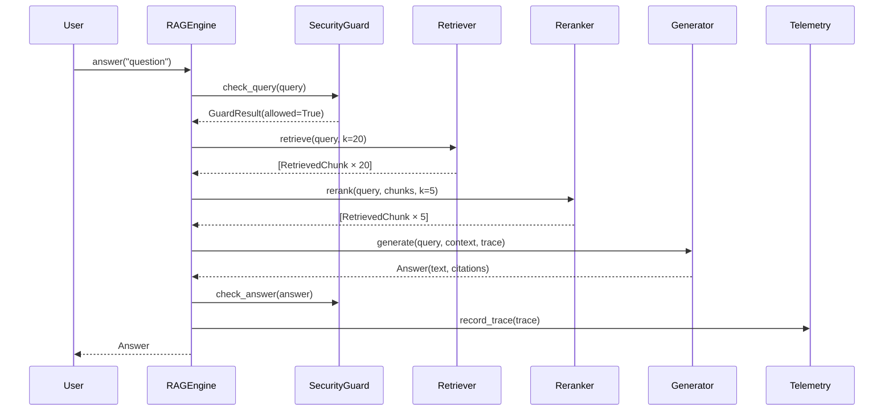
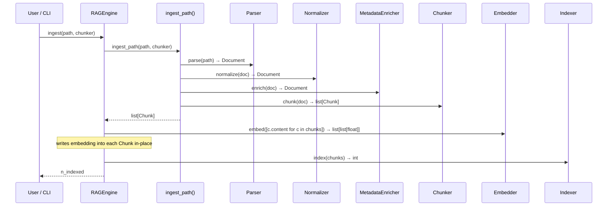
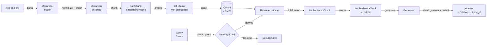
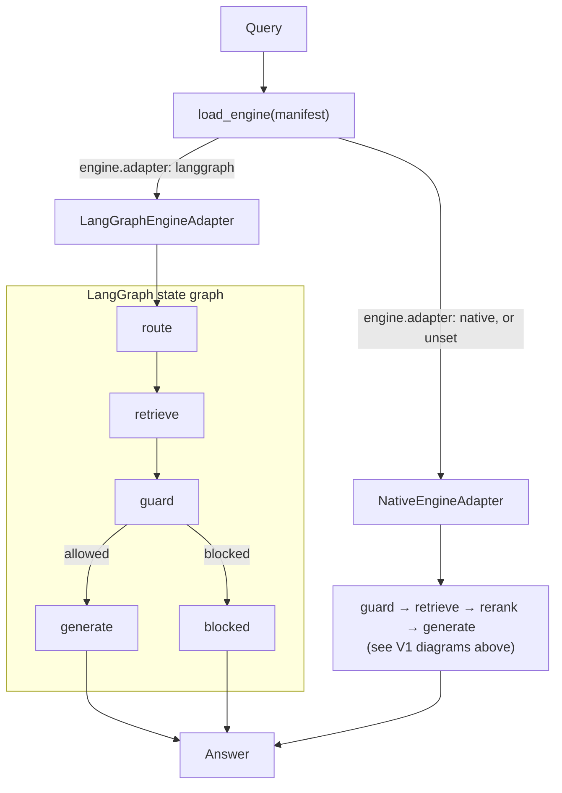

# Runtime Flow Diagrams

This document shows how data moves through the pipeline at runtime for each version of the framework. Each diagram focuses on a specific architectural concern. Read `data-model.md` for details on the objects passed between stages.

---

## V1 — Simple RAG (query path)

The V1 query path is a linear pipeline: guard → retrieve → rerank → generate → guard. The `Trace` object is threaded through every step and accumulates latency and token counts so the final `Answer` can be debugged end-to-end.

The two most important things to notice in this diagram:
1. The security guard runs **twice** — before retrieval (to block injections) and after generation (to catch PII leakage in the answer).
2. `Telemetry.record_trace()` fires after the answer is validated, not before — so the trace is complete when it is persisted.

---

## V1 — Ingestion path

When a file is ingested, it follows a transformation chain before landing in the vector and BM25 indices. This diagram shows that chain. The embedding step is the only one that calls an external service (OpenAI or HuggingFace); all other steps are local.

The output of `ingest_path()` is a list of `Chunk` objects. The engine then embeds and indexes them. The number of chunks written to the store is returned to the caller.

---

## V1 — Data lifecycle (Document → Answer)

This flowchart shows the full transformation from raw file to final answer. It is the same path as the sequence diagrams above but displayed as a data-flow graph, making it easier to see which stores are involved and where data branches.

---

## Engine delegation — native vs. LangGraph

Per [ADR-0005](../adr/0005-document-ai-control-plane-boundary.md) §5.2, this is the real fork
in the current codebase: a manifest's `engine.adapter` field selects which `DocumentEngine`
(`contracts/engine.py`) implementation `app/bootstrap.py::load_engine()` returns.
`"native"` (or no `engine` section) gets `NativeEngineAdapter` — the fixed V1 pipeline from the
diagrams above. `"langgraph"` gets `LangGraphEngineAdapter`
(`adapters/llms/langgraph_engine.py`), whose internal graph is the real, current replacement for
the V2/V3 native-agent and GraphRAG designs once sketched here — both adapters share the same
`Container` (identical chunker/retriever/guard/generator selection); only the orchestration
engine differs.

Generic multi-agent orchestration (the pre-ADR-0005 `Router`/`Coordinator`/`Planner`/
`Retriever Agent`/`Extractor`/`Synthesizer`/`Validator` design) and GraphRAG traversal
(`Entity Extractor`/`Graph Retriever`/`Context Builder`) are both delegated to whichever engine
is selected here — neither was ever built as native code beyond the multi-agent prototype
[removed in Lot 17](../refactoring/lot-17-prototype-retirement.md). A native `KnowledgeGraph`
data model does exist (`memory/graph/knowledge_graph.py`, retained with a documented caveat) but
is not wired into either engine path today.
