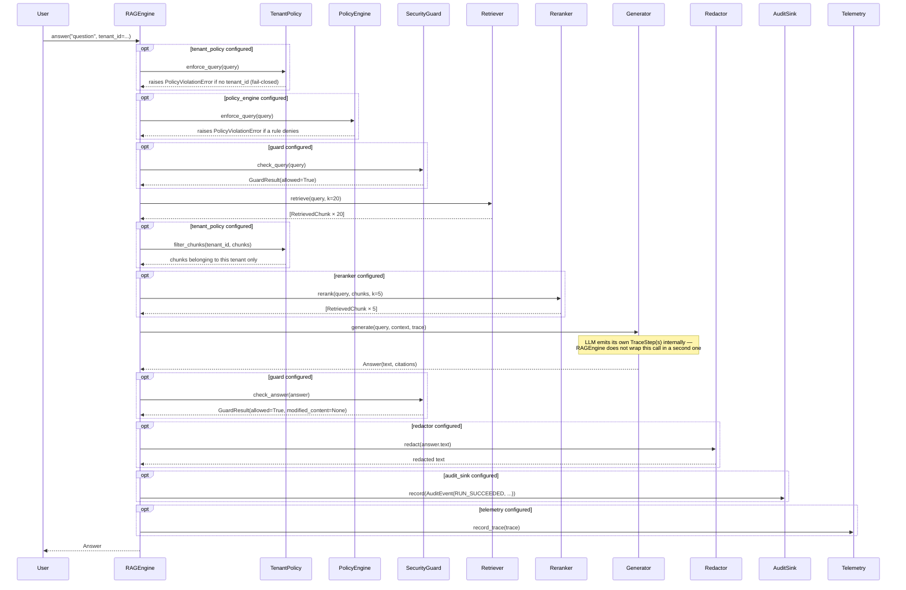
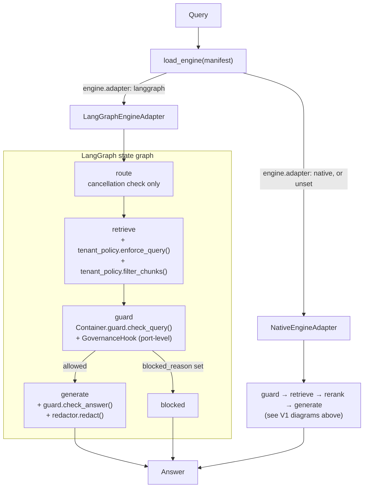

# Runtime Flow Diagrams

This document shows how data moves through the pipeline at runtime for each version of the
framework, as **sequence diagrams across actors** — complementary to
[`overview.md`](overview.md), which gives the same flows as flowcharts with more surrounding
"why" prose, and to [`data-model.md`](data-model.md), which documents the objects passed between
these stages. Where `overview.md` deliberately shows the *minimal* V1 flow for orientation, this
document shows the **complete** flow, including every governance step that only fires when its
manifest section is configured — because a sequence-diagram reference's whole purpose is to be
the detailed version, not another simplified summary.

---

## V1 — Simple RAG (query path), complete flow

This is the full sequence `RAGEngine._run_steps()` executes — every step below is real,
callable, tested code, not an aspirational design. Steps 0, 0b, and 2b (tenant isolation, policy
engine, tenant filtering) and steps 6–7 (redaction, audit) are **no-ops when their governing
manifest section is absent** — a `local-hybrid-rag.yaml` run (no `governance:` section) skips
straight from `check_query` to `retrieve`, and from `check_answer` to returning the `Answer`;
a `secure-enterprise-rag.yaml` run executes every step shown. This is the same
minimal-vs-governed distinction `overview.md`'s "guiding principles" table calls "progressive
rollout" — nothing here forks the pipeline logic, absent components are simply skipped branches
in the identical code path.

Two things worth internalizing before reading the diagram:
1. **The security guard runs twice** — before retrieval (`check_query`, blocking injections
   before they can shape what gets retrieved) and after generation (`check_answer`, catching
   PII/uncited-URL leakage in the answer).
2. **`Telemetry.record_trace()` and the final `AuditSink.record()` both fire after the answer is
   fully validated**, not before — so the persisted trace and audit event are complete, reflecting
   what was actually returned to the caller, not an intermediate state.



**On failure paths** — not shown above to keep the happy path legible, but real and tested:
a `TenantPolicy`/`PolicyEngine` denial or a `SecurityGuard` rejection at either checkpoint raises
immediately (`PolicyViolationError`/`SecurityError`) rather than returning a degraded `Answer`.
`RAGEngine._run()` (the caller of `_run_steps()`) catches any exception from the sequence above,
marks the `Trace` as `failed=True` with a `failure_reason`, still calls
`Telemetry.record_trace()` and `AuditSink.record(AuditEventType.RUN_FAILED)` if configured (so a
denied/failed run leaves audit evidence too, not silence), and then re-raises the original
exception unchanged to the caller. A blocked query at the very first tenant/policy/guard
checkpoint additionally gets its own `AuditEventType.GUARD_DECISION` event, in addition to the
`RUN_FAILED` one — two audit rows for one denial, both carrying the same `tenant_id`.

---

## V1 — Ingestion path

Ingestion is **two separate calls the caller makes**, not one call `RAGEngine` internally
orchestrates end to end — a detail easy to get wrong by assuming a single `engine.ingest(path)`
entry point exists. It does not. The real split, matching exactly what the CLI's own `ingest`
command does:

```mermaid
sequenceDiagram
    participant U as User / CLI
    participant IP as ingest_path() / ingest_directory()
    participant P as Parser
    participant N as Normalizer
    participant En as MetadataEnricher
    participant C as Chunker
    participant Ctx as ContextualEnricher
    participant E as RAGEngine / ApplicationService
    participant TP as TenantPolicy
    participant Emb as Embedder
    participant Idx as Indexer
    participant Lex as Lexical retriever (BM25Retriever or PersistentSparseRetriever)

    Note over U,IP: Call 1 — parse/chunk only, no external service, no engine involved
    U->>IP: ingest_path(path, chunker, tenant_id=...)
    IP->>P: parse(path) → Document
    IP->>N: normalize(doc) → Document
    IP->>En: enrich(doc) → Document
    IP->>C: chunk(doc) → list[Chunk]
    Note over IP: tenant_id (if given) stamped onto every chunk here
    IP->>Ctx: enrich(doc, chunks) → list[Chunk]
    Note over Ctx: sets chunk.embedding_text to a document-context-prefixed<br/>variant of content; content itself is never touched
    IP-->>U: list[Chunk] (embedding=None)

    Note over U,E: Call 2 — the caller passes the chunks from Call 1 to the engine separately
    U->>E: ingest_chunks(chunks)
    opt tenant_policy configured
        E->>TP: enforce_ingest(chunk.tenant_id) for every chunk — fail-closed
    end
    loop for each chunk with embedding=None
        E->>Emb: embed([chunk.embedding_text or chunk.content]) → list[float]
        Note over E: ONE call per chunk, not a single batched<br/>call across the whole document — see overview.md §10
        E->>E: chunk.embedding = result[0]
    end
    E->>Idx: index(chunks) → int
    Idx-->>E: n_indexed
    E->>Lex: index(chunks)
    Note over Lex: also feeds the lexical index — in-memory and lost on process<br/>exit for the bm25-memory default, persistent for sparse-qdrant<br/>(manifest retriever.config.lexical), see overview.md §3
    E-->>U: n_indexed
```

`RAGEngine.ingest(documents: list[Document])` is a **third**, less commonly used entry point —
it takes already-constructed `Document` objects (not a filesystem path) and internally calls the
chunker itself before doing the same tenant-check/embed/index sequence as `ingest_chunks()`
above; see that method's own docstring for its additional lifecycle-ledger idempotency behavior
(skip re-ingesting an unchanged document, version forward a changed one) when a
`lifecycle_ledger` is configured — `ingest_chunks()` has no such idempotency layer of its own.

---

## V1 — Data lifecycle (Document → Answer)

The same two paths above, as a single data-flow graph — useful for seeing which stores are
involved and where data branches, less useful than the sequence diagrams above for seeing exact
call order or which steps are optional.

```mermaid
flowchart LR
    File[File on disk] -->|parse| Doc[Document\nfrozen]
    Doc -->|normalize + enrich| DocE[Document\nenriched]
    DocE -->|chunk, tenant_id stamped| Chunks[list Chunk\nembedding=None]
    Chunks -->|"enforce_ingest per chunk\n(only if tenant_policy wired)"| TGate{OK?}
    TGate -->|"embed, one chunk at a time"| ChunksV[list Chunk\nwith embedding]
    ChunksV -->|index| Store[(Qdrant dense\n+ lexical: BM25 in-memory, or a\nsecond Qdrant collection)]

    Query[Query\nfrozen] -->|"enforce_query\n(only if tenant_policy wired)"| TQ{OK?}
    TQ -->|check_query| Guard{SecurityGuard}
    Guard -->|allowed| Ret[Retriever.retrieve]
    Guard -->|blocked| Err[SecurityError]
    Store --> Ret
    Ret -->|RRF fusion| RC[list RetrievedChunk]
    RC -->|"filter_chunks\n(only if tenant_policy wired)"| TF[list RetrievedChunk\ntenant-scoped]
    TF -->|rerank| RCR[list RetrievedChunk\nreranked]
    RCR -->|generate| Gen[Generator]
    Gen -->|check_answer + redact| FinalAns[Answer\n+ Citations + trace_id]
```



---

## Engine delegation — native vs. LangGraph

Per [ADR-0005](../adr/0005-document-ai-control-plane-boundary.md) §5.2, this is the real fork
in the current codebase: a manifest's `engine.adapter` field selects which `DocumentEngine`
(`contracts/engine.py`) implementation `app/bootstrap.py::load_engine()` returns. `"native"` (or
no `engine` section) gets `NativeEngineAdapter` — the fixed V1 pipeline from the diagrams above.
`"langgraph"` gets `LangGraphEngineAdapter` (`adapters/llms/langgraph_engine.py`), whose fixed
internal graph proves the external-engine boundary but does not implement the V2/V3 multi-agent
or GraphRAG designs once sketched here.

Both adapters share the same `Container` (identical chunker/retriever/guard/generator selection);
only the orchestration engine differs.



**Where tenant isolation and redaction actually execute in the LangGraph graph** — worth calling
out explicitly, since the node names alone (`route`/`retrieve`/`guard`/`generate`) don't make it
obvious: tenant isolation is **not** a separate node — `tenant_policy.enforce_query()` and
`.filter_chunks()` both run *inside* the `retrieve` node, immediately before and after the actual
retrieval call. Similarly, redaction is not a separate node — `redactor.redact()` runs *inside*
`generate`, immediately after the answer guard check.

This was not always correct: Lot 18's pilot-comparison script (running the identical request
through both engine adapters and diffing the result) found a real bug where a query with no
`tenant_id` returned a `200` through this adapter while the identical request correctly raised
`SecurityError` on the native engine — the `retrieve` node used to only *filter* chunks when
`query.tenant_id` happened to already be set, and never *denied* the request outright when it
wasn't. The current `_node_retrieve()` method (`enforce_query()` called unconditionally, before
the retrieval call, whenever a `tenant_policy` is wired) is the fix; that method's own inline
comment is the authoritative record of this history if you need the full detail.

**What this adapter deliberately does not replicate.** Per its own module docstring:
`AuditSink` event emission and human-review queueing are **not** performed by
`LangGraphEngineAdapter` — `registry.py::runtime_manifest_errors()` enforces this at the manifest
level too, by rejecting a manifest that selects `engine.adapter: langgraph` while also declaring
`governance.policy_engine`, `governance.review_queue`, `governance.audit_sink`, or
`observability.telemetry` (fails validation at startup, per ADR-0007 §3 — a manifest cannot
declare a control this adapter cannot actually activate).

A caller that needs audit evidence today should use the native engine
(`NativeEngineAdapter`/`RAGEngine`, or `load_pipeline()`), not the LangGraph adapter — this is a
real, current capability gap, not a documentation oversight, and closing it is future work
(folding audit/review into the control plane *above* the `DocumentEngine` boundary, so every
adapter gets it for free, rather than re-implementing it inside each one).

Generic multi-agent orchestration (the pre-ADR-0005 `Router`/`Coordinator`/`Planner`/
`Retriever Agent`/`Extractor`/`Synthesizer`/`Validator` design) and GraphRAG traversal
(`Entity Extractor`/`Graph Retriever`/`Context Builder`) are both delegated to whichever engine
is selected here — neither was ever built as native code beyond the multi-agent prototype
[removed in Lot 17](../refactoring/lot-17-prototype-retirement.md).

The native `KnowledgeGraph` data model (`memory/graph/knowledge_graph.py`) was removed 2026-08-07
(Étape 8, [ADR-0007](../adr/0007-layer-boundaries-and-control-plane-activation.md)) — zero
consumers anywhere, restorable via git history. There is no native graph capability of any kind
today.
