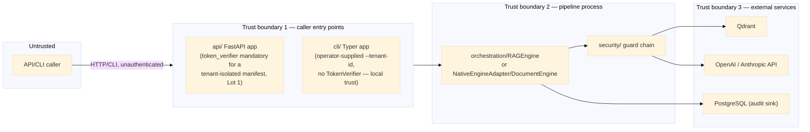

# Threat Model

**Status:** Lot 11a deliverable (`docs/refactoring-plan.md` Phase C) — a paper deliverable, no
enforcement code. Extends [security.md](security.md)'s attack-surface table with assets, trust
boundaries, actors, and a STRIDE pass, and cross-references each threat to its current mitigation
(if any) or the lot that owns closing it. Read alongside
[data-classification-policy.md](data-classification-policy.md), which this model assumes as the
sensitivity vocabulary for "what's at risk."

## 1. Assets

| Asset | Where it lives today | Classification (§ data-classification-policy.md) |
|---|---|---|
| Ingested source documents / chunks | Vector store (Qdrant) + in-memory BM25 index (`retrieval/`) | Caller-determined; defaults to `restricted` once Lot 11b enforces a default |
| Query text | In-flight only (`core.models.query.Query`); not persisted beyond `Trace`/`AuditEvent` | Same as the document(s) it's asking about |
| Generated answers + citations | Returned to caller; recorded in `Trace` (Lot 10) | Inherits from source chunks used |
| Trace/telemetry data | Wherever `Telemetry.record_trace()` is configured to sink (in-memory by default) | `internal` — performance data, not by itself confidentiality-bearing, but can leak query/answer content via `TraceStep.metadata` if a caller isn't careful |
| Compliance audit events | `InMemoryAuditSink` / `PostgresAuditSink` (Lot 10) | `internal` — allowlist-enforced payload (`contracts/audit.py`) specifically to keep this asset itself from becoming a `restricted`-data leak vector |
| Manifest configuration (incl. resolved secrets) | YAML on disk, resolved via `app/config_resolution.py` (Lot 9) | `restricted` if it contains resolved `secret://` values in memory; the YAML file itself should contain only references, never raw secrets (`.claude/rules/security-layers.md` Layer 05) |
| LLM/embedding provider API keys | Environment variables, resolved via `EnvSecretResolver`/future OpenBao backend | `restricted` |
| Policy definitions (`security/policies/`) | YAML files loaded by `PolicyEngine` | `internal` — not sensitive data, but a tampering target (see T3 below) |

## 2. Trust boundaries

**Boundary 1, updated by Lot 1 (tenant fail-closed, 2026-08-10):** this obligation applies to the
**API only** — the CLI has no `TokenVerifier` concept at all; both `mrag ask --tenant-id` and
`mrag ingest --tenant-id` trust the value an operator running the command directly supplies, the
same local-trust model as any other CLI flag, not a verified identity. For the API, authentication
(`create_app(..., token_verifier=...)`, Lot 16a) is no longer unconditionally optional. It
remains optional only for a manifest with no `governance.tenant_policy` wired (unauthenticated
local/dev use is still the default posture for those). For a manifest that *does* wire a
`tenant_policy` — `secure-enterprise-rag.yaml` and any tenant-isolated deployment — a
`token_verifier` is effectively mandatory: `create_app()` refuses to start without one, rather
than serving a tenant-isolated pipeline unauthenticated. This closes the gap this section
originally described (`docs/refactoring-plan.md` §2, "API security | No auth..."), for that one
case; an unauthenticated single-tenant deployment (no `tenant_policy` at all) remains a real,
accepted open boundary by design, not a gap.

**Boundary 3** already has partial mitigation via lazy-imported adapters and manifest-driven
configuration (no hardcoded credentials, per `.claude/rules/adapters.md` §5), but no TLS/mTLS
policy is defined for these outbound calls — flagged as a gap in §5 below, owned by Lot 16c
(deployment runbooks).

## 3. Threat actors

| Actor | Motivation | Capability |
|---|---|---|
| Anonymous internet caller (once deployed publicly) | Data exfiltration, service abuse, cost exhaustion (LLM API spend) | Whatever `api/`'s exposed surface allows — unrestricted only for a manifest with no `tenant_policy` wired; a tenant-isolated manifest requires a valid bearer token (Lot 1) or the API refuses to start. Rate limiting: see §4's Denial-of-service row below for current status. |
| Authenticated-but-wrong-tenant caller (post Lot 11b) | Cross-tenant data access, intentional or accidental | API/CLI access with valid credentials for a *different* tenant |
| Malicious document submitter | Prompt injection via poisoned corpus content, indirect exfiltration | Ability to get a document ingested (depends entirely on deployment — this framework does not itself define who can call `ingest`) |
| Insider with `.env`/manifest access | Credential theft, policy tampering | Local filesystem or CI/CD access |
| Compromised dependency (supply chain) | Arbitrary code execution via a malicious package version | Whatever the compromised package's import-time/runtime code can do — relevant given `pyproject.toml`'s `>=` version bounds (Lot 16b: SBOM, vulnerability gates) |

## 4. STRIDE analysis

Each row: the threat, the concrete mechanism in *this* codebase, current mitigation (if any), and
the owning lot if still open.

| STRIDE | Threat | Concrete mechanism here | Current mitigation | Owning lot if open |
|---|---|---|---|---|
| **S**poofing | Caller impersonates another tenant/user | For a manifest with no `tenant_policy` wired, no identity verification on `api/`'s `/answer`/`/retrieve` — an accepted, by-design gap for unauthenticated single-tenant deployments | `TokenVerifier` (Lot 16a) + fail-closed `TenantIsolationPolicy` (Lot 11b), and mandatory for any manifest that wires `tenant_policy` (Lot 1: `create_app()` refuses to start without a verifier in that case) | Closed for tenant-isolated manifests; open by design otherwise |
| **T**ampering | Malicious document poisons the corpus to bias retrieval/generation | Any document reaching `RAGEngine.ingest()` is trusted as-is; no provenance check | `docs/architecture/security.md` names "Provenance tracking + source allowlist" as the target mitigation — **not implemented** | Not yet assigned a lot; flag for Lot 17 scope review |
| **T**ampering | Policy YAML edited to weaken enforcement | `PolicyEngine` loads whatever YAML is on disk at startup, no integrity check | Git history provides an audit trail of changes (`.claude/rules/security-layers.md` Layer 07), but no runtime tamper-detection | Open — candidate for Lot 16c (deployment hardening) |
| **R**epudiation | A tenant denies having asked a query that leaked data, or denies a policy violation occurred | `Trace` (performance) + `AuditEvent` (compliance) now both exist (Lot 10), with `RUN_SUCCEEDED`/`RUN_FAILED` evidence and a `correlation_id` | Partially mitigated by Lot 10; full non-repudiation needs Lot 11b's identity propagation so `AuditEvent.actor`/`tenant_id` are trustworthy, not caller-supplied metadata | Lot 11b |
| **I**nformation disclosure | Internal exception text/stack detail returned to caller | `api/__init__.py`'s `/answer` handler: `raise HTTPException(status_code=500, detail=str(exc))` — the raw exception string, verbatim, is returned in the HTTP response body today | None | Lot 16a ("typed safe errors" — named explicitly in `docs/refactoring-plan.md`) |
| **I**nformation disclosure | PII/secrets in generated answers or logs | `security/redaction/patterns.py`'s `PatternRedactor` (post-generation, opt-in per manifest) | Partial — pattern coverage is FR/US-only and opt-in, not mandatory; not yet applied to what reaches `Trace`/`AuditEvent` metadata | Lot 11c ("apply configured redaction before storage, logging, and external calls") |
| **I**nformation disclosure | Audit/trace payload itself leaks raw PII | `AuditEvent.payload`'s allowlist (`contracts/audit.py`, Lot 10) blocks unlisted keys, but an allowlisted key like `query_text_redacted` is only as safe as the caller actually redacting before setting it — no enforcement that it *is* redacted yet | Structural mitigation exists (allowlist); behavioral guarantee is Lot 11c's | Lot 11c |
| **D**enial of service | Oversized or high-volume queries exhaust LLM budget or compute | `BasicSecurityGuard`'s `max_query_length` (default 4000 chars) blocks oversized single queries; **no rate limiting** across requests | Partial | Lot 16a ("rate and request-size limits") |
| **E**levation of privilege | A `PolicyEngine` failure is treated as "allow" instead of "deny" | Today, `PolicyEngine` isn't wired into the request path at all (V2.0/policy-as-code is not yet load-bearing per `docs/refactoring-plan.md`'s current-state gaps) — so this specific failure mode doesn't exist yet, but must be designed fail-closed when it is | N/A yet — explicitly called out as a Lot 11b acceptance criterion ("policy-engine errors deny by default, never allow by default") | Lot 11b |
| **E**levation of privilege | Cross-tenant read via a shared vector-store collection | `QdrantStore` takes one `collection` name per manifest, with no tenant-scoped filtering inside a collection | None | Lot 11b |

## 5. Residual/open items not assigned to a specific lot yet

- **Document provenance / anti-poisoning** (STRIDE Tampering, corpus): named as a target mitigation
  in `docs/architecture/security.md` since V1 but never implemented; needs an owning lot decision
  — flag for review at Lot 17 (prototype retirement and final consolidation), where the full
  remaining gap list gets reconciled against the closing programme.
- **TLS/mTLS for outbound calls to Qdrant/LLM providers/PostgreSQL**: not currently specified
  anywhere in the codebase or manifests; candidate for Lot 16c deployment runbooks.
- **Supply-chain integrity** (STRIDE Tampering, dependencies): `pyproject.toml` uses open `>=`
  bounds; Lot 16b already owns "SBOM, vulnerability and licence gates."

## 6. What this lot deliberately does not do

Per `docs/refactoring-plan.md`'s own scoping ("Paper-and-fixture deliverable; no enforcement code
yet"), this document does not change `PolicyEngine`, `SecurityGuard`, `RAGEngine`, or any
manifest schema. It is the reference the next three lots (11b, 11c, and the security-relevant
parts of 16a) implement against.
