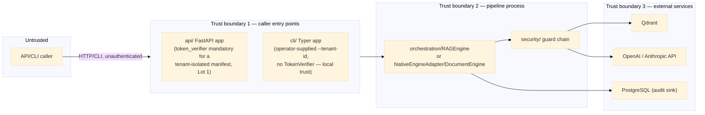

# Threat Model

**Status:** originally a Lot 11a deliverable (`docs/refactoring-plan.md` Phase C), written when
this was a paper deliverable with no enforcement code behind it yet. It is kept current here as of
the `docs/refactoring-plan.md` change log through **Lot 18** — nearly every item this document
originally listed as open (Lots 11b, 11c, 12a, 12b, 16a, 16b, 16c) has since shipped real code;
see each STRIDE row below for what changed and what, concretely, remains open today. Extends
[security.md](security.md)'s attack-surface table with assets, trust boundaries, actors, and a
STRIDE pass, and cross-references each threat to its current mitigation (if any) or the lot that
owns closing it. Lot 20 now owns the still-open classification-aware provider-egress boundary;
ADR-0015 is accepted, but planned Lots 21–22 do not yet mitigate threats. Read alongside
[data-classification-policy.md](data-classification-policy.md), which this model assumes as the
sensitivity vocabulary for "what's at risk." If you're reading this to judge whether a specific
control is real, don't trust the prose alone — the file paths and function names cited in each row
are the actual, current source; a claim here that drifts from the code is a bug in this document,
not in the code.

## 1. Assets

| Asset | Where it lives today | Classification (§ data-classification-policy.md) |
|---|---|---|
| Ingested source documents / chunks | Vector store (Qdrant, dense) + lexical index — manifest-selected: in-memory BM25 (`retrieval/retrievers/bm25.py`, the `bm25-memory` default, process-local) or a second, dedicated persistent Qdrant collection (`adapters/vectorstores/qdrant_sparse_store.py`, `sparse-qdrant` — `manifests/presets/secure-enterprise-rag.yaml`'s choice; carries the same tenant-partitioning and at-rest exposure as the dense collection, unlike the in-memory default) | Caller-determined; defaults to `restricted` once Lot 11b enforces a default |
| Query text | In-flight only (`core.models.query.Query`); not persisted beyond `Trace`/`AuditEvent` | Same as the document(s) it's asking about |
| Generated answers + citations | Returned to caller; recorded in `Trace` (Lot 10) | Inherits from source chunks used |
| Trace/telemetry data | Wherever `Telemetry.record_trace()` is configured to sink (in-memory by default) | `internal` — performance data, not by itself confidentiality-bearing, but can leak query/answer content via `TraceStep.metadata` if a caller isn't careful |
| Compliance audit events | `InMemoryAuditSink` / `PostgresAuditSink` (Lot 10) | `internal` — allowlist-enforced payload (`contracts/audit.py`) specifically to keep this asset itself from becoming a `restricted`-data leak vector |
| Feedback and review records | In-memory or PostgreSQL feedback/review stores (ADR-0014) | `internal` by default; correction text may be `restricted` and is refused unless redaction is configured |
| Manifest configuration (incl. resolved secrets) | YAML on disk, resolved via `app/config_resolution.py` (Lot 9) | `restricted` if it contains resolved `secret://` values in memory; the YAML file itself should contain only references, never raw secrets (`.claude/rules/security-layers.md` Layer 05) |
| LLM/embedding provider API keys | Environment variables, resolved via `EnvSecretResolver`/future OpenBao backend | `restricted` |
| Policy definitions (`security/policies/`) | YAML files loaded by `PolicyEngine` | `internal` — not sensitive data, but a tampering target (see T3 below) |

## 2. Trust boundaries

**Boundary 1 (tenant fail-closed, Lot 1; hardened further by Lot 16a):** this obligation applies to
the **API only** — the CLI has no `TokenVerifier` concept at all; both `mrag ask --tenant-id` and
`mrag ingest --tenant-id` trust the value an operator running the command directly supplies, the
same local-trust model as any other CLI flag, not a verified identity.

For the API, authentication (`create_app(..., token_verifier=...)`) is no longer unconditionally
optional. It remains optional only for a manifest with no `governance.tenant_policy` wired
(unauthenticated local/dev use is still the default posture for those). For a manifest that
*does* wire a `tenant_policy` — `secure-enterprise-rag.yaml` and any tenant-isolated deployment —
a `token_verifier` is effectively mandatory: `create_app()` (`src/modular_rag/api/__init__.py`)
refuses to start without one, rather than serving a tenant-isolated pipeline unauthenticated.

Lot 16a additionally wired `RateLimitMiddleware` and `MaxBodySizeMiddleware`
(`src/modular_rag/api/middleware.py`) onto this same boundary — see the Denial-of-service row in
§4 below. An unauthenticated single-tenant deployment (no `tenant_policy` at all) remains a real,
accepted open boundary by design, not a gap.

**Boundary 3** has partial mitigation via lazy-imported adapters and manifest-driven configuration
(no hardcoded credentials, per `.claude/rules/adapters.md` §5) and Lot 16b added dependency
scanning (SBOM + `pip-audit` in CI) for the client libraries that make these outbound calls. No
TLS/mTLS *policy* is defined or enforced for the calls themselves, though — `docs/guides/
deployment.md`'s own examples use `https://` endpoint URLs for Keycloak/Qdrant, which is a
convention shown in an example, not a check this codebase performs or requires. Still a real,
open gap — see §5 below.

More importantly, current output redaction occurs after model generation. It cannot prevent raw
query/context or embedding input from crossing Boundary 3. Lot 20 plans a deny-by-default,
classification-aware decision before every owned remote adapter and delegated-engine handoff.
Until then, restricted data must remain local or be protected by deployment/provider controls
outside this framework.

## 3. Threat actors

| Actor | Motivation | Capability |
|---|---|---|
| Anonymous internet caller (once deployed publicly) | Data exfiltration, service abuse, cost exhaustion (LLM API spend) | Whatever `api/`'s exposed surface allows — unrestricted only for a manifest with no `tenant_policy` wired; a tenant-isolated manifest requires a valid bearer token (Lot 1) or the API refuses to start. Every deployment, tenant-isolated or not, now also sits behind `RateLimitMiddleware`/`MaxBodySizeMiddleware` (Lot 16a) — see §4's Denial-of-service row for the specifics. |
| Authenticated-but-wrong-tenant caller (post Lot 11b) | Cross-tenant data access, intentional or accidental | API/CLI access with valid credentials for a *different* tenant |
| Malicious document submitter | Prompt injection via poisoned corpus content, indirect exfiltration | Ability to get a document ingested (depends entirely on deployment — this framework does not itself define who can call `ingest`) |
| Insider with `.env`/manifest access | Credential theft, policy tampering | Local filesystem or CI/CD access |
| Compromised dependency (supply chain) | Arbitrary code execution via a malicious package version | Whatever the compromised package's import-time/runtime code can do — relevant given `pyproject.toml`'s `>=` version bounds (Lot 16b: SBOM, vulnerability gates) |

## 4. STRIDE analysis

Each row: the threat, the concrete mechanism in *this* codebase, current mitigation (if any), and
the owning lot if still open.

| STRIDE | Threat | Concrete mechanism here | Current mitigation | Owning lot if open |
|---|---|---|---|---|
| **S**poofing | Caller impersonates another tenant/user | For a manifest with no `tenant_policy` wired, no identity verification on `api/`'s `/answer`/`/retrieve` — an accepted, by-design gap for unauthenticated single-tenant deployments | `TokenVerifier` (`KeycloakTokenVerifier`, Lot 11b) + fail-closed `TenantIsolationPolicy`, mandatory for any manifest that wires `tenant_policy` (Lot 1: `create_app()` refuses to start without a verifier in that case, confirmed at `api/__init__.py` lines ~95–105) | **Closed** for tenant-isolated manifests; open by design otherwise |
| **T**ampering | Malicious document poisons the corpus to bias retrieval/generation | Any document reaching `RAGEngine.ingest()`/`ingest_chunks()` is trusted as-is; no provenance check | `docs/architecture/security.md` names "Provenance tracking + source allowlist" as the target mitigation — **still not implemented**; grepping the codebase for `provenance`/`allowlist` outside the audit-payload allowlist and this document turns up nothing | **Open** — not assigned to a specific lot; Lot 17's prototype-retirement pass did not pick this up either, see §5 |
| **T**ampering | Policy YAML edited to weaken enforcement | `PolicyEngine` loads whatever YAML is on disk at startup (from a manifest's `governance.policy_engine.config.policies`), no integrity check | Git history provides an audit trail of changes (`.claude/rules/security-layers.md` Layer 07), but no runtime tamper-detection | **Open** — no lot has picked this up through Lot 18 |
| **R**epudiation | A tenant denies having asked a query that leaked data, or denies a policy violation occurred | `Trace` (performance) + `AuditEvent` (compliance) both exist (Lot 10), with `RUN_SUCCEEDED`/`RUN_FAILED`/`GUARD_DECISION` evidence and a `correlation_id`. `AuditEvent.tenant_id` is now populated from the *verified* identity when a `token_verifier` is configured (Lot 11b: `query.tenant_id` flows from `identity.tenant_id`, not a caller-supplied header the pipeline trusts blindly) | **Partially closed.** The tenant side of non-repudiation is trustworthy for an authenticated deployment. The *who* side is not: `AuditEvent.actor` (`contracts/audit.py`) is a real field, but `orchestration/engine.py`'s `_record_audit_event()` never sets it — every audit row's `actor` is `None`, even though `identity.user_id` is available at the API layer and passed through to `pipeline.answer(...)`. A tenant can be tied to an event; a specific user inside that tenant cannot yet | **Open** — the `actor` field wiring specifically; not currently named as an explicit acceptance criterion in any lot through 18 |
| **I**nformation disclosure | Internal exception text/stack detail returned to caller | `api/__init__.py`'s `/answer` and `/retrieve` handlers now call `to_http_exception(exc)` (`api/errors.py`), a typed mapping from internal exception types to safe HTTP status/detail pairs, instead of interpolating `str(exc)` directly into the response | **Closed** (Lot 16a) | — |
| **I**nformation disclosure | PII/secrets in generated answers or logs | `security/redaction/patterns.py`'s `PatternRedactor` (post-generation, opt-in per manifest) | Pattern coverage is still FR/US-only and still opt-in, not mandatory — that part is unchanged. What *did* change (Lot 11c): when a `redactor` is configured, `RAGEngine._record_audit_event()` now redacts query text into `query_text_redacted` *before* it's added to the audit payload (`orchestration/engine.py`, confirmed), closing the "not yet applied to Trace/AuditEvent metadata" half of this row | **Partially closed** — redaction-into-audit-payload is done; redaction *coverage* (more locales, mandatory-by-default) remains open, unassigned |
| **I**nformation disclosure | Audit/trace payload itself leaks raw PII | `AuditEvent.payload`'s allowlist (`contracts/audit.py`, Lot 10) blocks unlisted keys | Structural mitigation (allowlist) plus, since Lot 11c, the redaction-before-insert behavior described in the row above — an allowlisted `query_text_redacted` key is now actually redacted by the same code path that populates it, not merely named as if it should be | **Closed** for the query-text case; other payload fields still rely on caller discipline |
| **D**enial of service | Oversized or high-volume queries exhaust LLM budget or compute | `BasicSecurityGuard`'s `max_query_length` (default 4000 chars) blocks oversized single queries. `RateLimitMiddleware` (429 + `Retry-After` header) and `MaxBodySizeMiddleware` (413) are now wired in `create_app()` (`api/middleware.py`, `api/__init__.py`) via the `rate_limit_per_minute`/`max_body_bytes` parameters | **Closed** at the HTTP-request level (Lot 16a). Not closed: no per-tenant or per-token quota — the rate limit is a flat, process-wide ceiling, so one caller can still exhaust another's fair share within that ceiling | Per-tenant quotas: open, unassigned |
| **E**levation of privilege | A `PolicyEngine` failure is treated as "allow" instead of "deny" | `PolicyEngine.enforce_query()` **is** wired into the request path today — `orchestration/engine.py`'s `_run_steps()` calls `self._c.policy_engine.enforce_query(query)` unconditionally when a `policy_engine` is configured (confirmed directly in the source; this contradicts what an earlier version of this document claimed) | **Closed** — Lot 11b's acceptance criterion ("policy-engine errors deny by default, never allow by default") shipped alongside the wiring itself, not as a separate later step | — |
| **E**levation of privilege | Cross-tenant read via a shared vector-store collection | `QdrantStore.retrieve()` (`adapters/vectorstores/qdrant_store.py`) now takes a `tenant_id` parameter and applies a Qdrant payload `FieldCondition` filter (`must=[FieldCondition(key="tenant_id", match=MatchValue(value=tenant_id))]`) so cross-tenant points are excluded *at query time*, on top of `TenantIsolationPolicy.filter_chunks()`'s belt-and-suspenders post-filter | **Closed** (Lot 12b) | — |

## 5. Residual/open items, as of Lot 18

Everything below is confirmed still open by direct inspection of the current codebase — not
carried forward from the original Lot 11a version of this document without re-checking:

- **Document provenance / anti-poisoning** (STRIDE Tampering, corpus): named as a target mitigation
  in `docs/architecture/security.md` since V1, still not implemented. Lot 17's prototype-retirement
  pass (`docs/refactoring/lot-17-prototype-retirement.md`) did not pick this up — its scope was
  removing dead code, not adding a new control. Still genuinely unassigned to any lot.
- **`AuditEvent.actor` never populated** (STRIDE Repudiation): see §4's Repudiation row above.
  `identity.user_id` reaches `RAGEngine.answer()` as a parameter but is never threaded into the
  `AuditEvent` constructed in `_record_audit_event()`. A small, well-scoped fix if prioritized —
  the field and the data it needs already exist, only the wiring between them is missing.
- **Policy YAML integrity** (STRIDE Tampering): no runtime tamper-detection for
  `governance.policy_engine.config.policies`; git history is the only audit trail. Still open,
  unassigned through Lot 18.
- **TLS/mTLS for outbound calls to Qdrant/LLM providers/PostgreSQL**: still no enforced policy —
  `docs/guides/deployment.md`'s examples use `https://` URLs by convention, but nothing in this
  codebase validates or requires that. Lot 16c shipped backup/restore/rollback runbooks and a
  load-test script, not a TLS policy; still open.
- **Per-tenant / per-token rate-limit quotas**: Lot 16a's `RateLimitMiddleware` is a flat,
  process-wide ceiling (see §4's Denial-of-service row) — one caller can still starve another
  within that shared ceiling. Open, unassigned.
- **Supply-chain integrity** (STRIDE Tampering, dependencies): mostly closed. Lot 16b added a CI
  supply-chain job (`pip-audit`, SBOM generation, licence gate) and a `requirements-lock.txt`
  (generated via `uv pip compile`) now exists at the repo root for reproducible installs —
  `pyproject.toml`'s own dependency bounds are still open `>=` ranges, which is normal (the lock
  file, not the source bounds, is what pins exact resolved versions). Two license findings from
  Lot 16b (pymupdf's AGPL license, and the redistribution rights of the 56 research PDFs under
  `.claude/research-papers/`) remain escalated to an owner decision, not resolved by that lot.

## 6. What this document does and does not cover

This document is a threat *model* — assets, trust boundaries, actors, and a STRIDE pass with
current mitigation status. It does not itself change `PolicyEngine`, `SecurityGuard`, `RAGEngine`,
or any manifest schema; it is the reference the security-relevant lots (11b, 11c, 12b, and the
security parts of 16a) were implemented against, and — per the note at the top of this
document — the reference this document itself is kept in sync with as those lots land. If you find
a row here that no longer matches the code, that's a signal to fix this document, not to trust the
stale claim.
