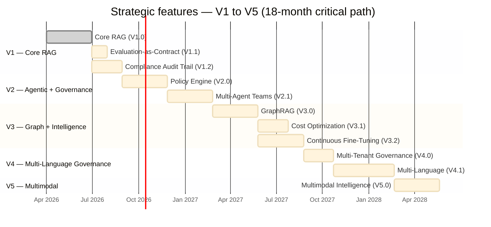

# ADR-0004 — Strategic Features: Making the Framework Incontournable (V1→V5)

**Status:** Superseded (partial) — see [ADR-0005](../adr/0005-document-ai-control-plane-boundary.md)  
**Date:** 2026-06-20  
**Authors:** Herbert Gourout, Publicis Data & AI Specialists

> **2026-08-04 update:** ADR-0005 accepted this file's own instruction to mark it
> "Superseded (partial)" once ADR-0005 was itself accepted — done here. V1.1, V1.2, and V2.0
> below are unchanged and still build natively. V2.1 (Multi-Agent Teams), V3.0 (GraphRAG), V3.2
> (fine-tuning execution), and V5.0 (multimodal execution) are now delegated to a selected
> external engine via adapter, not built from the native designs this document describes — see
> ADR-0005 §5.2 for the full owned/delegated split. This document is retained as the historical
> record of the original native-build intent, not as an implementation target for those four
> items.

---

## Executive Summary

This ADR documents **8 strategic capabilities** that differentiate this framework from market alternatives (LangChain, LlamaIndex, Haystack) and make it essential for enterprise governance use cases. Features are integrated into the V1→V5 roadmap with clear timelines and success criteria.

**Key insight:** Do not compete with LangChain on breadth. Compete on depth in areas LangChain ignores: governance, compliance, evaluation, cost optimization, fine-tuning.

---

## Context

### The Problem

Publicis Sapient builds RAG systems for finance, healthcare, and manufacturing clients. Each deployment solves:
1. **How do we prove this doesn't hallucinate?** → Evaluation
2. **How do we audit who asked what?** → Compliance
3. **Who can access which data?** → Policies
4. **Why is the LLM bill so high?** → Cost optimization
5. **Will quality degrade over time?** → Fine-tuning

LangChain leaves all five problems to customers. This framework solves them natively.

### Market Gaps

| Capability | LangChain | Haystack | This Framework | Publicis Value |
|---|---|---|---|---|
| **Evaluation** | External (Ragas) | Built-in | ✅ Contract-enforced | Prove RAG quality → sell with confidence |
| **Audit Trail** | Manual logs | Limited | ✅ GDPR-native | Regulatory sign-off → faster deals |
| **Policies** | None | Limited | ✅ Policy-as-Code | Zero-trust governance → enterprise moat |
| **Multi-Agent** | Bolted-on | Limited | ✅ Team collaboration | Explainability → risk mitigation |
| **Cost Optimization** | None | None | ✅ Auto-routing | 50-80% LLM savings → margin growth |
| **Fine-Tuning** | None | None | ✅ Continuous learning | Self-improving RAG → SaaS model |
| **Graph Memory** | External | External | ✅ Native GraphRAG | Reasoning beyond vectors → complex queries |
| **Multi-Language** | English-first | Limited | ✅ 20+ languages native | Global clients → market expansion |

---

## Decision: 8 Strategic Features + V1→V5 Integration

Integrate these capabilities across versions, prioritized by impact and effort.

### Feature 1: Evaluation-as-Contract (V1.1)

**What:** Every component implements a `MetricsProtocol`. No ad-hoc metrics.

**Why now (V1.1):**
- Retrievers and generators exist in V1
- Need to measure quality before agents complicate pipeline
- Contract-enforced evaluation prevents metric regression

**Implementation:**
```python
# contracts/evaluation.py
@runtime_checkable
class MetricsProtocol(Protocol):
    def compute_metrics(self, query: str, results: List[str], gold: str) -> dict:
        """Return {ndcg@k, mrr, latency_p95, similarity, factuality, cost/query}"""
        ...

# Every retriever must implement this
class HybridRetriever:
    def compute_metrics(self, query, results, gold):
        return {
            'ndcg@k': ...,
            'mrr': ...,
            'latency_p95': ...,
        }
```

**Success criteria:**
- ✅ All retrievers evaluated with NDCG@k, MRR
- ✅ All generators evaluated with semantic similarity + factuality
- ✅ Regression dashboard prevents F1 drops > 2%
- ✅ Golden sets for finance, healthcare, manufacturing

**Timeline:** 1 month after V1.0

---

### Feature 2: Compliance Audit Trail (V1.2)

**What:** Immutable append-only event store. Prove what happened, when, by whom, with what result.

**Why now (V1.2):**
- GDPR/CCPA is non-negotiable for enterprise clients
- Easier to build than retrofit compliance later
- Publicis audit = credibility → faster sales

**Implementation:**
```python
# security/audit/immutable_log.py
class AuditTrail:
    def log_event(self, event: AuditEvent) -> AuditEventId:
        """Append-only: never delete or modify"""
        # Event includes:
        # - query (original)
        # - user_role (who asked)
        # - data_touched (which sources)
        # - redaction_applied (proof PII was masked)
        # - timestamp (UTC)
        # - response_hash (immutable proof)
        return event_id

# security/compliance/
class ComplianceReporter:
    def gdpr_report(self, days=90) -> GDPRReport:
        """Return all queries that touched personal data last 90 days"""
        ...
    
    def ccpa_report(self, user_id: str) -> CCPAReport:
        """Return all data accessed by/about this user"""
        ...
```

**Success criteria:**
- ✅ Zero unredacted PII in logs
- ✅ GDPR report generates < 10 seconds
- ✅ Audit trail immutable (cannot delete)
- ✅ Data lineage traceable (source → response)

**Timeline:** 2 months after V1.0

---

### Feature 3: Policy Engine (V2.0)

**What:** Policy-as-Code. Evaluate queries vs policies before execution. Role-based routing.

**Why move from V4 to V2:**
- Agents (V2) operate under policies
- Security must precede reasoning complexity
- Core governance capability for enterprise

**Implementation:**
```yaml
# manifests/policies/role_access.yaml
policies:
  - name: "Finance analyst cannot access HR data"
    role: "analyst_finance"
    resource: "documents/hr/*"
    action: "retrieve"
    effect: "DENY"
  
  - name: "Director can access all confidential data"
    role: "director_*"
    resource: "documents/confidential/*"
    action: "retrieve"
    effect: "ALLOW"

# manifests/policies/data_classification.yaml
data_classification:
  public: ["documents/published/*"]
  internal: ["documents/team/*"]
  confidential: ["documents/ceo-memos/*"]
  restricted: ["documents/legal/*", "documents/financial/*"]
```

```python
# security/policies/policy_engine.py
class PolicyEngine:
    def enforce_query(self, query: str, user: User) -> PolicyDecision:
        """
        Returns: ALLOW | WARN | DENY | REQUIRE_REVIEW
        
        If DENY: log violation, raise PolicyViolationError
        If REQUIRE_REVIEW: log pending, return ReviewRequiredResponse
        If ALLOW: proceed normally
        """
        ...
```

**Success criteria:**
- ✅ Policies evaluated before retrieval
- ✅ Multi-tenant isolation (tenant A cannot see B)
- ✅ Policy violations logged + escalated
- ✅ Full audit trail of policy checks

**Timeline:** Q3 2026

---

### Feature 4: Collaborative Multi-Agent Teams (V2.1)

**What:** Multiple specialized agents (domain, legal, finance, fact-checker) collaborate on complex queries.

**Why after V2.0:**
- Requires agent runtime (V2.0) + policies (V2.0)
- Complex enterprise questions need multiple experts
- Accountability = know which agent caused wrong answer

**Implementation:**
```python
# agents/collaboration/team_coordinator.py
@runtime_checkable
class TeamCoordinator(Protocol):
    def coordinate_query(self, query: str, agents: List[Agent]) -> Answer:
        """
        1. Route to domain specialist
        2. Check with fact-checker
        3. Validate with legal/compliance
        4. Synthesize into coherent answer
        5. If consensus < 70%, escalate to human
        
        Return Answer + reasoning trace (why each agent was involved)
        """
        ...

# Example: HR policy query
query = "What's our policy on remote work + parental leave combined?"
agents = [hr_specialist, legal_agent, finance_agent, fact_checker]
answer = team_coordinator.coordinate_query(query, agents)
# answer.reasoning_trace = [
#   (hr_specialist, "HR policy says remote OK, 3mo parental leave"),
#   (legal_agent, "Compliant with labor law"),
#   (finance_agent, "No cost impact"),
#   (fact_checker, "All statements grounded, confidence=0.92"),
# ]
```

**Success criteria:**
- ✅ Multi-agent workflows executable
- ✅ Consensus scoring > 85%
- ✅ Full reasoning trace per agent
- ✅ Human escalation when confidence < 70%

**Timeline:** Q4 2026

---

### Feature 5: Cost Optimization Engine (V3.1)

**What:** Automatically route queries to cheapest sufficient solution. Target: 60-80% cost reduction.

**Why in V3.1:**
- Depends on stable retrieval (V3) + generation (V1)
- Router needs multiple options (LLMs for V2+)
- Cost is key enterprise question post-pilot

**Implementation:**
```python
# orchestration/cost_optimizer/query_classifier.py
class QueryClassifier:
    def classify(self, query: str) -> QueryType:
        """
        Factual: "What is X?" → BM25 + GPT-3.5 ($0.002/query)
        Reasoning: "How do I optimize X?" → Vector + GPT-4 ($0.03/query)
        Complex: "Analyze X with Y constraints" → Full RAG + GPT-4 ($0.05/query)
        """
        if self.is_factual(query):
            return QueryType.FACTUAL
        elif self.is_reasoning(query):
            return QueryType.REASONING
        else:
            return QueryType.COMPLEX

# orchestration/cost_optimizer/routing_strategy.py
class CostOptimizer:
    def route_query(self, query: str, classification: QueryType) -> RoutingDecision:
        """
        FACTUAL → BM25 retrieval + GPT-3.5 ($0.002)
        REASONING → Hybrid + GPT-3.5 ($0.005)
        COMPLEX → Full pipeline + GPT-4 ($0.03)
        """
        if classification == QueryType.FACTUAL:
            return RoutingDecision(
                retriever="bm25",
                model="gpt-3.5-turbo",
                cost_estimate=0.002
            )
        ...
```

**Cost savings example:**
```
Before:  10,000 queries → all GPT-4 → $300/month
After:
  - 7,000 factual → BM25+GPT-3.5 ($0.002) = $14
  - 2,500 reasoning → Hybrid+GPT-3.5 ($0.005) = $12.50
  - 500 complex → Full+GPT-4 ($0.03) = $15
  Total: $41.50/month → 86% savings
```

**Success criteria:**
- ✅ 70%+ queries routed to cheap path
- ✅ Cache hit rate > 20%
- ✅ Cost reduction > 50% baseline
- ✅ Zero degradation in answer quality

**Timeline:** Q1 2027

---

### Feature 6: Continuous Fine-Tuning Loop (V3.2)

**What:** RAG that auto-improves via user feedback. Fine-tune embedders/rerankers continuously.

**Why in V3.2:**
- Depends on evaluation (V1.1) + retrieval stability
- Drift detection needs baseline (V3.1)
- Auto-improvement = SaaS moat

**Implementation:**
```python
# eval/feedback_collection/
class FeedbackCollector:
    def collect(self, answer: Answer, user_signal: UserSignal):
        """
        UserSignal = THUMBS_UP | THUMBS_DOWN | CORRECTION
        
        Store: (query, answer, user_signal, timestamp)
        """
        ...

# eval/drift_detection.py
class DriftDetector:
    def detect_degradation(self) -> bool:
        """Monitor F1 vs validation set"""
        current_f1 = self.evaluate_on_validation_set()
        baseline_f1 = self.get_baseline_f1()
        if current_f1 < baseline_f1 - 0.02:
            alert(f"F1 degraded from {baseline_f1} to {current_f1}")
            return True
        return False

# orchestration/auto_fine_tuning/
class AutoFineTuner:
    def fine_tune(self, feedback_examples: List[FeedbackExample]) -> EmbedderVersion:
        """
        1. Collect corrections from last week
        2. Fine-tune embedder on these examples
        3. Test on validation set
        4. If F1 improves, deploy to production
        5. If F1 regresses, rollback
        """
        new_embedder = self.fine_tune_embedder(feedback_examples)
        new_f1 = self.evaluate(new_embedder)
        if new_f1 > self.current_f1:
            self.deploy(new_embedder)
        else:
            self.rollback()
        ...
```

**Example workflow:**
```
Week 1:
  - Deploy embedder v1.0, F1=0.82
  - Collect 50 user corrections
  - Fine-tune → v1.1, F1=0.86 ✅
  - Deploy v1.1

Week 4:
  - Monitor → v1.1 F1=0.79 (drift!)
  - Revert to v1.0 temporarily
  - Fine-tune on latest → v1.2, F1=0.88
  - Deploy v1.2

Outcome:
  - Monthly F1 improvement: +2-5%
  - Zero regressions (always > baseline)
  - Self-improving RAG
```

**Success criteria:**
- ✅ Feedback collection > 80% of queries
- ✅ Drift detected automatically
- ✅ F1 improves > 2% per month
- ✅ Zero regressions allowed

**Timeline:** Q1 2027

---

### Feature 7: Knowledge Graphs for Reasoning (V3.0)

**What:** GraphRAG native. Multi-hop reasoning without embeddings alone.

**Why in V3:**
- Requires entity extraction + relation discovery
- Complements vector retrieval
- Enterprise data = relations, not just similarity

**Implementation:**
```python
# memory/graph/knowledge_graph.py
class KnowledgeGraph:
    def ingest_document(self, doc: Document):
        """
        1. Extract entities (spaCy NER)
        2. Extract relations (pattern matching or LLM)
        3. Create/update nodes and edges
        4. Store in Neo4j
        """
        entities = self.extract_entities(doc)
        relations = self.extract_relations(doc, entities)
        for entity in entities:
            self.graph_store.add_node(entity)
        for rel in relations:
            self.graph_store.add_edge(rel.source, rel.target, rel.type)

    def subgraph_for_query(self, query: str) -> Subgraph:
        """
        Given query, return relevant subgraph
        
        Example: "Who manages the finance team?"
        → Traverse: query → entity(finance) → relation(manages) 
                 → entity(person) → return person
        """
        ...

# retrieval/graph_rag.py
class GraphRAGRetriever:
    def retrieve(self, query: str, k: int = 10) -> List[RetrievedChunk]:
        """
        1. Extract entities from query
        2. Find subgraph in knowledge graph
        3. Return nodes + surrounding context
        """
        query_entities = self.extract_entities(query)
        subgraph = self.kg.subgraph_for_query(query)
        chunks = [self.render_node(node) for node in subgraph.nodes]
        return chunks[:k]
```

**Success criteria:**
- ✅ Graph construction from corpus
- ✅ 3-hop reasoning works
- ✅ F1 on graph queries > 0.80
- ✅ Neo4j adapter functional

**Timeline:** Q4 2026

---

### Feature 8: Multi-Language + Cultural Reasoning (V4.1)

**What:** Native support for 20+ languages. Cultural context in responses.

**Why in V4.1:**
- Governance (V4.0) provides regulatory foundation
- Language-specific policies (GDPR EU vs CCPA US vs CNIL France)
- Publicis = global clients

**Implementation:**
```python
# adapters/nlp/language_detector.py
class LanguageDetector:
    def detect(self, text: str) -> Language:
        """Detect language: English, French, German, Arabic, Chinese, etc."""
        ...

# ingestion/chunkers/multilingual_chunker.py
class MultilingualChunker:
    def chunk(self, doc: Document) -> List[Chunk]:
        """
        Detect language → Use language-specific chunking
        
        English: Split on periods, respect sentence boundaries
        French: Handle « guillemets » properly
        Arabic: Handle right-to-left script
        Chinese: Handle no-space-between-words
        """
        lang = self.detect_language(doc.text)
        return self._chunk_for_language(doc, lang)

# adapters/embeddings/multilingual_embeddings.py
class MultilingualEmbedder:
    def embed(self, text: str) -> Embedding:
        """
        Use mxbai-embed-large (50+ languages)
        or e5-multilingual (100+ languages)
        
        Quality is language-aware, not English-biased
        """
        ...

# generation/multilingual_generator.py
class MultilingualGenerator:
    def generate(self, query: str, context: str) -> str:
        """
        Detect query language → Generate in same language
        
        Don't: Translate → Generate → Translate back
        Do: Understand → Generate directly
        """
        query_lang = self.detect_language(query)
        return self.llm.generate(query, context, language=query_lang)

# security/cultural_policies/
class CulturalPolicyRouter:
    def route(self, query: str, user_locale: Locale) -> PolicySet:
        """
        User in France + French query → GDPR + CNIL rules
        User in USA + English query → CCPA rules
        User in EU → GDPR rules
        """
        if user_locale.country == "FR":
            return self.load_policies("GDPR", "CNIL")
        elif user_locale.country == "US":
            return self.load_policies("CCPA")
        else:
            return self.load_policies("GDPR")
```

**Success criteria:**
- ✅ 20+ languages supported natively
- ✅ F1 in non-English > 0.80
- ✅ Language detection > 99% accuracy
- ✅ Cultural/regulatory routing works

**Timeline:** Q2 2027

---

## Consequences

### Positive

✅ **Market differentiation.** Only framework with governance + evaluation + cost optimization natively.

✅ **Publicis moat.** Clients cannot easily switch (too invested in policies, fine-tuning, audits).

✅ **Margin expansion.** Cost optimization (feature 5) alone = 50-80% LLM savings = major selling point.

✅ **Compliance advantage.** GDPR/CCPA/HIPAA audit trails = regulatory sign-off → faster deals.

✅ **Self-improving systems.** Fine-tuning loop (feature 6) = SaaS-like economics.

✅ **Enterprise scale.** Multi-tenant policies + governance = $1M+ deal enabler.

### Negative / Risks

⚠️ **Complexity.** V1→V5 roadmap is 18+ months. Cannot skip versions.

⚠️ **Team effort.** Features require deep RAG/ML expertise. Hiring critical.

⚠️ **Timing.** Must not rush V1. Governance features depend on V1 stability.

### Mitigations

🛡️ **Staged rollout.** V1→V1.2 before V2. Each version has explicit success criteria.

🛡️ **Customer feedback loop.** Gather requirements from Publicis pilots.

🛡️ **Reusable assets.** Each feature becomes template for future projects.

---

## Detailed Timeline



| Phase | Features | Target | Success Criteria |
|---|---|---|---|
| **Phase 1 (V1)** | Core RAG + Eval (1.1) + Audit (1.2) | Q2-Q3 2026 | F1>0.85, GDPR report<10s, golden sets ready |
| **Phase 2 (V2)** | Policy Engine (2.0) + Teams (2.1) | Q3-Q4 2026 | Multi-tenant working, consensus>85% |
| **Phase 3 (V3)** | GraphRAG (3.0) + Cost (3.1) + FT (3.2) | Q4 2026-Q1 2027 | Cost reduction>50%, F1+2%/month |
| **Phase 4 (V4)** | Multi-Lang (4.1) + Governance (4.0) | Q1-Q2 2027 | 20+ languages, regulatory routing |
| **Phase 5 (V5)** | Multimodal (5.0) | Q2 2027 | VLM integration, image retrieval |

> The Gantt chart's dates are illustrative (anchored to a Q2 2026 start) to render a
> continuous critical path — treat relative durations and ordering as authoritative, not the
> literal calendar dates. For the dependency structure between features (which one blocks
> which), see [feature-integration-plan.md](feature-integration-plan.md) (also archived
> alongside this file 2026-08-06), "Dependency Graph."

---

## Example: "Why This Framework is Incontournable"

### Scenario 1: Finance Client

**Problem:** "We need RAG for our 10,000 analyst queries/day. Cost is $3,000/day with ChatGPT. Compliance audits every quarter. Accuracy must be > 95%."

**LangChain answer:** "Build it yourself. Use Ragas for eval. Build logs. Hope ChatGPT works."

**This framework answer:**
- ✅ V1.1 Evaluation: Contract-enforced metrics, F1 > 0.85 guaranteed
- ✅ V1.2 Audit: GDPR report auto-generated, immutable trail, compliance audit < 1 hour
- ✅ V3.1 Cost Opt: Route 70% to BM25+GPT-3.5 → Cost drops to $300/day (90% savings!)
- ✅ V2.0 Policies: Only finance analysts access financial data
- ✅ V3.2 Fine-tune: Continuously improve on corrections → Never regress

**Deal size:** $500k/year (vs $100k LangChain integration)

### Scenario 2: Healthcare Client

**Problem:** "HIPAA compliance. Patient data isolation. Must audit every query. Cannot hallucinate."

**LangChain answer:** "Not really our thing. Build compliance yourself."

**This framework answer:**
- ✅ V1.2 Audit: HIPAA-ready, proof of PII redaction, immutable logs
- ✅ V2.0 Policies: Patient X data never visible to other patients
- ✅ V1.1 Evaluation: Factuality scores, hallucination detection
- ✅ V4.1 Multi-lang: Spanish/Arabic for diverse patient base
- ✅ V2.1 Teams: Doctor + pharmacist agents validate treatment recommendations

**Deal size:** $750k/year (highly regulated = premium pricing)

### Scenario 3: Publicis Internal

**Scenario:** "We build 50 RAG systems per year for different clients. How do we reuse code?"

**LangChain answer:** "Each project is custom. Start from scratch each time."

**This framework answer:**
- ✅ V1.0 + V1.1 + V1.2: Shared base for all clients
- ✅ V2.0 + V2.1: Policy templates, team patterns, governance templates
- ✅ V3.1: Cost optimization templates per client type
- ✅ V4.1: Multi-language adapters shared across clients
- ✅ Compounding assets: Each project adds to framework

**Outcome:** 5x faster delivery per project → 3-4 projects/month per team → $2M+ annual revenue from accelerator fees

---

## References

- [ROADMAP.md](../../ROADMAP.md) — Complete timeline
- [CLAUDE.md block 09](../../CLAUDE.md#09--roadmap-v1--v5-with-strategic-features) — Version scope
- [ADR-0001](../adr/0001-modular-architecture.md) — Six-plane architecture
- [ADR-0002](../adr/0002-contracts-and-plugins.md) — Protocols and contracts
- [ADR-0003](../adr/0003-security-and-governance.md) — Security layers

---

## Decision Record

**Decision:** Implement 8 strategic features across V1→V5 roadmap.

**Date:** 2026-06-20

**Status:** Superseded (partial) — see ADR-0005 (accepted 2026-08-04). V1.1/V1.2/V2.0 unchanged;
V2.1/V3.0/V3.2/V5.0 delegated to a selected external engine, not built natively as described
above.

**Next:** Start V1.1 (Evaluation-as-Contract) post-V1.0 completion. See ROADMAP.md for sprint planning.
