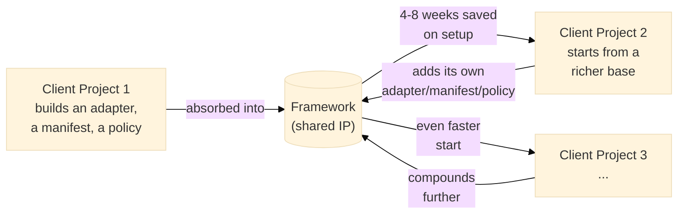

# Business case — Modular RAG Framework

> Internal Publicis Sapient document. Audience: management, technical leads, client project stakeholders.

---

## Executive summary

This framework is a **proprietary delivery accelerator** developed in-house by Publicis Sapient. It provides an orchestration, governance, and security layer on top of the best available open-source RAG tools — something no generic OSS framework offers for an enterprise context. Every client project that uses it saves 4 to 8 weeks of setup. At 5 projects per year, the full V1–V4 development pays for itself.

---

## 1. Reusable commercial asset

This framework is proprietary IP that stays with Publicis Sapient at the end of every project, unlike a bespoke LangChain implementation delivered to the client.

Each delivery makes the next one faster and the asset more valuable — the loop never resets
to zero the way a client-owned, one-off LangChain build does.

- **Savings per project**: 4 to 8 weeks of setup, security, observability, and governance are no longer rebuilt from scratch.
- **Margin uplift**: the weeks saved on infrastructure are not lost — they are reallocated to billable business value.
- **Premium pricing**: a proprietary framework justifies higher day rates than "we use LangChain like everyone else".
- **Compounding**: every adapter, manifest, or policy built on one project accumulates in the framework. The asset appreciates with every delivery.

---

## 2. Delivery accelerator

The YAML manifest is the key: configuring a complete RAG pipeline — chunker, embedder, hybrid retriever, reranker, LLM, security — takes hours, not weeks.

- **Demonstrable prototype in 1 day**: for an RFP or a discovery, showing a working pipeline on the client's documents within 24 hours is an immediate selling point.
- **Faster onboarding**: a new consultant on the project understands the architecture in half a day — no need to decode an unstructured LangChain codebase.
- **Flexible staffing**: the standardized hexagonal architecture lets teams rotate between projects without a long ramp-up period.
- **No-code configuration**: a lead or a PM can read and modify a YAML manifest without opening Python.

---

## 3. Competitive differentiation

Competitors (Accenture, Capgemini, Deloitte Digital) use LangChain, LlamaIndex, or proprietary cloud solutions. Publicis Sapient can position itself differently.

- **"We have our own enterprise RAG framework"**: a pitch hook few consultancies can deliver credibly and demonstrably.
- **Governance by design**: fail-closed tenant isolation, a real Keycloak-backed identity
  verifier, and a structured audit trail (`AuditEvent`, PII/secret payload allowlist) are
  already shipped — not a V4-future promise (per
  [ADR-0005](adr/0005-document-ai-control-plane-boundary.md), accepted 2026-08-04, this is owned
  and current, V2.0 scope). This exists in no comparable OSS framework at this maturity and is a
  decisive argument in regulated RFPs today, not "once V4 ships."
- **Demonstrable architecture**: the ADRs, the Pydantic contracts, and the hexagonal structure are proof of technical maturity that can be shown to a CIO or a CISO during an audit.
- **Vendor independence**: the adapter pattern proves that Publicis Sapient is not simply reselling OpenAI or AWS — it brings its own value layer, neutral and durable.

---

## 4. Coverage of regulated industries

Publicis Sapient works with banks, insurers, pharmaceutical players, and utilities — all subject to strict regulations (GDPR, DORA, NIS2, sector-specific). This framework addresses these constraints directly.

- **Audit trail — primitives shipped, not a turnkey compliance report**: every run captures a
  structured `AuditEvent` (PII/secret payload allowlist enforced by a validator) to a
  manifest-configured sink (`governance.audit_sink.type: in-memory` or `postgres` — the Postgres
  sink is append-only by construction, no UPDATE/DELETE anywhere in the code).

  What's **not** shipped yet: a formatted GDPR/CCPA/HIPAA report *generator* — turning captured
  events into a report a DPO can hand to a regulator is still a manual query today. Say "captures
  a durable, structured audit trail," not "generates compliance reports."
- **Automatic PII redaction**: emails, phone numbers, IBANs, API keys removed before exposure
  via a manifest-activatable redactor (`governance.redactor.type: patterns`) — documentable in
  a DPIA.
- **Multi-tenant isolation — enforced, gated by an explicit flag**: `governance.tenant_policy`
  (fail-closed `TenantIsolationPolicy`) filters cross-tenant data and denies requests missing a
  tenant on query/ingest, real Keycloak-backed identity verification is available for the
  API. `governance.tenant_enforcement: true` must be set explicitly — it is never silently
  assumed, and a manifest declaring it without a wired `tenant_policy` now fails validation
  rather than silently no-op'ing.
- **Safety vs Security explicitly separated**: a distinction regulators appreciate, and one that proves security is not an afterthought.

> **Corrected 2026-08-07 (ADR-0007 Étape 10):** the audit-trail and tenant-isolation rows above
> were rewritten to match the current, verified state — both primitives are now real and
> manifest-activatable (`secure-enterprise-rag.yaml` is a working example), which supersedes the
> 2026-08-04 correction that used to sit here (it described an earlier, pre-Lot-11b/pre-Étape-6
> state). Still be precise in client conversations: "captures/enforces X" is accurate;
> "is GDPR/HIPAA compliant" is not — compliance is a property of a full deployment plus process,
> never of a software component alone.

---

## 5. Resilience against AI market evolution

The LLM market changes every six months. This framework is designed to survive those changes without a rewrite.

- **Swap an LLM with one line of YAML**: when GPT-5 ships or a client mandates Mistral on-premise, the change does not touch the pipeline.
- **Integrate the best OSS tools at any time**: LlamaIndex for semantic chunking, Ragas for evaluation, LiteLLM as a gateway — all wrappable in 50-line adapters. The framework orchestrates, it does not reinvent.
- **No dependency on an external startup**: LangChain nearly disappeared, LlamaIndex changes its API regularly. Here, Publicis Sapient controls its own contracts.
- **On-premise deployment possible**: with HuggingFace + Qdrant, the framework runs entirely without calls to external APIs — a frequent requirement in projects with sensitive data.

---

## 6. Foundation for a structured service offering

This framework can be the foundation of a formalized, repeatable AI practice.

- **RAG-as-a-Service**: package the framework + hosting + support as an offering sold to clients who do not want to manage the infrastructure.
- **Audits of existing RAG systems**: knowledge of the framework makes it possible to audit third-party implementations at clients who started with LangChain.
- **Internal training**: create a "RAG Engineer PS" curriculum based on this framework — a differentiating skill for recruitment and retention.
- **Client skills transfer**: in some contexts, deliver the framework as a foundation the client then maintains — a licensing or transfer model.

---

## 7. Talent attraction and retention

Senior engineers choose their employers partly based on the technical quality of internal projects.

- **"At PS we build our own tools"** is a recruiting argument against consultancies that merely assemble SaaS products.
- A potentially open-sourced framework would generate public visibility, external contributions, and inbound applications.
- Internal contributors develop RAG architecture expertise that is rare on the market — a skill that adds value on client engagements.

---

## 8. Capitalizing on accumulated domain knowledge

Publicis Sapient accumulates methodological expertise across dozens of projects. This framework is the vehicle for capitalizing on that knowledge.

- Patterns discovered on one project (optimal chunking for legal documents, reranking strategy for product FAQs) are encoded as reusable adapters and manifests.
- One project's golden-set benchmarks (`eval/runners/benchmark.py`'s `BenchmarkRunner` against
  `ExactMatchEvaluator`/retrieval metrics — the framework's own built-in scorers, not a Ragas
  integration, which doesn't exist in this codebase today) feed the next project's regression
  baselines via `QualityGate`.
- Graph Memory (V3) could model accumulated sector knowledge as an asset that appreciates over
  time — GraphRAG traversal itself is delegated to a selected external engine (LangGraph) per
  [ADR-0005](adr/0005-document-ai-control-plane-boundary.md), not a native build, and the
  external engine doesn't provide it today. A prior native knowledge-graph *data model* was
  removed as dead code in 2026-08-07 (zero consumers) — there is no native graph capability of
  any kind in the codebase right now, only the delegation target.

---

## 9. Positioning on high-stakes projects

Some projects require guarantees that OSS frameworks cannot provide.

- **Data sovereignty path**: parsing, HuggingFace embedding, Qdrant retrieval, governance, and
  audit can run on-premise. The shipped semantic generators are OpenAI/Anthropic adapters; a
  no-external-API deployment still needs a contract-conformant local-LLM generator adapter.
- **Explainability**: sourced citations, groundedness scores, and the full trace make it possible to justify every answer — a frequent requirement in decision-support projects.
- **Definable SLAs**: structured traces cover query guarding, retrieval, reranking, and
  generation latency, giving a starting point for contractual SLAs.

  Since ADR-0012, a manifest can also opt into live, OTLP-exportable OpenTelemetry spans
  (`observability.tracer.type: otel`) — the API, ingestion, embedding, retrieval, reranking, and
  generation stages are instrumented, correlation/request/trace ids propagate through one
  distributed trace per call, and no query/document/answer/token content is ever attached as a
  span attribute. This is a first cut (see ADR-0012's own out-of-scope notes — no cross-service
  `traceparent` propagation yet, and LangGraph-routed requests get engine-neutral API/application
  spans but no internal graph-step spans).

  ADR-0013 also exposes aggregate request latency, token and static estimated-cost metrics plus
  reference Grafana/Prometheus material. No shipped preset enables tracer/meter, live backend
  validation is still required, and readiness/review gauges have documented sampling limits —
  don't overclaim full cross-service distributed tracing to a client beyond what's actually
  built.
- **Large enterprise clients**: CIO and CISO stakeholders at large companies want governance, auditability, and control. This framework speaks directly to them.

---

## Summary

| Dimension | Direct benefit |
|---|---|
| Reusable IP | Higher margins on every client project |
| Accelerated delivery | 4–8 weeks saved per project |
| Differentiation | Winning pitch in regulated RFPs |
| Governance | Manifest-activatable primitives (tenant isolation, PII redaction, structured audit trail) a client assembles into a compliant deployment |
| Resilience | Zero vendor lock-in, compatible with any LLM evolution |
| Service offering | Basis for a formalized enterprise RAG practice |
| Talent | Recruitment and retention of senior AI profiles |
| Knowledge | Cross-project capitalization, an appreciating asset |
| Critical projects | SLAs, sovereignty, explainability for large accounts |

This framework turns every Publicis Sapient RAG project from a cost into an investment. The real question is not "is it worth it" — it is "how many projects does it take to break even". The answer: one or two client projects are enough to pay off the full V1–V4 development.
