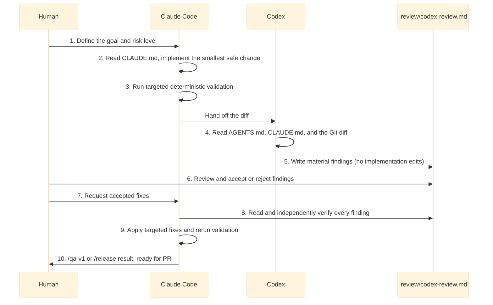

# AI Engineering Workflow

This repository uses a two-provider workflow:

- Claude Code is optimized as the primary builder.
- Codex is optimized as the independent challenger and reviewer.

The goal is not to make agents compete. The goal is to create separation of
duties, reduce blind spots, and keep expensive reasoning focused where it matters.

## Core Operating Principle

Use one writer at a time.

Multiple agents can review, but only one agent should edit a given file set during
a task. This keeps diffs readable and prevents conflicting design decisions.

## Standard Workflow



1. Human defines the goal and risk level.
2. Claude Code reads `CLAUDE.md` and implements the smallest safe change.
3. Claude Code runs the smallest relevant deterministic validation.
4. Codex reads `AGENTS.md`, `CLAUDE.md`, and the Git diff.
5. Codex reviews without editing implementation files and writes the result to
   `.review/codex-review.md`.
6. Human accepts or rejects findings; Claude Code reads the complete review and
   independently verifies accepted findings before changing code.
7. Claude Code applies targeted fixes and reruns the appropriate validations.
8. A second Codex pass may be requested when needed; after two passes, prefer human
   intervention over an automated review loop.
9. Run `/qa-v1` or the appropriate `/release` workflow before the GitHub PR or release.

## Practical Handoff Example

Assume the task is: "add `--tenant-id` to `mrag ingest`."

### 1. Ask Claude Code to implement

```text
Read CLAUDE.md.
Add --tenant-id to mrag ingest, keep the change narrow, update the relevant
tests and documentation, and run the targeted validations. Do not commit or push.
```

Claude Code implements the change and leaves the working tree ready for review.

### 2. Ask Codex to review

```text
Review the current Git diff as an independent staff engineer.
Follow AGENTS.md and CLAUDE.md. Review only this task and its diff.
Do not modify implementation files. Write the complete final review to
.review/codex-review.md and report only material findings.
```

Codex replaces the local review file with one of these final statuses:

- `CHANGES_REQUIRED` when a `BLOCKER` or `HIGH` finding remains.
- `READY_FOR_FINAL_VALIDATION` when no `BLOCKER` or `HIGH` finding remains.

The review file is local and ignored by Git. Its versioned reference format is
`.review/codex-review.example.md`.

### 3. Ask Claude Code to process accepted findings

```text
Read .review/codex-review.md completely. Verify every finding independently.
Fix valid BLOCKER and HIGH findings, evaluate MEDIUM findings against the task
scope, and avoid unrelated LOW-priority refactoring. Run the appropriate
validations. Do not commit or push.
```

Claude Code must not apply a recommendation blindly. The human still decides which
findings are accepted, and deterministic tests remain the final authority.

### 4. Finish the task

Request one more Codex pass if a material correction needs independent verification.
Do not exceed two Codex passes without human intervention. Once the review status is
`READY_FOR_FINAL_VALIDATION`, run `/qa-v1`; use `/release` only for a release and when
its required services and credentials are available.

## Provider Responsibilities

| Responsibility | Claude Code | Codex |
|---|---|---|
| Implementation | Primary | Secondary, only when asked |
| Repo workflow skills | Primary | Reads and respects |
| Diff review | Secondary | Primary |
| Architecture challenge | Secondary | Primary |
| Security challenge | Shared | Strong independent reviewer |
| Documentation drafting | Shared | Shared |
| Release gate review | Shared | Independent reviewer |

## Enterprise Patterns

### 1. Provider Separation

Claude Code produces the change. Codex reviews it independently. This avoids the
same model validating its own blind spots.

### 2. Model Tiering

Use three tiers:

- Tier 1: small/fast model for docs, summaries, triage, and boilerplate.
- Tier 2: mid-tier model for normal code, tests, and focused debugging.
- Tier 3: premium model for architecture, security, contracts, and critical review.

### 3. Role-Based Agents

Use explicit roles:

- `builder`
- `reviewer`
- `architect`
- `security-reviewer`
- `test-engineer`
- `doc-writer`
- `migration-planner`

### 4. Diff-First Review

The reviewer starts from:

- `git diff`
- touched tests
- touched contracts
- impacted docs
- manifest changes
- regression risk

Do not make the reviewer reread the whole repository unless the diff suggests a
systemic risk.

### 5. No Shared Write Zone

Two agents must not edit the same files concurrently. One writer, many reviewers.

### 6. Escalation Policy

Use fast models for simple work. Escalate to premium for doubt, architectural
conflict, subtle bugs, security, client data, or regulated behavior. Use human
approval for irreversible changes.

### 7. Contract-First Development

Before implementation, check:

- `contracts/`
- `core/models/`
- manifests
- `scripts/check_layering.py`

### 8. Architecture Gates

Automate:

- `scripts/check_layering.py`
- unit tests
- contract tests
- lint
- manifest validation

### 9. Minimal Agent Memory

Keep only durable non-negotiables in `CLAUDE.md` and `AGENTS.md`: rules,
commands, architecture, conventions. Put detailed playbooks in `docs/guides/`.

### 10. Golden Prompts

Keep reusable prompts for:

- staff-engineer diff review
- bug-only review
- simpler alternative proposal
- security review
- docs/code consistency review

### 11. Human Approval Gates

Human approval is required for file deletion, data migration, auth/security
changes, external dependencies, public API refactors, and contract changes.

### 12. Cost Observability

Every premium usage should include a reason, for example:

```text
premium_reason: architecture
premium_reason: security
premium_reason: high-risk refactor
```

## Review Modes

### Bug Review

Use for normal diffs:

```text
Review only for bugs, regressions, missing tests, security issues, and layering
violations. Ignore style unless it changes behavior.
```

### Architecture Review

Use when `contracts/`, `orchestration/`, manifests, or domain boundaries change:

```text
Challenge the design. Compare it against CLAUDE.md layering rules, manifest-first
wiring, contract-first development, and ADR requirements. Do not edit files.
```

### Security Review

Use for `security/`, PII, policies, prompt injection, tenancy, auth, or external
tool use:

```text
Review as a security engineer. Look for data leakage, policy bypass, unsafe tool
use, weak validation, missing tests, and audit gaps.
```

### Release Review

Use before a tagged release or major MR:

```text
Review release readiness. Check docs/code consistency, test gaps, known stubs,
roadmap claims, manifest presets, and migration risk.
```

## Human Approval Gates

Require explicit human approval for:

- Deleting files or generated assets.
- Changing public contracts.
- Changing security policy behavior.
- Adding new dependencies.
- Changing manifests used in production-like presets.
- Running e2e tests that call paid LLM APIs.
- Touching secrets, local credentials, or deployment settings.

## Prompt Library

### Claude Code Builder

```text
Read CLAUDE.md and docs/guides/model-routing.md.
Implement the requested change only.
Respect the hexagonal layering rules.
Add or update tests when behavior changes.
Run the smallest relevant checks and report anything unavailable.
```

### Codex Reviewer

```text
Read AGENTS.md and CLAUDE.md.
Review the current Git diff only.
Do not edit implementation files.
Write the final review to .review/codex-review.md.
Prioritize bugs, regressions, security issues, missing tests, manifest problems,
and layering violations.
```

### Premium Architecture Session

```text
This task touches architecture and justifies a premium model.
Compare options, identify risks, recommend one approach, then implement only the
smallest safe slice if asked.
```

### Alternative Architecture

```text
Compare two approaches.
Evaluate impact on contracts, manifests, orchestration, tests, security, and docs.
Recommend one option clearly.
Do not code unless explicitly asked.
```

### Docs/Code Consistency

```text
Check whether documentation claims match the current code.
Report stale docs, overstated capabilities, missing commands, and incorrect paths.
Do not rewrite broad docs unless asked.
```

## Governance Checklist

Before opening a GitHub PR:

- One writer owns the final diff.
- Codex has reviewed high-risk changes.
- `/qa-v1` or equivalent local checks have run.
- `scripts/check_layering.py` passes.
- Contract changes have conformance tests.
- Docs reflect the actual behavior.
- Premium model usage, if any, has a reason.

## Enterprise Controls

Large teams should also keep these controls outside the prompt layer:

- Versioned repository rules.
- Strict permissions and sandbox defaults.
- Logs or traces of agent actions.
- Required human review.
- CI gates.
- Secret scanning.
- Dependency scanning.
- Repository-level policies.
- Cost and quality metrics.
- Model-routing matrices.
- Premium models limited to justified tasks.
- Validated prompt templates.
- Writer/reviewer separation.
- Explicit approval for destructive changes.

## Metrics To Track

Large teams usually track:

- Time saved per task type.
- Review findings by provider.
- Defects caught before MR.
- Defects escaped after MR.
- Premium model usage reason.
- Cost by workflow category.
- Test pass rate after agent changes.
- Percentage of generated changes requiring human rewrite.

These metrics should guide model routing. If a small model repeatedly creates
review churn for a task type, promote that task to mid-tier. If premium models are
used without materially better outcomes, demote that task type.
