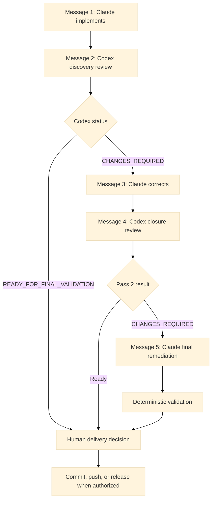

# AI Engineering Workflow

This guide defines the current Claude Chat to Codex Chat delivery workflow for
this repository. It is the operational reference for implementing and reviewing
one bounded task without using Codex CLI.

## Workflow at a Glance

- Claude Chat is the sole writer of implementation files.
- Codex Chat is the independent reviewer and writes only the review report.
- The chats exchange task state through `.review/handoff.md` and
  `.review/codex-review.md`.
- The normal path uses two human messages: one to Claude, then one to Codex.
- If pass 1 reports a blocking finding, one correction cycle adds two messages.
- If pass 2 still reports a blocking finding, one final Claude remediation adds
  a fifth message, without adding a third general Codex review.
- The workflow therefore uses two messages normally and five messages at most.
- Codex performs one discovery review and, when needed, one closure review.
- `READY_FOR_FINAL_VALIDATION` or completion of pass 2 ends the Codex review loop.

No third general review is allowed. After pass 2, Claude may apply one final,
bounded remediation of the remaining accepted findings. A human then decides
whether to deliver, defer, accept the remaining risk, or return the task to a new
development cycle.



## Before Starting

Use a dedicated Claude Chat and Codex Chat that both have access to the same
repository and working tree. Do not let both assistants edit implementation
files concurrently.

Define one task with the following payload. Replace every placeholder before
sending Message 1.

```text
TASK <identifier> - <title>

Objective:
<one observable outcome>

Exact scope:
- <file, module, or behavior in scope>

Out of scope:
- <explicitly excluded work>

Expected work:
- <implementation requirement>
- <test or documentation requirement>

Acceptance criteria:
- <observable and verifiable result>
- <regression that must remain impossible>

Specialized reviewers, analysis only:
- <agent name or "none">

Available external services and credentials:
- <service>: <available, unavailable, or not required>

Required validations:
- <targeted tests or repository gate>

Additional constraints:
- <security, compatibility, migration, or operational constraint>
```

## Complete Message Sequence

### Message 1 of 2 - Ask Claude Chat to Implement

Send the following message to Claude Chat, followed by the completed task payload.

```text
Read CLAUDE.md completely before making any modification and treat it as the
source of truth. Read the applicable path rules, ADRs, and research digests.

Act as the sole implementation writer for exactly the task supplied below. Do
not start another task or expand the scope into unrelated improvements. Preserve
existing unrelated changes.

Inspect the current implementation, tests, contracts, manifests, documentation,
and validation scripts before editing. Keep the change narrow and compliant with
the hexagonal architecture. If the task fixes a bug, write a regression test
before the correction. Any contract change requires a contract-conformance test.

Specialized agents may analyze or review only. They must not edit the same files
in parallel with the primary writer.

Use existing repository tooling first. Do not add or replace dependencies,
scanners, build tools, or CI services unless the task explicitly requires and
authorizes it.

At the end:
1. self-review the complete task diff;
2. run targeted tests and the required task validations;
3. run /qa-v1;
4. run scripts/check_layering.py when architecture-sensitive files changed;
5. update documentation affected by the implemented behavior;
6. record every unavailable validation and its release consequence;
7. prepare .review/handoff.md from .review/handoff.example.md for review pass
   1/2 in DISCOVERY mode.

The handoff must identify the task, risk level, immutable base commit, current
HEAD and working-tree inventory, exact scope, acceptance criteria, design
decisions, executed validations, limitations, known risks, and out-of-scope
work. An implementation checkpoint is optional and requires my authorization;
the current working tree may be reviewed without creating a commit.

Do not invoke Codex CLI. Do not edit .review/codex-review.md. Do not commit or
push without explicit authorization. Stop when the implementation and handoff
are ready for independent review.

<PASTE THE COMPLETED TASK PAYLOAD HERE>
```

Expected result: Claude implements only the defined task and prepares
`.review/handoff.md`. Check that the handoff says `Review pass: 1/2` and
`Review mode: DISCOVERY` before continuing.

### Message 2 of 2 - Ask Codex Chat to Review the Complete Diff

Send this message to Codex Chat:

```text
This is review pass 1 of 2 in DISCOVERY mode.

Read AGENTS.md, CLAUDE.md, and .review/handoff.md completely. Review only the
complete task diff identified by the handoff against its immutable base and
acceptance criteria.

Act as an independent staff engineer. Report all material bugs, regressions,
security risks, contract breaks, manifest or wiring issues, missing tests, and
architecture violations in this single discovery pass. Ignore cosmetic style
unless it causes a defect. Do not expand the review into unrelated repository
debt and do not modify implementation files.

Write the complete final review to .review/codex-review.md using
.review/codex-review.example.md. Set Status to CHANGES_REQUIRED while any
BLOCKER or HIGH finding remains; otherwise set it to
READY_FOR_FINAL_VALIDATION. Report only significant findings.
```

Read the `Status` in `.review/codex-review.md`:

- `READY_FOR_FINAL_VALIDATION`: stop the Codex loop and follow
  [Delivery decision](#delivery-decision).
- `CHANGES_REQUIRED`: continue once with Messages 3 and 4 below.

`MEDIUM` and `LOW` findings do not automatically require another review pass.
They must be recorded as fixed, deferred, accepted risk, or rejected according
to the task scope and the human decision.

### Message 3 of 5 - Ask Claude Chat to Apply Accepted Corrections

Use this message only after pass 1 returns `CHANGES_REQUIRED`:

```text
Read CLAUDE.md, .review/handoff.md, and .review/codex-review.md completely.
Independently verify every pass-1 finding against the code, task scope, and
acceptance criteria.

Fix every valid BLOCKER and HIGH finding. Evaluate MEDIUM findings against the
task scope and avoid unrelated LOW-priority refactoring. If a finding requires a
scope expansion, destructive action, public contract decision, security-policy
decision, or risk acceptance that I have not authorized, stop and ask me for the
specific decision.

Apply all accepted corrections as one batch. Add regression or conformance tests
where required, self-review the corrective diff, and rerun the targeted and task
validations. Run /qa-v1 and run scripts/check_layering.py when architecture-
sensitive files changed.

Update .review/handoff.md for review pass 2/2 in CLOSURE_ONLY mode. Complete the
finding-resolution table with one decision for every pass-1 finding: FIXED,
DEFERRED, ACCEPTED_RISK, or REJECTED. For every decision, record the change and
test or evidence. Record the corrective base so Codex can isolate regressions
introduced by the corrections.

A local correction checkpoint is optional and requires my authorization. Do not
invoke Codex CLI, do not edit .review/codex-review.md, and do not push. Stop when
the correction batch, validation evidence, and closure handoff are ready.
```

Expected result: `.review/handoff.md` says `Review pass: 2/2`, `Review mode:
CLOSURE_ONLY`, identifies the corrective base, and contains a complete resolution
row for every pass-1 finding.

### Message 4 of 5 - Ask Codex Chat to Verify Closure

Send this final review message to Codex Chat:

```text
This is review pass 2 of 2 in CLOSURE_ONLY mode.

Read AGENTS.md, CLAUDE.md, the previous review, and .review/handoff.md completely.
Verify only:
1. closure of the accepted pass-1 findings;
2. preservation of the original acceptance criteria;
3. regressions directly introduced by the corrective diff.

Do not perform a new open-ended review. Do not report pre-existing debt, deferred
findings, accepted risks, rejected findings without new evidence, or unrelated
improvements. A new finding is valid only when the corrective diff directly
introduced it; record that causal evidence explicitly.

Do not modify implementation files. Update .review/codex-review.md using the
repository template, including the finding-closure table and final status.

```

Pass 2 is the unconditional end of the Codex review loop:

- If the result is `READY_FOR_FINAL_VALIDATION`, proceed to the delivery decision.
- If a `BLOCKER` or `HIGH` remains, do not request a third general review. Use
  Message 5 once for the remaining accepted findings, then make the human
  delivery decision from the resulting validation evidence.
- A narrow third verification is allowed only when a human explicitly names a
  newly introduced critical risk and limits the review to that risk.

### Message 5 of 5 - Ask Claude Chat for Final Remediation

Use this message only when pass 2 returns `CHANGES_REQUIRED`. This is a final
writer step, not a third review pass:

```text
Read CLAUDE.md, .review/handoff.md, and the final pass-2 report in
.review/codex-review.md completely. This is the final remediation after the
two-pass Codex review limit; do not invoke Codex or request another general
review.

Independently verify only the BLOCKER and HIGH findings that remain open in the
pass-2 report, including any regression that the report causally attributes to
the corrective diff. Preserve the original task scope and acceptance criteria.
Do not reopen closed, deferred, accepted-risk, or rejected findings, and do not
add unrelated improvements.

Fix every remaining finding that is valid and accepted. If a correction requires
a scope expansion, destructive action, public contract decision, security-policy
decision, new dependency, production manifest change, or risk acceptance that I
have not authorized, stop and ask me for that specific decision before editing.

Keep the final corrective diff narrow. Add or update regression and conformance
tests where required. Self-review all changes, run the affected targeted tests,
run /qa-v1, and run scripts/check_layering.py when architecture-sensitive files
changed. Update only documentation affected by the corrected behavior.

Do not edit .review/codex-review.md: it remains the historical result of Codex
pass 2 and must not be relabeled READY_FOR_FINAL_VALIDATION. Update
.review/handoff.md using its "Final Claude remediation" section
that lists each addressed pass-2 finding, changed files, validation evidence,
unavailable checks, and remaining risks. Do not change the recorded review pass
or claim that Codex verified these final changes.

Do not commit or push without explicit authorization. Stop with a concise final
summary for the human delivery decision.
```

Expected result: Claude has either produced deterministic evidence for a narrow
final correction or stopped for a required human decision. No automatic Codex
pass follows this message.

## Delivery Decision

No additional chat message is required when Codex returns
`READY_FOR_FINAL_VALIDATION`. Claude already ran the deterministic gates in
Message 1 or, after corrections, Message 3. Codex changes only the review report,
so those results remain valid while the implementation diff is unchanged.

When Message 5 was required, its targeted checks and final deterministic gates
replace the earlier validation evidence for the files it changed. The pass-2
Codex report remains unchanged and may still say `CHANGES_REQUIRED`; it is a
historical review record, not proof that Claude's final changes were independently
verified. The human uses that report together with the final handoff and
validation evidence to make the delivery decision.

Before authorizing a commit, push, merge, or release, the human checks the final
status, validation evidence, unavailable checks, and accepted or deferred risks.
Rerun the affected validation only if an implementation, test, manifest,
dependency, or deployment file changed after Claude recorded the last result.
Any further code change after Message 5 starts a new bounded development decision;
it must not be hidden inside an extra Codex review pass.

Tests and deterministic gates are the final authority. The human owns the commit,
push, merge, and release decision.

## Review Artifacts

### `.review/handoff.md`

Claude owns this file. It records:

- task identity, risk, scope, and acceptance criteria;
- immutable Git base and working-tree inventory;
- design decisions and validation evidence;
- limitations, accepted risks, and out-of-scope work;
- the pass-2 finding-resolution table and corrective base;
- when required, the final Claude remediation and its validation evidence.

Create it from `.review/handoff.example.md`. Do not invent a reduced format.

### `.review/codex-review.md`

Codex owns this file during review. It records:

- review identity, mode, base, and acceptance criteria checked;
- material findings with evidence and severity;
- pass-2 closure results;
- validation performed, remaining risks, and final status.

Create it from `.review/codex-review.example.md`. Claude reads it but does not
edit it.

## Roles and Decision Boundaries

| Responsibility | Claude Chat | Codex Chat | Human |
|---|---|---|---|
| Define scope and acceptance criteria | Supports | Challenges | Owns |
| Modify implementation files | Sole writer | Never during review | Authorizes |
| Prepare handoff | Owns | Reads | Verifies readiness |
| Discover material findings | Self-review | Owns in pass 1 | Arbitrates |
| Apply accepted corrections | Owns | Never during review | Authorizes decisions |
| Verify correction closure | Supports with evidence | Owns in pass 2 | Arbitrates |
| Apply final post-pass-2 remediation | Owns once | No third general review | Authorizes decisions |
| Commit, push, merge, or release | Only when asked | Never during review | Owns |

Human approval is required for destructive actions, public contract changes,
security-policy changes, new dependencies, production manifest changes, paid
external calls, secrets, data migrations, and explicit risk acceptance.

## Review Scope and Model Routing

Codex starts from the immutable base, Git diff, changed tests, contracts,
manifests, documentation, and acceptance criteria. It does not perform a
repository-wide audit unless the task explicitly requests one or the diff proves
a systemic impact.

Use the smallest model tier appropriate to the risk:

- small or fast: documentation, summaries, boilerplate, and obvious tests;
- mid-tier: normal implementation, focused fixes, and routine tests;
- premium: contracts, orchestration, security, architecture, migrations,
  multi-module refactors, and independent review of high-risk diffs.

Record the reason when a premium model is used.

## Optional Automation

The repository retains `/delivery-loop`, `scripts/prepare_review.ps1`, and
`scripts/run_codex_review.ps1` for optional future automation. They are not part
of the current default workflow. Do not run `codex exec` or attempt device
authentication when workspace policy blocks Codex CLI. The four-message
automated sequence covers the two Codex passes and the first correction batch. The
five-message chat workflow above is the supported fallback when pass 2 still
requires final Claude remediation.

## Pull Request Readiness Checklist

Before asking for a commit, push, pull request, or release, verify that:

- one writer owns the final implementation diff;
- `.review/handoff.md` identifies the immutable base, scope, and acceptance
  criteria;
- pass 1 reviewed the complete task diff;
- accepted blocking findings were processed as one correction batch;
- pass 2, when required, stayed in closure-only mode;
- the Codex loop stopped at `READY_FOR_FINAL_VALIDATION` or after pass 2;
- any remaining accepted pass-2 blocker was handled once through Message 5 and
  recorded without altering the Codex report;
- `/qa-v1` and task-specific deterministic checks ran;
- `scripts/check_layering.py` passed when required;
- contract changes have conformance tests;
- documentation matches the implemented behavior;
- unavailable checks and remaining risks are explicit;
- commit and push still require human authorization.

## Metrics for Improving the Workflow

Track review-cycle duration, findings by severity, defects escaping review,
validation failures after agent changes, human rework, premium-model usage, and
the percentage of tasks requiring pass 2 or final Claude remediation. Any task
exceeding the two-pass Codex cap is a process signal that requires human analysis,
not another automatic review. Message 5 does not count as a third review.
