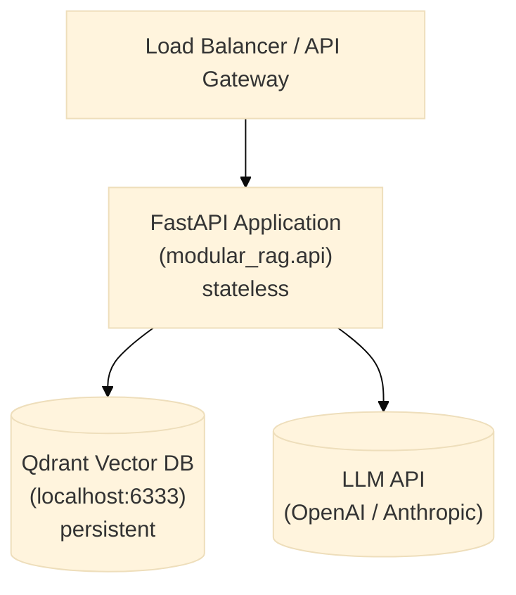

# Deployment Guide

This guide covers running the framework somewhere other than a developer's own machine — a
shared staging box, a client's cloud account, or a container platform. If you have not yet
run the pipeline locally, do that first via [getting-started.md](getting-started.md): every
problem you would hit in production (missing API key, unreachable Qdrant, wrong manifest) is
faster to diagnose locally than in a container log.

## Architecture overview

The three boxes below are intentionally separate processes, not because the framework
requires it, but because it lets each one scale, fail, and be replaced independently. The
FastAPI application is stateless — it holds no data of its own — so the vector database
(persistent knowledge) and the LLM API (the reasoning step) are the only two components that
actually need to survive a container restart.



## Running the REST API server

```bash
# Development
uvicorn modular_rag.api:create_app --factory \
        --reload \
        --host 0.0.0.0 \
        --port 8000

# Pass manifest path via environment variable
MRAG_MANIFEST_PATH=manifests/presets/secure-enterprise-rag.yaml \
uvicorn modular_rag.api:create_app --factory --host 0.0.0.0 --port 8000
```

## Docker

### Dockerfile

```dockerfile
FROM python:3.11-slim

WORKDIR /app
COPY . .

RUN pip install -e ".[v1]"

ENV MRAG_MANIFEST_PATH=manifests/presets/secure-enterprise-rag.yaml

EXPOSE 8000
CMD ["uvicorn", "modular_rag.api:create_app", "--factory", \
     "--host", "0.0.0.0", "--port", "8000"]
```

### docker-compose.yml

```yaml
version: "3.9"

services:
  mrag-api:
    build: .
    ports:
      - "8000:8000"
    environment:
      - MRAG_OPENAI_API_KEY=${OPENAI_API_KEY}
      - MRAG_QDRANT_URL=http://qdrant:6333
      - MRAG_MANIFEST_PATH=manifests/presets/secure-enterprise-rag.yaml
    depends_on:
      - qdrant

  qdrant:
    image: qdrant/qdrant
    ports:
      - "6333:6333"
    volumes:
      - qdrant_data:/qdrant/storage

volumes:
  qdrant_data:
```

```bash
docker-compose up -d
```

## Multi-environment manifests

The same pipeline definition should not run unchanged from a developer's laptop to a
client's production environment — dev favors fast iteration and verbose logs, production
favors the full security stack and quiet logs. Rather than maintaining separate copies of an
entire manifest per environment, the intent (see
[manifests/_index.md](../../manifests/_index.md)) is to layer a small override on top of a
shared preset:

```
manifests/
├── dev/         # local dev, logging verbose, no auth
├── staging/     # mirrors production, auth enabled, GPT-4o
└── production/  # full security stack, multi-tenant, audit trail
```

**This layering mechanism is V4 scope and not implemented yet** — the three folders above
are currently stubs (see each folder's `_index.md`). Until it ships, use
[`secure-enterprise-rag.yaml`](../../manifests/presets/secure-enterprise-rag.yaml) directly
as your production manifest and adapt it by hand per environment. Once the mechanism exists,
selecting an environment at runtime will look like this:

```bash
export MRAG_ENVIRONMENT=production
export MRAG_MANIFEST_PATH=manifests/production/pipeline.yaml
```

## Health check

```bash
curl http://localhost:8000/health
# {"status": "ok", "pipeline": "secure-enterprise-rag", "version": "0.x.y"}
```

## Scaling

- **Horizontal**: The `RAGEngine` is stateless — scale the API containers freely. The BM25 index must be rebuilt per-container on startup (or replaced with a shared search service in V4).
- **Qdrant**: Use the Qdrant cluster mode for production workloads. Configure the URL and API key via `MRAG_QDRANT_URL` and `MRAG_QDRANT_API_KEY`.
- **Embedding**: Consider a dedicated embedding service (e.g., Infinity, TEI) to avoid reloading the model on each container restart. Wire it via the `adapters/embeddings/` adapter.

## Security hardening for production

None of the following is on by default in the local development preset — security is
opt-in in V1 so that local iteration stays fast and frictionless. Before anything
client-facing goes live, work through this list explicitly rather than assuming a preset
switch handles it:

1. Enable `BasicSecurityGuard` and `PatternRedactor` in your manifest.
2. Set `MRAG_QDRANT_API_KEY` — Qdrant supports API-key authentication.
3. Put the API behind an authenticated reverse proxy (nginx, Traefik, or your API gateway).
4. Use the `secure-enterprise-rag.yaml` preset as your base, or create a `manifests/production/` override.
5. Set `MRAG_LOG_LEVEL=WARNING` in production to suppress debug trace output.
