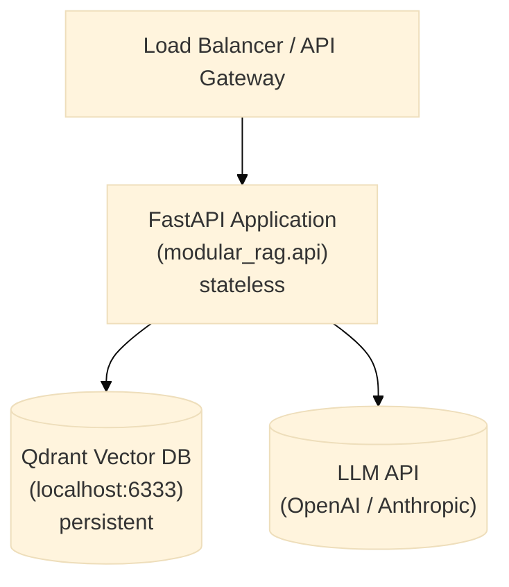

# Deployment Guide

This guide covers running the framework somewhere other than a developer's own machine — a
shared staging box, a client's cloud account, or a container platform. If you have not yet
run the pipeline locally, do that first via [getting-started.md](getting-started.md): every
problem you would hit in production (missing API key, unreachable Qdrant, wrong manifest) is
faster to diagnose locally than in a container log.

## Architecture overview

The three boxes below are intentionally separate processes, not because the framework
requires it, but because it lets each one scale, fail, and be replaced independently. The
FastAPI application is stateless — it holds no data of its own — so the vector database
(persistent knowledge) and the LLM API (the reasoning step) are the only two components that
actually need to survive a container restart.



## Running the REST API server

`create_app()` requires a `manifest_path` argument, so bare `uvicorn ... --factory` (which calls
the factory with zero arguments) does not work — see [rest.md](../api/rest.md). Use the
one-line wrapper module instead:

```bash
# Development — server.py is the wrapper docker/server.py already provides
# (MRAG_MANIFEST_PATH-configurable); reuse it locally too:
MRAG_MANIFEST_PATH=manifests/presets/local-hybrid-rag.yaml \
uvicorn server:app --app-dir docker --reload --host 0.0.0.0 --port 8000
```

## Docker

The [`Dockerfile`](../../Dockerfile) at the repo root (Lot 16b, `docs/refactoring-plan.md`) is
the real, current build — a multi-stage immutable image: a `builder` stage produces a wheel from
source, the `runtime` stage installs only that wheel (`[v1]` extra) into a slim non-root image,
never the source tree, dev tooling, or `.claude/research-papers/` (excluded via
[`.dockerignore`](../../.dockerignore)). [`docker/server.py`](../../docker/server.py) is the
`create_app()` wrapper the image runs, configurable via `MRAG_MANIFEST_PATH`. Verified in CI by
the `container-build` job (`.github/workflows/ci.yml`) — build + a real `docker run` + `/health`
poll — since building it requires a live Docker daemon this repository's own sandboxed
development environment does not always have.

```bash
docker build -t modular-rag:local .
docker run -d --name mrag-api -p 8000:8000 \
    -e MRAG_MANIFEST_PATH=manifests/presets/local-hybrid-rag.yaml \
    -e OPENAI_API_KEY="$OPENAI_API_KEY" \
    modular-rag:local
```

`OPENAI_API_KEY` above is the standard (not `MRAG_`-prefixed) variable the OpenAI SDK itself
reads when a manifest's `generator.config`/`embedder.config` omits `api_key` — verified against
`generation/synthesizers/openai_gen.py`'s `OpenAI(api_key=self.api_key or None, ...)`, which
falls through to the SDK's own env lookup on `None`. `app/settings.py`'s `Settings` class
declares `MRAG_OPENAI_API_KEY`/`MRAG_QDRANT_URL`/`MRAG_QDRANT_API_KEY` fields, but as of this
writing nothing in `orchestration/_default_factories.py` actually constructs a `Settings()` or
reads them — every adapter factory is `AdapterClass(**cfg.config)`, sourced only from the
manifest. Qdrant's `url`/`api_key` have no SDK-level env fallback the way OpenAI's does, so they
must be set explicitly in the manifest's `indexer.config` (or resolved via `resolve_manifest()`,
Lot 9, if your entrypoint uses it). Wiring `Settings` into the factories is a real gap, not this
guide's to fix — recorded here so this document doesn't repeat the same incorrect claim its
previous version made.

### docker-compose.yml

```yaml
services:
  mrag-api:
    build: .
    ports:
      - "8000:8000"
    environment:
      - OPENAI_API_KEY=${OPENAI_API_KEY}
      - MRAG_MANIFEST_PATH=manifests/presets/local-hybrid-rag.yaml
    depends_on:
      - qdrant

  qdrant:
    image: qdrant/qdrant
    ports:
      - "6333:6333"
    volumes:
      - qdrant_data:/qdrant/storage

volumes:
  qdrant_data:
```

`local-hybrid-rag.yaml` hardcodes `indexer.config.url: "http://localhost:6333"` — inside this
compose network that resolves to the `mrag-api` container itself, not the `qdrant` service, so
this example as written will fail to reach Qdrant. Since there is no environment-variable
override for it (see above), either edit the manifest's `url` to `http://qdrant:6333` before
building the image, or mount a modified copy over `/app/manifests/presets/local-hybrid-rag.yaml`
at `docker run`/compose time.

```bash
docker-compose up -d
```

For rollback (previous image tag, previous manifest revision, or reverting
`engine.adapter` back to `"native"`), see
[backup-restore.md](backup-restore.md#rollback).

## Multi-environment manifests

The same pipeline definition should not run unchanged from a developer's laptop to a
client's production environment — dev favors fast iteration and verbose logs, production
favors the full security stack and quiet logs. Rather than maintaining separate copies of an
entire manifest per environment, the intent (see
[manifests/_index.md](../../manifests/_index.md)) is to layer a small override on top of a
shared preset:

```
manifests/
├── dev/         # local dev, logging verbose, no auth
├── staging/     # mirrors production, auth enabled, GPT-4o
└── production/  # full security stack, multi-tenant, audit trail
```

**This layering mechanism is V4 scope and not implemented yet** — the three folders above
are currently stubs (see each folder's `_index.md`). `secure-enterprise-rag.yaml` is
**blueprint, not runnable today** — see [`manifests/README.md`](../../manifests/README.md):
`wire()` never reads its `policies:` field (which also points at two files that don't exist),
and its `${QDRANT_URL}` interpolation is never resolved by `load_pipeline()`/`create_app()`
(both call the plain, non-interpolating `load_manifest()` — `${VAR}`/`secret://` resolution is
`app/config_resolution.py`'s `resolve_manifest()`, wired into `mrag validate` and schema
export, Lot 9, but not into the actual pipeline-loading path yet). Until a real production
manifest exists, start from [`local-hybrid-rag.yaml`](../../manifests/presets/local-hybrid-rag.yaml)
(the only preset proven to wire end-to-end, Lot 5) and add security components by hand — see
the hardening list below, not the blueprint preset.

## Health check

```bash
curl http://localhost:8000/health
# {"status": "ok", "pipeline": "local-hybrid-rag"}

curl http://localhost:8000/ready
# {"status": "ready", "pipeline": "local-hybrid-rag"}
# /ready (Lot 16a) reports the same wiring-succeeded evidence /health does today --
# it does not probe live Qdrant/LLM connectivity. See docs/api/rest.md.
```

## Scaling

- **Horizontal**: The `RAGEngine` is stateless — scale the API containers freely. The BM25 index must be rebuilt per-container on startup (or replaced with a shared search service in V4). `RateLimitMiddleware`'s (Lot 16a) in-memory window is also per-process — each replica rate-limits independently, not against one shared counter; a Redis-backed limiter is the documented upgrade path if that matters at your scale.
- **Qdrant**: Use the Qdrant cluster mode for production workloads.
- **Embedding**: Consider a dedicated embedding service (e.g., Infinity, TEI) to avoid reloading the model on each container restart. Wire it via the `adapters/embeddings/` adapter.

## Security hardening for production

None of the following is on by default in the local development preset — security is
opt-in in V1 so that local iteration stays fast and frictionless. Before anything
client-facing goes live, work through this list explicitly rather than assuming a preset
switch handles it:

1. Configure `create_app(..., token_verifier=...)` (Lot 16a) — `adapters/auth/keycloak_verifier.py`'s `KeycloakTokenVerifier` is the reference `TokenVerifier` implementation. Without one, `/answer` and `/retrieve` are unauthenticated. See [rest.md](../api/rest.md#authentication).
2. Enable `BasicSecurityGuard` and `PatternRedactor` in your manifest, and a `tenant_policy` (`TenantIsolationPolicy`, Lot 11b) if serving more than one tenant.
3. Tune `create_app(..., rate_limit_per_minute=..., max_body_bytes=...)` (Lot 16a) for your expected load — see [backup-restore.md](backup-restore.md#overload--soak-evidence-deferred-from-lot-14) for a load-test script to calibrate against.
4. Set Qdrant's `api_key` in `indexer.config.api_key` if your Qdrant instance requires one — as a manifest literal, not an environment-variable reference: `load_pipeline()`/`create_app()` load the manifest via plain `load_manifest()` (no `${VAR}`/`secret://` interpolation), so a `${QDRANT_API_KEY}`-style reference here will not resolve at wiring time. Pre-render the manifest yourself, or use `resolve_manifest()` (Lot 9) if you build a custom entrypoint on top of it.
5. Put the API behind an authenticated reverse proxy (nginx, Traefik, or your API gateway) as defense-in-depth on top of, not instead of, #1.
6. Reduce log verbosity for production if needed — `app/settings.py`'s `Settings.log_level` field exists but, like the API-key fields above, nothing in this codebase currently constructs a `Settings()` or applies it (no `logging.basicConfig()`/`structlog.configure()` call reads it either); setting `MRAG_LOG_LEVEL` today has no effect. Configure `structlog`/stdlib `logging` directly in your own entrypoint if you need this before that gap is closed.

For backup, restore, and rollback procedures once this is running, see
[backup-restore.md](backup-restore.md).
