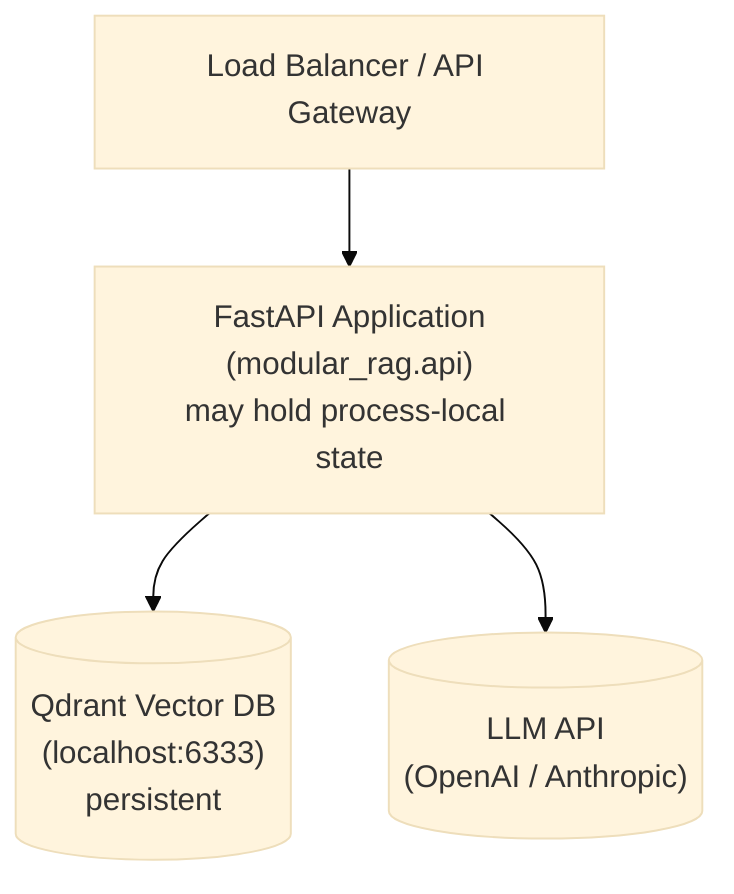

# Deployment Guide

This guide covers running the framework somewhere other than a developer's own machine — a
shared staging box, a client's cloud account, or a container platform. If you have not yet
run the pipeline locally, do that first via [getting-started.md](getting-started.md): every
problem you would hit in production (missing API key, unreachable Qdrant, wrong manifest) is
faster to diagnose locally than in a container log.

## Architecture overview

The three boxes below are intentionally separate processes, not because the framework
requires it, but because it lets each one scale, fail, and be replaced independently. The
The FastAPI process is replaceable, but it is not universally stateless. Depending on the
manifest, it can hold a BM25 index, rate-limit counters, an in-memory review queue, an in-memory
audit sink, or an in-memory lifecycle ledger. Qdrant/PostgreSQL provide durable state only for
the components explicitly configured to use them.



## Running the REST API server

`create_app()` requires a `manifest_path` argument, so bare `uvicorn ... --factory` (which calls
the factory with zero arguments) does not work — see [rest.md](../api/rest.md). Use the
one-line wrapper module instead:

```bash
# Development — server.py is the wrapper docker/server.py already provides
# (MRAG_MANIFEST_PATH-configurable); reuse it locally too:
MRAG_MANIFEST_PATH=manifests/presets/local-hybrid-rag.yaml \
uvicorn server:app --app-dir docker --reload --host 0.0.0.0 --port 8000
```

## Docker

The [`Dockerfile`](../../Dockerfile) at the repo root (Lot 16b, `docs/refactoring-plan.md`) is
the real, current build — a multi-stage immutable image: a `builder` stage produces a wheel from
source, the `runtime` stage installs the wheel with the `v1`, `langgraph`, `postgres`, and
`auth` extras into a slim non-root image,
never the source tree, dev tooling, or `.claude/research-papers/` (excluded via
[`.dockerignore`](../../.dockerignore)). [`docker/server.py`](../../docker/server.py) is the
`create_app()` wrapper the image runs, configurable via `MRAG_MANIFEST_PATH`. Verified in CI by
the `container-build` job (`.github/workflows/ci.yml`) — build + a real `docker run` + `/health`
poll — since building it requires a live Docker daemon this repository's own sandboxed
development environment does not always have.

```bash
docker build -t modular-rag:local .
docker run -d --name mrag-api -p 8000:8000 \
    -e MRAG_MANIFEST_PATH=manifests/presets/local-hybrid-rag.yaml \
    -e OPENAI_API_KEY="$OPENAI_API_KEY" \
    modular-rag:local
```

`OPENAI_API_KEY` above is the standard (not `MRAG_`-prefixed) variable the OpenAI SDK itself
reads when a manifest's `generator.config`/`embedder.config` omits `api_key` — verified against
`generation/synthesizers/openai_gen.py`'s `OpenAI(api_key=self.api_key or None, ...)`, which
falls through to the SDK's own env lookup on `None`. `app/settings.py`'s `Settings` class once
declared `MRAG_OPENAI_API_KEY`/`MRAG_QDRANT_URL`/`MRAG_QDRANT_API_KEY` fields, but nothing in
the pipeline-wiring path ever constructed a `Settings()` or read them — every adapter factory is
`AdapterClass(**cfg.config)`, sourced only from the manifest — so the file was deleted outright
in Étape 8 of the ADR-0007 stabilization pass. Qdrant's `url`/`api_key` have no SDK-level env
fallback the way OpenAI's does, so they must be set explicitly in the manifest's
`indexer.config` (or resolved via `resolve_manifest()`, Lot 9, if your entrypoint uses it).

### `compose.yaml`

The real Compose file lives at the repo root — [`compose.yaml`](../../compose.yaml) — not
duplicated here as a separate illustrative snippet (a previous version of this section carried
its own inline copy, which drifted out of sync with the real file; see that file's own header
comment for the full quick-start commands, and `scripts/smoke_test_compose.py` for an automated
version of them). It brings up four services: `api` (this repo's own image), `qdrant`, `postgres`
(ADR-0011 — durable audit trail), and a one-shot `migrate` service that runs `mrag db migrate`
before `api` starts (deliberately not `auto_migrate: true` on the manifest itself — see
`compose.yaml`'s own comment for why that alone wouldn't satisfy `/ready`). Keycloak is a
separate, opt-in `auth` profile (`docker compose --profile auth up`) — see "Authenticated
container deployment" below.

`docker/local-hybrid-rag.yaml` is the container-network variant of the local preset: its Qdrant
URL is `http://qdrant:6333` and it wires a `governance.audit_sink: type: postgres`, matching the
Compose service names. The ordinary local preset (`manifests/presets/local-hybrid-rag.yaml`) keeps
`localhost:6333` and no Postgres for host-based development; do not interchange the two
environments.

```bash
cp .env.example .env   # then set OPENAI_API_KEY for a fully healthy /ready
docker compose up --build
```

For rollback (previous image tag, previous manifest revision, or reverting
`engine.adapter` back to `"native"`), see
[backup-restore.md](backup-restore.md#rollback).

## Multi-environment manifests

The same pipeline definition should not run unchanged from a developer's laptop to a
client's production environment — dev favors fast iteration and verbose logs, production
favors the full security stack and quiet logs. Rather than maintaining separate copies of an
entire manifest per environment, the intent (see
[manifests/_index.md](../../manifests/_index.md)) is to layer a small override on top of a
shared preset:

```
manifests/
├── dev/         # local dev, logging verbose, no auth
├── staging/     # mirrors production, auth enabled, GPT-4o
└── production/  # full security stack, multi-tenant, audit trail
```

Automatic discovery of `dev/`, `staging/`, and `production/` overrides is not implemented; the
folders remain future-facing stubs. Programmatic callers can already pass an explicit
`environment_path` to `resolve_manifest()`, while API/CLI startup resolves one selected manifest
including `${VAR}` and `secret://` references. `secure-enterprise-rag.yaml` is a runnable V2
preset, not a blueprint: it wires tenant isolation, redaction, inline policy evaluation,
PostgreSQL audit, and telemetry. Quality gates apply to offline golden-set regression runs, not
online answers (ADR-0008). Install `.[v1,postgres]`, supply
`QDRANT_URL`, `QDRANT_API_KEY`, and `AUDIT_DATABASE_URL`, and configure API identity separately.

## Health check

```bash
curl http://localhost:8000/health
# {"status": "ok", "pipeline": "local-hybrid-rag"}

curl http://localhost:8000/ready
# {"status": "healthy", "pipeline": "local-hybrid-rag", "dependencies": [
#   {"name": "qdrant", "healthy": true, "detail": null, "latency_ms": 12.3, "role": "indexer"},
#   {"name": "openai", "healthy": true, "detail": null, "latency_ms": 340.1, "role": "generator"},
#   {"name": "postgres", "healthy": true, "detail": null, "latency_ms": 8.7, "role": "audit_sink"}
# ]}
# /ready (Lot 6 -- readiness and resilience, ADR-0010) actually probes every wired
# dependency -- Qdrant, PostgreSQL when a manifest configures one, and the LLM
# generator via a real, cached, credential-validating call -- not merely that
# create_app() finished wiring. "status" is one of core.enums.ReadinessState's real
# values (healthy/degraded/unready), never the literal string "ready". HTTP 503 only
# for "unready". Without a real OPENAI_API_KEY, expect the "generator" entry (and
# therefore the whole aggregate status) unready -- that is correct, honest behavior,
# not a bug. See docs/api/rest.md and docs/adr/0010-health-checkable-and-readiness-semantics.md.
```

## Scaling

- **Horizontal**: replicas are safe only after every required stateful capability is externalized
  or deliberately rebuilt per replica. BM25 is process-local, the default rate limiter counts
  per process, and the in-memory audit/review/lifecycle implementations diverge across replicas.
  Use shared services or single-replica operation when those semantics matter.
- **Qdrant**: Use the Qdrant cluster mode for production workloads.
- **Embedding**: Consider a dedicated embedding service (e.g., Infinity, TEI) to avoid reloading the model on each container restart. Wire it via the `adapters/embeddings/` adapter.

## Security hardening for production

None of the following is on by default in the local development preset — security is
opt-in in V1 so that local iteration stays fast and frictionless. Before anything
client-facing goes live, work through this list explicitly rather than assuming a preset
switch handles it:

1. Configure `create_app(..., token_verifier=...)` (Lot 16a) — `adapters/auth/keycloak_verifier.py`'s `KeycloakTokenVerifier` is the reference `TokenVerifier` implementation. Without one, `/answer` and `/retrieve` are unauthenticated *if* the manifest has no `governance.tenant_policy` wired. `secure-enterprise-rag.yaml` (step 2 below) does wire one, so for it this is not optional: `create_app()` refuses to start without a `token_verifier` at all (Lot 1, tenant fail-closed) — configure OIDC issuer/audience before first launch, not after a failed one. See [rest.md](../api/rest.md#authentication).
2. Start from `secure-enterprise-rag.yaml`, or explicitly enable `BasicSecurityGuard`, `PatternRedactor`, an audit sink, and `TenantIsolationPolicy`. The tenant policy denies requests without an authenticated tenant identity.
3. Tune `create_app(..., rate_limit_per_minute=..., max_body_bytes=...)` (Lot 16a) for your expected load — see [backup-restore.md](backup-restore.md#overload--soak-evidence-deferred-from-lot-14) for a load-test script to calibrate against.
4. Keep secrets out of YAML: use `${QDRANT_URL}` and `secret://QDRANT_API_KEY`/`secret://AUDIT_DATABASE_URL`. `load_pipeline()`, `load_engine()`, and `load_application()` all call `resolve_manifest()` before wiring.
5. Put the API behind an authenticated reverse proxy (nginx, Traefik, or your API gateway) as defense-in-depth on top of, not instead of, #1.
6. Configure `structlog`/stdlib logging in the deployment entrypoint or platform. There is no framework-wide `MRAG_LOG_LEVEL` setting.

## Authenticated container deployment

For **local testing only**, `compose.yaml`'s opt-in `auth` profile
(`docker compose --profile auth up`) brings up a local Keycloak instance
(`start-dev` mode) on `http://localhost:8080` — bringing the container up is automated, but
realm/client setup (registering a client, mapping `tenant_id`/`sub` claims) is a one-time manual
pass through Keycloak's own admin console; a mounted realm-import file was deliberately not
attempted (unverifiable without a live Keycloak instance in this development environment — see
`compose.yaml`'s own comment). Set `MRAG_OIDC_ISSUER_URL`/`MRAG_OIDC_AUDIENCE` in `.env` once the
realm exists, matching the values below, then restart the `api` service.

For a real deployment against your organization's own Keycloak, the shipped `docker/server.py`
enables Keycloak verification when both variables below are set;
setting only one fails startup rather than silently exposing an unauthenticated API. Against
`secure-enterprise-rag.yaml` specifically, setting *neither* now also fails startup (Lot 1,
tenant fail-closed: `create_app()` refuses to run a tenant-isolated manifest without a
`token_verifier` at all) — there is no combination of these two variables that leaves this
preset's API silently open:

```bash
docker run -d --name mrag-secure -p 8000:8000 \
  -e MRAG_MANIFEST_PATH=manifests/presets/secure-enterprise-rag.yaml \
  -e MRAG_OIDC_ISSUER_URL=https://keycloak.example/realms/client \
  -e MRAG_OIDC_AUDIENCE=modular-rag-api \
  -e QDRANT_URL=https://qdrant.example \
  -e QDRANT_API_KEY="$QDRANT_API_KEY" \
  -e AUDIT_DATABASE_URL="$AUDIT_DATABASE_URL" \
  -e OPENAI_API_KEY="$OPENAI_API_KEY" \
  modular-rag:local
```

The token must contain `tenant_id` and `sub` claims by default. Customize claim paths by
constructing `KeycloakTokenVerifier` in your own entrypoint when the realm uses different names.

For backup, restore, and rollback procedures once this is running, see
[backup-restore.md](backup-restore.md).
