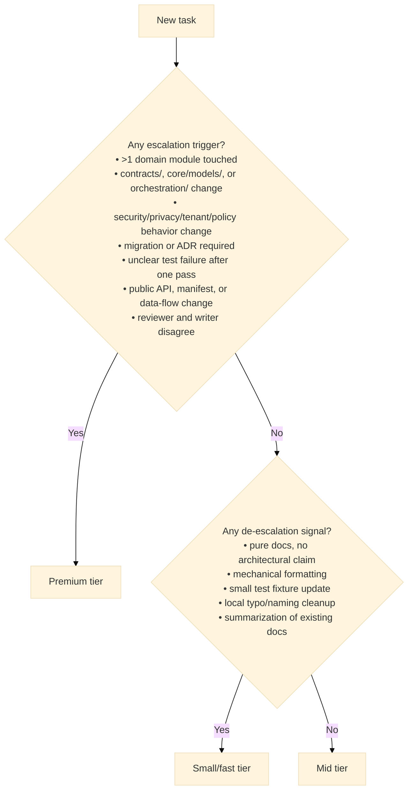

# Model Routing Guide

This guide defines how to choose a provider and model tier for AI-assisted
engineering work on Modular RAG.

The rule is simple: never use the strongest model everywhere. Use the smallest
model tier that can produce a reliable result for the risk level. Premium models
are reserved for hard reasoning, high blast radius, or independent review.

## Decision Criteria

Choose the model tier from these criteria:

| Criterion | Low-risk signal | Premium signal |
|---|---|---|
| Cognitive complexity | Mechanical edit, local change, obvious test | Ambiguous design, root-cause analysis, multi-step reasoning |
| Business risk | Internal docs, non-critical tooling | Client-facing behavior, release blocker, regulated data |
| Diff size | One file or narrow test update | Cross-domain or multi-module refactor |
| Reasoning need | Summarize, format, rename, generate boilerplate | Compare architectures, debug subtle failure, design contracts |
| Speed need | Interactive quick turnaround | Deep analysis is more important than latency |
| Cost | Repetitive or batchable work | High-value decision where correctness dominates cost |
| Confidentiality | Public docs or generic code | Secrets-adjacent, PII, tenant isolation, policy logic |
| Agentic autonomy | Human-directed small edit | Long-running plan, tool use, refactor, multi-step validation |

Example: do not use Opus-class or premium GPT reasoning for a simple README
rewrite. Use premium for architecture migrations, multi-module refactors, security
audits, policy changes, or irreversible design decisions.

## Provider Roles

| Provider | Default role | Best use |
|---|---|---|
| Claude Code | Primary builder | Repo-aware implementation, planned edits, skills, hooks, local workflows. |
| Codex | Independent challenger | Diff review, architecture critique, hidden coupling, tests and safety gaps. |
| Either provider | Specialist reviewer | Security, architecture, migration, release-readiness checks. |

Avoid using both providers as writers on the same files at the same time. The
default enterprise pattern is one writer and one independent reviewer.

## Model Tiers

Use tiers rather than hardcoding one model name in process docs.

| Tier | Typical models | Use for | Avoid for |
|---|---|---|---|
| Small/fast | Haiku, mini, nano | Simple docs, summaries, changelog, boilerplate, issue triage. | Cross-module reasoning, security, release blockers. |
| Mid-tier | Sonnet-class, GPT mid-tier | Normal implementation, test generation, focused debugging, doc/code sync. | Large architecture decisions without review. |
| Premium | Opus-class, GPT premium reasoning | Contracts, orchestration, security, multi-module refactors, ADRs, critical review. | Typos, simple docs, mechanical edits. |

## Model Choice Examples

| Task | Recommended tier |
|---|---|
| Rephrase README, changelog, or simple docs | Small/fast |
| Add low-risk technical docs | Small/fast or mid-tier |
| Standard unit tests | Mid-tier |
| Focused local debugging | Mid-tier |
| Multi-file refactor | Premium |
| RAG architecture, agents, security, policies | Premium |
| Critical review of a large diff | Other provider, premium |
| Security audit or threat modeling | Premium, optionally double-reviewed |
| Repetitive bulk generation | Small/fast, batched |
| Irreversible decision | Premium plus human approval |

## Routing Matrix

| Task | Writer | Reviewer | Model tier | Required checks |
|---|---|---|---|---|
| README or changelog update | Claude Code or Codex | Optional | Small/fast | Link check by inspection. |
| Developer guide update | Claude Code | Codex optional | Small/fast or mid-tier | Docs/code consistency scan. |
| Add unit tests | Claude Code | Codex optional | Mid-tier | `pytest tests/unit`. |
| Add contract tests | Claude Code | Codex | Mid-tier | `pytest tests/contract`. |
| Fix focused bug | Claude Code | Codex if risky | Mid-tier | Targeted test + `/qa-v1`. |
| New retriever/generator/guard | Claude Code | Codex | Premium for design, mid-tier for implementation | Unit + contract + manifest wiring + layering. |
| Change `contracts/` | Claude Code | Codex premium | Premium | Contract tests + implementation scan + ADR if structural. |
| Change `orchestration/` | Claude Code | Codex premium | Premium | Unit + integration impact + layering. |
| Security or PII behavior | Claude Code | Codex premium | Premium | Security tests + adversarial cases. |
| Manifest schema or registry change | Claude Code | Codex | Premium | Preset validation + docs update. |
| Refactor across domains | One writer only | Other provider premium | Premium | Layering strict + full local QA. |
| Release readiness | No writer by default | Codex + Claude review | Premium for review | Full CI equivalent. |

## Claude Premium

Use Claude premium models for:

- Multi-domain refactors.
- Changes in `contracts/`.
- Changes in `orchestration/registry.py` or pipeline wiring.
- Security, PII, policy engine, or tenant-isolation behavior.
- Agentic workflows.
- Graph memory design.
- V2/V3/V4 architecture decisions.
- Subtle debugging where the root cause is unclear.
- ADR decisions.
- Model or manifest migrations.
- Full audit before release.

Do not use Claude premium models for:

- Simple docs.
- Renaming.
- Typos.
- Basic changelog entries.
- Formatting.
- Obvious small unit tests.
- Boilerplate generation.

## Codex Premium

Use Codex premium models for:

- Independent review.
- Contradictory reasoning against Claude Code's implementation.
- Finding what the builder missed.
- Technical debt analysis.
- Security analysis.
- Docs/code consistency review.
- Proposing an alternative architecture.
- Validating that a refactor preserved domain boundaries.

Default Codex premium review prompt:

```text
Do not edit files. Review only.
Prioritize bugs, regressions, architecture risks, security risks, and missing tests.
Ignore style unless it causes a behavior or maintainability defect.
```

## Escalation Rules



Escalate from small or mid-tier to premium when any of these are true:

- More than one domain module is touched.
- `contracts/`, `core/models/`, or `orchestration/` changes.
- Security, privacy, tenant isolation, or policy behavior changes.
- A migration or ADR is required.
- Tests fail for a reason that is not obvious after one focused pass.
- The diff changes public API, manifest semantics, or data flow.
- The reviewer and writer disagree.

De-escalate when the task is:

- Pure documentation with no architectural claims.
- Mechanical formatting.
- Small test fixture update.
- Local typo or naming cleanup.
- Summarization of existing docs.

## Cost Controls

For every premium-model use, record a short reason:

```text
premium_reason: changes contracts and orchestration
premium_reason: independent security review
premium_reason: release blocker with unclear root cause
```

Batch low-risk tasks together for small models. Keep premium sessions short and
focused on the hard decision, then hand implementation back to a mid-tier model
when the plan is clear.

## Quality Gates

Default local gate:

```powershell
python scripts/check_layering.py --strict
ruff check .
pytest tests/unit tests/contract
```

Only run integration tests when Qdrant is available on `localhost:6333`.
Only run e2e tests when Qdrant and the required LLM API key are available.

## Anti-Patterns

- Using a premium model for every task.
- Letting two agents edit the same files concurrently.
- Asking the builder to approve its own architecture.
- Accepting generated code without tests.
- Adding repo rules only in chat instead of versioned docs.
- Using docs-only models for contract or security work.
- Running integration/e2e checks without confirmed dependencies.
- Leaving model choices implicit in a regulated or client-facing project.
