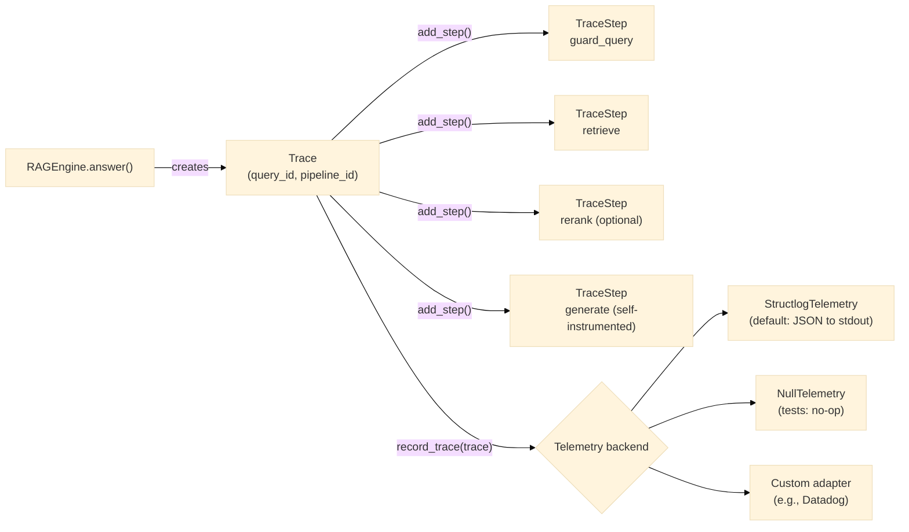
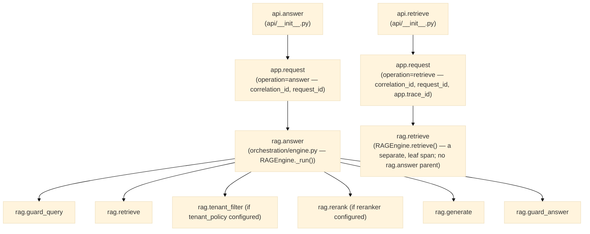

# Observability Guide

## What the framework tracks

Every call to `pipeline.answer()` produces a `Trace` object (see `core/models/trace.py`).
The trace records each pipeline step with:

- **Name** — e.g., `guard_query`, `retrieve`, `rerank`, `generate`, `guard_answer`
- **Input / output tokens** — for LLM steps
- **Latency (ms)** — wall-clock time for the step
- **Metadata** — arbitrary key/value pairs (e.g., `num_chunks_retrieved: 20`)

The `Trace` accumulates totals: `total_input_tokens`, `total_output_tokens`, `total_latency_ms`.

Step names are confirmed directly from `orchestration/engine.py`'s `_run_steps()`: `guard_query`
(tenant/policy checks raise before this step even runs, so a denial produces *no* trace steps —
see [threat-model.md](../architecture/threat-model.md) for what a denial produces instead),
`retrieve`, `rerank` (only if a reranker is configured), then `generate` — the generator
self-instruments its own `TraceStep` rather than the engine wrapping it in a second one (Lot 10
fixed a real double-counting bug here; don't reintroduce an outer "generate" step if you're
reading this as a guide for writing a similar component). There is no `guard_answer` step name in
the current source — the post-generation guard check and the optional redaction/human-review
steps that follow it do not currently emit their own named `TraceStep`s; their only visible trace
signal today is a missing early-return (the run completed normally) or a `GUARD_DECISION` audit
event if an `audit_sink` is configured — see below.



**Telemetry vs. audit — two different, both-optional recording paths.** `Telemetry` (this guide)
is performance/debugging data — latency, token counts — sent wherever `observability.telemetry`
points. Compliance evidence (who asked what, was it denied, was it redacted) is a completely
separate mechanism, `AuditSink` (`contracts/audit.py`), configured via `governance.audit_sink` and
covered in [audit-traceability.md](audit-traceability.md), not this guide. A pipeline can have
either, both, or neither configured — they don't imply each other.

## Telemetry backends

The telemetry contract (`contracts/telemetry.py`) defines two methods:

```python
record_trace(trace: Trace) -> None
record_metrics(pipeline_id: str, metrics: Metrics) -> None
```

### StructlogTelemetry (default)

Configured automatically when no custom telemetry is specified in the manifest.
Writes structured JSON to stdout:

```json
{
  "event": "trace_recorded",
  "schema_version": "1.2",
  "pipeline_id": "local-hybrid-rag",
  "query_id": "a1b2c3d4",
  "total_latency_ms": 1234.5,
  "total_input_tokens": 1800,
  "total_output_tokens": 320,
  "failed": false,
  "steps": ["guard_query", "retrieve", "rerank", "generate"],
  "timestamp": "2026-05-21T10:00:00Z"
}
```

There is no `routing_strategy` field — an earlier version of this example showed one, left over
from a native query-routing feature (`QueryRouter`) removed well before this pass; see
[data-model.md](../architecture/data-model.md)'s `Trace` field table for the complete, current
list, including `failed`/`failure_reason` for a run that raised.

### NullTelemetry

Use in tests to suppress all telemetry output:

```python
from modular_rag.observability import NullTelemetry

container.telemetry = NullTelemetry()
```

### Custom telemetry adapter

Implement the `Telemetry` protocol and wire it in your manifest:

```python
# src/my_org/telemetry/datadog_telemetry.py
from modular_rag.contracts.telemetry import Telemetry
from modular_rag.core.models.trace import Trace
from modular_rag.core.models.metrics import Metrics

class DatadogTelemetry:
    def record_trace(self, trace: Trace) -> None:
        # send to Datadog APM
        ...

    def record_metrics(self, pipeline_id: str, metrics: Metrics) -> None:
        # send custom metric
        ...

    def name(self) -> str:
        return "datadog"
```

Register and use in your manifest:

```yaml
telemetry:
  type: datadog
  config:
    api_key: ${DATADOG_API_KEY}
    service: mrag-pipeline
```

## Reading traces in Python

```python
pipeline = load_pipeline("manifests/presets/local-hybrid-rag.yaml")
answer = pipeline.answer("What is GraphRAG?")

# The trace_id links the answer to its trace
print(answer.trace_id)
```

## Evaluation metrics

`record_metrics(pipeline_id, metrics)` takes a `Metrics` instance — a 16-field evaluation-score
bag (retrieval, answer-quality, policy, cost/latency, and failure-signal families), not something
this guide re-derives field by field. See [data-model.md](../architecture/data-model.md#metrics)
for the complete, current table — an earlier version of this section listed only 11 of the 16
real fields (missing `exact_match`, `answer_precision`, `answer_recall`, `context_precision`,
`policy_violations`, `failed`, `failure_reason`, and `schema_version`), which is exactly the class
of drift that table is meant to be the single source of truth against, rather than duplicating a
now-incomplete copy here.

## Distributed tracing (OpenTelemetry)

[ADR-0012](../adr/0012-opentelemetry-tracing-port.md) adds live, OpenTelemetry-compatible
distributed tracing — a separate, both-optional mechanism from `Telemetry` above. Where
`Telemetry.record_trace()` receives a completed `Trace` after a run finishes, `Tracer`
(`contracts/tracing.py`) creates *live* spans as each pipeline stage executes, so a single
request produces one correctly-nested, exportable OpenTelemetry trace.

### Where spans are created

Only in `orchestration/engine.py`, `app/application.py`, and `api/__init__.py` — never inside
`ingestion/`, `retrieval/`, `generation/`, or `security/` (domain modules never import
OpenTelemetry, directly or indirectly). `app/application.py`'s `"app.request"` span is shared by
both `ApplicationService.answer()` and `.retrieve()` (an `operation` attribute — `"answer"` or
`"retrieve"` — distinguishes the two in a trace viewer), but they nest very differently below
it — corrected here after Codex review pass 1 (HIGH-002) found the previous single-diagram
version implied `/retrieve` also flowed through `rag.answer`, which it never does:



Both `"app.request"` spans carry `app.trace_id` — a real, minimal `Trace` built specifically for
that call (`Trace(query_id=..., pipeline_id=...)`, with one `TraceStep` for the retrieval itself
on the `retrieve()` path). This was corrected during Lot 11's own review cycle (Codex pass 2
HIGH-002): an earlier version omitted `app.trace_id` for `retrieve()` on the reasoning that
`RAGEngine.retrieve()` built no `Trace` object to take an id from — but that silently narrowed the
original "propagate correlation_id, request_id, and trace_id" acceptance criterion without an
explicit decision to do so. Per an explicit human decision, `RAGEngine.retrieve()` now builds a
real `Trace` and returns it via `RetrievalResult.trace_id` — a public contract change: `RAGEngine.
retrieve()`/`ApplicationService.retrieve()` now return `RetrievalResult` (`chunks` + `trace_id`),
not a bare `list[RetrievedChunk]`, and `GET /retrieve`'s JSON response is now `{"chunks": [...],
"trace_id": "..."}` instead of a bare array — see `docs/api/rest.md`. This `Trace` is not recorded
via `Telemetry`/`AuditSink` (only `answer()`/`_run()` does that); it exists solely to carry a real
trace_id, not for the fuller answer-path observability/audit machinery.

`RAGEngine.ingest()`/`ingest_chunks()` similarly create `rag.ingest` → `rag.chunk` (per document)
and `rag.embed` spans — these are root spans when called directly (there is no `/ingest` API
route; ingestion runs via `mrag ingest` or `RAGEngine.ingest()` directly).

`engine.adapter: langgraph` manifests still produce `api.answer`/`api.retrieve` and `app.request`
— both are engine-neutral, reading `Container.tracer` directly regardless of which
`DocumentEngine` is selected — but never the `rag.*` spans above, since `LangGraphEngineAdapter`
never calls into `RAGEngine` (see ADR-0012's own "LangGraphEngineAdapter internal step
instrumentation" out-of-scope note; corrected, Codex review pass 1 HIGH-001, from an earlier
version of `runtime_manifest_errors()` that mistakenly rejected `observability.tracer` under
LangGraph entirely).

Every span in this tree shares one OpenTelemetry trace_id automatically — via OpenTelemetry's
own `contextvars`-based context propagation, not manual id-threading — as long as every layer
reads the *same* `Container`-registered `Tracer` instance, which manifest-driven wiring already
guarantees.

### `Tracer`/`Span` contract

```python
def start_span(self, name: str, attributes: dict[str, str | int | float | bool] | None = None) -> Span
def name(self) -> str
```

`Span` is a context manager: `set_attribute(key, value)` and `record_error(message)` (message
must be a short, safe classification — e.g. an exception type name — never raw exception text).

### `NullTracer` (default — tracing disabled)

Omitting `observability.tracer` from a manifest (or configuring `type: null`) means
`Container.tracer` is `None`; every instrumentation site guards with `if self._c.tracer:` (or the
equivalent `nullcontext()` fallback in `app/`/`api/`), so zero spans are ever created — this is
the "instrumentation can be disabled" behavior.

### `OtelTracer` (real backend)

```yaml
observability:
  tracer:
    type: otel
    config:
      service_name: my-pipeline
      otlp_endpoint: "http://otel-collector:4317"   # omit to create spans without exporting them
      otlp_insecure: true
      console_export: false
```

`otlp_endpoint` omitted (the default) still creates real spans — every attribute-setting code
path is exercised identically in every environment — but attaches no exporter, so nothing is
ever transmitted ("toggleable export function": the toggle is whether an endpoint is
configured). Export, when enabled, runs through OpenTelemetry's own `BatchSpanProcessor` on a
background thread, which catches and logs export failures internally rather than raising into
application code — a down or unreachable OTLP collector has no functional impact on request
handling.

`engine.adapter: langgraph` manifests may also set `observability.tracer` — see the "Where spans
are created" section above for exactly which spans a LangGraph-routed request gets (the
engine-neutral `api.*`/`app.request` pair, not the `RAGEngine`-internal `rag.*` spans).
No shipped preset currently declares a tracer; copy a preset to activate this role.

### PII safety

Span attributes are restricted to counts, provider/model identifiers (`Component.name()`, the
same non-secret identifier already logged elsewhere), status, and `correlation_id`/`request_id`.
No query text, document content, answer text, or token content is ever attached to a span — the
same allowlist discipline as `TraceStep`'s own checklist (see `orchestration/CLAUDE.md`).

### Testing with an in-memory exporter

```python
from modular_rag.adapters.observability.otel_tracing import OtelTracer

tracer, exporter = OtelTracer.for_testing()
with tracer.start_span("rag.retrieve", {"provider": "hybrid"}) as span:
    span.set_attribute("chunks_returned", 5)

spans = exporter.get_finished_spans()
assert spans[0].name == "rag.retrieve"
```

`for_testing()` wires an in-process `InMemorySpanExporter` behind a synchronous
`SimpleSpanProcessor` — no network, no real OTLP collector, no sleep/poll needed to observe
finished spans.

### Out of scope (see ADR-0012)

Cross-service W3C `traceparent` header extraction/injection at the API boundary, unifying
`Trace.id`/`ExecutionContext.correlation_id`/OpenTelemetry's own trace_id into one identifier, and
`LangGraphEngineAdapter` internal step instrumentation are all explicitly deferred — recorded as
known limitations in the ADR, not silently unhandled.

## Operational metrics (Meter)

[ADR-0013](../adr/0013-operational-metrics-meter-port.md) adds live, collectable operational
metrics — counters, histograms, gauges — a third, deliberately separate mechanism from both
`Telemetry` (post-hoc `Trace`/`Metrics` recording) and `Tracer` (live spans, above). **Not the same
thing as `core.models.metrics.Metrics`** (the 16-field evaluation-quality bag `Telemetry.
record_metrics()` takes) — that name collision is exactly why this Protocol is called `Meter`, not
`Metrics`.

### `Meter`/instrument contract

```python
def counter(self, name: str, value: int | float = 1, attributes: dict[str, str | int | float | bool] | None = None) -> None
def histogram(self, name: str, value: float, attributes: dict[str, str | int | float | bool] | None = None) -> None
def gauge(self, name: str, value: float, attributes: dict[str, str | int | float | bool] | None = None) -> None
def name(self) -> str
```

A counter accumulates (multiple calls with the same name+attributes add); a gauge overwrites (the
latest value wins); a histogram records a distribution of observed values (for percentile queries
like p95 latency).

### Where metrics are recorded

Only in `orchestration/engine.py`, `orchestration/reconciliation.py`, `app/application.py`, and
`api/__init__.py` — the same engine-neutral/pipeline-stage split ADR-0012 already establishes for
spans, never inside `ingestion/`, `retrieval/`, `generation/`, or `security/`.

| Metric | Type | Labels | Where |
|---|---|---|---|
| `mrag.request.duration_ms` | histogram | `operation`, `engine`, `status` | `ApplicationService.answer()`/`.retrieve()` — **not** also inside `RAGEngine`, to avoid double-counting. HTTP requests rejected earlier by authentication, body-size, validation, rate-limit or concurrency middleware are outside this denominator. |
| `mrag.request.errors` | counter | `operation`, `engine`, `error_type` | same scope: exceptions raised after entering `ApplicationService`, not all HTTP error responses |
| `mrag.ingest.documents` | counter | — | `RAGEngine.ingest()` |
| `mrag.ingest.chunks` | counter | — | `RAGEngine.ingest_chunks()` (covers both entry points — `ingest()` calls this internally per document) |
| `mrag.ingest.duration_ms` | histogram | — | same |
| `mrag.ingest.errors` | counter | `error_type` | same, on lexical-index failure |
| `mrag.guard.rejections` | counter | `stage` (`query`/`answer`) | `RAGEngine._run_steps()` |
| `mrag.retrieve.empty` | counter | `operation` (`answer`/`retrieve`) | `RAGEngine._run_steps()`/`.retrieve()` |
| `mrag.retrieve.degraded` | counter | `source` (`vector`/`lexical`) | same, reading `HybridRetriever.last_degraded_sources` |
| `mrag.readiness.state` | gauge | `state` (`healthy`/`degraded`/`unready`) | `GET /ready` — emitted on probe. Current code writes `1` only for the observed state and does not reset the other labelled series, so an old state can remain visible after recovery; do not use it as an authoritative current-state alert until fixed. |
| `mrag.generation.tokens` | counter | `direction` (`input`/`output`), `model` | `RAGEngine._run_steps()`, reading the generator's own `TraceStep` |
| `mrag.generation.cost_usd` | counter | `model` | same, reading `TraceStep.metadata["cost_usd"]` (only when present — an unpriced model gets no cost counter, never a fabricated 0.0) |
| `mrag.reconciliation.divergences` | gauge | `type` (`missing_in_vector`/`missing_in_lexical`/`orphaned_in_vector`/`orphaned_in_lexical`) | `IndexReconciler.check()` |
| `mrag.review.enqueued` | counter | — | `RAGEngine._run_steps()` |
| `mrag.review.pending` | gauge | — | same, sampled only at enqueue time. Resolution does not refresh it, so it can overstate current queue depth. |

See [docs/observability/](../observability/) for the reference dashboard, minimum alerts, SLOs,
and runbooks built against this exact catalog.

The reference material deliberately omits deployable readiness-state and review-backlog alerts
until those two gauges report current state reliably. These are implementation limitations, not
collector configuration issues.

### Cardinality safety

`OtelMeter._sanitize_attributes()` drops (never raises — logs a warning and continues) any
attribute whose key matches a denylist of per-request identifiers (`correlation_id`, `request_id`,
`trace_id`, `chunk_id`, `document_id`/`doc_id`, ...) or whose value is UUID/ULID-shaped, applied to
every `counter()`/`histogram()`/`gauge()` call — defense in depth on top of the primary discipline
(no first-party call site passes one of those values as a label at all). This check exists
*specifically* for `Meter`, not `Tracer`: a metric label creates a persistent time series per
distinct value combination in a real backend, so unbounded cardinality here is a production
incident; a span attribute carries no such risk.

### `NullMeter` / `OtelMeter`

Symmetrical with `Tracer`'s `NullTracer`/`OtelTracer`:

```yaml
observability:
  meter:
    type: otel   # or "null" to explicitly disable
    config:
      otlp_endpoint: "http://otel-collector:4317"   # omit to record without exporting
```

```python
from modular_rag.adapters.observability.otel_meter import OtelMeter

meter, reader = OtelMeter.for_testing()
meter.counter("mrag.request.errors", attributes={"operation": "answer"})

data = reader.get_metrics_data()
```

`for_testing()` wires an in-process `InMemoryMetricReader` — no network, no real OTLP collector.
No shipped preset currently declares a meter; copy a preset to activate this role.

### Cost estimation

`core/pricing.py::estimate_cost_usd(model, input_tokens, output_tokens)` is a static, manually-
refreshed price table (USD per 1M tokens) — not a live provider API lookup. Returns `None` (never
a fabricated `0.0`) for a model the table doesn't recognize. Both `OpenAIGenerator` and
`AnthropicGenerator` call it inside their own `generate()` and attach the result to their
`TraceStep.metadata["cost_usd"]` only when it is not `None`.

## Log configuration

**There is no `MRAG_LOG_LEVEL` or `MRAG_LOG_FORMAT` environment variable in this codebase** — an
earlier version of this guide described both; neither is read anywhere in
`observability/`. `StructlogTelemetry` writes structured JSON with no built-in level or format
switch of its own. If you need Python's standard logging level or structlog's own output renderer
configured differently (e.g. a human-readable console renderer for local development instead of
JSON), configure `structlog` directly in your own application entry point, before calling
`load_pipeline()`/`load_application()` — see
[structlog's own configuration documentation](https://www.structlog.org/en/stable/configuration.html)
for how; this framework does not wrap or simplify that configuration itself today.
