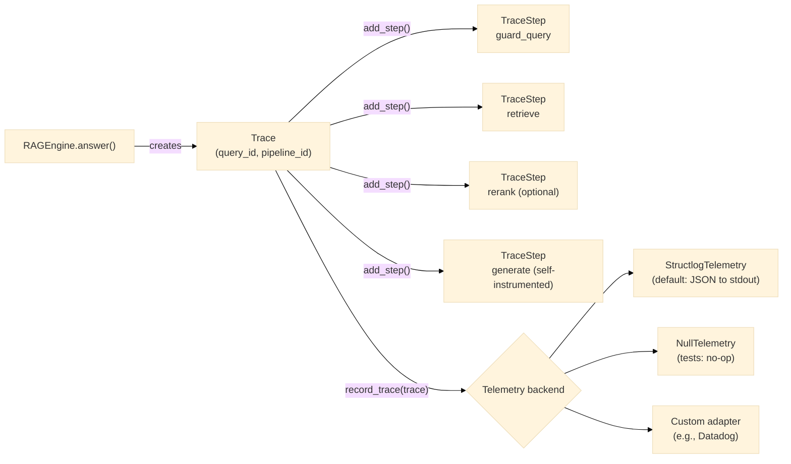

# Observability Guide

## What the framework tracks

Every call to `pipeline.answer()` produces a `Trace` object (see `core/models/trace.py`).
The trace records each pipeline step with:

- **Name** — e.g., `guard_query`, `retrieve`, `rerank`, `generate`, `guard_answer`
- **Input / output tokens** — for LLM steps
- **Latency (ms)** — wall-clock time for the step
- **Metadata** — arbitrary key/value pairs (e.g., `num_chunks_retrieved: 20`)

The `Trace` accumulates totals: `total_input_tokens`, `total_output_tokens`, `total_latency_ms`.

Step names are confirmed directly from `orchestration/engine.py`'s `_run_steps()`: `guard_query`
(tenant/policy checks raise before this step even runs, so a denial produces *no* trace steps —
see [threat-model.md](../architecture/threat-model.md) for what a denial produces instead),
`retrieve`, `rerank` (only if a reranker is configured), then `generate` — the generator
self-instruments its own `TraceStep` rather than the engine wrapping it in a second one (Lot 10
fixed a real double-counting bug here; don't reintroduce an outer "generate" step if you're
reading this as a guide for writing a similar component). There is no `guard_answer` step name in
the current source — the post-generation guard check and the optional redaction/human-review
steps that follow it do not currently emit their own named `TraceStep`s; their only visible trace
signal today is a missing early-return (the run completed normally) or a `GUARD_DECISION` audit
event if an `audit_sink` is configured — see below.



**Telemetry vs. audit — two different, both-optional recording paths.** `Telemetry` (this guide)
is performance/debugging data — latency, token counts — sent wherever `observability.telemetry`
points. Compliance evidence (who asked what, was it denied, was it redacted) is a completely
separate mechanism, `AuditSink` (`contracts/audit.py`), configured via `governance.audit_sink` and
covered in [audit-traceability.md](audit-traceability.md), not this guide. A pipeline can have
either, both, or neither configured — they don't imply each other.

## Telemetry backends

The telemetry contract (`contracts/telemetry.py`) defines two methods:

```python
record_trace(trace: Trace) -> None
record_metrics(pipeline_id: str, metrics: Metrics) -> None
```

### StructlogTelemetry (default)

Configured automatically when no custom telemetry is specified in the manifest.
Writes structured JSON to stdout:

```json
{
  "event": "trace_recorded",
  "schema_version": "1.2",
  "pipeline_id": "local-hybrid-rag",
  "query_id": "a1b2c3d4",
  "total_latency_ms": 1234.5,
  "total_input_tokens": 1800,
  "total_output_tokens": 320,
  "failed": false,
  "steps": ["guard_query", "retrieve", "rerank", "generate"],
  "timestamp": "2026-05-21T10:00:00Z"
}
```

There is no `routing_strategy` field — an earlier version of this example showed one, left over
from a native query-routing feature (`QueryRouter`) removed well before this pass; see
[data-model.md](../architecture/data-model.md)'s `Trace` field table for the complete, current
list, including `failed`/`failure_reason` for a run that raised.

### NullTelemetry

Use in tests to suppress all telemetry output:

```python
from modular_rag.observability import NullTelemetry

container.telemetry = NullTelemetry()
```

### Custom telemetry adapter

Implement the `Telemetry` protocol and wire it in your manifest:

```python
# src/my_org/telemetry/datadog_telemetry.py
from modular_rag.contracts.telemetry import Telemetry
from modular_rag.core.models.trace import Trace
from modular_rag.core.models.metrics import Metrics

class DatadogTelemetry:
    def record_trace(self, trace: Trace) -> None:
        # send to Datadog APM
        ...

    def record_metrics(self, pipeline_id: str, metrics: Metrics) -> None:
        # send custom metric
        ...

    def name(self) -> str:
        return "datadog"
```

Register and use in your manifest:

```yaml
telemetry:
  type: datadog
  config:
    api_key: ${DATADOG_API_KEY}
    service: mrag-pipeline
```

## Reading traces in Python

```python
pipeline = load_pipeline("manifests/presets/local-hybrid-rag.yaml")
answer = pipeline.answer("What is GraphRAG?")

# The trace_id links the answer to its trace
print(answer.trace_id)
```

## Evaluation metrics

`record_metrics(pipeline_id, metrics)` takes a `Metrics` instance — a 16-field evaluation-score
bag (retrieval, answer-quality, policy, cost/latency, and failure-signal families), not something
this guide re-derives field by field. See [data-model.md](../architecture/data-model.md#metrics)
for the complete, current table — an earlier version of this section listed only 11 of the 16
real fields (missing `exact_match`, `answer_precision`, `answer_recall`, `context_precision`,
`policy_violations`, `failed`, `failure_reason`, and `schema_version`), which is exactly the class
of drift that table is meant to be the single source of truth against, rather than duplicating a
now-incomplete copy here.

## Log configuration

**There is no `MRAG_LOG_LEVEL` or `MRAG_LOG_FORMAT` environment variable in this codebase** — an
earlier version of this guide described both; neither is read anywhere in
`observability/`. `StructlogTelemetry` writes structured JSON with no built-in level or format
switch of its own. If you need Python's standard logging level or structlog's own output renderer
configured differently (e.g. a human-readable console renderer for local development instead of
JSON), configure `structlog` directly in your own application entry point, before calling
`load_pipeline()`/`load_application()` — see
[structlog's own configuration documentation](https://www.structlog.org/en/stable/configuration.html)
for how; this framework does not wrap or simplify that configuration itself today.
