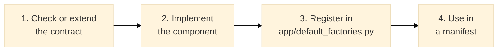

# Plugin Development Guide

This guide explains how to add a new component (chunker, retriever, generator, etc.)
to the framework. The framework is contract-driven: all components are discovered
through the `ComponentRegistry` and selected by name in YAML manifests.

## The pattern (four steps)



The same recipe, applied to a chunker specifically, is in
[CONTRIBUTING.md](../../CONTRIBUTING.md), "Adding a new component."

### 1. Check or extend the contract

Every component type has a `typing.Protocol` in `src/modular_rag/contracts/`.
Before implementing, verify the protocol matches your interface.

```python
# contracts/chunking.py (already exists)
from typing import Protocol, runtime_checkable
from modular_rag.core.models.document import Document
from modular_rag.core.models.chunk import Chunk

@runtime_checkable
class Chunker(Protocol):
    def chunk(self, document: Document) -> list[Chunk]: ...
    def name(self) -> str: ...
```

If you need to add a method, write an ADR first (`docs/adr/000N-your-decision.md`).

### 2. Implement the component

Create your implementation in the appropriate domain folder. Example: a semantic chunker.

```python
# src/modular_rag/ingestion/chunkers/semantic.py
from __future__ import annotations

from modular_rag.core.ids import new_id
from modular_rag.core.models.chunk import Chunk
from modular_rag.core.models.document import Document


class SemanticChunker:
    """Groups sentences with high cosine similarity into chunks."""

    def __init__(self, similarity_threshold: float = 0.8) -> None:
        self._threshold = similarity_threshold

    def chunk(self, document: Document) -> list[Chunk]:
        # ... your implementation ...
        sentences = document.content.split(". ")
        return [
            Chunk(doc_id=document.id, content=s.strip())
            for s in sentences
            if s.strip()
        ]

    def name(self) -> str:
        return "semantic"
```

**Cross-domain import rule**: your implementation must only import from
`contracts/`, `core/models/`, and the standard library. Never import from
`generation/`, `retrieval/`, `agents/`, etc.

### 3. Register in `app/default_factories.py`

```python
# src/modular_rag/app/default_factories.py

from modular_rag.ingestion.chunkers.semantic import SemanticChunker

def register_defaults(reg: ComponentRegistry) -> None:
    # ... existing registrations ...
    reg.register(
        "chunker",
        "semantic",
        lambda cfg: SemanticChunker(
            similarity_threshold=cfg.config.get("similarity_threshold", 0.8)
        ),
    )
```

### 4. Use in a manifest

```yaml
# manifests/presets/semantic-rag.yaml
version: "1.0"
id: semantic-rag
chunker:
  type: semantic
  config:
    similarity_threshold: 0.75
```

## Writing tests

### Unit test

```python
# tests/unit/ingestion/chunkers/test_semantic.py
from modular_rag.core.models.document import Document
from modular_rag.ingestion.chunkers.semantic import SemanticChunker

def test_name():
    assert SemanticChunker().name() == "semantic"

def test_splits_on_sentences():
    doc = Document(source="test.txt", content="First sentence. Second sentence. Third.")
    chunks = SemanticChunker().chunk(doc)
    assert len(chunks) >= 1
```

### Contract conformance test

```python
# tests/contract/test_chunker_conformance.py  (add to existing parametrize list)
from modular_rag.ingestion.chunkers.semantic import SemanticChunker

CHUNKERS = [
    FixedSizeChunker(),
    AdaptiveChunker(),
    SemanticChunker(),  # add here
]
```

## Component types reference

| Contract | Role | Domain folder |
|---|---|---|
| `Chunker` | Splits documents into chunks | `ingestion/chunkers/` |
| `Embedder` | Generates vector embeddings | `adapters/embeddings/` |
| `Indexer` | Stores chunks in a vector store | `adapters/vectorstores/` |
| `Retriever` | Retrieves relevant chunks | `retrieval/retrievers/` |
| `Reranker` | Re-scores retrieved candidates | `retrieval/rerankers/` |
| `Generator` | Generates an answer from context | `generation/synthesizers/` |
| `SecurityGuard` | Checks queries and answers | `security/filters/` |
| `Redactor` | Removes PII from text | `security/redaction/` |
| `Evaluator` | Scores a (query, answer) pair | `eval/scorers/` |
| `Planner` | Plans multi-step retrieval | `retrieval/planners/` |
| `Agent` | Specialized reasoning unit | `agents/<role>/` |
| `Telemetry` | Records traces and metrics | `observability/` |
| `Storage` | Key-value persistence | `memory/kv/` |

## Versioning

Contracts are versioned by the ADR process. A breaking change to a contract
(adding a required method, changing signatures) requires:

1. A new ADR (`docs/adr/000N-...`).
2. A major version bump in `pyproject.toml`.
3. Migration guide in `docs/guides/`.
