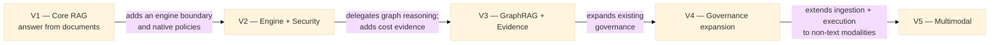

# Onboarding — Functional Profiles and the Framework's Full Journey

> This document answers a simple question that had no single answer anywhere in the repo:
> **who should read what, in what order, and why** — whether you're a developer, a tech
> lead, a client-engagement consultant, a functional product owner, or a security/compliance
> officer. It complements [`docs/business-case.md`](business-case.md) (the "commercial why")
> and [`ROADMAP.md`](../ROADMAP.md) (the "what, checked off as it ships") by answering
> "who does what, and how to find your way around."
>
> **If you specifically want to understand the 2026-08 engine-agnostic control-plane
> refactoring programme** (ADR-0005's owned-vs-delegated pivot, 18 lots, Phase A-D) rather
> than the framework in general, go straight to
> [docs/refactoring/README.md](refactoring/README.md) instead. The version summaries below use the
> current owned/delegated boundary and distinguish a selectable adapter from capabilities that the
> adapter does not yet implement.

---

## 1. Why this document exists

The framework grew fast: five planned versions (V1 through V5), well over a hundred
documentation files, ADRs, manifests, a multi-layer hexagonal architecture. A newcomer —
whether they're here to write code or to understand what the tool lets them do for a client
— faces a volume of information that doesn't indicate where to start. This document maps
that path.

It replaces no existing document: it **indexes and contextualizes**. Every section points to
the source document that is authoritative on the topic.

---

## 2. The profiles that interact with the framework

The framework doesn't have a single type of user. Each profile below has different needs
and a different depth of technical involvement. Knowing which profile you belong to (or
which one you're writing for) saves you from reading 700 lines of Pydantic specification
when a single page of YAML manifest would have done the job.

### 2.1 Framework developer (contributes to the source code)

Builds or extends internal components: a new chunker, a new retriever, a new generator, a
new policy. This profile touches `src/modular_rag/`, writes tests, and must respect the
   inward hexagonal dependency rule (`cli`/`api` → `app` → `orchestration` → contracts/core;
   domain/adapters depend on inward contracts, never on outer interfaces).

**What this profile should read, in order:**
1. [CLAUDE.md](../CLAUDE.md) — the non-negotiable rules (contracts first, no cross-domain
   imports, manifests as the source of truth).
2. [CONTRIBUTING.md](../CONTRIBUTING.md) — local setup, step-by-step recipe for adding a
   component.
3. [docs/architecture/module-model.md](architecture/module-model.md) — why the dependency
   rule exists, with concrete examples of what it prevents.
4. [docs/architecture/data-model.md](architecture/data-model.md) — the Pydantic objects that
   flow through everything (`Document`, `Chunk`, `Query`, `Answer`, `Trace`…).
5. [docs/guides/plugin-development.md](guides/plugin-development.md) — the four-step recipe
   (contract → implementation → registry → manifest).
6. The relevant [ADRs](adr/) for the area being modified.

This profile should **never** need to read `docs/business-case.md` to do the job — but
reading it once helps explain why certain constraints (V4 governance, data sovereignty) are
non-negotiable even when they complicate the implementation.

### 2.2 Tech lead / architect

Decides on structural changes: new layer, new contract, a shifted boundary between modules.
Writes or approves ADRs. Arbitrates between "extend an existing contract" and "create a new
one."

**Priority reading:**
1. [docs/architecture/overview.md](architecture/overview.md) — the complete technical
   specification, the system's six planes, the V1→V5 roadmap with the detail of what each
   version adds.
2. [docs/adr/](adr/) — fifteen accepted decisions. Always check the
   status: proposed assurance levels and existing-application support are not implementation.
3. [docs/architecture/module-model.md](architecture/module-model.md) and
   [structure.md](architecture/structure.md) — the complete map of the code, file by file.
4. [docs/archive/2026-05-20-initial-review.md](archive/2026-05-20-initial-review.md) — the
   initial review that set the P0/P1/P2 priorities; useful for understanding why certain
   choices (Apache 2.0, an honest pre-alpha status, tests mirroring `src/`) were settled
   early. Archived 2026-08-06 (low ongoing utility, kept for historical context) — see
   [docs/archive/README.md](archive/README.md).

### 2.3 Consultant / delivery lead on a client project

Configures a pipeline for a client via YAML manifests, without necessarily touching Python
code. Needs to know which preset to choose, how to adapt it (LLM model, security level,
retrieval depth), and how to demonstrate a proof of concept quickly.

**Priority reading:**
1. [docs/guides/getting-started.md](guides/getting-started.md) — from clone to first
   answer, in five steps.
2. [manifests/_index.md](../manifests/_index.md) — which preset to choose depending on the
   client context (local dev, secure enterprise, agentic, graph, multimodal).
3. [docs/guides/installation.md](guides/installation.md) — environment variables,
   per-version dependencies.
4. [docs/guides/deployment.md](guides/deployment.md) — how to run this outside a dev
   machine (Docker, multi-environment).
5. [docs/business-case.md](business-case.md) — product hypothesis, target users, caveats, and the
   pilot evidence required before making savings or portability claims.

This profile normally doesn't need to read `data-model.md` or `module-model.md` — unless
they need to explain to a client's CIO *why* the architecture is trustworthy.

### 2.4 Functional profile / product owner / business analyst

Doesn't code, doesn't necessarily configure the manifests, but needs to know **what the
tool can do today and what it will be able to do tomorrow**, in order to scope a client need
or a user story. This is the profile most often forgotten in technical documentation — which
is exactly why this document exists.

**Priority reading:**
1. Section 3 below ("The full journey, explained without technical jargon").
2. [docs/business-case.md](business-case.md) — the product hypothesis and decision gate; it does
   not claim measured ROI or automatic regulatory coverage.
3. [ROADMAP.md](../ROADMAP.md) — what's already delivered (box checked) versus what's still
   to be built, by version.
4. [examples/simple_qa/docs/rag-overview.md](../examples/simple_qa/docs/rag-overview.md) — a
   non-technical explanation of what RAG is and why it exists, useful for explaining it to a
   client who doesn't know the term.

This profile needs no file under `src/modular_rag/`, no ADRs (too technical), and no
`module-model.md`. If they need to know a specific capability ("can we already answer
questions about a video?"), the answer is in the version table in section 3 — not in the
code.

### 2.5 Security / compliance (CISO, DPO, auditor)

Needs to assess whether the framework meets regulatory constraints (GDPR, DORA, NIS2,
sector-specific rules) before a regulated client adopts it. Doesn't code, but needs concrete
proof — not marketing promises.

**Priority reading:**
1. [docs/architecture/security.md](architecture/security.md) — the attack surfaces
   covered, the guard chain, the exact PII redaction patterns (regexes, data types covered).
2. [docs/adr/0003-security-and-governance.md](adr/0003-security-and-governance.md) — the
   Safety (anti-injection, PII) vs. Security (RBAC, policies) split, and what's already
   implemented (V1) versus planned (V4).
3. [docs/business-case.md](business-case.md) — assurance hypothesis and explicit compliance/
   licensing caveats.
4. [docs/architecture/data-classification-policy.md](architecture/data-classification-policy.md)
   and [threat-model.md](architecture/threat-model.md) — especially the open Lot 20 provider-
   egress boundary.

**Watch point to communicate to this profile without softening it**: corrected 2026-08-06 —
this used to say policy-as-code governance, multi-tenancy, and the audit trail were "V4 items,
not yet delivered." That's no longer true: per [ADR-0005](adr/0005-document-ai-control-plane-boundary.md)
(accepted 2026-08-04), the Policy Engine, fail-closed tenant isolation, and a structured audit
trail are owned and shipped now (V2.0/Lot 10/Lot 11b-c), not deferred to V4. What genuinely
remains undelivered per V4 is the *multi-environment* layering (dev/staging/prod overrides) and
full regulatory reporting and classification-aware model egress — see [ROADMAP.md](../ROADMAP.md).

Still never present a capability as operational before checking its actual status here or in
[docs/refactoring/README.md](refactoring/README.md) §5's honest "what's still open" list — this
is exactly the kind of gap between documented promise and delivered code that the initial
review of 2026-05-20 flagged as the project's #1 risk (see
[docs/archive/2026-05-20-initial-review.md](archive/2026-05-20-initial-review.md), archived
2026-08-06 for low ongoing utility, not because it was wrong).

### 2.6 Management / commercial

Only needs [docs/business-case.md](business-case.md) and the status table in
[README.md](../README.md) ("Project status"). Nothing else is required at this level.

---

## 3. The full journey, explained without technical jargon

This section answers the question "what is this framework going to do, from start to
finish?" in plain language, without assuming any knowledge of the architecture. Each version
is not an isolated module: it depends on the one before it, and there is no shortcut (you
can't jump to V3 without V1 working, because V3's knowledge graph builds on the retrieval
pipeline already built in V1).

### V1 — Core RAG: answering a question from documents

**The problem solved.** A client has documents (PDFs, Word files, web pages, internal notes)
and wants to ask questions in natural language and get a sourced answer, instead of
manually searching through dozens of files.

**How it works, in one sentence.** Documents are split into small pieces ("chunks"),
indexed in two complementary ways (a search by meaning and a search by keyword), and for
each question, the most relevant pieces are retrieved and handed to a language model (GPT
or Claude), which writes an answer citing its sources.

**Why combine two search methods instead of just one?** Search by meaning ("vector search")
understands paraphrases and synonyms but can miss an exact technical acronym ("SLA", "IBAN")
that the user types verbatim. Keyword search (BM25) does the opposite: perfect on exact
terms, blind to paraphrasing. Combining the two (RRF fusion, detailed in
[docs/architecture/overview.md](architecture/overview.md), section 11) gives the best of
both worlds without sacrificing either.

**Status**: ✅ the core path is covered by unit/contract tests, live Qdrant/PostgreSQL integration,
a deterministic governed e2e scenario in the main CI, and an LLM-backed Qdrant scenario in the
scheduled/manual nightly workflow. The paid LLM path is deliberately not run on every PR.

### V2 — Engine boundary and security

**The problem solved.** V1 works well for "what was Q3 revenue?" but fails on "compare Q3
results to the initial forecast and explain the gap" — a question that requires pulling
several pieces of information, cross-referencing them, and then double-checking the answer
is well supported before returning it.

**How it works here.** The framework sends a normalized request through the selected
`DocumentEngine`, keeping context and results vendor-neutral. The shipped LangGraph adapter is a
real selectable `StateGraph`, but its graph is fixed (route → retrieve → guard → generate): it does
not yet decompose questions, call tools, maintain conversations, or coordinate agents. There is no
native team of specialized agents in this repository.

> Per [ADR-0005](adr/0005-document-ai-control-plane-boundary.md) (accepted 2026-08-04),
> this native five-agent design is **not** what gets built — generic multi-agent orchestration
> is delegated to a selected external engine (LangGraph, see
> [ADR-0006](adr/0006-external-engine-selection.md)) via the `DocumentEngine` port. The
> policy-engine half of V2 (inline rules and tenant isolation) shipped natively and is current,
> while RBAC enforcement is not implemented
> — see [ROADMAP.md](../ROADMAP.md) V2.0.

**Status**: ⚙️ multi-agent coordination is a delegated target and unavailable in the current
adapter; the engine boundary and native policy/tenant mechanisms are shipped.

### V3 — Graph Memory: understanding relationships between facts, not just their content

**The problem solved.** V1 and V2 retrieve relevant pieces of text, but don't "know" that
"Client X" is contractually tied to "Supplier Y", which had an incident affecting "Project
Z". This kind of multi-hop question ("who is affected, in cascade, by the incident at Y?")
needs a knowledge graph, not just text search.

**Delegated target behaviour.** An external engine may extract entities/relationships, traverse
them, and return graph-grounded evidence through a future adapter. This repository does not plan
to rebuild that traversal engine. Its owned role is to validate portable policy, provenance, and
quality evidence where the adapter exposes it.

> Per ADR-0005, GraphRAG **traversal** (the N-hop exploration and reasoning) is delegated to
> the selected external engine, not built natively. A prior native graph *data model* was
> removed as dead code on 2026-08-07 (zero consumers anywhere, restorable via git history) —
> there is no native graph capability of any kind in the codebase today. EvoRAG's
> edge-reinforcement feedback loop was removed entirely in Lot 17 (`docs/refactoring-plan.md`):
> zero consumers, dead code.

**Status**: ⬜ GraphRAG is delegated and unavailable. Separately, V3.1 is partly delivered through
aggregate OTel latency/token/estimated-cost metrics and a reference dashboard; per-user/query/month
reporting and anomaly detection remain absent.

### V4 — Governance: making the system usable in a regulated context, at scale

**The problem solved.** A deployment internal to a single team doesn't need formal
governance. A deployment shared across a bank, an insurer, or multiple clients on the same
instance absolutely does: who is allowed to see which data, how to prove to a regulator that
a given answer didn't leak PII, how to fully isolate one client's data from another's.

**How it works today.** Inline policy rules are declared in a manifest and applied in the native
RAG path. Tenant identity is enforced fail-closed and used for store-side and defense-in-depth
chunk filtering. Pattern redaction, structured audit sinks and human-review queuing are optional
manifest components. The current LangGraph adapter supports tenant isolation, guards and
redaction, but rejects audit, policy-engine, review-queue and telemetry controls it cannot honor.

**Status**: 🟡 core primitives (inline policy, tenant isolation, redaction, audit, durable feedback
and review) are real and manifest-activatable on the native path, and Lot 20 classification-aware
provider egress ships (including an OPA-backed `EgressPolicy`). Multi-environment layering, OPA
behind the general `PolicyEngine`, risk profiles, formatted compliance reporting, and uniform
external-engine controls remain. Suitability for a regulated deployment requires deployment-specific technical and
legal qualification; this status alone does not establish it.

### V5 — Multimodal evidence: beyond text

**The problem solved.** Many useful documents aren't plain text: a financial report has
charts, a contract has tables, a meeting has an audio recording. V1 through V4 only process
the text extracted from these documents — losing the information contained in an image or a
table.

**Target boundary.** VLM/model execution is delegated to an external engine. A future native
contribution may normalize provenance and citations for page regions, images, table cells, audio
or video timecodes, and apply classification/egress policy before those assets leave the trust
boundary. Exact parsers, stores, and models require evidence and an ADR; they are not fixed here.

**Status**: ⬜ planned, the least advanced implementation to date — see
[ROADMAP.md](../ROADMAP.md).

---

## 4. How the development plan gets updated

Three documents, at different levels of granularity, get updated as things evolve:

| Document | Granularity | Updated when |
|---|---|---|
| [ROADMAP.md](../ROADMAP.md) | Checkbox per feature, per version | A listed feature is delivered and validated by its tests |
| [CHANGELOG.md](../CHANGELOG.md) | Narrative entry per notable change | On every Pull Request, under the `[Unreleased]` section (a rule enforced by the PR checklist in [CONTRIBUTING.md](../CONTRIBUTING.md)) |
| [README.md](../README.md), "Project status" section | Flat overview, per component | When a major component changes status (✅/⬜) |

Documentation updates still require author judgment; no tool can infer the correct narrative from
a diff. However, the repository now has an automated drift gate: install `.githooks/pre-push` via
the documented hook installer and every push runs `scripts/check_docs.py`; CI runs the same check.
It validates links and known stale/forbidden patterns but does not rewrite documentation. See
[CONTRIBUTING.md](../CONTRIBUTING.md), "Automated documentation gate".

To visualize the same roadmap as diagrams (timeline, dependency graphs), see
[docs/architecture/roadmap-mermaid.md](architecture/roadmap-mermaid.md).

---

## 5. What doesn't exist yet, and shouldn't be promised

To avoid repeating the gap identified in the 2026-05-20 review (documentation announcing
capabilities that weren't delivered), here is the honest state as of this document's
writing:

- The LangGraph adapter does not provide multi-agent coordination, query decomposition, tool use
  or multi-turn interaction; selecting its preset does not activate those behaviours.
- GraphRAG traversal, multilingual quality support, fine-tuning execution and multimodal execution
  do not exist in the current runtime. Graph and multimodal manifests are blueprints, not presets.
- Feedback, durable review, and offline drift detection do exist (ADR-0014), but production drift
  thresholds are uncalibrated and no external retraining workflow consumes the advisory flag.
- Classification-aware provider egress (Lot 20, ADR-0016) and L0/L1/L2 assurance levels with
  conformance reports (Lot 21, ADR-0017) **are implemented**. Wrapping an existing external
  application (Lot 22) is **not**: only its contract exists (`contracts/application.py`,
  ADR-0018), with no adapter and no manifest able to select one.
- RBAC decisions, classification-aware *policy-engine* enforcement (the `PolicyEngine` and tenant
  policy do not branch on `DataClassification`; only provider egress does), OPA behind
  `PolicyEngine`, environment promotion and formatted compliance reports are not implemented,
  even though core tenant/policy/audit/review primitives ship.
- `adapters/llms/` and `adapters/auth/` are implemented; only `adapters/graphstores/` and
  `adapters/search/` remain empty extension targets.
- Integration and e2e suites are real. The main CI provisions Qdrant/PostgreSQL for live tests;
  only the paid LLM-backed scenario is separated into the nightly workflow.

Before any client presentation or contractual commitment on a capability, check its status
in [ROADMAP.md](../ROADMAP.md) rather than relying on memory or a previous conversation —
the roadmap changes faster than habits do.
