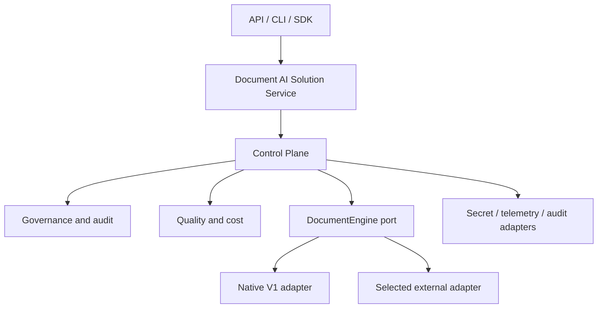

# Definitive Repository Refactoring Plan and Progress Tracker

> **Document status:** Consolidated after the second contradictory audit; Lot 0 complete, Lot 1
> (ADR-0005) drafted and awaiting team sign-off; Lots 11/12/16 subsequently split and sized for
> a 4-person team (see §9). No implementation lot has started.  
> **Last audit:** 2026-08-03  
> **Target outcome:** Deploy compliant, measurable document-AI solutions faster,
> independently of the underlying execution engine.  
> **Migration principle:** Incremental, evidence-based, reversible, and releasable after
> every accepted lot.

This document supersedes the first version of the refactoring plan while retaining its
validated decisions. It is the execution and progress-tracking source of truth. It does not
replace the product roadmap, ADRs, release notes, or operational runbooks.

The plan may change only after a blocking discovery, a material scope change, or an approved
architecture decision. Counts and repository observations below are a dated audit snapshot,
not permanent acceptance criteria.

Status values used throughout the tracker are `NOT STARTED`, `IN PROGRESS`, `BLOCKED`,
`COMPLETE`, and `CANCELLED`. A lot is `COMPLETE` only when all acceptance evidence is linked.

## 1. Executive summary of the second analysis

The first plan chose the correct product direction: this package should be an enterprise
document-AI delivery and control plane, not another general-purpose orchestration framework.
It should own governance, measurement, normalized evidence, configuration, auditability, and
engine portability while delegating generic agent runtimes, GraphRAG, multimodal execution,
and workflow engines to specialized products. The native V1 implementation remains useful as
a reference adapter, subject to explicit maintenance and exit criteria.

The second repository audit found that the first plan was strategically sound but not yet safe
to execute unchanged. It placed CI hardening, telemetry schemas, and Claude configuration too
late; did not fully cover data lifecycle, resilience, concurrency, metric correctness, public
compatibility, supply-chain risk, or operational ownership; and proposed a baseline Git tag and
possible PDF history migration without sufficient authorization and rollback constraints.

The revised order therefore:

1. records ownership, scope, compatibility surfaces, and a reproducible baseline;
2. realigns Claude instructions before they steer implementation toward the obsolete V1-to-V5
   framework roadmap;
3. characterizes current behavior and corrects capability claims;
4. validates the proposed engine boundary with an early, isolated engine-fit spike;
5. establishes contracts, configuration, audit, governance, data lifecycle, quality, and
   reliability foundations;
6. proves portability with one external engine before retiring competing prototypes;
7. closes with hardened interfaces, release evidence, and a representative pilot.

No production refactoring lot has started. Static compilation and strict layering checks pass;
dynamic tests remain unverified because the audited environment has no project virtual
environment and its available Python installation lacks the declared test tools.

## 2. Global evaluation of the first document

| Dimension | Evaluation | Conclusion |
|---|---|---|
| Product direction | Strong | Retain without changing the agreed outcome |
| Repository grounding | Good but incomplete | Retain findings and add omitted operational/data risks |
| Architecture target | Sound at high level | Validate with compatibility inventory and engine-fit spike |
| Execution order | Unsafe in places | Replace with the order in sections 9-12 |
| Acceptance criteria | Uneven | Make evidence, owners, rollback, and compatibility explicit |
| Test strategy | Broad but insufficiently semantic | Add metric, failure, concurrency, migration, and data tests |
| Migration safety | Partial | Separate reversible code migration from data/history operations |
| Progress tracking | Useful | Retain, with status and evidence per lot |

Overall verdict: **retain and substantially revise**, not restart from zero. The original 16
lots are mapped to the revised programme in section 7.

## 3. Elements correctly covered

The following conclusions from the first plan are validated by repository evidence:

- The package must not compete directly with LangGraph, LlamaIndex, or Haystack.
- Engine-independent governance and measurement are the durable product boundary.
- Existing component-level protocols are suitable as native-engine internals, not as the
  cross-engine business abstraction.
- `RAGEngine` should first be preserved behind a native `DocumentEngine` adapter.
- API, CLI, and examples must stop reading private container state.
- Manifest schemas require explicit versioning, migration, capability validation, and secret
  handling.
- Tenant, evaluation, telemetry, redaction, and policy declarations are not currently wired
  into an end-to-end enforced product guarantee.
- A single external-engine pilot is preferable to integrating three engines concurrently.
- Generic agent, graph-memory, and future-version prototypes require usage and compatibility
  analysis before retention or retirement.
- Research papers are valuable as decision evidence and evaluation inputs, not as an automatic
  feature backlog.
- Claims of stability, production readiness, security, and compliance must be backed by
  executable evidence.
- Characterization, conformance, migration, security, packaging, and business-regression tests
  are necessary before release.

## 4. Incomplete or incorrect elements

| Initial element | Problem found | Required correction |
|---|---|---|
| Create a baseline Git tag | Tag creation changes shared history and assumes authorization | Record the baseline commit SHA and evidence first; tag only after explicit release approval |
| CI gates near programme end | Allows drift during the highest-risk phases | Establish offline CI in Lot 3 and ratchet gates continuously |
| Claude cleanup near programme end | Current instructions and permissions actively steer obsolete scope and deny future adapter paths | Add a narrow interim realignment in Lot 2; perform full consolidation in Lot 17 |
| Engine contracts before selection work | Risks designing an unvalidated lowest-common-denominator abstraction | Run a time-boxed, non-production engine-fit spike before freezing contracts |
| Governance before audit foundation | Enforcement cannot produce stable compliance evidence without event semantics | Define versioned audit/trace schemas and sinks before the governed vertical slice |
| Quality gates | Existing evaluator semantics were assumed usable | Correct metric names, formulas, identities, failure handling, and dataset rules first |
| Deployment rollback | Covered binaries but not persisted index or audit compatibility | Add versioned index, replay, backup, restore, and forward/backward compatibility rules |
| Research PDF migration | Could imply destructive Git history rewriting | Do not rewrite history in this programme; treat historical purge as separate approval |
| Prototype retirement | Lacked a cost ceiling for keeping native V1 | Add ownership, support window, and explicit native-adapter exit criteria |
| Progressive mypy | Too vague to enforce | Capture a baseline, forbid new errors, then reduce a recorded budget per lot |

## 5. Newly discovered repository elements

### 5.1 Configuration and development agents

`CLAUDE.md`, `.claude/.instructions.md`, `.claude/.prompt.md`, `.claude/settings.json`,
path rules, agents, skills, hooks, and module-level Claude files form an active implementation
control system. They still encode the original sequential V1-to-V5 framework roadmap. Some
permissions deny changes under adapter and benchmark paths needed by the new target. They must
be aligned before implementation. `.claude/settings.local.json` is personal and remains
untouched and untracked.

### 5.2 Data lifecycle and index correctness

- Vector-store deletion is not mirrored reliably in the mutable in-memory BM25 index.
- Repeated ingestion, update semantics, idempotency, tombstones, and right-to-erasure are not
  defined.
- Embeddings are stored inside mutable chunk models, coupling domain data to an index strategy.
- There is no index schema/version, rebuild, backup, restore, or migration protocol.
- Free-form metadata has no classification or tenant/PII schema.

### 5.3 Reliability, concurrency, and lifecycle

- External LLM, embedding, and vector calls lack uniform timeout, retry, cancellation,
  circuit-breaker, and overload semantics.
- Startup and shutdown hooks do not own client/resource closure.
- Async surfaces can call blocking implementations.
- Mutable in-memory retrieval state and lazy model/client initialization lack documented
  concurrency guarantees.
- Broad exception handling silently degrades hybrid retrieval and can convert benchmark
  failures into apparently valid empty metrics.

### 5.4 Evaluation and trace correctness

- `ExactMatchEvaluator` behaves like token-set F1 rather than exact match.
- Answer precision/recall are written into retrieval-named fields.
- Token sets discard frequency, and benchmark identity/failure semantics are ambiguous.
- Generation trace steps can represent overlapping timings; retrieval timing and answer-guard
  decisions are not consistently represented; failed executions may not persist complete
  evidence.

### 5.5 API, configuration, and compatibility

- The documented FastAPI factory command cannot supply the required manifest argument.
- Internal exception strings can be returned to callers.
- Authentication, rate limits, request-size limits, tenant identity, and readiness semantics
  are absent; retrieval responses expose source content without an authorization boundary.
- Component configuration accepts arbitrary dictionaries and manifest extra-field policy,
  environment precedence, interpolation, secret resolution, and compatibility policy are not
  defined.
- Package version is duplicated; public Python, REST, CLI, manifest, persisted-index, and audit
  schema compatibility guarantees are not inventoried.

### 5.6 Supply chain, legal, testing, and ownership

- Reproducible dependency resolution, SBOM, vulnerability policy, third-party/model licence
  review, and update policy are missing.
- The 56 research PDFs are both a repository-size and redistribution/licensing concern.
- Major app, orchestration, API, CLI, policy, telemetry, benchmark, lifecycle, and storage
  behavior lacks direct tests.
- There is no explicit CODEOWNERS/RACI mapping, threat model, data-classification policy,
  support matrix, or owner for acceptance evidence.

## 6. Gap matrix

Severity is one of `BLOCKING`, `CRITICAL`, `IMPORTANT`, `IMPROVEMENT`, or `OPTIONAL`.

| Analysed element | First plan | Repository state | Gap | Severity/impact | Correction |
|---|---|---|---|---|---|
| Product boundary | Defined | Old roadmap still dominates instructions | Strategy and implementation control conflict | BLOCKING: scope drift | ADR plus Claude interim realignment |
| Dynamic baseline | Planned | Not executable in audited environment | Current behavior unproven | BLOCKING: unsafe refactor | Reproducible Python 3.11 environment and CI evidence |
| Public compatibility | Implicit | Multiple undocumented surfaces and private access | Breakage cannot be measured | CRITICAL | Inventory and characterize every surface |
| Tenant isolation | Planned | Tenant is descriptive, not a storage filter | Cross-tenant exposure | CRITICAL | Authenticated context plus fail-closed index/retrieval enforcement |
| Data deletion/update | Missing | Vector/BM25 state can diverge | Stale or undeletable data | CRITICAL | Document lifecycle contract and atomic/reconcilable indexing |
| Audit semantics | Planned after governance | No stable event schema/sink | Compliance evidence cannot be guaranteed | CRITICAL | Move audit foundation before governance |
| Metric correctness | Assumed | Names and calculations are inconsistent | False release decisions | CRITICAL | Version metric definitions and test reference cases |
| API security | Partial | No auth/rate limit; exception and content exposure | Data leakage/abuse | CRITICAL | Threat model, typed safe errors, auth and limits |
| Manifest configuration | Planned | Arbitrary config and unresolved placeholders | Late failures/secret risk | CRITICAL | Strict schema, precedence, secret references, validation CLI |
| Engine abstraction | Planned | Not validated against an external engine | Lock-in or weak abstraction | IMPORTANT | Early engine-fit spike then frozen v1 contract |
| Resilience | Missing | No uniform external-call policy | Cascading failures/hangs | IMPORTANT | Timeout/retry/cancellation/overload contract |
| Concurrency | Missing | Sync work and shared mutable state | Throughput and correctness risk | IMPORTANT | Concurrency model and load tests |
| Trace semantics | Partial | Duplicate/incomplete steps and weak failure trace | Misleading evidence | IMPORTANT | Versioned trace semantics and failure-path tests |
| Index migration | Missing | No schema or rebuild protocol | Irrecoverable rollout failure | CRITICAL | Versioned index, dual-read/write or rebuild strategy |
| Dependency reproducibility | Partial | No lock/constraints and CI dependency mismatch | Non-repeatable builds | IMPORTANT | Supported Python matrix and reproducible constraints |
| Versioning | Missing | Version duplicated in multiple files | Release inconsistency | IMPORTANT | Single version source and compatibility policy |
| Prototype retirement | Planned | Unknown external consumers | Accidental contract break | IMPORTANT | Usage audit, deprecation window, restore evidence |
| Research assets | Planned move | Large PDFs and unknown redistribution rights | Legal/history risk | IMPORTANT | Licence inventory; no history rewrite without separate approval |
| Ownership | Missing | Acceptance owners undefined | Lots cannot be closed objectively | IMPORTANT | RACI/CODEOWNERS and evidence owner per lot |
| Documentation claims | Planned | Delivered/planned behavior mixed | Trust and compliance risk | CRITICAL | Capability catalogue backed by tests |

## 7. Decisions on the initial plan

| Initial lot | Verdict | Repository-based decision |
|---:|---|---|
| 0 Product boundary | **Validated with adjustments** | Retain; add non-goals, ownership, compatibility classes, and native exit criteria |
| 1 Reproducible baseline | **To replan** | Move before code changes; baseline SHA first, optional tag only with approval |
| 2 Characterization | **To complete** | Add data lifecycle, metrics, failure, concurrency, and public-surface behavior |
| 3 Capability truth | **Validated with adjustments** | Perform early and maintain continuously |
| 4 Engine contracts | **To replan** | Precede by compatibility inventory and engine-fit spike |
| 5 Native adapter | **Validated with adjustments** | Add cost/support ceiling and parity/error semantics |
| 6 Manifest v2 | **Validated with adjustments** | Add strictness, precedence, interpolation, schema export, and index compatibility |
| 7 Governance | **To replan** | Threat model and audit schema first; include lifecycle and fail-closed degradation |
| 8 Quality plane | **To replace** | First repair metric semantics, then introduce profiles and gates |
| 9 External adapter | **Validated with adjustments** | Split early selection spike from later production implementation |
| 10 Telemetry/audit | **To replan** | Move schema and sink foundations before governance; keep vendor adapter later |
| 11 Interfaces/deployment | **To complete** | Add API abuse controls, lifecycle, compatibility, supply-chain and licence evidence |
| 12 Prototype retirement | **Validated with adjustments** | Require consumer inventory, deprecation, cost decision, and restoration test |
| 13 Docs/research | **To replan** | Split early Claude alignment and late consolidation; prohibit implicit history rewrite |
| 14 CI/release gates | **To replan** | Create baseline gates in Lot 3 and ratchet throughout; final hardening remains late |
| 15 Pilot/closure | **Validated with adjustments** | Add data rollback, operational exercise, and explicit business/security sign-off |

No initial lot is deleted outright. Redundant work is merged into revised lots; risky
operations are conditional rather than silently removed.

## 8. Additional risks

| Risk | Severity | Mitigation and stop condition |
|---|---|---|
| Claude automation implements the obsolete roadmap | Critical | Lot 2 must complete before architecture implementation |
| Persisted vector and lexical indexes diverge | Critical | Block governed rollout until lifecycle reconciliation tests pass |
| Empty/incorrect metrics allow regressions | Critical | Fail benchmark runs on infrastructure errors; version metric definitions |
| Refactor breaks an unknown consumer | High | Surface inventory, telemetry/usage evidence where available, deprecation window |
| Native V1 becomes a permanent second framework | High | Named owner, bounded feature policy, annual/phase exit decision |
| External abstraction becomes lowest common denominator | High | Capabilities plus engine-specific extension envelope, proven by two adapters |
| Async facade hides blocking work | High | Declare execution model and pass bounded concurrency tests |
| Raw content, PII, or secrets enter logs/audit | Critical | Data classification, redaction boundaries, schema allowlists, negative tests |
| Index migration causes data loss | Critical | Backup/restore proof, compatibility matrix, canary and rollback checkpoint |
| Research assets cannot legally be redistributed | High | Licence/provenance review; quarantine unverified assets from release artifacts |
| Dependency or model licence blocks commercial use | High | SBOM and licence gate before pilot |
| CI is green while external capabilities are untested | High | Publish explicit offline/integration evidence classes and release requirements |
| Repository history rewrite destroys recoverability | Critical | Out of scope unless separately approved, backed up, and executed as its own project |

## 9. Revised execution order

**Sizing convention:** T-shirt size plus a day/week range, assuming roughly **one or two of the
four team members focused on that lot at a time** — not the whole team in parallel, since most
lots are not internally parallelizable. S = 1-3 days, M = 3-8 days (about a week), L = 1.5-3
weeks. Sizes are estimates for re-planning, not commitments; a lot that overruns its size by a
wide margin is itself a signal to re-scope, not to silently keep going.

Lots 11, 12, and 16 from the original 18-lot list are each split into lettered sub-lots (`11a-c`,
`12a-c`, `16a-c`) because each bundled 3-5 separable deliverables under one acceptance gate,
which made them too coarse to track or size honestly. No scope was removed — see
`docs/refactoring/lot-0-baseline.md` change history for the split rationale. Sub-lots inherit
their parent's priority and dependency direction unless stated otherwise.

| Lot | Deliverable | Priority | Size | Status | Depends on |
|---:|---|---|---|---|---|
| 0 | Programme control, snapshot, ownership, and change policy | P0 | S (0.5-1d) | COMPLETE | - |
| 1 | Product-boundary ADR, non-goals, and success measures | P0 | S (1-2d) | IN PROGRESS | 0 |
| 2 | Interim Claude configuration realignment | P0 | S (1-2d) | NOT STARTED | 1 |
| 3 | Reproducible baseline and minimum CI gates | P0 | M (3-5d) | NOT STARTED | 0 |
| 4 | Public-surface inventory and characterization safety net | P0 | L (1.5-2wk) | NOT STARTED | 3 |
| 5 | Capability truth and runnable-manifest classification | P0 | S (2-3d) | NOT STARTED | 1, 3 |
| 6 | External-engine fit spike and selection ADR | P0 | M (1-1.5wk, time-boxed) | NOT STARTED | 1, 4 |
| 7 | Engine-neutral contracts and compatibility policy | P0 | M (1wk) | NOT STARTED | 4, 6 |
| 8 | Native V1 adapter and compatibility facade | P0 | M (1wk) | NOT STARTED | 7 |
| 9 | Versioned solution configuration and secret resolution | P0 | M (1wk) | NOT STARTED | 7 |
| 10 | Versioned trace/audit foundation | P0 | M (1wk) | NOT STARTED | 7, 9 |
| 11a | Threat model and data-classification policy | P0 | S (2-3d) | NOT STARTED | 8-10 |
| 11b | Authenticated identity/tenant propagation, fail-closed enforcement | P0 | M (1wk) | NOT STARTED | 11a |
| 11c | Redaction integration, audit evidence, human-review escalation | P0 | M (1wk) | NOT STARTED | 11b |
| 12a | Document identity and idempotent ingest/update/delete/tombstone | P0 | M (1wk) | NOT STARTED | 11c |
| 12b | Index schema/version, vector-lexical atomicity, reconciliation | P0 | L (1.5-2wk) | NOT STARTED | 12a |
| 12c | Backup, restore, rebuild, migration, right-to-erasure proof | P0 | M (1wk) | NOT STARTED | 12b |
| 13 | Correct quality and measurement plane | P0 | M (1wk) | NOT STARTED | 7-10 |
| 14 | Reliability, concurrency, and resource lifecycle | P1 | L (1.5-2wk) | NOT STARTED | 12c, 13 |
| 15 | First production external-engine adapter | P1 | L (2-3wk) | NOT STARTED | 7, 9, 10, 12c, 13, 14 |
| 16a | API/CLI hardening (auth, authz, limits, safe errors, readiness) | P1 | M (1wk) | NOT STARTED | 15 |
| 16b | Packaging and supply chain (builds, SBOM, licence gates, single version source) | P1 | S-M (3-5d) | NOT STARTED | 15 |
| 16c | Deployment and ops runbooks (deploy, backup, restore, rollback) | P1 | S-M (3-5d) | NOT STARTED | 16a, 16b |
| 17 | Prototype retirement and final docs/Claude/research consolidation | P1 | M (1wk) | NOT STARTED | 16a-16c |
| 18 | Multi-engine pilot, release gates, and programme closure | P1 | M-L (1-2wk) | NOT STARTED | 17 |

Ranges (e.g. `8-10`) list the earliest and latest lot whose evidence is required via the
dependency chain, not necessarily every intermediate lot as a direct predecessor. `16a` and
`16b` may run in parallel (neither touches the other's files); `16c` needs both finished.

Lots 2 and 3 may run in parallel after Lot 1 if they do not edit the same files. Lot 5 may
start during Lot 4 but cannot publish claims before baseline evidence exists. Every lot must
land as one or more atomic, independently reversible changes.

**Rough total:** summing the midpoint of every lot/sub-lot above comes to roughly **125-130
person-days** of focused work if done by one person sequentially. For a 4-person team working
this alongside regular responsibilities (not full-time on the programme), with the limited
parallelism noted above, expect **4-7 months of calendar time**, not weeks. If that horizon
doesn't match business expectations, the fix is to cut scope (fewer owned capabilities in
ADR-0005, or defer Phase C/D) — not to compress the estimate without compressing the work.

## 10. Consolidated refactoring document

### 10.1 Product boundary

The package owns engine-independent solution manifests, execution context, policy enforcement,
tenant isolation, redaction boundaries, provenance, audit schemas, quality profiles, regression
gates, cost/latency evidence, engine capability discovery, and normalized results/errors.

It delegates generic orchestration, durable workflows, generic GraphRAG and agent memory,
universal connector catalogues, multimodal model execution, and fine-tuning platforms. A
delegated capability may be exposed through an adapter; it must not be reimplemented in core
without an approved ADR showing why an adapter cannot meet the product outcome.

### 10.2 Target architecture

Dependency direction is `interfaces -> service/control plane -> contracts/core`; infrastructure
and engines implement contracts and never leak vendor types across the public boundary. Existing
fine-grained component protocols remain native-adapter internals.

### 10.3 Compatibility classes

Every change must classify its impact on: Python imports and callable signatures; REST paths and
schemas; CLI commands and exit codes; manifest schema; persisted vector/lexical data; trace and
audit schemas; deployment configuration; and documented behavior. Compatibility is not promised
until Lot 4 records the current surface and Lot 7 publishes a versioning/deprecation policy.

### 10.4 Programme invariants

- The repository remains installable and the accepted offline suite passes after every lot.
- No planned capability is described as delivered.
- Governance and evaluation profiles are engine-neutral.
- Production authorization failures are fail closed.
- Raw secrets and unapproved sensitive content are absent from logs, traces, and audit events.
- Destructive data or Git-history operations require separate approval and verified recovery.
- File moves preserve compatibility facades until deprecation criteria are met.
- Scientific sources inform explicit hypotheses; repository measurements decide acceptance.

## 11. Detailed plan by phase

### Phase A - Control and evidence (Lots 0-5)

**Lot 0:** Record baseline branch/commit SHA, dirty-worktree exclusions, decision authority,
RACI/CODEOWNERS proposal, evidence locations, and plan-change rules. Do not tag, push, or alter
remote state without authorization.

**Lot 1:** Approve an ADR for the product boundary, non-goals, target architecture, capability
ownership, measurable outcomes, and native-adapter support/exit criteria. Package renaming is a
non-blocking separate decision; preserve a stable import facade.

**Lot 2:** Narrowly update `CLAUDE.md` and shared `.claude/` instructions, rules, permissions,
agents, and skills that contradict the approved ADR. Preserve useful QA workflows. Do not touch
personal local settings. Record each retained, modified, or retired automation rule.

**Lot 3:** Create the supported Python environment and reproducible dependency set; reconcile
`pytest-cov`; run lint, offline unit/contract tests, compilation, strict layering, wheel build,
and clean-install smoke tests. Establish minimum GitHub CI. Capture a mypy baseline and reject
new errors; reduce the budget deliberately thereafter.

**Lot 4:** Inventory public and persisted compatibility surfaces. Add fake-based characterization
tests for manifest loading, registry wiring, ingest/retrieve/answer, API, CLI, errors, security,
trace behavior, metrics, deletion/update, and hybrid fallback. Record existing questionable
behavior without silently blessing it as the target.

**Lot 5:** Correct README, roadmap, changelog, manifests, UUID/ULID statements, environment
examples, test counts, API launch instructions, and compliance claims. Classify each manifest as
runnable, experimental, or blueprint and validate runnable commands in CI.

### Phase B - Architecture foundations (Lots 6-10)

**Lot 6:** Use one representative use case to compare LangGraph, LlamaIndex, and Haystack against
required ingest, answer, evidence, streaming, cancellation, governance interception, telemetry,
and deployment capabilities. Build only disposable adapter spikes outside the production path.
Select one engine through an ADR; do not integrate all three.

**Lot 7:** Define versioned `DocumentEngine`, capabilities, normalized requests/results,
`ExecutionContext`, evidence/citation, typed error, cancellation, and extension-envelope
semantics. Define public compatibility and deprecation policy. Supply a fake engine and semantic
conformance suite, not merely runtime `Protocol` checks.

**Lot 8:** Implement the native adapter around `RAGEngine`; remove private-container access from
interfaces; retain `load_pipeline()` or equivalent compatibility facade; verify old/new parity,
failure semantics, and native-adapter maintenance budget.

**Lot 9:** Introduce strict versioned solution manifests with engine, governance, quality, and
observability sections; define extra-field policy, configuration precedence, environment
interpolation, secret references, capability validation, JSON schema export, validation CLI,
and tested v1-to-v2 migration.

**Lot 10:** Define separate versioned trace and compliance-audit events, correlation/causation,
failure events, timing semantics, PII allowlists, retention metadata, and sink contracts. Provide
in-memory test sinks before vendor integrations. Remove duplicate or ambiguous timing steps.

### Phase C - Enterprise correctness (Lots 11a-14)

**Lot 11a:** Produce a threat model and a data-classification policy (public/internal/
confidential/restricted, tenant/PII schema). Paper-and-fixture deliverable; no enforcement code
yet. Blocks 11b, since identity/tenant propagation needs the classification to enforce against.

**Lot 11b:** Propagate authenticated identity and tenant through `ExecutionContext`; enforce
fail-closed policy before indexing, retrieval, and generation. Test cross-tenant and
policy-engine failure paths (deny-by-default on policy-engine error, not allow-by-default).

**Lot 11c:** Apply configured redaction before storage, logging, and external calls; emit audit
evidence for every governed execution; support human review for high-risk outcomes. Depends on
11b's identity/tenant context to know what to redact and for whom.

**Lot 12a:** Define document identity, idempotent ingestion, update, deletion, and tombstone
semantics. This is the domain-level lifecycle contract, independent of any specific index
implementation.

**Lot 12b:** Define index schema/version; make vector/lexical writes atomic or reconcilable;
implement the reconciliation job that detects and repairs BM25/vector divergence. Separate
domain chunks from mutable embedding storage where required by the approved design. The largest
sub-lot in Phase C — consider a mid-lot checkpoint rather than one large acceptance gate.

**Lot 12c:** Implement backup, restore, rebuild-from-source, and right-to-erasure proof
(including a verified restore exercise, not just a backup that has never been tested). Depends
on 12b's index schema existing to version against.

**Lot 13:** Correct metric vocabulary and formulas with reference fixtures; version quality and
golden-dataset schemas; distinguish infrastructure failure from zero quality; measure retrieval,
answer, evidence, policy, latency, and cost; begin gates in report-only mode and promote agreed
thresholds to blocking with recorded baselines.

**Lot 14:** Define sync/async execution, timeouts, retry eligibility, cancellation, circuit
breaking, backpressure, overload, and graceful shutdown. Own and close clients/resources. Make
lazy initialization and mutable indexes concurrency-safe or explicitly single-worker. Add fault,
concurrency, soak, and bounded-load evidence.

### Phase D - Portability and delivery (Lots 15-18)

**Lot 15:** Implement the selected external adapter. It must pass the same semantic engine,
governance, audit, migration, quality, cancellation, and failure tests as native V1. Express
differences through capabilities and documented extension configuration.

**Lot 16a:** Harden FastAPI factory/startup, typed safe errors, authentication, authorization,
rate and request-size limits, readiness/liveness, content exposure, and CLI exit codes.

**Lot 16b:** Immutable wheel/container builds, SBOM, vulnerability and licence gates (including
the 56 research PDFs' redistribution rights), and one authoritative version source. Independent
of 16a — different files, can run in parallel with a second owner.

**Lot 16c:** Deployment, backup, restore, and rollback runbooks. Needs both 16a (what to deploy)
and 16b (how it's built/scanned) finished first.

**Lot 17:** Audit imports and consumers, then deprecate, retain, or remove generic agents,
FlowCompiler/router paths, graph memory/versioning, unused future manifests, stale GitLab assets,
and unused dependencies. Complete Claude/documentation consolidation and a research evidence
catalogue. Keep digests; stop adding large binaries. Do not rewrite Git history in this lot.

**Lot 18:** Run a sanitized representative scenario with native and external engines under the
same governance and quality profiles. Compare delivery effort, quality, latency, cost, audit
evidence, concurrency, deployment, data migration, and rollback. Harden all approved CI gates,
remove expired shims, publish release evidence, and obtain architecture, security, operations,
legal, and business-quality sign-off.

## 12. Acceptance criteria by stage

| Stage | Mandatory evidence |
|---|---|
| Lot 0 | Baseline SHA, worktree exclusions, owners, evidence location, change policy |
| Lot 1 | Approved ADR; explicit owned/delegated capabilities; native exit criteria |
| Lot 2 | Shared Claude configuration matches ADR; quality workflows retained; local settings untouched |
| Lot 3 | Fresh install and offline gates pass in local/CI parity; dependency and type baselines recorded |
| Lot 4 | Every identified public surface and critical failure path has characterization evidence |
| Lot 5 | No unsupported delivered/security/compliance claim; runnable docs commands pass |
| Lot 6 | Selection matrix, spike evidence, ADR, and documented rejected alternatives |
| Lot 7 | Vendor-neutral types; semantic fake/conformance tests; versioning policy |
| Lot 8 | V1 parity; no interface private-state access; compatibility route and rollback flag |
| Lot 9 | Strict validation before startup; schema export; all runnable v1 manifests migrate and roll back |
| Lot 10 | Stable trace/audit schemas; complete success/failure evidence; no raw secret/PII leakage |
| Lot 11a | Written threat model and data-classification policy, reviewed by the team |
| Lot 11b | Cross-tenant tests fail closed; policy-engine errors deny by default, never allow by default |
| Lot 11c | Every governed execution has redaction, policy, and audit evidence attached |
| Lot 12a | Re-ingest/update/delete are deterministic and idempotent; tombstones proven |
| Lot 12b | Index schema versioned; vector/lexical divergence is detected and reconciled, not silent |
| Lot 12c | Backup/restore and right-to-erasure proven via an actual executed restore, not a written procedure |
| Lot 13 | Reference metric fixtures pass; failures cannot appear as zero scores; baselines are reproducible |
| Lot 14 | Deadlines/cancellation/shutdown work; fault and concurrency targets are met and recorded |
| Lot 15 | Both engines pass the same mandatory suite; profile switch requires no governance rewrite |
| Lot 16a | API/CLI reject unauthenticated/oversized/malformed requests; no internal exception text leaks |
| Lot 16b | Wheel/container builds reproducible; SBOM and licence gates pass, including the 56 PDFs |
| Lot 16c | Deploy, backup, restore, and rollback commands are each executed at least once, not just documented |
| Lot 17 | Each removal has impact evidence, deprecation or non-use proof, and restoration path |
| Lot 18 | Pilot and rollback exercise pass; mandatory gates green; named owners sign final evidence |

## 13. Test and non-regression strategy

| Test class | Core evidence | Runs when |
|---|---|---|
| Static | Compilation, Ruff, import/layering rules, type-error ratchet | Every change |
| Characterization | Existing public behavior and known quirks | Before structural change |
| Unit | Policies, schemas, mapping, redaction, metrics, lifecycle state | Every implementation lot |
| Semantic contract | Results, capabilities, errors, cancellation, evidence invariants | Every engine/adapter |
| Configuration/migration | Strict schema, precedence, secrets, v1/v2 and rollback | Every schema change |
| Data lifecycle | Idempotency, update, delete, reconciliation, backup/restore | Every storage change |
| Security/privacy | Tenant isolation, injection, exfiltration, log safety, abuse limits | Every governed release |
| Fault/concurrency | Timeouts, retries, partial failure, cancellation, load, shutdown | Adapter/runtime changes |
| Integration | Qdrant, selected engine, identity, audit, telemetry, secrets | Confirmed services/keys |
| End to end | Ingest through governed answer, audit, delete, restore | Release candidate |
| Quality/business | Versioned golden sets, cost/latency, deterministic baseline | Engine/model/prompt change |
| Packaging/operations | Wheel/container install, health, deploy, migration, rollback | Release candidate |
| Documentation | Links, commands, manifests, capability catalogue | Every docs/release change |

Offline tests must use deterministic fakes, fixed seeds, and controllable clocks where time or
retry behavior matters. Integration and e2e suites must never be reported as passed when skipped.
Benchmark infrastructure failures fail the run; they do not produce empty metrics. Thresholds
record dataset version, engine/model version, configuration, environment, and confidence limits.

## 14. Migration and rollback strategy

1. **Checkpoint:** Record commit SHA, artifacts, schemas, dependency set, and test evidence before
   each lot. Tags and pushes require normal release authorization.
2. **Add before move:** Introduce new contracts/facades, then migrate callers; preserve old imports
   and commands for the declared compatibility window.
3. **Shadow/compare:** Run native old/new paths and, later, native/external engines on identical
   sanitized inputs before switching defaults.
4. **Configuration:** Dual-read manifest v1/v2; write only the new version; provide explicit
   validation, migration, and downgrade limitations.
5. **Data:** Version indexes. Prefer rebuild from authoritative documents or a tested dual-index
   canary. Verify backup and restore before migration. Never infer that code rollback can read a
   newer persisted schema.
6. **Audit:** Treat event schemas as append-only/versioned. Consumers accept the supported old/new
   window; never mutate historical compliance evidence in place.
7. **Release:** Use feature/profile flags and canaries where safe. Retain the previous wheel,
   container, manifest, index snapshot, and runbook until acceptance closes.
8. **Removal:** Require non-use evidence, dependency/import search, deprecation where public,
   release notes, and a tested restoration commit/artifact.
9. **Research assets/history:** Do not purge Git history during this programme. Externalization or
   historical cleanup is a separately approved, backed-up migration.
10. **Rollback trigger:** Stop rollout on compatibility breach, cross-tenant exposure, missing
    audit evidence, data divergence, quality threshold breach, unrecoverable error-rate increase,
    or failed restore exercise.

## 15. Final completeness checklist

- [ ] Product ADR, non-goals, owners, success measures, and plan-change rules are approved.
- [ ] Claude and repository instructions express the same product boundary.
- [ ] Baseline and all mandatory offline checks are reproducible locally and in CI.
- [ ] Public and persisted compatibility surfaces have policies and tests.
- [ ] Native V1 and one external engine satisfy the same semantic contract.
- [ ] Engine switches do not rewrite governance or quality profiles.
- [ ] Manifests are strict, versioned, migratable, capability-aware, and secret-safe.
- [ ] Tenant isolation, policy failures, redaction, and audit are enforced end to end.
- [ ] Document update/deletion and vector/lexical reconciliation are proven.
- [ ] Index and audit migrations have verified backup, restore, and rollback paths.
- [ ] Metrics have correct names/formulas and cannot hide infrastructure failures.
- [ ] Trace timings, errors, costs, and evidence have unambiguous versioned semantics.
- [ ] Timeouts, cancellation, resource closure, concurrency, and overload behavior are tested.
- [ ] API, CLI, wheel, container, health, deployment, and rollback commands are executable.
- [ ] SBOM, vulnerability, secret, dependency, model, and licence evidence pass policy.
- [ ] Documentation has no unsupported delivered, production, security, or compliance claim.
- [ ] Each prototype is supported, delegated/deprecated, or removed with impact evidence.
- [ ] Research digests and evidence catalogue are retained; binary provenance is resolved.
- [ ] Representative pilot evidence is approved by named technical and business owners.
- [ ] All expired compatibility shims are removed only after their support window.

## 16. Remaining uncertainties and unverifiable points

| Unknown | Effect | Resolution owner/milestone |
|---|---|---|
| Current external consumers of Python/API/CLI/manifests | Compatibility window cannot be finalized | Lot 0/4 owner inventory |
| First external engine and pilot use case | Contract details and adapter scope remain provisional | Lot 6 ADR |
| Target identity provider and authorization claims | Auth adapter and context mapping cannot be finalized | Before Lot 11b |
| Target deployment platform and topology | Container, readiness, scaling, and rollback details remain open | Before Lot 16c |
| Audit retention, immutability, residency, and legal requirements | Sink and schema policy remain provisional | Before Lot 10 acceptance |
| SLOs, throughput, corpus scale, and cost budgets | Performance gates cannot be set | Before Lot 13/14 blocking gates |
| Authoritative document source and deletion obligations | Rebuild/right-to-erasure design remains provisional | Before Lot 12a |
| Research PDF and dependency/model redistribution rights | Release contents may need quarantine or replacement | Before Lot 16b/17 |
| Dynamic current test results | Runtime baseline is unverified | Lot 3; dependencies unavailable during audit |
| Integration/e2e behavior | Requires confirmed Qdrant, engine services, credentials, and datasets | Lots 15-18 |
| Full semantic content of all 56 PDFs | PDFs were inventoried/digested, not page-validated during audit | Evidence-catalogue review in Lot 17 |

### Audit evidence and analysis limits

The audit covered all 382 tracked paths by inventory and classification, executable Python
architecture, tests, manifests, dependency declarations, CI, scripts, primary documentation,
Claude configuration, and research digests. Static Python compilation and strict layering passed.
The 56 source PDFs were inventoried and their repository digests reviewed, but not all pages were
manually validated. Empty placeholder files were classified but contain no analyzable behavior.
Personal `.claude/settings.local.json` was deliberately excluded. Dynamic unit, contract,
integration, e2e, performance, and security suites were not represented as passing.

### Decision log

| Date | Decision | Status |
|---|---|---|
| 2026-08-03 | Build an engine-independent, compliant, measurable document-AI delivery platform | ACCEPTED |
| 2026-08-03 | Do not compete directly with general-purpose orchestration/indexing frameworks | ACCEPTED |
| 2026-08-03 | Retain V1 as a bounded native/reference adapter | ACCEPTED |
| 2026-08-03 | Retain scientific work as evidence, hypotheses, and evaluation support | ACCEPTED |
| 2026-08-03 | Consolidate the second contradictory audit into this definitive tracker | COMPLETE |
| 2026-08-03 | Recorded Lot 0 baseline (commit `47ea77f`), decision authority, and evidence locations | COMPLETE |
| 2026-08-03 | Drafted ADR-0005 (product boundary, capability ownership, native-adapter exit criteria) | PROPOSED — awaiting 4-person team sign-off |
| Pending | Select the first external engine | Lot 6 |
| Pending | Approve the product ADR and named owners | Lots 0-1 |
| Pending | Decide final product/package name | Non-blocking |

### Change history

| Date | Change |
|---|---|
| 2026-08-03 | Created the first repository refactoring plan and tracker |
| 2026-08-03 | Consolidated the second contradictory audit; revised order; added Claude alignment, data lifecycle, metric correctness, resilience, compatibility, supply-chain, ownership, and safe rollback controls |
| 2026-08-03 | Lot 0 executed: `docs/refactoring/lot-0-baseline.md` created (baseline SHA, decision authority, ownership table, evidence locations) |
| 2026-08-03 | Lot 1 drafted: `docs/adr/0005-document-ai-control-plane-boundary.md` created, status Proposed, `docs/adr/_index.md` updated |
| 2026-08-03 | Plan validation pass: added per-lot effort sizing and a total-programme estimate (~125-130 person-days, 4-7 months for a 4-person team); split Lots 11, 12, 16 into lettered sub-lots (11a-c, 12a-c, 16a-c) because each bundled 3-5 separable deliverables under one acceptance gate | COMPLETE |
