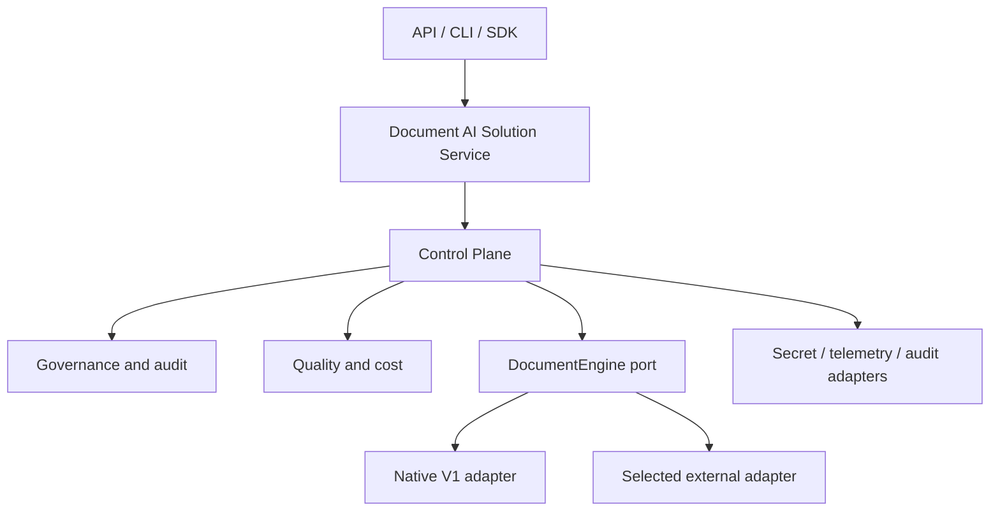

# Refactoring Plan — Engine-Agnostic Control Plane

> **Status:** Lot 0 complete; Lot 1 (product-boundary ADR) drafted, pending sign-off from all
> 4 team members.
> **Target outcome:** Deploy compliant, measurable document-AI solutions faster, independently
> of the underlying execution engine.
> **Migration principle:** Incremental, evidence-based, reversible, and releasable after every
> accepted lot.
> **Governing decision:** [ADR-0005](adr/0005-document-ai-control-plane-boundary.md) — product
> boundary, owned vs. delegated capabilities, native-adapter exit criteria.

This document is the execution and progress-tracking source of truth for the refactoring
programme. It does not replace the product roadmap, ADRs, release notes, or operational
runbooks. Baseline snapshot, decision authority, per-lot ownership, and the rules for changing
this plan live in [docs/refactoring/lot-0-baseline.md](refactoring/lot-0-baseline.md).

Status values used throughout are `NOT STARTED`, `IN PROGRESS`, `BLOCKED`, `COMPLETE`, and
`CANCELLED`. A lot is `COMPLETE` only when every acceptance-evidence item in §6 is linked.

---

## 1. Product boundary and target architecture

### 1.1 Owned vs. delegated

The package owns engine-independent solution manifests, execution context, policy enforcement,
tenant isolation, redaction boundaries, provenance, audit schemas, quality profiles, regression
gates, cost/latency evidence, engine capability discovery, and normalized results/errors.

It delegates generic orchestration, durable workflows, generic GraphRAG and agent memory,
universal connector catalogues, multimodal model execution, and fine-tuning platform mechanics
to a selected external engine. A delegated capability may be exposed through an adapter; it must
not be reimplemented in core without an approved ADR showing why an adapter cannot meet the
product outcome. Full rationale, capability tables, non-goals, and native-adapter exit criteria:
[ADR-0005](adr/0005-document-ai-control-plane-boundary.md).

### 1.2 Target architecture

Dependency direction is `interfaces -> service/control plane -> contracts/core`; infrastructure
and engines implement contracts and never leak vendor types across the public boundary. Existing
fine-grained component protocols (`Chunker`, `Retriever`, `Generator`, ...) remain native-adapter
internals, not the cross-engine abstraction.

### 1.3 Compatibility classes

Every change must classify its impact on: Python imports and callable signatures; REST paths and
schemas; CLI commands and exit codes; manifest schema; persisted vector/lexical data; trace and
audit schemas; deployment configuration; and documented behavior. Compatibility is not promised
until Lot 4 records the current surface and Lot 7 publishes a versioning/deprecation policy.

### 1.4 Programme invariants

- The repository remains installable and the accepted offline suite passes after every lot.
- No planned capability is described as delivered.
- Governance and evaluation profiles are engine-neutral.
- Production authorization failures are fail closed.
- Raw secrets and unapproved sensitive content are absent from logs, traces, and audit events.
- Destructive data or Git-history operations require separate approval and verified recovery.
- File moves preserve compatibility facades until deprecation criteria are met.
- Scientific sources inform explicit hypotheses; repository measurements decide acceptance.

---

## 2. Current repository state and known gaps

Findings below are tracked against the target in §1. Severity is one of `BLOCKING`, `CRITICAL`,
`IMPORTANT`, `IMPROVEMENT`, or `OPTIONAL`. Every row names the lot that resolves it.

| Area | Current gap | Severity | Resolved by |
|---|---|---|---|
| Product boundary | `CLAUDE.md`/`.claude/` instructions still encode the pre-ADR-0005 V1→V5 native-build roadmap | BLOCKING (scope drift) | Lot 2 |
| Dynamic baseline | No reproducible test environment; declared test tools unavailable in the current one | BLOCKING (unsafe refactor) | Lot 3 |
| Public compatibility | Multiple undocumented surfaces; API/CLI/examples read private container state | CRITICAL | Lot 4 |
| Tenant isolation | Tenant is descriptive metadata, not an enforced storage filter | CRITICAL | Lot 11b |
| Data deletion/update | Vector-store deletion is not mirrored in the mutable in-memory BM25 index; no idempotency/tombstone contract | CRITICAL | Lot 12a, 12b |
| Audit semantics | No stable event schema or sink; compliance evidence cannot be guaranteed | CRITICAL | Lot 10 |
| Metric correctness | `ExactMatchEvaluator` behaves like token-set F1, not exact match; answer precision/recall written into retrieval-named fields | CRITICAL | Lot 13 |
| API security | No auth, rate limits, or request-size limits; internal exception strings and source content can leak to callers | CRITICAL | Lot 16a |
| Manifest configuration | Component config accepts arbitrary dicts; no extra-field policy, precedence, interpolation, or secret-reference resolution | CRITICAL | Lot 9 |
| Engine abstraction | Not yet validated against an external engine; risk of designing an unvalidated lowest-common-denominator port | IMPORTANT | Lot 6, 7 |
| Resilience | External LLM/embedding/vector calls lack uniform timeout, retry, cancellation, and overload semantics | IMPORTANT | Lot 14 |
| Concurrency | Sync work callable from async surfaces; mutable in-memory state has no documented concurrency guarantee | IMPORTANT | Lot 14 |
| Trace semantics | Generation trace steps can overlap; failed executions may not persist complete evidence | IMPORTANT | Lot 10 |
| Index migration | No index schema/version, rebuild, backup, or restore protocol | CRITICAL | Lot 12b, 12c |
| Dependency reproducibility | No dependency lock/constraints; CI/declared-tooling mismatch | IMPORTANT | Lot 3 |
| Versioning | Package version duplicated across files | IMPORTANT | Lot 16b |
| Prototype retirement | Unknown external consumers of generic agents, graph memory, and other future-version stubs | IMPORTANT | Lot 17 |
| Research assets | 56 research PDFs carry repository-size and redistribution/licensing risk | IMPORTANT | Lot 16b, 17 |
| Ownership | Acceptance owners were undefined | IMPORTANT | Lot 0 (recorded, see `lot-0-baseline.md`) |
| Documentation/sales claims | Delivered vs. planned behavior is mixed in docs and business-case material — e.g. multi-tenant isolation and audit-trail claims currently outrun what §1's gaps above actually enforce | CRITICAL | Lot 5 |

---

## 3. Risks

| Risk | Severity | Mitigation and stop condition |
|---|---|---|
| Automation implements scope the ADR delegates away | Critical | Lot 2 must complete before further implementation |
| Persisted vector and lexical indexes diverge | Critical | Block governed rollout until lifecycle reconciliation tests pass |
| Empty/incorrect metrics allow regressions | Critical | Fail benchmark runs on infrastructure errors; version metric definitions |
| Refactor breaks an unknown consumer | High | Surface inventory, telemetry/usage evidence where available, deprecation window |
| Native V1 becomes a permanent second framework | High | Named owner, bounded feature policy, exit-criteria decision at Lot 17/18 |
| External abstraction becomes lowest common denominator | High | Capabilities plus engine-specific extension envelope, proven by two adapters |
| Async facade hides blocking work | High | Declare execution model and pass bounded concurrency tests |
| Raw content, PII, or secrets enter logs/audit | Critical | Data classification, redaction boundaries, schema allowlists, negative tests |
| Index migration causes data loss | Critical | Backup/restore proof, compatibility matrix, canary and rollback checkpoint |
| Research assets cannot legally be redistributed | High | Licence/provenance review; quarantine unverified assets from release artifacts |
| Dependency or model licence blocks commercial use | High | SBOM and licence gate before pilot |
| CI is green while external capabilities are untested | High | Publish explicit offline/integration evidence classes and release requirements |
| Repository history rewrite destroys recoverability | Critical | Out of scope unless separately approved, backed up, and executed as its own project |
| The programme itself is not worth its cost | High | Confirm the delivery-project pipeline assumption behind the business case before committing full-team time past Lot 5 |

---

## 4. Execution order and sizing

**Sizing convention:** T-shirt size plus a day/week range, assuming roughly **one or two of the
four team members focused on that lot at a time** — not the whole team in parallel, since most
lots are not internally parallelizable. S = 1-3 days, M = 3-8 days (about a week), L = 1.5-3
weeks. Sizes are estimates for re-planning, not commitments; a lot that overruns its size by a
wide margin is a signal to re-scope, not to silently keep going.

Lots 11, 12, and 16 are split into lettered sub-lots (`11a-c`, `12a-c`, `16a-c`) because each
bundled 3-5 separable deliverables under one acceptance gate, which made them too coarse to
track or size honestly. Sub-lots inherit their parent's priority and dependency direction unless
stated otherwise.

| Lot | Deliverable | Priority | Size | Status | Depends on |
|---:|---|---|---|---|---|
| 0 | Programme control, snapshot, ownership, and change policy | P0 | S (0.5-1d) | COMPLETE | - |
| 1 | Product-boundary ADR, non-goals, and success measures | P0 | S (1-2d) | IN PROGRESS | 0 |
| 2 | Interim Claude configuration realignment | P0 | S (1-2d) | NOT STARTED | 1 |
| 3 | Reproducible baseline and minimum CI gates | P0 | M (3-5d) | NOT STARTED | 0 |
| 4 | Public-surface inventory and characterization safety net | P0 | L (1.5-2wk) | NOT STARTED | 3 |
| 5 | Capability truth and runnable-manifest classification | P0 | S (2-3d) | NOT STARTED | 1, 3 |
| 6 | External-engine fit spike and selection ADR | P0 | M (1-1.5wk, time-boxed) | NOT STARTED | 1, 4 |
| 7 | Engine-neutral contracts and compatibility policy | P0 | M (1wk) | NOT STARTED | 4, 6 |
| 8 | Native V1 adapter and compatibility facade | P0 | M (1wk) | NOT STARTED | 7 |
| 9 | Versioned solution configuration and secret resolution | P0 | M (1wk) | NOT STARTED | 7 |
| 10 | Versioned trace/audit foundation | P0 | M (1wk) | NOT STARTED | 7, 9 |
| 11a | Threat model and data-classification policy | P0 | S (2-3d) | NOT STARTED | 8-10 |
| 11b | Authenticated identity/tenant propagation, fail-closed enforcement | P0 | M (1wk) | NOT STARTED | 11a |
| 11c | Redaction integration, audit evidence, human-review escalation | P0 | M (1wk) | NOT STARTED | 11b |
| 12a | Document identity and idempotent ingest/update/delete/tombstone | P0 | M (1wk) | NOT STARTED | 11c |
| 12b | Index schema/version, vector-lexical atomicity, reconciliation | P0 | L (1.5-2wk) | NOT STARTED | 12a |
| 12c | Backup, restore, rebuild, migration, right-to-erasure proof | P0 | M (1wk) | NOT STARTED | 12b |
| 13 | Correct quality and measurement plane | P0 | M (1wk) | NOT STARTED | 7-10 |
| 14 | Reliability, concurrency, and resource lifecycle | P1 | L (1.5-2wk) | NOT STARTED | 12c, 13 |
| 15 | First production external-engine adapter | P1 | L (2-3wk) | NOT STARTED | 7, 9, 10, 12c, 13, 14 |
| 16a | API/CLI hardening (auth, authz, limits, safe errors, readiness) | P1 | M (1wk) | NOT STARTED | 15 |
| 16b | Packaging and supply chain (builds, SBOM, licence gates, single version source) | P1 | S-M (3-5d) | NOT STARTED | 15 |
| 16c | Deployment and ops runbooks (deploy, backup, restore, rollback) | P1 | S-M (3-5d) | NOT STARTED | 16a, 16b |
| 17 | Prototype retirement and final docs/Claude/research consolidation | P1 | M (1wk) | NOT STARTED | 16a-16c |
| 18 | Multi-engine pilot, release gates, and programme closure | P1 | M-L (1-2wk) | NOT STARTED | 17 |

Ranges (e.g. `8-10`) list the earliest and latest lot whose evidence is required via the
dependency chain, not necessarily every intermediate lot as a direct predecessor. `16a` and
`16b` may run in parallel (neither touches the other's files); `16c` needs both finished. Lots 2
and 3 may run in parallel after Lot 1 if they do not edit the same files. Lot 5 may start during
Lot 4 but cannot publish claims before baseline evidence exists. Every lot must land as one or
more atomic, independently reversible changes.

**Rough total:** summing the midpoint of every lot/sub-lot above comes to roughly **125-130
person-days** of focused work if done by one person sequentially. For a 4-person team working
this alongside regular responsibilities, with the limited parallelism noted above, expect
**4-7 months of calendar time**, not weeks. Before committing past Lot 5, confirm the
delivery-pipeline assumption the business case rests on (see §3, last risk row) — if fewer
client engagements are actually in scope than assumed, cut Phase D scope rather than compress
the estimate without compressing the work.

---

## 5. Detailed plan by phase

### Phase A — Control and evidence (Lots 0-5)

**Lot 0:** Record baseline branch/commit SHA, dirty-worktree exclusions, decision authority,
ownership, evidence locations, and plan-change rules. Do not tag, push, or alter remote state
without authorization.

**Lot 1:** Approve an ADR for the product boundary, non-goals, target architecture, capability
ownership, measurable outcomes, and native-adapter support/exit criteria. Package renaming is a
non-blocking separate decision; preserve a stable import facade.

**Lot 2:** Narrowly update `CLAUDE.md` and shared `.claude/` instructions, rules, permissions,
agents, and skills that contradict the approved ADR. Preserve useful QA workflows. Do not touch
personal local settings. Record each retained, modified, or retired automation rule.

**Lot 3:** Create the supported Python environment and reproducible dependency set; reconcile
`pytest-cov`; run lint, offline unit/contract tests, compilation, strict layering, wheel build,
and clean-install smoke tests. Establish minimum GitHub CI. Capture a mypy baseline and reject
new errors; reduce the budget deliberately thereafter.

**Lot 4:** Inventory public and persisted compatibility surfaces. Add fake-based characterization
tests for manifest loading, registry wiring, ingest/retrieve/answer, API, CLI, errors, security,
trace behavior, metrics, deletion/update, and hybrid fallback. Record existing questionable
behavior without silently blessing it as the target.

**Lot 5:** Correct README, roadmap, changelog, manifests, UUID/ULID statements, environment
examples, test counts, API launch instructions, and compliance/business-case claims. Classify
each manifest as runnable, experimental, or blueprint and validate runnable commands in CI.

### Phase B — Architecture foundations (Lots 6-10)

**Lot 6:** Use one representative use case to compare at least two candidate engines (e.g.
LangGraph, LlamaIndex, Haystack) against required ingest, answer, evidence, streaming,
cancellation, governance interception, telemetry, and deployment capabilities. Build only
disposable adapter spikes outside the production path. Select one engine through an ADR.

**Lot 7:** Define versioned `DocumentEngine`, capabilities, normalized requests/results,
`ExecutionContext`, evidence/citation, typed error, cancellation, and extension-envelope
semantics. Define public compatibility and deprecation policy. Supply a fake engine and semantic
conformance suite, not merely runtime `Protocol` checks.

**Lot 8:** Implement the native adapter around `RAGEngine`; remove private-container access from
interfaces; retain `load_pipeline()` or equivalent compatibility facade; verify old/new parity,
failure semantics, and native-adapter maintenance budget.

**Lot 9:** Introduce strict versioned solution manifests with engine, governance, quality, and
observability sections; define extra-field policy, configuration precedence, environment
interpolation, secret references, capability validation, JSON schema export, validation CLI,
and tested v1-to-v2 migration.

**Lot 10:** Define separate versioned trace and compliance-audit events, correlation/causation,
failure events, timing semantics, PII allowlists, retention metadata, and sink contracts. Provide
in-memory test sinks before vendor integrations. Remove duplicate or ambiguous timing steps.

### Phase C — Enterprise correctness (Lots 11a-14)

**Lot 11a:** Produce a threat model and a data-classification policy (public/internal/
confidential/restricted, tenant/PII schema). Paper-and-fixture deliverable; no enforcement code
yet. Blocks 11b, since identity/tenant propagation needs the classification to enforce against.

**Lot 11b:** Propagate authenticated identity and tenant through `ExecutionContext`; enforce
fail-closed policy before indexing, retrieval, and generation. Test cross-tenant and
policy-engine failure paths (deny-by-default on policy-engine error, not allow-by-default).

**Lot 11c:** Apply configured redaction before storage, logging, and external calls; emit audit
evidence for every governed execution; support human review for high-risk outcomes. Depends on
11b's identity/tenant context to know what to redact and for whom.

**Lot 12a:** Define document identity, idempotent ingestion, update, deletion, and tombstone
semantics. This is the domain-level lifecycle contract, independent of any specific index
implementation.

**Lot 12b:** Define index schema/version; make vector/lexical writes atomic or reconcilable;
implement the reconciliation job that detects and repairs BM25/vector divergence. Separate
domain chunks from mutable embedding storage where required by the approved design. The largest
sub-lot in Phase C — consider a mid-lot checkpoint rather than one large acceptance gate.

**Lot 12c:** Implement backup, restore, rebuild-from-source, and right-to-erasure proof
(including a verified restore exercise, not just a backup that has never been tested). Depends
on 12b's index schema existing to version against.

**Lot 13:** Correct metric vocabulary and formulas with reference fixtures; version quality and
golden-dataset schemas; distinguish infrastructure failure from zero quality; measure retrieval,
answer, evidence, policy, latency, and cost; begin gates in report-only mode and promote agreed
thresholds to blocking with recorded baselines.

**Lot 14:** Define sync/async execution, timeouts, retry eligibility, cancellation, circuit
breaking, backpressure, overload, and graceful shutdown. Own and close clients/resources. Make
lazy initialization and mutable indexes concurrency-safe or explicitly single-worker. Add fault,
concurrency, soak, and bounded-load evidence.

### Phase D — Portability and delivery (Lots 15-18)

**Lot 15:** Implement the selected external adapter. It must pass the same semantic engine,
governance, audit, migration, quality, cancellation, and failure tests as native V1. Express
differences through capabilities and documented extension configuration.

**Lot 16a:** Harden FastAPI factory/startup, typed safe errors, authentication, authorization,
rate and request-size limits, readiness/liveness, content exposure, and CLI exit codes.

**Lot 16b:** Immutable wheel/container builds, SBOM, vulnerability and licence gates (including
the 56 research PDFs' redistribution rights), and one authoritative version source. Independent
of 16a — different files, can run in parallel with a second owner.

**Lot 16c:** Deployment, backup, restore, and rollback runbooks. Needs both 16a (what to deploy)
and 16b (how it's built/scanned) finished first.

**Lot 17:** Audit imports and consumers, then deprecate, retain, or remove generic agents,
FlowCompiler/router paths, graph memory/versioning, unused future manifests, stale GitLab assets,
and unused dependencies. Complete Claude/documentation consolidation and a research evidence
catalogue. Keep digests; stop adding large binaries. Do not rewrite Git history in this lot.

**Lot 18:** Run a sanitized representative scenario with native and external engines under the
same governance and quality profiles. Compare delivery effort, quality, latency, cost, audit
evidence, concurrency, deployment, data migration, and rollback. Harden all approved CI gates,
remove expired shims, publish release evidence, and obtain architecture, security, operations,
legal, and business-quality sign-off.

---

## 6. Acceptance criteria by stage

| Stage | Mandatory evidence |
|---|---|
| Lot 0 | Baseline SHA, worktree exclusions, owners, evidence location, change policy |
| Lot 1 | Approved ADR; explicit owned/delegated capabilities; native exit criteria |
| Lot 2 | Shared Claude configuration matches ADR; quality workflows retained; local settings untouched |
| Lot 3 | Fresh install and offline gates pass in local/CI parity; dependency and type baselines recorded |
| Lot 4 | Every identified public surface and critical failure path has characterization evidence |
| Lot 5 | No unsupported delivered/security/compliance claim; runnable docs commands pass |
| Lot 6 | Selection matrix, spike evidence, ADR, and documented rejected alternatives |
| Lot 7 | Vendor-neutral types; semantic fake/conformance tests; versioning policy |
| Lot 8 | V1 parity; no interface private-state access; compatibility route and rollback flag |
| Lot 9 | Strict validation before startup; schema export; all runnable v1 manifests migrate and roll back |
| Lot 10 | Stable trace/audit schemas; complete success/failure evidence; no raw secret/PII leakage |
| Lot 11a | Written threat model and data-classification policy, reviewed by the team |
| Lot 11b | Cross-tenant tests fail closed; policy-engine errors deny by default, never allow by default |
| Lot 11c | Every governed execution has redaction, policy, and audit evidence attached |
| Lot 12a | Re-ingest/update/delete are deterministic and idempotent; tombstones proven |
| Lot 12b | Index schema versioned; vector/lexical divergence is detected and reconciled, not silent |
| Lot 12c | Backup/restore and right-to-erasure proven via an actual executed restore, not a written procedure |
| Lot 13 | Reference metric fixtures pass; failures cannot appear as zero scores; baselines are reproducible |
| Lot 14 | Deadlines/cancellation/shutdown work; fault and concurrency targets are met and recorded |
| Lot 15 | Both engines pass the same mandatory suite; profile switch requires no governance rewrite |
| Lot 16a | API/CLI reject unauthenticated/oversized/malformed requests; no internal exception text leaks |
| Lot 16b | Wheel/container builds reproducible; SBOM and licence gates pass, including the 56 PDFs |
| Lot 16c | Deploy, backup, restore, and rollback commands are each executed at least once, not just documented |
| Lot 17 | Each removal has impact evidence, deprecation or non-use proof, and restoration path |
| Lot 18 | Pilot and rollback exercise pass; mandatory gates green; named owners sign final evidence |

---

## 7. Test and non-regression strategy

| Test class | Core evidence | Runs when |
|---|---|---|
| Static | Compilation, Ruff, import/layering rules, type-error ratchet | Every change |
| Characterization | Existing public behavior and known quirks | Before structural change |
| Unit | Policies, schemas, mapping, redaction, metrics, lifecycle state | Every implementation lot |
| Semantic contract | Results, capabilities, errors, cancellation, evidence invariants | Every engine/adapter |
| Configuration/migration | Strict schema, precedence, secrets, v1/v2 and rollback | Every schema change |
| Data lifecycle | Idempotency, update, delete, reconciliation, backup/restore | Every storage change |
| Security/privacy | Tenant isolation, injection, exfiltration, log safety, abuse limits | Every governed release |
| Fault/concurrency | Timeouts, retries, partial failure, cancellation, load, shutdown | Adapter/runtime changes |
| Integration | Qdrant, selected engine, identity, audit, telemetry, secrets | Confirmed services/keys |
| End to end | Ingest through governed answer, audit, delete, restore | Release candidate |
| Quality/business | Versioned golden sets, cost/latency, deterministic baseline | Engine/model/prompt change |
| Packaging/operations | Wheel/container install, health, deploy, migration, rollback | Release candidate |
| Documentation | Links, commands, manifests, capability catalogue | Every docs/release change |

Offline tests must use deterministic fakes, fixed seeds, and controllable clocks where time or
retry behavior matters. Integration and e2e suites must never be reported as passed when skipped.
Benchmark infrastructure failures fail the run; they do not produce empty metrics. Thresholds
record dataset version, engine/model version, configuration, environment, and confidence limits.

---

## 8. Migration and rollback strategy

1. **Checkpoint:** Record commit SHA, artifacts, schemas, dependency set, and test evidence before
   each lot. Tags and pushes require normal release authorization.
2. **Add before move:** Introduce new contracts/facades, then migrate callers; preserve old imports
   and commands for the declared compatibility window.
3. **Shadow/compare:** Run native old/new paths and, later, native/external engines on identical
   sanitized inputs before switching defaults.
4. **Configuration:** Dual-read manifest v1/v2; write only the new version; provide explicit
   validation, migration, and downgrade limitations.
5. **Data:** Version indexes. Prefer rebuild from authoritative documents or a tested dual-index
   canary. Verify backup and restore before migration. Never infer that code rollback can read a
   newer persisted schema.
6. **Audit:** Treat event schemas as append-only/versioned. Consumers accept the supported old/new
   window; never mutate historical compliance evidence in place.
7. **Release:** Use feature/profile flags and canaries where safe. Retain the previous wheel,
   container, manifest, index snapshot, and runbook until acceptance closes.
8. **Removal:** Require non-use evidence, dependency/import search, deprecation where public,
   release notes, and a tested restoration commit/artifact.
9. **Research assets/history:** Do not purge Git history during this programme. Externalization or
   historical cleanup is a separately approved, backed-up migration.
10. **Rollback trigger:** Stop rollout on compatibility breach, cross-tenant exposure, missing
    audit evidence, data divergence, quality threshold breach, unrecoverable error-rate increase,
    or failed restore exercise.

---

## 9. Final completeness checklist

- [ ] Product ADR, non-goals, owners, success measures, and plan-change rules are approved.
- [ ] Claude and repository instructions express the same product boundary.
- [ ] Baseline and all mandatory offline checks are reproducible locally and in CI.
- [ ] Public and persisted compatibility surfaces have policies and tests.
- [ ] Native V1 and one external engine satisfy the same semantic contract.
- [ ] Engine switches do not rewrite governance or quality profiles.
- [ ] Manifests are strict, versioned, migratable, capability-aware, and secret-safe.
- [ ] Tenant isolation, policy failures, redaction, and audit are enforced end to end.
- [ ] Document update/deletion and vector/lexical reconciliation are proven.
- [ ] Index and audit migrations have verified backup, restore, and rollback paths.
- [ ] Metrics have correct names/formulas and cannot hide infrastructure failures.
- [ ] Trace timings, errors, costs, and evidence have unambiguous versioned semantics.
- [ ] Timeouts, cancellation, resource closure, concurrency, and overload behavior are tested.
- [ ] API, CLI, wheel, container, health, deployment, and rollback commands are executable.
- [ ] SBOM, vulnerability, secret, dependency, model, and licence evidence pass policy.
- [ ] Documentation has no unsupported delivered, production, security, or compliance claim.
- [ ] Each prototype is supported, delegated/deprecated, or removed with impact evidence.
- [ ] Research digests and evidence catalogue are retained; binary provenance is resolved.
- [ ] Representative pilot evidence is approved by named technical and business owners.
- [ ] All expired compatibility shims are removed only after their support window.

---

## 10. Open questions and unresolved dependencies

| Unknown | Effect | Resolution owner/milestone |
|---|---|---|
| Current external consumers of Python/API/CLI/manifests | Compatibility window cannot be finalized | Lot 0/4 owner inventory |
| First external engine and pilot use case | Contract details and adapter scope remain provisional | Lot 6 ADR |
| Target identity provider and authorization claims | Auth adapter and context mapping cannot be finalized | Before Lot 11b |
| Target deployment platform and topology | Container, readiness, scaling, and rollback details remain open | Before Lot 16c |
| Audit retention, immutability, residency, and legal requirements | Sink and schema policy remain provisional | Before Lot 10 acceptance |
| SLOs, throughput, corpus scale, and cost budgets | Performance gates cannot be set | Before Lot 13/14 blocking gates |
| Authoritative document source and deletion obligations | Rebuild/right-to-erasure design remains provisional | Before Lot 12a |
| Research PDF and dependency/model redistribution rights | Release contents may need quarantine or replacement | Before Lot 16b/17 |
| Dynamic current test results | Runtime baseline is unverified | Lot 3; dependencies unavailable in the current environment |
| Integration/e2e behavior | Requires confirmed Qdrant, engine services, credentials, and datasets | Lots 15-18 |
| Full semantic content of all 56 PDFs | Inventoried/digested, not page-validated | Evidence-catalogue review in Lot 17 |
| Delivery-pipeline assumption behind the business case | The 4-7 month programme cost (§4) is only justified if the assumed client-project volume is real | Confirm with delivery ownership before Lot 6 |

### Analysis coverage notes

All 382 tracked repository paths are inventoried and classified: executable Python architecture,
tests, manifests, dependency declarations, CI, scripts, primary documentation, Claude
configuration, and research digests. Static Python compilation and strict layering currently
pass. The 56 source PDFs are inventoried and their repository digests reviewed, but not all pages
have been manually validated. Empty placeholder files are classified but contain no analyzable
behavior. Personal `.claude/settings.local.json` is deliberately excluded from all of the above.
Dynamic unit, contract, integration, e2e, performance, and security suites are **not** currently
verified as passing — establishing that reproducibly is Lot 3's deliverable, not an assumption
this plan makes going in.

---

## 11. Ownership and change control

Decision authority, per-lot ownership, evidence locations, and the rule for when this plan may
change are recorded in [docs/refactoring/lot-0-baseline.md](refactoring/lot-0-baseline.md) and
are not duplicated here. In short: this plan changes only after a blocking discovery, a material
scope change, or an approved architecture decision — never as a silent in-place edit.

---

## 12. Decision log and change history

### Decision log

| Date | Decision | Status |
|---|---|---|
| 2026-08-03 | Build an engine-independent, compliant, measurable document-AI delivery platform | ACCEPTED |
| 2026-08-03 | Do not compete directly with general-purpose orchestration/indexing frameworks | ACCEPTED |
| 2026-08-03 | Retain V1 as a bounded native/reference adapter | ACCEPTED |
| 2026-08-03 | Retain scientific work as evidence, hypotheses, and evaluation support | ACCEPTED |
| 2026-08-03 | Recorded Lot 0 baseline, decision authority, and evidence locations | COMPLETE |
| 2026-08-03 | Drafted ADR-0005 (product boundary, capability ownership, native-adapter exit criteria) | PROPOSED — awaiting 4-person team sign-off |
| 2026-08-03 | Added per-lot effort sizing and total-programme estimate; split Lots 11/12/16 into lettered sub-lots | COMPLETE |
| Pending | Select the first external engine | Lot 6 |
| Pending | Approve ADR-0005 and named lot owners | Lots 0-1 |
| Pending | Decide final product/package name | Non-blocking |
| Pending | Confirm delivery-pipeline volume behind the business case | Before Lot 6 |

### Change history

| Date | Change |
|---|---|
| 2026-08-03 | Lot 0 executed: baseline SHA, decision authority, ownership table, and evidence locations recorded |
| 2026-08-03 | Lot 1 drafted: ADR-0005 created, status Proposed |
| 2026-08-03 | Added per-lot effort sizing and a total-programme estimate; split Lots 11, 12, 16 into lettered sub-lots |
| 2026-08-03 | Rewritten as a single final, consolidated plan: findings restated as current-state gaps rather than a comparison between prior drafts |
