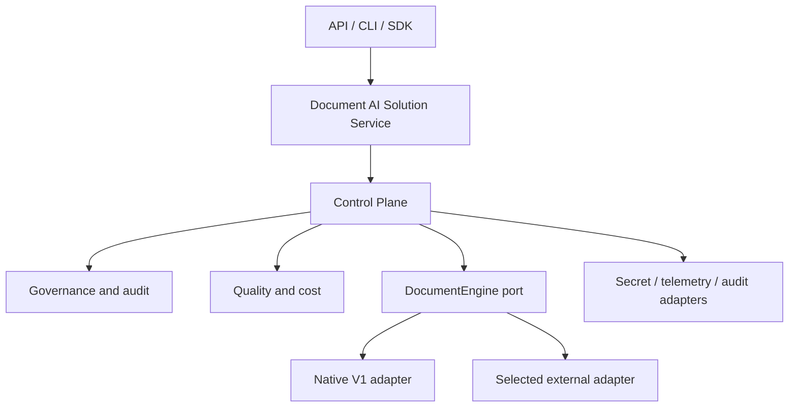

# Refactoring Plan — Engine-Agnostic Control Plane

> **Status:** Phase A (Lots 0-5), Phase B (Lots 6-10, engine port + native adapter + versioned
> manifests/trace/audit), and Phase C (Lots 11a-12c, tenant identity/fail-closed enforcement +
> document lifecycle/reconciliation/erasure) are all **COMPLETE**. Full detail in
> `docs/refactoring/lot-{0..13}-*.md` (one file per lot/sub-lot). Phase D in progress:
> - **Lot 13 COMPLETE** (2026-08-05): corrected `Metrics` vocabulary (answer-scoped fields
>   distinct from retrieval-scoped ones; genuine `exact_match`), fixed `BenchmarkRunner`'s
>   failure-masking, versioned `Metrics`/`GoldenSet` schemas, report-only/blocking `QualityGate`.
> - **Lot 14 COMPLETE** (2026-08-05): timeouts on all four external-SDK adapters (tested against
>   the real installed SDKs); `core/resilience.py` (`retry_with_backoff`, `CircuitBreaker`, not
>   auto-wired — policy is a per-adapter caller decision); `Container.close()` graceful shutdown;
>   `threading.Lock` on the four in-memory reference stores' genuine read-then-write races
>   (proven with real-thread concurrency tests). Sync/async semantics and cancellation status
>   documented honestly as still-open rather than silently retrofit. mypy baseline steady at 34.
> - **Lot 15 COMPLETE** (2026-08-05): `LangGraphEngineAdapter` (`adapters/llms/langgraph_engine.py`)
>   — second `DocumentEngine` implementation, a real LangGraph `StateGraph` orchestrating the same
>   wired `Container` components native uses. Declares `STREAMING`/`GOVERNANCE_INTERCEPT`/
>   `CANCELLATION` (native declares none) — differences expressed through capabilities, not silent
>   divergence. `app/bootstrap.py`'s new `load_engine()` selects an adapter from
>   `manifest.engine.adapter`. Found and fixed a real layering violation (adapter typed against a
>   local structural `Protocol` instead of importing `app.container.Container` directly) and a real
>   governance-parity bug (container-guard denial now raises `SecurityError` identically in both
>   adapters, proven by a same-container parity test). Audit-event emission is a documented,
>   deliberate gap (belongs above the port, at the `load_engine()` call site — none exists yet).
>   Evidence in `docs/refactoring/lot-15-langgraph-adapter.md`. Phase D underway.
> - **Lot 16a COMPLETE** (2026-08-05): `create_app()` gained optional `token_verifier`
>   (`HTTPBearer`-based auth, closes Lot 11b's "no API/CLI auth middleware" residual gap),
>   `max_body_bytes` (413), and `rate_limit_per_minute` (429 + `Retry-After`) — all
>   optional/default-open, matching every other optional-component precedent. New
>   `api/errors.py`'s `to_http_exception()` replaces `detail=str(exc)` with typed safe mapping
>   (401/403 pass-through for auth/security errors whose message is itself the safe explanation;
>   everything else gets a generic message + correlation id, real exception logged server-side).
>   New `/ready` route (honestly scoped — wiring readiness, not live dependency connectivity).
>   CLI `ingest`/`ask` gained typed exit codes instead of raw tracebacks; `ask` gained
>   `--tenant-id`. Found and fixed a real bug while wiring `/retrieve` auth:
>   `RAGEngine.retrieve()` never consulted `Container.tenant_policy` at all (unlike `answer()`) —
>   auth would have been theater without this fix. mypy baseline lowered 34→31 (typed
>   `api/__init__.py`'s pre-existing bare `dict` returns while touching the file). Evidence in
>   `docs/refactoring/lot-16a-api-cli-hardening.md`.
> - **Lot 16b COMPLETE (engineering scope)** (2026-08-05): single authoritative version source
>   (`__version__` reads installed package metadata, no more duplicated literal). New
>   `scripts/check_licenses.py` licence gate (ratchet pattern, mirrors the mypy/layering
>   baselines) + `.claude/license-baseline.txt`; new CI `supply-chain` job (`pip-audit` — 0
>   known vulnerabilities across 209 packages; licence gate; CycloneDX SBOM artifact). New
>   `Dockerfile`/`.dockerignore`/`docker/server.py` for an immutable container build, verified
>   via a new CI `container-build` job (build + real `docker run` + `/health` poll) since this
>   sandboxed environment has no `docker` binary to test locally. **Two findings escalated to
>   Herbert Gourout, not decided by this lot**: `pymupdf`'s AGPL-3.0/Artifex dual licence
>   (accept the copyleft obligation, buy a commercial licence, or replace the dependency), and
>   the 56 research PDFs under `.claude/research-papers/` (128MB, fully tracked in git history)
>   whose per-paper arXiv redistribution rights were never verified. Evidence in
>   `docs/refactoring/lot-16b-supply-chain.md`.
> **Target outcome:** Deploy compliant, measurable document-AI solutions faster, independently
> of the underlying execution engine.
> **Migration principle:** Incremental, evidence-based, reversible, and releasable after every
> accepted lot.
> **Governing decision:** [ADR-0005](adr/0005-document-ai-control-plane-boundary.md) — product
> boundary, owned vs. delegated capabilities, native-adapter exit criteria.

This document is the execution and progress-tracking source of truth for the refactoring
programme. It does not replace the product roadmap, ADRs, release notes, or operational
runbooks. Baseline snapshot, decision authority, per-lot ownership, and the rules for changing
this plan live in [docs/refactoring/lot-0-baseline.md](refactoring/lot-0-baseline.md).

Status values used throughout are `NOT STARTED`, `IN PROGRESS`, `BLOCKED`, `COMPLETE`, and
`CANCELLED`. A lot is `COMPLETE` only when every acceptance-evidence item in §6 is linked.

---

## 1. Product boundary and target architecture

### 1.1 Owned vs. delegated

The package owns engine-independent solution manifests, execution context, policy enforcement,
tenant isolation, redaction boundaries, provenance, audit schemas, quality profiles, regression
gates, cost/latency evidence, engine capability discovery, and normalized results/errors.

It delegates generic orchestration, durable workflows, generic GraphRAG and agent memory,
universal connector catalogues, multimodal model execution, and fine-tuning platform mechanics
to a selected external engine. A delegated capability may be exposed through an adapter; it must
not be reimplemented in core without an approved ADR showing why an adapter cannot meet the
product outcome. Full rationale, capability tables, non-goals, and native-adapter exit criteria:
[ADR-0005](adr/0005-document-ai-control-plane-boundary.md).

### 1.2 Target architecture

Dependency direction is `interfaces -> service/control plane -> contracts/core`; infrastructure
and engines implement contracts and never leak vendor types across the public boundary. Existing
fine-grained component protocols (`Chunker`, `Retriever`, `Generator`, ...) remain native-adapter
internals, not the cross-engine abstraction.

### 1.3 Compatibility classes

Every change must classify its impact on: Python imports and callable signatures; REST paths and
schemas; CLI commands and exit codes; manifest schema; persisted vector/lexical data; trace and
audit schemas; deployment configuration; and documented behavior. Compatibility is not promised
until Lot 4 records the current surface and Lot 7 publishes a versioning/deprecation policy.

### 1.4 Programme invariants

- The repository remains installable and the accepted offline suite passes after every lot.
- No planned capability is described as delivered.
- Governance and evaluation profiles are engine-neutral.
- Production authorization failures are fail closed.
- Raw secrets and unapproved sensitive content are absent from logs, traces, and audit events.
- Destructive data or Git-history operations require separate approval and verified recovery.
- File moves preserve compatibility facades until deprecation criteria are met.
- Scientific sources inform explicit hypotheses; repository measurements decide acceptance.

---

## 2. Current repository state and known gaps

Findings below are tracked against the target in §1. Severity is one of `BLOCKING`, `CRITICAL`,
`IMPORTANT`, `IMPROVEMENT`, or `OPTIONAL`. Every row names the lot that resolves it.

| Area | Current gap | Severity | Resolved by |
|---|---|---|---|
| Product boundary | `CLAUDE.md`/`.claude/` instructions still encode the pre-ADR-0005 V1→V5 native-build roadmap | BLOCKING (scope drift) | Lot 2 |
| Dynamic baseline | No reproducible test environment; declared test tools unavailable in the current one | BLOCKING (unsafe refactor) | Lot 3 |
| Public compatibility | Multiple undocumented surfaces; API/CLI/examples read private container state | CRITICAL | Lot 4 |
| ~~Tenant isolation~~ | **RESOLVED in Lot 11b, extended in Lot 12b, closed in Lot 16a** (2026-08-05): `tenant_id` is a real, enforced field (`Query`/`Chunk`/`Document`), with fail-closed `TenantIsolationPolicy` (deny missing tenant on query/ingest, filter cross-tenant chunks before generation) and a real Keycloak `TokenVerifier`. Lot 12b fixed `QdrantStore` silently dropping `tenant_id` on index/retrieve and added Qdrant-level query-time filtering as defense-in-depth. Lot 16a wired `create_app()`'s optional `token_verifier` to `/answer`/`/retrieve` (`Authorization: Bearer` → verified `TenantContext.tenant_id`, never a caller-supplied field) and, while doing so, found and fixed a real bug: `RAGEngine.retrieve()` never consulted `Container.tenant_policy` at all (unlike `answer()`) — auth alone would have been theater on that path without the fix. | — | Lot 11b, 12b, 16a |
| ~~Data deletion/update~~ | **RESOLVED in Lot 12a** (2026-08-05): `RAGEngine.delete_document()` coordinates deletion across `Container.indexer` and the retriever's lexical state; `BM25Retriever` now implements `delete()`/`clear()` and `index()` appends (previously silently replaced) the corpus; `HybridRetriever` delegates `delete()`/`clear()` to its BM25 side. `contracts/lifecycle.py` (`LifecycleLedger`, `DocumentRecord`) gives document identity, idempotent `ingest()` (skip-unchanged / update-with-old-chunk-deletion), and tombstone semantics, backed by `InMemoryLifecycleLedger` + `PostgresLifecycleLedger`. | — | Lot 12a |
| ~~Audit semantics~~ | **RESOLVED in Lot 10** (2026-08-05): `contracts/audit.py` (`AuditEvent`, `AuditSink`, PII/secret payload allowlist enforced by a Pydantic validator); `InMemoryAuditSink` (reference) + `PostgresAuditSink` (durable, lazy-imported, append-only). `RAGEngine` records a `RUN_SUCCEEDED`/`RUN_FAILED` event on every run when an `audit_sink` is configured. Retention/residency/legal requirements remain open — see §10. | — | Lot 10 |
| ~~Metric correctness~~ | **RESOLVED in Lot 13** (2026-08-05): `ExactMatchEvaluator` now writes answer-level scores into `answer_precision`/`answer_recall`/`answer_relevance`, never into the retrieval-scoped `precision_at_k`/`recall_at_k`; it also now computes a genuine `exact_match` field (normalized string equality) — previously named "exact match" but never checked for it. | — | Lot 13 |
| ~~API security~~ | **RESOLVED in Lot 16a** (2026-08-05): optional `token_verifier` (`HTTPBearer` auth on `/answer`/`/retrieve`), `MaxBodySizeMiddleware` (413), `RateLimitMiddleware` (429 + `Retry-After`, in-memory/single-process, Redis upgrade path documented not built); `api/errors.py`'s `to_http_exception()` replaces `detail=str(exc)` with typed safe mapping (401/403 pass-through for auth/security errors, generic message + correlation id for everything else, real exception logged server-side). New `/ready` route, honestly scoped (wiring readiness, not live dependency connectivity). | — | Lot 16a |
| ~~API routing bug (found in Lot 4)~~ | **RESOLVED in Lot 8** (2026-08-04): moved `QuestionRequest`/`AnswerResponse` to module level in `api/__init__.py`. `POST /answer` now returns 200 as documented — regression test: `tests/unit/api/test_api.py::test_answer_accepts_the_documented_json_body_and_returns_200`. | — | Lot 8 |
| ~~Private-container access in api/cli~~ | **RESOLVED in Lot 8**: `RAGEngine` now exposes public `manifest_id`/`chunker`/`retriever` properties; `api/__init__.py`, `cli/__init__.py`, and `examples/hybrid_search/main.py` no longer reach into `pipeline._c`. | — | Lot 8 |
| ~~BM25 small-corpus scoring gap (found in Lot 4)~~ | **RESOLVED in Lot 12b** (2026-08-05): `BM25Retriever.retrieve()` now gates inclusion on genuine lexical token overlap instead of `score > 0`, so a document that's the best/only match still returns even when `rank_bm25`'s IDF term is zero/negative — regression test: `tests/unit/retrieval/test_bm25.py::test_retrieve_returns_the_relevant_document_even_in_a_too_small_corpus`. | — | Lot 12b |
| ~~Benchmark failure-masking confirmed (Lot 4)~~ | **RESOLVED in Lot 13** (2026-08-05): `BenchmarkRunner.run()` now records `Metrics.for_failure(str(exc))` on an `engine.answer()` exception instead of a bare all-None `Metrics()`; `BenchmarkReport.failed_count`/`failure_rate` make crashed cases visible in aggregate, and `avg_*` properties explicitly exclude them. Upholds the §10.4 invariant. Regression test: `tests/unit/eval/test_benchmark.py::test_runner_records_engine_failures_as_failed_not_as_null_scores`. | — | Lot 13 |
| ~~Manifest configuration~~ | **RESOLVED in Lot 9** (2026-08-04): `extra="forbid"` on `PipelineManifest`/`ComponentConfig`; `app/config_resolution.py` adds `${VAR}` interpolation, `secret://` resolution, precedence layering, capability dry-run validation, JSON schema export, and `mrag validate`. Component `config: dict` payload stays intentionally free-form (dynamic per adapter type). | — | Lot 9 |
| ~~Engine abstraction~~ | **RESOLVED in Lot 15** (2026-08-05): `LangGraphEngineAdapter` validates `contracts/engine.py`'s `DocumentEngine` port against a real, structurally different engine (a LangGraph `StateGraph`, not a wrapper of the native engine) — proving genuine engine-neutrality rather than an unvalidated lowest-common-denominator design. Both adapters pass parity tests for the shared governance path; declared-capability differences (streaming, governance-hook, cancellation — LangGraph has all three, native has none) are explicit, not silent. | — | Lot 6, 7, 15 |
| ~~Resilience~~ | **RESOLVED in Lot 15** (2026-08-05), extending Lot 14: `LangGraphEngineAdapter` declares and implements `CANCELLATION` (`CancellationToken` checked at every node boundary); `NativeEngineAdapter`'s continued non-support is unchanged and still correctly documented, not silently dropped. **Still open**: overload/backpressure semantics (need live load-testing infra) — deferred to Lot 16c. | IMPORTANT (residual) | Lot 16c (overload evidence) |
| ~~Concurrency~~ | **RESOLVED in Lot 14** (2026-08-05): `InMemoryAuditSink`, `InMemoryLifecycleLedger`, `HumanReviewGate`, and `BM25Retriever` — the four in-memory reference stores with a genuine read-then-write race — now hold a `threading.Lock`, proven with real-thread concurrency tests. Sync/async execution semantics documented (only `HuggingFaceEmbedder.aembed()` truly non-blocking today; every other `a*` method is a sync-wrapped coroutine) rather than silently retrofit. | — | Lot 14 |
| ~~Trace semantics~~ | **RESOLVED in Lot 10** (2026-08-05): removed the duplicate/overlapping "generate" `TraceStep` (generator self-instrumentation is now the only source); `Trace.failed`/`failure_reason` capture failed runs, which now still reach `telemetry.record_trace()` before the exception propagates. `TRACE_SCHEMA_VERSION = "1.1"`. | — | Lot 10 |
| ~~Index migration~~ | **RESOLVED in Lot 12b/12c** (2026-08-05): `contracts/lifecycle.py`'s `INDEX_SCHEMA_VERSION` + `DocumentRecord.schema_version` gives index-schema versioning; `IndexReconciler` detects and repairs orphaned-id divergence; `RAGEngine.rebuild_document()` handles the missing-content direction reconciliation can't auto-repair; ledger backup/restore proven via a genuine round-trip exercise (fresh-instance restore, not a same-instance no-op). Production PostgreSQL/Qdrant-native backup tooling documented (not reimplemented) — owned by Lot 16c's runbooks as operational content. | — | Lot 12b, 12c |
| Dependency reproducibility | No dependency lock/constraints; CI/declared-tooling mismatch | IMPORTANT | Lot 3 |
| ~~Versioning~~ | **RESOLVED in Lot 16b** (2026-08-05): `src/modular_rag/__init__.py`'s `__version__` now reads `importlib.metadata.version("modular-rag")` instead of a hardcoded duplicate literal; `api/__init__.py`'s `FastAPI(version=...)` reads the same. `pyproject.toml`'s `[project].version` is the one remaining source. | — | Lot 16b |
| Prototype retirement | Unknown external consumers of generic agents, graph memory, and other future-version stubs | IMPORTANT | Lot 17 |
| Research assets | 56 research PDFs carry repository-size and redistribution/licensing risk | IMPORTANT | Lot 16b, 17 |
| Ownership | Acceptance owners were undefined | IMPORTANT | Lot 0 (recorded, see `lot-0-baseline.md`) |
| Documentation/sales claims | Delivered vs. planned behavior is mixed in docs and business-case material — e.g. multi-tenant isolation and audit-trail claims currently outrun what §1's gaps above actually enforce | CRITICAL | Lot 5 |

---

## 3. Risks

| Risk | Severity | Mitigation and stop condition |
|---|---|---|
| Automation implements scope the ADR delegates away | Critical | Lot 2 must complete before further implementation |
| Persisted vector and lexical indexes diverge | Critical | Block governed rollout until lifecycle reconciliation tests pass |
| Empty/incorrect metrics allow regressions | Critical | Fail benchmark runs on infrastructure errors; version metric definitions |
| Refactor breaks an unknown consumer | High | Surface inventory, telemetry/usage evidence where available, deprecation window |
| Native V1 becomes a permanent second framework | High | Named owner, bounded feature policy, exit-criteria decision at Lot 17/18 |
| External abstraction becomes lowest common denominator | High | Capabilities plus engine-specific extension envelope, proven by two adapters |
| Async facade hides blocking work | High | Declare execution model and pass bounded concurrency tests |
| Raw content, PII, or secrets enter logs/audit | Critical | Data classification, redaction boundaries, schema allowlists, negative tests |
| Index migration causes data loss | Critical | Backup/restore proof, compatibility matrix, canary and rollback checkpoint |
| Research assets cannot legally be redistributed | High | Licence/provenance review; quarantine unverified assets from release artifacts |
| Dependency or model licence blocks commercial use | High | SBOM and licence gate before pilot |
| CI is green while external capabilities are untested | High | Publish explicit offline/integration evidence classes and release requirements |
| Repository history rewrite destroys recoverability | Critical | Out of scope unless separately approved, backed up, and executed as its own project |
| The programme itself is not worth its cost | High | Confirm the delivery-project pipeline assumption behind the business case before committing full-team time past Lot 5 |

---

## 4. Execution order and sizing

**Sizing convention:** T-shirt size plus a day/week range, originally scoped assuming **one or
two people focused on a lot at a time** out of a target team of up to 4. As of 2026-08-03 only
one person (Herbert Gourout) is active, so sizes below are still valid per-lot effort estimates,
but the parallel-lot opportunities noted further down (2+3, 16a+16b) are **not available** until
a second person joins — they collapse to sequential work in the meantime. S = 1-3 days,
M = 3-8 days (about a week), L = 1.5-3 weeks. Sizes are estimates for re-planning, not
commitments; a lot that overruns its size by a wide margin is a signal to re-scope, not to
silently keep going.

Lots 11, 12, and 16 are split into lettered sub-lots (`11a-c`, `12a-c`, `16a-c`) because each
bundled 3-5 separable deliverables under one acceptance gate, which made them too coarse to
track or size honestly. Sub-lots inherit their parent's priority and dependency direction unless
stated otherwise.

| Lot | Deliverable | Priority | Size | Status | Depends on |
|---:|---|---|---|---|---|
| 0 | Programme control, snapshot, ownership, and change policy | P0 | S (0.5-1d) | COMPLETE | - |
| 1 | Product-boundary ADR, non-goals, and success measures | P0 | S (1-2d) | COMPLETE | 0 |
| 2 | Interim Claude configuration realignment | P0 | S (1-2d) | COMPLETE | 1 |
| 3 | Reproducible baseline and minimum CI gates | P0 | M (3-5d) | COMPLETE | 0 |
| 4 | Public-surface inventory and characterization safety net | P0 | L (1.5-2wk) | COMPLETE | 3 |
| 5 | Capability truth and runnable-manifest classification | P0 | S (2-3d) | COMPLETE | 1, 3 |
| 6 | External-engine fit spike and selection ADR | P0 | M (1-1.5wk, time-boxed) | COMPLETE | 1, 4 |
| 7 | Engine-neutral contracts and compatibility policy | P0 | M (1wk) | COMPLETE | 4, 6 |
| 8 | Native V1 adapter and compatibility facade | P0 | M (1wk) | COMPLETE | 7 |
| 9 | Versioned solution configuration and secret resolution | P0 | M (1wk) | COMPLETE | 7 |
| 10 | Versioned trace/audit foundation | P0 | M (1wk) | NOT STARTED | 7, 9 |
| 11a | Threat model and data-classification policy | P0 | S (2-3d) | NOT STARTED | 8-10 |
| 11b | Authenticated identity/tenant propagation, fail-closed enforcement | P0 | M (1wk) | NOT STARTED | 11a |
| 11c | Redaction integration, audit evidence, human-review escalation | P0 | M (1wk) | NOT STARTED | 11b |
| 12a | Document identity and idempotent ingest/update/delete/tombstone | P0 | M (1wk) | NOT STARTED | 11c |
| 12b | Index schema/version, vector-lexical atomicity, reconciliation | P0 | L (1.5-2wk) | NOT STARTED | 12a |
| 12c | Backup, restore, rebuild, migration, right-to-erasure proof | P0 | M (1wk) | NOT STARTED | 12b |
| 13 | Correct quality and measurement plane | P0 | M (1wk) | NOT STARTED | 7-10 |
| 14 | Reliability, concurrency, and resource lifecycle | P1 | L (1.5-2wk) | NOT STARTED | 12c, 13 |
| 15 | First production external-engine adapter | P1 | L (2-3wk) | NOT STARTED | 7, 9, 10, 12c, 13, 14 |
| 16a | API/CLI hardening (auth, authz, limits, safe errors, readiness) | P1 | M (1wk) | NOT STARTED | 15 |
| 16b | Packaging and supply chain (builds, SBOM, licence gates, single version source) | P1 | S-M (3-5d) | NOT STARTED | 15 |
| 16c | Deployment and ops runbooks (deploy, backup, restore, rollback) | P1 | S-M (3-5d) | NOT STARTED | 16a, 16b |
| 17 | Prototype retirement and final docs/Claude/research consolidation | P1 | M (1wk) | NOT STARTED | 16a-16c |
| 18 | Multi-engine pilot, release gates, and programme closure | P1 | M-L (1-2wk) | NOT STARTED | 17 |

Ranges (e.g. `8-10`) list the earliest and latest lot whose evidence is required via the
dependency chain, not necessarily every intermediate lot as a direct predecessor. `16a` and
`16b` may run in parallel (neither touches the other's files); `16c` needs both finished. Lots 2
and 3 may run in parallel after Lot 1 if they do not edit the same files. Lot 5 may start during
Lot 4 but cannot publish claims before baseline evidence exists. Every lot must land as one or
more atomic, independently reversible changes.

**Rough total:** summing the midpoint of every lot/sub-lot above comes to roughly **125-130
person-days** of focused work done sequentially by one person — which, while solo, is also the
realistic current-state estimate, not just a lower bound: there is no second person yet to absorb
any of the parallel lots. Calendar duration depends entirely on how much of Herbert Gourout's
time is actually allocated to this programme alongside other responsibilities; the original
"4-7 months for a team of 4" framing no longer applies until additional people are confirmed.
Before committing past Lot 5, confirm the delivery-pipeline assumption the business case rests
on (see §3, last risk row) — if fewer client engagements are actually in scope than assumed, cut
Phase D scope rather than compress the estimate without compressing the work.

---

## 5. Detailed plan by phase

### Phase A — Control and evidence (Lots 0-5)

**Lot 0:** Record baseline branch/commit SHA, dirty-worktree exclusions, decision authority,
ownership, evidence locations, and plan-change rules. Do not tag, push, or alter remote state
without authorization.

**Lot 1:** Approve an ADR for the product boundary, non-goals, target architecture, capability
ownership, measurable outcomes, and native-adapter support/exit criteria. Package renaming is a
non-blocking separate decision; preserve a stable import facade.

**Lot 2:** Narrowly update `CLAUDE.md` and shared `.claude/` instructions, rules, permissions,
agents, and skills that contradict the approved ADR. Preserve useful QA workflows. Do not touch
personal local settings. Record each retained, modified, or retired automation rule.

**Lot 3:** Create the supported Python environment and reproducible dependency set; reconcile
`pytest-cov`; run lint, offline unit/contract tests, compilation, strict layering, wheel build,
and clean-install smoke tests. Establish minimum GitHub CI. Capture a mypy baseline and reject
new errors; reduce the budget deliberately thereafter.

**Lot 4:** Inventory public and persisted compatibility surfaces. Add fake-based characterization
tests for manifest loading, registry wiring, ingest/retrieve/answer, API, CLI, errors, security,
trace behavior, metrics, deletion/update, and hybrid fallback. Record existing questionable
behavior without silently blessing it as the target.

**Lot 5:** Correct README, roadmap, changelog, manifests, UUID/ULID statements, environment
examples, test counts, API launch instructions, and compliance/business-case claims. Classify
each manifest as runnable, experimental, or blueprint and validate runnable commands in CI.

### Phase B — Architecture foundations (Lots 6-10)

**Lot 6:** Use one representative use case to compare at least two candidate engines (e.g.
LangGraph, LlamaIndex, Haystack) against required ingest, answer, evidence, streaming,
cancellation, governance interception, telemetry, and deployment capabilities. Build only
disposable adapter spikes outside the production path. Select one engine through an ADR.

**Lot 7:** Define versioned `DocumentEngine`, capabilities, normalized requests/results,
`ExecutionContext`, evidence/citation, typed error, cancellation, and extension-envelope
semantics. Define public compatibility and deprecation policy. Supply a fake engine and semantic
conformance suite, not merely runtime `Protocol` checks.

**Lot 8:** Implement the native adapter around `RAGEngine`; remove private-container access from
interfaces; retain `load_pipeline()` or equivalent compatibility facade; verify old/new parity,
failure semantics, and native-adapter maintenance budget.

**Lot 9:** Introduce strict versioned solution manifests with engine, governance, quality, and
observability sections; define extra-field policy, configuration precedence, environment
interpolation, secret references, capability validation, JSON schema export, validation CLI,
and tested v1-to-v2 migration.

**Lot 10:** Define separate versioned trace and compliance-audit events, correlation/causation,
failure events, timing semantics, PII allowlists, retention metadata, and sink contracts. Provide
in-memory test sinks before vendor integrations. Remove duplicate or ambiguous timing steps.
Persist the audit event store in **PostgreSQL** (append-only table, not mutated in place) —
resolves the previously undefined storage backend for the V1.2 compliance audit trail.

### Phase C — Enterprise correctness (Lots 11a-14)

**Lot 11a:** Produce a threat model and a data-classification policy (public/internal/
confidential/restricted, tenant/PII schema). Paper-and-fixture deliverable; no enforcement code
yet. Blocks 11b, since identity/tenant propagation needs the classification to enforce against.

**Lot 11b:** Propagate authenticated identity and tenant through `ExecutionContext`; enforce
fail-closed policy before indexing, retrieval, and generation. Test cross-tenant and
policy-engine failure paths (deny-by-default on policy-engine error, not allow-by-default).
Target identity provider: **Keycloak** (OIDC) — resolves the previously open question on which
auth adapter and claims mapping to build against.

**Lot 11c:** Apply configured redaction before storage, logging, and external calls; emit audit
evidence for every governed execution; support human review for high-risk outcomes. Depends on
11b's identity/tenant context to know what to redact and for whom.

**Lot 12a:** Define document identity, idempotent ingestion, update, deletion, and tombstone
semantics. This is the domain-level lifecycle contract, independent of any specific index
implementation. The lifecycle/idempotency ledger itself is backed by **PostgreSQL**, consistent
with Lot 10's audit-store choice.

**Lot 12b:** Define index schema/version; make vector/lexical writes atomic or reconcilable;
implement the reconciliation job that detects and repairs BM25/vector divergence. Separate
domain chunks from mutable embedding storage where required by the approved design. The largest
sub-lot in Phase C — consider a mid-lot checkpoint rather than one large acceptance gate.

**Lot 12c:** Implement backup, restore, rebuild-from-source, and right-to-erasure proof
(including a verified restore exercise, not just a backup that has never been tested). Depends
on 12b's index schema existing to version against.

**Lot 13:** Correct metric vocabulary and formulas with reference fixtures; version quality and
golden-dataset schemas; distinguish infrastructure failure from zero quality; measure retrieval,
answer, evidence, policy, latency, and cost; begin gates in report-only mode and promote agreed
thresholds to blocking with recorded baselines.

**Lot 14:** Define sync/async execution, timeouts, retry eligibility, cancellation, circuit
breaking, backpressure, overload, and graceful shutdown. Own and close clients/resources. Make
lazy initialization and mutable indexes concurrency-safe or explicitly single-worker. Add fault,
concurrency, soak, and bounded-load evidence.

### Phase D — Portability and delivery (Lots 15-18)

**Lot 15:** Implement the selected external adapter. It must pass the same semantic engine,
governance, audit, migration, quality, cancellation, and failure tests as native V1. Express
differences through capabilities and documented extension configuration.

**Lot 16a:** Harden FastAPI factory/startup, typed safe errors, authentication, authorization,
rate and request-size limits, readiness/liveness, content exposure, and CLI exit codes.

**Lot 16b:** Immutable wheel/container builds, SBOM, vulnerability and licence gates (including
the 56 research PDFs' redistribution rights), and one authoritative version source. Independent
of 16a — different files, can run in parallel with a second owner.

**Lot 16c:** Deployment, backup, restore, and rollback runbooks. Needs both 16a (what to deploy)
and 16b (how it's built/scanned) finished first.

**Lot 17:** Audit imports and consumers, then deprecate, retain, or remove generic agents,
FlowCompiler/router paths, graph memory/versioning, unused future manifests, stale GitLab assets,
and unused dependencies. Complete Claude/documentation consolidation and a research evidence
catalogue. Keep digests; stop adding large binaries. Do not rewrite Git history in this lot.

**Lot 18:** Run a sanitized representative scenario with native and external engines under the
same governance and quality profiles. Compare delivery effort, quality, latency, cost, audit
evidence, concurrency, deployment, data migration, and rollback. Harden all approved CI gates,
remove expired shims, publish release evidence, and obtain architecture, security, operations,
legal, and business-quality sign-off.

---

## 6. Acceptance criteria by stage

| Stage | Mandatory evidence |
|---|---|
| Lot 0 | Baseline SHA, worktree exclusions, owners, evidence location, change policy |
| Lot 1 | Approved ADR; explicit owned/delegated capabilities; native exit criteria |
| Lot 2 | Shared Claude configuration matches ADR; quality workflows retained; local settings untouched |
| Lot 3 | Fresh install and offline gates pass in local/CI parity; dependency and type baselines recorded |
| Lot 4 | Every identified public surface and critical failure path has characterization evidence |
| Lot 5 | No unsupported delivered/security/compliance claim; runnable docs commands pass |
| Lot 6 | Selection matrix, spike evidence, ADR, and documented rejected alternatives |
| Lot 7 | Vendor-neutral types; semantic fake/conformance tests; versioning policy |
| Lot 8 | V1 parity; no interface private-state access; compatibility route and rollback flag |
| Lot 9 | Strict validation before startup; schema export; all runnable v1 manifests migrate and roll back |
| Lot 10 | Stable trace/audit schemas; complete success/failure evidence; no raw secret/PII leakage |
| Lot 11a | Written threat model and data-classification policy, reviewed by the team |
| Lot 11b | Cross-tenant tests fail closed; policy-engine errors deny by default, never allow by default |
| Lot 11c | Every governed execution has redaction, policy, and audit evidence attached |
| Lot 12a | Re-ingest/update/delete are deterministic and idempotent; tombstones proven |
| Lot 12b | Index schema versioned; vector/lexical divergence is detected and reconciled, not silent |
| Lot 12c | Backup/restore and right-to-erasure proven via an actual executed restore, not a written procedure |
| Lot 13 | Reference metric fixtures pass; failures cannot appear as zero scores; baselines are reproducible |
| Lot 14 | Deadlines/cancellation/shutdown work; fault and concurrency targets are met and recorded |
| Lot 15 | Both engines pass the same mandatory suite; profile switch requires no governance rewrite |
| Lot 16a | API/CLI reject unauthenticated/oversized/malformed requests; no internal exception text leaks |
| Lot 16b | Wheel/container builds reproducible; SBOM and licence gates pass, including the 56 PDFs |
| Lot 16c | Deploy, backup, restore, and rollback commands are each executed at least once, not just documented |
| Lot 17 | Each removal has impact evidence, deprecation or non-use proof, and restoration path |
| Lot 18 | Pilot and rollback exercise pass; mandatory gates green; named owners sign final evidence |

---

## 7. Test and non-regression strategy

| Test class | Core evidence | Runs when |
|---|---|---|
| Static | Compilation, Ruff, import/layering rules, type-error ratchet | Every change |
| Characterization | Existing public behavior and known quirks | Before structural change |
| Unit | Policies, schemas, mapping, redaction, metrics, lifecycle state | Every implementation lot |
| Semantic contract | Results, capabilities, errors, cancellation, evidence invariants | Every engine/adapter |
| Configuration/migration | Strict schema, precedence, secrets, v1/v2 and rollback | Every schema change |
| Data lifecycle | Idempotency, update, delete, reconciliation, backup/restore | Every storage change |
| Security/privacy | Tenant isolation, injection, exfiltration, log safety, abuse limits | Every governed release |
| Fault/concurrency | Timeouts, retries, partial failure, cancellation, load, shutdown | Adapter/runtime changes |
| Integration | Qdrant, selected engine, identity, audit, telemetry, secrets | Confirmed services/keys |
| End to end | Ingest through governed answer, audit, delete, restore | Release candidate |
| Quality/business | Versioned golden sets, cost/latency, deterministic baseline | Engine/model/prompt change |
| Packaging/operations | Wheel/container install, health, deploy, migration, rollback | Release candidate |
| Documentation | Links, commands, manifests, capability catalogue | Every docs/release change |

Offline tests must use deterministic fakes, fixed seeds, and controllable clocks where time or
retry behavior matters. Integration and e2e suites must never be reported as passed when skipped.
Benchmark infrastructure failures fail the run; they do not produce empty metrics. Thresholds
record dataset version, engine/model version, configuration, environment, and confidence limits.

---

## 8. Migration and rollback strategy

1. **Checkpoint:** Record commit SHA, artifacts, schemas, dependency set, and test evidence before
   each lot. Tags and pushes require normal release authorization.
2. **Add before move:** Introduce new contracts/facades, then migrate callers; preserve old imports
   and commands for the declared compatibility window.
3. **Shadow/compare:** Run native old/new paths and, later, native/external engines on identical
   sanitized inputs before switching defaults.
4. **Configuration:** Dual-read manifest v1/v2; write only the new version; provide explicit
   validation, migration, and downgrade limitations.
5. **Data:** Version indexes. Prefer rebuild from authoritative documents or a tested dual-index
   canary. Verify backup and restore before migration. Never infer that code rollback can read a
   newer persisted schema.
6. **Audit:** Treat event schemas as append-only/versioned. Consumers accept the supported old/new
   window; never mutate historical compliance evidence in place.
7. **Release:** Use feature/profile flags and canaries where safe. Retain the previous wheel,
   container, manifest, index snapshot, and runbook until acceptance closes.
8. **Removal:** Require non-use evidence, dependency/import search, deprecation where public,
   release notes, and a tested restoration commit/artifact.
9. **Research assets/history:** Do not purge Git history during this programme. Externalization or
   historical cleanup is a separately approved, backed-up migration.
10. **Rollback trigger:** Stop rollout on compatibility breach, cross-tenant exposure, missing
    audit evidence, data divergence, quality threshold breach, unrecoverable error-rate increase,
    or failed restore exercise.

---

## 9. Final completeness checklist

- [ ] Product ADR, non-goals, owners, success measures, and plan-change rules are approved.
- [ ] Claude and repository instructions express the same product boundary.
- [ ] Baseline and all mandatory offline checks are reproducible locally and in CI.
- [ ] Public and persisted compatibility surfaces have policies and tests.
- [ ] Native V1 and one external engine satisfy the same semantic contract.
- [ ] Engine switches do not rewrite governance or quality profiles.
- [ ] Manifests are strict, versioned, migratable, capability-aware, and secret-safe.
- [ ] Tenant isolation, policy failures, redaction, and audit are enforced end to end.
- [ ] Document update/deletion and vector/lexical reconciliation are proven.
- [ ] Index and audit migrations have verified backup, restore, and rollback paths.
- [ ] Metrics have correct names/formulas and cannot hide infrastructure failures.
- [ ] Trace timings, errors, costs, and evidence have unambiguous versioned semantics.
- [ ] Timeouts, cancellation, resource closure, concurrency, and overload behavior are tested.
- [ ] API, CLI, wheel, container, health, deployment, and rollback commands are executable.
- [ ] SBOM, vulnerability, secret, dependency, model, and licence evidence pass policy.
- [ ] Documentation has no unsupported delivered, production, security, or compliance claim.
- [ ] Each prototype is supported, delegated/deprecated, or removed with impact evidence.
- [ ] Research digests and evidence catalogue are retained; binary provenance is resolved.
- [ ] Representative pilot evidence is approved by named technical and business owners.
- [ ] All expired compatibility shims are removed only after their support window.

---

## 10. Open questions and unresolved dependencies

| Unknown | Effect | Resolution owner/milestone |
|---|---|---|
| Current external consumers of Python/API/CLI/manifests | Compatibility window cannot be finalized | Lot 0/4 owner inventory |
| First external engine and pilot use case | Contract details and adapter scope remain provisional | Lot 6 ADR |
| Target deployment platform and topology | Container, readiness, scaling, and rollback details remain open | Before Lot 16c |
| Audit retention *enforcement*, immutability *enforcement*, residency, and legal requirements | Schema/sink now exist (Lot 10: `AuditEvent.retention_days` metadata, `PostgresAuditSink`, append-only by convention); no scheduled deletion job, no DB-permission-level immutability, no residency decision yet | Retention job/DB permissions: Lot 16c. Residency/legal: before Lot 11c (redaction/audit evidence) needs it |
| SLOs, throughput, corpus scale, and cost budgets | Performance gates cannot be set | Before Lot 13/14 blocking gates |
| Authoritative document source and deletion obligations | Rebuild/right-to-erasure design remains provisional | Before Lot 12a |
| Research PDF and dependency/model redistribution rights | Release contents may need quarantine or replacement | Before Lot 16b/17 |
| Dynamic current test results | Runtime baseline is unverified | Lot 3; dependencies unavailable in the current environment |
| Integration/e2e behavior | Requires confirmed Qdrant, engine services, credentials, and datasets | Lots 15-18 |
| Full semantic content of all 56 PDFs | Inventoried/digested, not page-validated | Evidence-catalogue review in Lot 17 |
| Delivery-pipeline assumption behind the business case | The 4-7 month programme cost (§4) is only justified if the assumed client-project volume is real | Confirm with delivery ownership before Lot 6 |

Technology choices for specific lots that are candidates but **not yet committed** (pending
ADR-0005 sign-off and/or the deployment-topology decision above) are tracked separately in
[docs/refactoring/technology-candidates.md](refactoring/technology-candidates.md), not in this
table — that file is a parking lot, not part of the approved plan.

### Analysis coverage notes

All 382 tracked repository paths are inventoried and classified: executable Python architecture,
tests, manifests, dependency declarations, CI, scripts, primary documentation, Claude
configuration, and research digests. Static Python compilation and strict layering currently
pass. The 56 source PDFs are inventoried and their repository digests reviewed, but not all pages
have been manually validated. Empty placeholder files are classified but contain no analyzable
behavior. Personal `.claude/settings.local.json` is deliberately excluded from all of the above.
Dynamic unit, contract, integration, e2e, performance, and security suites are **not** currently
verified as passing — establishing that reproducibly is Lot 3's deliverable, not an assumption
this plan makes going in.

---

## 11. Ownership and change control

Decision authority, per-lot ownership, evidence locations, and the rule for when this plan may
change are recorded in [docs/refactoring/lot-0-baseline.md](refactoring/lot-0-baseline.md) and
are not duplicated here. In short: this plan changes only after a blocking discovery, a material
scope change, or an approved architecture decision — never as a silent in-place edit.

---

## 12. Decision log and change history

### Decision log

| Date | Decision | Status |
|---|---|---|
| 2026-08-03 | Build an engine-independent, compliant, measurable document-AI delivery platform | ACCEPTED |
| 2026-08-03 | Do not compete directly with general-purpose orchestration/indexing frameworks | ACCEPTED |
| 2026-08-03 | Retain V1 as a bounded native/reference adapter | ACCEPTED |
| 2026-08-03 | Retain scientific work as evidence, hypotheses, and evaluation support | ACCEPTED |
| 2026-08-03 | Recorded Lot 0 baseline, decision authority, and evidence locations | COMPLETE |
| 2026-08-03 | Drafted ADR-0005 (product boundary, capability ownership, native-adapter exit criteria) | PROPOSED — approval rests with Herbert Gourout alone; team not yet assembled |
| 2026-08-03 | Removed the multi-person approval gate from Lot 0/ADR-0005/plan; decision authority is sole (Herbert Gourout) until additional team members are actually onboarded | COMPLETE |
| 2026-08-04 | Accepted ADR-0005 (Lot 1 complete); started Lot 2 (Claude realignment) and Lot 3 (reproducible baseline + CI) | IN PROGRESS |
| 2026-08-04 | Completed Lot 2: `CLAUDE.md`/`.claude/` realigned to ADR-0005 owned-vs-delegated split; decision record in `docs/refactoring/lot-2-claude-realignment.md` | COMPLETE |
| 2026-08-04 | Completed Lot 3: `.venv` + `.[v1,dev]` install verified, `pytest-cov` gap closed, `uv` dependency lock added, mypy `python_version` bug fixed and baseline captured (35 errors), `scripts/check.sh` PIPESTATUS bug fixed and layering/compilation wired in, `.github/workflows/ci.yml` rewritten (compilation, layering, ratcheted mypy, wheel build, clean-install smoke test); evidence in `docs/refactoring/lot-3-baseline-and-ci.md` | COMPLETE |
| 2026-08-04 | Lot 4 Part 1 (public surface: API, CLI, manifest loading, registry): 28 new characterization tests, 0% coverage before. Found and recorded a real bug: `POST /answer` never accepts its documented JSON body (forward-reference resolution failure, endpoint likely never worked via HTTP). Evidence in `docs/refactoring/lot-4-public-surface-part1.md`. | IN PROGRESS |
| 2026-08-04 | Lot 4 Part 2 (metrics, deletion/update, hybrid fallback): 23 new/extended characterization tests. Found two more real gaps: BM25 silently drops relevant hits in small corpora (negative/zero IDF), and benchmark failures are recorded as indistinguishable from genuine null scores. Confirmed `RAGEngine` has no `delete()` at all. Evidence in `docs/refactoring/lot-4-part2-metrics-deletion-fallback.md`. Lot 4 as a whole is now COMPLETE. | COMPLETE |
| 2026-08-04 | Lot 5: corrected delivered/security/compliance claims in README.md, docs/api/rest.md, docs/business-case.md against verified current behavior; classified all 5 manifest presets runnable/blueprint with `manifests/README.md`; added CI + check.sh validation that the one runnable manifest actually wires. Phase A (Lots 0-5) is now fully COMPLETE. Evidence in `docs/refactoring/lot-5-capability-truth.md`. | COMPLETE |
| 2026-08-04 | Lot 6: executed spike comparing LangGraph and LlamaIndex Workflows against a governed-QA use case (real code, both installed and run, not a docs-only comparison). ADR-0006 accepted — LangGraph selected. Evidence in `docs/refactoring/lot-6-spike/`. Lot 6 COMPLETE. | COMPLETE |
| 2026-08-04 | Lot 7: built `contracts/engine.py` (`DocumentEngine` port, `EngineCapability`, `ExecutionContext`, `EngineRequest`/`Result`/`Step`, `GovernanceHook`, `CancellationToken`), `FakeDocumentEngine`, an 11-test semantic conformance suite, and the compatibility/deprecation policy doc. Zero vendor types in the contract; zero new mypy errors. Evidence in `docs/refactoring/lot-7-document-engine-contract.md`. Lot 7 COMPLETE. | COMPLETE |
| 2026-08-04 | Lot 8: `NativeEngineAdapter` wraps `RAGEngine` behind `DocumentEngine` (empty capability set, honest not aspirational); `load_native_engine()` added alongside unchanged `load_pipeline()` compatibility route. Removed private `_c` container access from `api/__init__.py`, `cli/__init__.py`, and `examples/hybrid_search/main.py` via new `RAGEngine.manifest_id`/`.chunker`/`.retriever` public properties. Fixed the Lot 4 `/answer` 422 routing bug (module-level request/response models). Parity test proves adapter output matches direct `RAGEngine.answer()`. Evidence in `docs/refactoring/lot-8-native-adapter.md`. Lot 8 COMPLETE. | COMPLETE |
| 2026-08-04 | Lot 9: `extra="forbid"` on manifest models; new optional v2 sections (`engine`/`governance`/`quality`/`observability`, schema only — no behavior yet, explicitly documented per-section); `app/config_resolution.py` adds `${VAR}` interpolation, `secret://` resolution (`EnvSecretResolver`, `contracts/secrets.py`), precedence layering, capability dry-run validation, `mrag validate`/`mrag manifest-schema` CLI commands, and committed JSON schema export. v1→v2→v1 migration proven to round-trip exactly against the real runnable manifest. `load_pipeline()` itself is unchanged (opt-in, not default-behavior change). Evidence in `docs/refactoring/lot-9-versioned-config.md`. Lot 9 COMPLETE. | COMPLETE |
| 2026-08-05 | Lot 10: removed the duplicate/overlapping "generate" `TraceStep` (double-counted generation latency); `TRACE_SCHEMA_VERSION = "1.1"`; `Trace.failed`/`failure_reason` so failed runs still reach telemetry. New `contracts/audit.py` (`AuditEvent`, `AuditEventType`, `AuditSink`, `ALLOWED_PAYLOAD_KEYS` enforced by a Pydantic validator); `security/audit/store.py` (`InMemoryAuditSink`); `adapters/audit/postgres_sink.py` (`PostgresAuditSink`, lazy-imported `psycopg`, append-only DDL). `Container.audit_sink` (optional) and `RAGEngine._audit()` record `RUN_SUCCEEDED`/`RUN_FAILED` evidence on every run. Retention/residency enforcement remains open (recorded in §10, owners: Lot 16c/11c). Evidence in `docs/refactoring/lot-10-trace-audit-foundation.md`. Phase B (Lots 6-10) now fully COMPLETE. | COMPLETE |
| 2026-08-05 | Lot 11a: `docs/architecture/threat-model.md` (assets, trust boundaries, actors, STRIDE analysis, each threat cross-referenced to its owning lot) and `docs/architecture/data-classification-policy.md` (4 levels, tenant schema, PII schema); `DataClassification`/`PIICategory` vocabulary in `core/enums.py`; 6-example classification fixture plus 7 fixture-validity tests. Paper/fixture only, no enforcement code — Lot 11b implements against it. Evidence in `docs/refactoring/lot-11a-threat-model-data-classification.md`. | COMPLETE |
| 2026-08-05 | Lot 11b: `Query`/`Chunk`/`Document.tenant_id` (additive); `contracts/identity.py` (`TenantContext`, `TokenVerifier`); `adapters/auth/keycloak_verifier.py` (`KeycloakTokenVerifier`, real RS256/JWKS verification, tested against a locally generated keypair — `pyjwt[crypto]` not declared in `pyproject.toml`, same opt-in-infra precedent as Postgres); `adapters/auth/**` permission reopened deny→ask. New `security/policies/tenant_isolation.py` (`TenantIsolationPolicy`, fail-closed) and `contracts.security.TenantPolicy` Protocol; `PolicyEngine.enforce_query()` now denies on evaluation error instead of silently skipping. `RAGEngine` enforces tenant identity before retrieval, filters cross-tenant chunks before generation, and denies ingestion of untenanted chunks; `NativeEngineAdapter` now propagates `ExecutionContext.tenant_id`. Known residual gaps (no API/CLI auth wiring yet, post-retrieval not query-time filtering) recorded in §2. Evidence in `docs/refactoring/lot-11b-identity-tenant-propagation.md`. | COMPLETE |
| 2026-08-05 | Lot 11c: `Container.redactor`/`review_queue` (both optional); `RAGEngine` applies redaction to returned answer text and to `query_text_redacted` audit payloads; new `GUARD_DECISION` audit events fire at every governance denial point (tenant isolation, query guard, answer guard) and on human-review flagging, alongside the pre-existing generic run-level events. New `contracts/review.py` (`ReviewItem`, `ReviewQueue`) and `security/policies/human_review.py` (`HumanReviewGate`, threshold 0.7 per `docs/architecture/security.md`). Honestly documented: no real generator sets `Answer.confidence` today, so the gate is real but has no live trigger until Lot 13 wires a genuine confidence/quality signal. Evidence in `docs/refactoring/lot-11c-redaction-audit-human-review.md`. Lot 11 (11a-c) fully COMPLETE. | COMPLETE |
| 2026-08-05 | Lot 12a: `contracts/lifecycle.py` (`LifecycleLedger`, `DocumentRecord`, `DocumentStatus`); `ingestion/lifecycle/` (`hashing.py`, `InMemoryLifecycleLedger`); `adapters/lifecycle/postgres_ledger.py` (`PostgresLifecycleLedger`). `RAGEngine.ingest()` now idempotent per document (skip-unchanged, update-deletes-old-chunks-first) when a ledger is configured; new `RAGEngine.delete_document()` — closing the exact "no delete() at all" gap from Lot 4 — coordinates deletion across `Container.indexer` and the retriever's lexical state. Fixed `BM25Retriever.index()` silently replacing (not appending to) its corpus on a second call, and added `delete()`/`clear()` to both `BM25Retriever` and `HybridRetriever`. Evidence in `docs/refactoring/lot-12a-document-lifecycle.md`. | COMPLETE |
| 2026-08-05 | Lot 12b: `INDEX_SCHEMA_VERSION`/`DocumentRecord.schema_version`; `Indexer.list_ids()` (`QdrantStore` via scroll API, `BM25Retriever`/`HybridRetriever` duck-typed); `contracts/reconciliation.py` (`DocumentDivergence`, `ReconciliationReport`, `RepairResult`) and `orchestration/reconciliation.py`'s `IndexReconciler` (`check()`/`repair()`, repairs orphans only, never fabricates missing content); `LifecycleLedger.list_active()`. Fixed the BM25 small-corpus IDF-floor scoring bug (Lot 4) by gating on lexical overlap instead of score sign. Found and fixed `QdrantStore` silently dropping `tenant_id` on index/retrieve (defeated Lot 11b's tenant isolation for the real vector-store path) and added Qdrant-level query-time tenant filtering. mypy baseline ratcheted 35→34. Evidence in `docs/refactoring/lot-12b-index-reconciliation.md`. | COMPLETE |
| 2026-08-05 | Lot 12c: `LifecycleLedger.export_all()`/`restore_record()` (both implementations); `ingestion/lifecycle/backup.py` (`backup_ledger()`/`restore_ledger()`), proven via a genuine fresh-instance restore exercise, not a same-instance no-op; `RAGEngine.rebuild_document()` (forces re-chunk/re-embed/re-index, bypassing the idempotency skip — resolves `IndexReconciler`'s `unresolved_missing`); `contracts/erasure.py`'s `ErasureProof` + `RAGEngine.erase_document()` (re-verifies post-deletion absence from both stores, `bool \| None` semantics so "unverifiable" is never conflated with "confirmed clean"). Production PostgreSQL/Qdrant-native backup tooling documented, not reimplemented — deferred to Lot 16c. Evidence in `docs/refactoring/lot-12c-backup-restore-erasure.md`. **Phase C (Lots 11a-12c) now fully COMPLETE.** | COMPLETE |
| 2026-08-05 | Lot 13: `Metrics` gained `schema_version`, answer-scoped `exact_match`/`answer_precision`/`answer_recall` (distinct from retrieval-scoped `precision_at_k`/`recall_at_k`), `policy_violations`, `failed`/`failure_reason`, and a `for_failure()` classmethod. Fixed `ExactMatchEvaluator` writing answer scores into retrieval-named fields and gave it genuine exact-match checking. Fixed `BenchmarkRunner.run()`'s failure-masking (§10.4 invariant). New `GoldenSet` (versioned, named `BenchmarkCase` collection) and `eval/quality_gate.py`'s `QualityGate` (report-only/blocking, fail-closed on a missing metric). Evidence/policy/cost `Metrics` fields recorded as capacity without a populating producer yet — not overclaimed. Evidence in `docs/refactoring/lot-13-quality-measurement-plane.md`. | COMPLETE |
| 2026-08-05 | Lot 14: `timeout` param on `OpenAIGenerator`/`AnthropicGenerator`/`OpenAIEmbedder`/`QdrantStore`, tested against the real installed SDKs. New `core/resilience.py` (`retry_with_backoff`, `CircuitBreaker`) — not auto-wired into any adapter, left as a per-caller policy decision. `Container.close()` + `.close()` on all four SDK-backed adapters for graceful shutdown. `threading.Lock` added to `InMemoryAuditSink`/`InMemoryLifecycleLedger`/`HumanReviewGate`/`BM25Retriever`, each proven with real-thread concurrency tests against their genuine read-then-write races. Sync/async and cancellation status documented as still-open rather than silently retrofit; overload/soak evidence deferred to Lot 16c (needs live load-testing infra). Evidence in `docs/refactoring/lot-14-reliability-concurrency.md`. | COMPLETE |
| 2026-08-05 | Lot 15: `LangGraphEngineAdapter` (`adapters/llms/langgraph_engine.py`) — second `DocumentEngine` implementation, a real LangGraph `StateGraph` (route→retrieve→guard→[blocked\|generate]) over the same wired `Container` components native uses. Declares `STREAMING`/`GOVERNANCE_INTERCEPT`/`CANCELLATION` (native declares none) — differences expressed through capabilities. `app/bootstrap.py`'s `load_engine()` selects an adapter from `manifest.engine.adapter`, proven against a real v1→v2-migrated manifest. Found and fixed a genuine layering violation (adapter now typed against a local structural `Protocol` instead of importing `app.container.Container`) and a genuine governance-parity bug (container-guard denial now raises `SecurityError` identically in both adapters). Audit-event emission recorded as a deliberate, documented gap — belongs above the port at the `load_engine()` call site, which doesn't exist yet; deferred to Lot 16a/17. Evidence in `docs/refactoring/lot-15-langgraph-adapter.md`. | COMPLETE |
| 2026-08-05 | Lot 16a: `create_app()` gained optional `token_verifier` (HTTPBearer auth), `max_body_bytes` (413), `rate_limit_per_minute` (429). New `api/errors.py` (`to_http_exception()` — typed safe error mapping, no more raw `str(exc)` leakage) and `api/middleware.py` (`MaxBodySizeMiddleware`, `RateLimitMiddleware`). New `/ready` route, honestly scoped. CLI `ingest`/`ask` gained typed exit codes; `ask` gained `--tenant-id`. Found and fixed a real bug: `RAGEngine.retrieve()` never consulted `Container.tenant_policy` — auth would have been theater on that path without the fix. mypy baseline lowered 34→31. Evidence in `docs/refactoring/lot-16a-api-cli-hardening.md`. | COMPLETE |
| 2026-08-05 | Lot 16b: single version source (`__version__` reads installed package metadata), `scripts/check_licenses.py` licence gate + `.claude/license-baseline.txt`, CI `supply-chain` job (`pip-audit` — 0 known vulnerabilities across 209 packages; SBOM artifact), `Dockerfile`/`.dockerignore`/`docker/server.py` for an immutable container build verified by a new CI `container-build` job. Two findings escalated to Herbert Gourout rather than decided unilaterally: `pymupdf`'s AGPL-3.0/Artifex dual licence, and unverified per-paper redistribution rights on the 56 research PDFs (128MB, tracked in git history). Evidence in `docs/refactoring/lot-16b-supply-chain.md`. | COMPLETE (engineering scope) — 2 findings awaiting owner decision |
| 2026-08-03 | Added per-lot effort sizing and total-programme estimate; split Lots 11/12/16 into lettered sub-lots | COMPLETE |
| 2026-08-03 | Selected Keycloak (Lot 11b identity provider) and PostgreSQL (Lot 10 audit store, Lot 12a lifecycle ledger) from an infra-stack compatibility review | COMPLETE |
| 2026-08-04 | Accepted ADR-0006: LangGraph selected as the external engine, on Herbert Gourout's explicit delegation of the call to the spike evidence | ACCEPTED |
| Pending | Decide final product/package name | Non-blocking |
| Pending | Confirm delivery-pipeline volume behind the business case | Before Lot 6 |

### Change history

| Date | Change |
|---|---|
| 2026-08-03 | Lot 0 executed: baseline SHA, decision authority, ownership table, and evidence locations recorded |
| 2026-08-03 | Lot 1 drafted: ADR-0005 created, status Proposed |
| 2026-08-03 | Added per-lot effort sizing and a total-programme estimate; split Lots 11, 12, 16 into lettered sub-lots |
| 2026-08-03 | Rewritten as a single final, consolidated plan: findings restated as current-state gaps rather than a comparison between prior drafts |
| 2026-08-03 | Committed Keycloak (Lot 11b) and PostgreSQL (Lot 10, 12a) as the only two technology choices from an infra-stack review resolved now; resolved identity-provider open question; parked everything else in `docs/refactoring/technology-candidates.md` |
| 2026-08-05 | Lot 10 executed: trace double-counting fix, versioned trace/audit schemas, `AuditSink` Protocol + PII allowlist, in-memory and PostgreSQL sinks, wired into `RAGEngine`. Phase B complete. |
| 2026-08-05 | Lot 11a executed: threat model, data-classification policy, classification/PII vocabulary, fixtures. Phase C started. |
| 2026-08-05 | Lot 11b executed: tenant_id propagation, Keycloak token verifier, fail-closed tenant isolation and policy-engine hardening, wired into RAGEngine and NativeEngineAdapter. |
| 2026-08-05 | Lot 11c executed: redaction wiring, per-decision GUARD_DECISION audit events, human-review gate. Lot 11 (11a-c) complete. |
| 2026-08-05 | Lot 12a executed: document identity/idempotency ledger (in-memory + Postgres), RAGEngine.ingest() idempotency, new RAGEngine.delete_document(), BM25Retriever append/delete/clear fix. |
| 2026-08-05 | Lot 12b executed: index schema version, IndexReconciler, BM25 small-corpus fix, QdrantStore tenant_id bug fix + query-time filtering. mypy baseline lowered to 34. |
| 2026-08-05 | Lot 12c executed: ledger backup/restore (verified), rebuild_document(), erase_document() with post-deletion verification. Phase C complete. |
| 2026-08-05 | Lot 13 executed: Metrics vocabulary fix, ExactMatchEvaluator fix, BenchmarkRunner failure-masking fix, GoldenSet, QualityGate. |
| 2026-08-05 | Lot 14 executed: timeouts, retry/circuit-breaker primitives, Container.close(), thread-safety locks on in-memory stores. |
| 2026-08-05 | Lot 15 executed: LangGraphEngineAdapter (second DocumentEngine implementation), load_engine() manifest-driven adapter selection, layering-violation and governance-parity bugs found and fixed. Phase D started. |
| 2026-08-05 | Lot 16a executed: API auth/rate-limit/body-size middleware, typed safe error mapping, /ready route, CLI typed exit codes, RAGEngine.retrieve() tenant-isolation bug found and fixed. |
| 2026-08-05 | Lot 16b executed: single version source, dependency licence gate + baseline, CI supply-chain job (pip-audit, SBOM), Dockerfile/container-build CI job. Two licence/legal findings (pymupdf AGPL, 56 research PDFs' redistribution rights) escalated for an owner decision, not resolved by this lot. |
