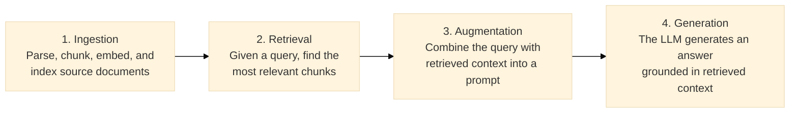

# Retrieval-Augmented Generation (RAG)

## What is RAG?

Retrieval-Augmented Generation (RAG) is a technique that combines information
retrieval with generative language models. Instead of relying solely on the
model's parametric knowledge (embedded in its weights during training), RAG
retrieves relevant documents from an external corpus and uses them as context
for generation.

RAG was introduced by Lewis et al. (2020) in the paper "Retrieval-Augmented
Generation for Knowledge-Intensive NLP Tasks". The original formulation uses
a dense retriever (DPR) paired with a seq2seq generator (BART).

## Why RAG?

Large language models have several limitations that RAG addresses:

- **Knowledge cutoff**: LLMs cannot access information beyond their training data.
- **Hallucination**: LLMs may generate plausible-sounding but incorrect facts.
- **Auditability**: RAG answers can be traced back to specific source documents.
- **Updateability**: The knowledge base can be updated without retraining the model.

## The RAG pipeline

A typical RAG pipeline consists of:

1. **Ingestion**: Parse, chunk, embed, and index source documents.
2. **Retrieval**: Given a query, find the most relevant chunks.
3. **Augmentation**: Combine the query with retrieved context into a prompt.
4. **Generation**: The LLM generates an answer grounded in the retrieved context.

## Variants

- **Naive RAG**: Fixed chunking, single-vector retrieval, one-shot generation.
- **Advanced RAG**: Hybrid retrieval, reranking, query decomposition.
- **Modular RAG**: Pluggable components, agentic workflows, graph memory.
- **GraphRAG**: Entity extraction, knowledge graph construction, multi-hop retrieval.
