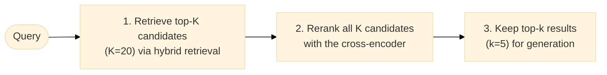

# Retrieval Methods

## Dense retrieval (vector search)

Dense retrieval encodes both queries and documents into dense vector
representations using a bi-encoder model (e.g., BERT, DPR, BGE).
Similarity is measured by cosine distance or dot product.

**Advantages**: semantic matching, language-agnostic, handles paraphrases.
**Disadvantages**: requires GPU for embedding, expensive index updates.

Common models:
- `BAAI/bge-small-en-v1.5` — fast, 384-dimensional, strong for English
- `sentence-transformers/all-MiniLM-L6-v2` — compact general-purpose
- `intfloat/e5-large-v2` — high accuracy, larger footprint

## Sparse retrieval (BM25)

BM25 (Best Match 25) is a probabilistic retrieval function that ranks documents
based on term frequency (TF) and inverse document frequency (IDF). It is the
default algorithm in Elasticsearch and OpenSearch.

**Advantages**: no training required, fast at inference, strong for exact keyword match.
**Disadvantages**: no semantic understanding, struggles with synonyms and paraphrases.

## Hybrid retrieval

Hybrid retrieval combines dense and sparse signals. The two ranked lists are
fused using Reciprocal Rank Fusion (RRF):

```
RRF_score(d) = Σ weight_i / (rrf_k + rank_i(d))
```

where `rrf_k=60` is the default smoothing constant, `weight_i` defaults to `1.0`, and
`rank_i(d)` is the rank of document `d` in list `i`. The method is robust to incomparable raw
score scales; this implementation also exposes `rrf_k` and per-list weights.

## Reranking

A cross-encoder reranker (e.g., `cross-encoder/ms-marco-MiniLM-L-6-v2`) takes
(query, document) pairs and outputs a relevance score. It is slower than
bi-encoders but much more accurate because it can model query-document interaction.

Typical pipeline:



1. Retrieve top-K candidates (K=20) via hybrid retrieval.
2. Rerank all K candidates with the cross-encoder.
3. Keep top-k results (k=5) for generation.
