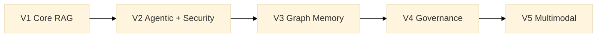

# Modular RAG Framework

[](https://pscode.lioncloud.net/data_specialiste/advancedpublicisrag/-/pipelines)
[](https://pscode.lioncloud.net/data_specialiste/advancedpublicisrag/-/graphs/main/charts)


A modular framework for building production-grade RAG and agentic systems: declarative orchestration, composable retrieval, structured memory, native security, and progressive multimodal support.

## Table of Contents

- [Vision](#vision)
- [Architecture](#architecture)
- [Getting started](#getting-started)
- [Key features](#key-features)
- [Roadmap](#roadmap)
- [Contributing](#contributing)
- [License](#license)

## Vision

The goal of this framework is to provide a **context OS** for RAG and agentic systems:

- Build modular RAG pipelines (chunking, retrieval, generation, validation).
- Orchestrate multiple specialized agents instead of a single monolithic LLM.
- Introduce graph memory, governance, and multimodality progressively without rewriting the core.

The architecture is designed to be extensible: each component (chunker, retriever, agent, guard, etc.) is wired through stable contracts and manifests.

## Architecture

High-level view of versions V1 to V5:



Detailed architecture (per-version diagrams, flows, and modules):

- `docs/architecture/overview.md`
- `docs/architecture/roadmap-mermaid.md`

## Getting started

### Prerequisites

- Python 3.11+
- Git
- Access to an LLM (OpenAI, Azure, or any supported backend)
- GitLab or GitHub access to clone the repository

### Installation (development)

```bash
git clone https://pscode.lioncloud.net/data_specialiste/advancedpublicisrag.git
cd advancedpublicisrag
python -m venv .venv
source .venv/bin/activate  # or .venv\Scripts\activate on Windows
pip install -e .
```

### First RAG pipeline

```python
from modular_rag.app.bootstrap import load_pipeline

pipeline = load_pipeline("manifests/presets/local-hybrid-rag.yaml")
answer = pipeline.answer("Explain the concept of Modular RAG.")
print(answer.text)
```

For complete end‑to‑end examples, see the `examples/` folder (`simple_qa`, `hybrid_search`, `secure_rag`, `agentic_rag`, `graph_memory`).

## Key features

- **Declarative orchestration** via YAML manifests (knowledge architecture as code).
- **Adaptive chunking** and hybrid retrieval (vector + lexical).
- **Agentic runtime** with specialized agents (extraction, synthesis, validation).
- **Native security** (query guard, anti‑poisoning, redaction).
- **Built‑in evaluation** (benchmarks, metrics, traces).
- Planned extensions: graph memory, advanced governance, multimodal reasoning.

## Roadmap

- **V1 – Core RAG**: ingestion, retrieval, generation, evaluation.
- **V2 – Agentic + Security**: advanced planner, multi‑agent runtime, stronger security.
- **V3 – Graph Memory**: graph memory, multi‑hop reasoning, feedback loops.
- **V4 – Governance**: policy‑as‑code, advanced RBAC, audit and compliance.
- **V5 – Multimodal**: text + image + tables + audio/video.

Details live in `ROADMAP.md` and `docs/architecture/roadmap-mermaid.md`.

## Contributing

Contributions are welcome!

1. Fork the repo and create a branch (for example `feature/my-feature`).
2. Implement your changes + tests (`tests/unit`, `tests/integration`).
3. Update docs if needed (`docs/guides`, `docs/architecture`).
4. Open a Merge Request into the main branch.

See `CONTRIBUTING.md` for coding, testing, and documentation guidelines.

## License

This project is distributed under the MIT license (or another license to be defined).  
See the `LICENSE` file for details.