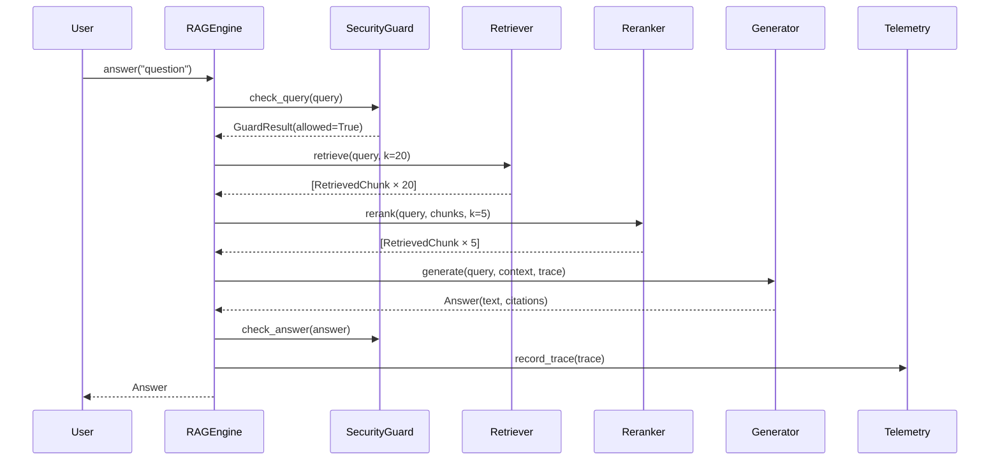
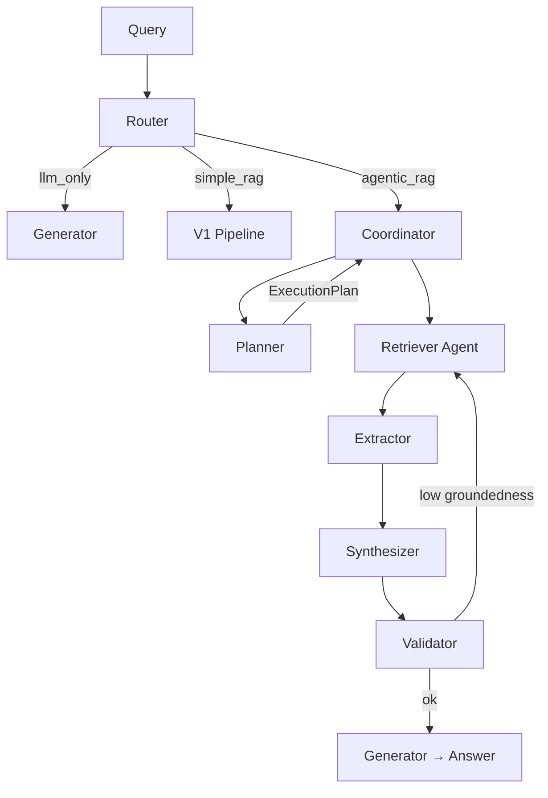
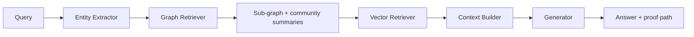

# Runtime Flow Diagrams

## V1 — Simple RAG

```mermaid
sequenceDiagram
    participant U as User
    participant E as RAGEngine
    participant G as SecurityGuard
    participant R as Retriever
    participant RR as Reranker
    participant LLM as Generator
    participant T as Telemetry

    U->>E: answer("question")
    E->>G: check_query(query)
    G-->>E: GuardResult(allowed=True)
    E->>R: retrieve(query, k=20)
    R-->>E: [RetrievedChunk × 20]
    E->>RR: rerank(query, chunks, k=5)
    RR-->>E: [RetrievedChunk × 5]
    E->>LLM: generate(query, context, trace)
    LLM-->>E: Answer(text, citations)
    E->>G: check_answer(answer)
    E->>T: record_trace(trace)
    E-->>U: Answer
```

## V2 — Agentic RAG

```mermaid
flowchart TD
    Q[Query] --> Router
    Router -->|llm_only| LLM[Generator]
    Router -->|simple_rag| V1[V1 Pipeline]
    Router -->|agentic_rag| Coord[Coordinator]

    Coord --> Planner
    Planner -->|ExecutionPlan| Coord
    Coord --> RetAgent[Retriever Agent]
    RetAgent --> Extractor
    Extractor --> Synthesizer
    Synthesizer --> Validator
    Validator -->|low groundedness| RetAgent
    Validator -->|ok| Output[Generator → Answer]
```

## V3 — Graph RAG

```mermaid
flowchart LR
    Q[Query] --> EE[Entity Extractor]
    EE --> GR[Graph Retriever]
    GR --> SubG[Sub-graph + community summaries]
    SubG --> VR[Vector Retriever]
    VR --> Merge[Context Builder]
    Merge --> LLM[Generator]
    LLM --> Ans[Answer + proof path]
```
